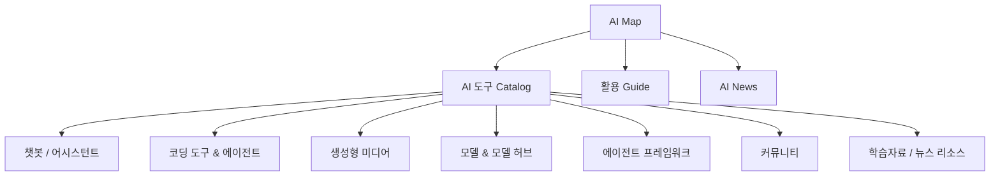

# AI Map

AI Map은 AI 도구를 단순한 이름 목록이 아니라 **역할, 실행 방식, 작업 Workflow** 기준으로 탐색하기 위한 지식 지도다.

현재 블로그에는 별도 저장소 `linjingzhu/ai-map`에서 공개 가능한 콘텐츠만 가져와 통합했다.

## 구성

## 왜 별도 테마로 분리하는가

`AI 사용방법`과 `AI Map`은 목적이 다르다.

| 영역 | 질문 |
|---|---|
| AI 사용방법 | AI를 어떻게 개발과 업무에 사용할 것인가? |
| AI Map | 어떤 AI 도구가 있고 어디에 적합한가? |

## 데이터 범위

- 130개 이상 AI 도구/리소스 카탈로그
- 7개 카테고리
- 설치형과 웹 실행 구분
- 이미지/디자인 및 코딩 Workflow Guide
- AI 관련 뉴스/학습 링크

## 통합 원칙

원본 저장소는 private이며 React/Vite 기반의 독립 앱이다. 현재 기술 블로그는 GitHub Pages의 정적 Markdown 구조이므로 전체 개발 인프라를 복사하지 않았다.

가져온 것:

- 공개용 도구 데이터
- 카테고리
- 공식 실행/다운로드 링크
- 활용 Guide
- 공개 News 데이터

가져오지 않은 것:

- 원본 저장소의 `.ai/`, `.claude/`, `.codex/`
- 내부 개발 Script와 Test Harness
- Hosting 설정
- 비공개 운영 문서

이 방식으로 현재 블로그 Architecture를 유지하면서 AI Map의 지식만 재사용한다.
