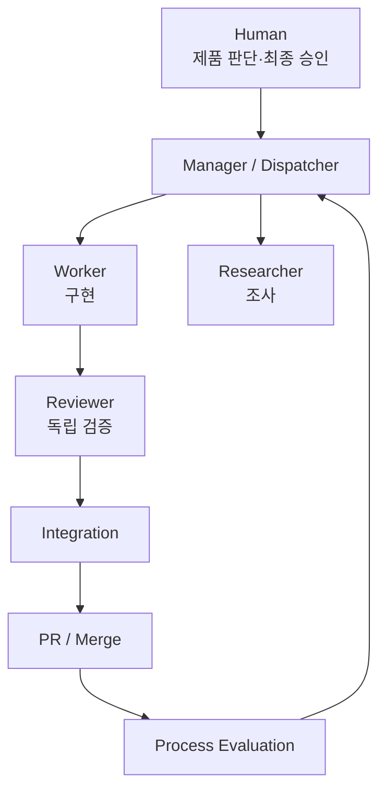
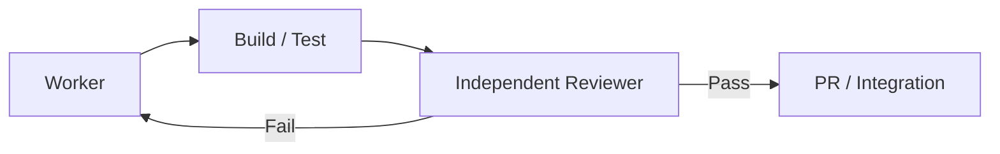

# AI를 개발 도구가 아니라 개발 시스템으로 사용하기

AI 코딩 도구의 효율은 “코드를 얼마나 빨리 써 주는가”보다 **어떤 역할과 책임을 주고, 어떤 검증 루프 안에서 움직이게 하는가**에 더 크게 좌우된다.

## 기본 관점

AI를 한 명의 만능 개발자로 두기보다 다음처럼 역할을 분리한다.



| 계층 | 핵심 책임 |
|---|---|
| Human | 제품 방향, 우선순위, 고위험 승인 |
| Manager / Dispatcher | 요청 해석, 작업 분해, 난이도·모델·역할 선택 |
| Workspace Manager | Git branch/worktree 생성·정리 |
| Worker | 실제 구현 |
| Researcher | 기존 코드·API·구조 조사 |
| Reviewer | 구현 독립 검증 |
| Integration | 결과 통합 및 회귀 확인 |
| Process Evaluator | 비용·실패·반복 문제 분석 |

## 가장 중요한 운영 원칙

### 1. 대화보다 Repository를 기억으로 사용한다

긴 대화는 언젠가 압축되거나 끊긴다. 장기적으로 유지해야 할 결정은 저장소에 둔다.

```text
Repository
├─ CLAUDE.md        Claude Code 진입점
├─ AGENTS.md        Codex 진입점
└─ .ai/
   ├─ PRODUCT.md
   ├─ ARCHITECTURE.md
   ├─ GIT_POLICY.md
   ├─ TEST_POLICY.md
   ├─ DECISIONS.md
   └─ CURRENT_STATE.md
```

즉 **Repository = 장기 기억**, **Session = 일시적인 작업 기억**으로 본다.

### 2. 구현과 검증을 분리한다

같은 Agent가 “구현했고 잘 됐다”고 판단하는 것보다, 다른 Agent가 실제 diff를 보고 검증하는 것이 안전하다.



### 3. Agent 수가 많다고 좋은 시스템이 아니다

Agent 간 handoff에도 토큰과 설명 비용이 든다. 작은 수정은 한 Worker와 한 Reviewer만으로 충분할 수 있다.

> 목표는 **최대 병렬화**가 아니라 **Cost per Accepted Change를 낮추면서 품질을 유지하는 것**이다.

## Git과 결합한 기본 단위

기능 개발의 가장 이해하기 쉬운 단위는 다음과 같다.

```text
1 Feature
↕
1 Branch
↕
1 Worktree
↕
1 Main Development Session
```

Session은 교체할 수 있지만 Branch와 Worktree는 기능이 끝날 때까지 유지할 수 있다.

## AI에게 맡기기 좋은 것

- 코드베이스 탐색
- 구현 방향 비교
- 작은 기능 구현
- 빌드·테스트 실행
- diff 리뷰
- Git 상태 분석
- branch/worktree 생성
- PR 설명 작성
- 반복 실패 패턴 분석

## 사람이 계속 가져야 하는 것

- 제품 방향
- 사용자 가치
- 핵심 Architecture 결정
- 파괴적 Git History 변경 승인
- Force push 승인
- 보안 정책
- 최종 Merge 판단

이 블로그의 AI 파트는 “AI에게 더 많은 권한을 주는 법”이 아니라 **권한과 책임을 명확히 나눠 더 예측 가능한 개발 시스템을 만드는 법**을 다룬다.