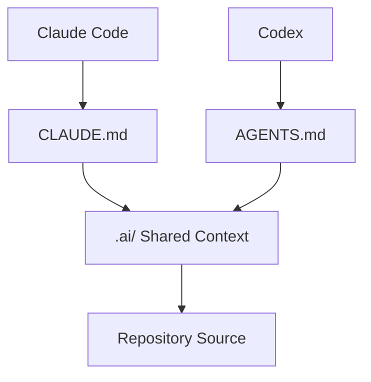
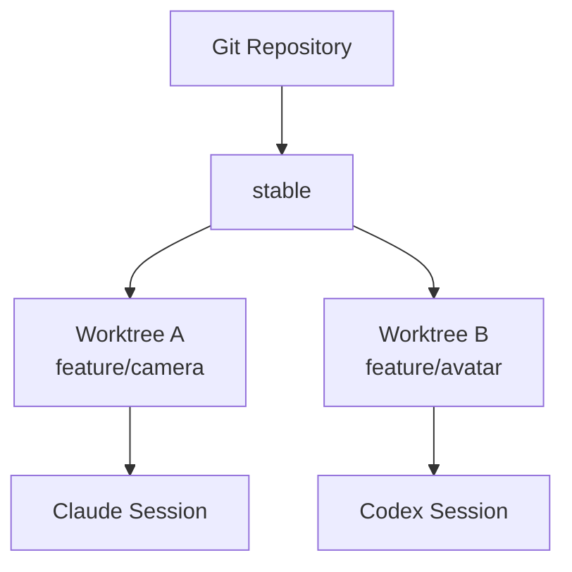

# Claude Code와 Codex가 같은 제품을 함께 개발하기

두 AI가 같은 GitHub 저장소를 사용한다고 해서 자동으로 같은 문맥을 공유하는 것은 아니다.

핵심은 **코드는 Git으로 공유하고, 장기 문맥과 정책은 Repository 파일로 공유하는 것**이다.

## 권장 구조

```text
MyProduct/
├─ CLAUDE.md
├─ AGENTS.md
├─ .ai/
│  ├─ PRODUCT.md
│  ├─ ARCHITECTURE.md
│  ├─ DEVELOPMENT_POLICY.md
│  ├─ GIT_POLICY.md
│  ├─ UX_POLICY.md
│  ├─ TEST_POLICY.md
│  ├─ DECISIONS.md
│  └─ CURRENT_STATE.md
└─ Source/
```



## 왜 이런 구조가 필요한가

Claude와 Codex의 대화 기록은 서로 자동 공유되지 않는다.

예를 들어 Claude 세션에서 다음 결정을 내렸다고 하자.

> Blend Shape 생성 UI는 Avatar > Blend Shape 탭에 둔다.

이 결정이 채팅에만 남으면 Codex는 알지 못한다. 따라서 오래 유지할 결정은 `.ai/DECISIONS.md` 같은 파일로 외부화한다.

## 병렬 개발은 같은 Working Tree에서 하지 않는다

나쁜 구조:

```text
같은 폴더
├─ Claude가 Camera.cpp 수정
└─ Codex도 Camera.cpp 수정
```

권장:



각 AI는 독립 Branch와 Worktree에서 작업하고 PR 단계에서 교차 검증한다.

## Cross-model Review

```text
Claude 구현
→ PR
→ Codex Review
→ Claude 수정
→ Human / CI 확인
→ Merge

Codex 구현
→ PR
→ Claude Review
→ Codex 수정
→ Human / CI 확인
→ Merge
```

모델을 동일하게 만드는 것이 목표가 아니다. 오히려:

> **같은 Source of Truth + 다른 추론 경로 + 상호 검증**

이 더 가치가 있다.

## CURRENT_STATE.md의 역할

현재 작업을 빠르게 복원하기 위한 인덱스다.

| Owner | Branch | Task | State |
|---|---|---|---|
| Claude | `feature/camera` | Camera animation | In Progress |
| Codex | `feature/library` | Library browser | Review |

세션이 끊겨도 새 Agent가 저장소를 읽고 현재 상태를 복구할 수 있다.

## 장기적으로 추가할 수 있는 도구

새로운 Coding Agent가 들어와도 공통 정책을 `.ai/`에 두면 해당 Agent용 진입 파일만 추가하면 된다.

```text
Claude → CLAUDE.md ─┐
Codex  → AGENTS.md ─┼→ .ai/*
Other  → ENTRY.md  ─┘
```

이렇게 하면 특정 AI 제품에 종속되지 않는 개발 운영 구조가 된다.