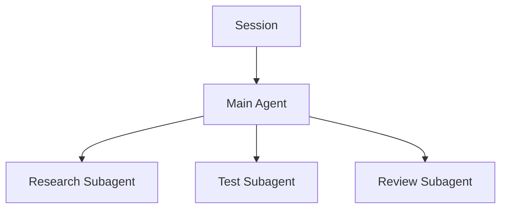

# Session, Agent, Subagent의 차이

이 세 개를 분리하면 Claude Code의 병렬 작업 구조가 훨씬 명확해진다.

## 한 문장 정의

- **Session**: 대화와 작업 문맥을 담는 작업방
- **Agent**: 그 작업방에서 목표를 수행하는 작업자
- **Subagent**: Main Agent가 특정 하위 임무를 맡기기 위해 호출한 보조 작업자



## Session

Session에는 다음이 누적된다.

- 사용자와의 대화
- 현재까지의 판단
- Tool 실행 결과
- 작업 목표
- 현재 프로젝트에 대한 임시 이해

Session을 새로 만들면 이 대화 Context는 새로 시작하지만, 같은 Worktree의 파일과 Git 상태는 그대로 남아 있다.

```text
feature/camera + worktree/camera
├─ Session 1  종료
├─ Session 2  새로 시작
└─ Session 3  QA 단계
```

따라서 긴 Session을 무조건 유지할 필요는 없다.

## Agent

Agent는 실제로 계획하고 도구를 사용해 목표를 수행하는 실행 주체다.

```text
Main Agent
├─ 요구사항 해석
├─ 파일 탐색
├─ 코드 수정
├─ Git 실행
├─ 테스트
└─ 결과 판단
```

## Subagent

Subagent는 별도의 작은 Context에서 특정 임무에 집중한다.

예:

```text
Main Agent
"Camera Animation 기능을 구현한다."

├─ Researcher
│  └─ 기존 Camera 구조 조사
├─ Test Agent
│  └─ 회귀 테스트 후보 조사
└─ Reviewer
   └─ 변경사항 독립 검토
```

장점은 Main Context에 모든 조사 과정이 쌓이지 않는다는 점이다.

## 같은 Agent가 여러 Session에 참여하는가?

“같은 역할”은 여러 Session에서 재사용할 수 있지만, 실행 인스턴스는 별개라고 보는 것이 정확하다.

```text
Reviewer 역할 정의
├─ Session A → Reviewer Instance A
└─ Session B → Reviewer Instance B
```

상태를 공유하고 싶다면 파일로 외부화한다.

## Session 교체 시점

시간보다 **Task Boundary**를 기준으로 한다.

- 큰 Subtask 완료
- Commit 경계
- 구현 → Review
- Review → Fix
- Context가 지나치게 커짐
- 잘못된 과거 가정이 반복됨

## Handoff 문서

복잡한 미완성 작업이라면 새 Session에게 짧은 handoff를 남긴다.

```md
# Session Handoff

Branch: feature/camera
Worktree: worktrees/camera

## Current Goal
Imported camera animation 연결

## Completed
- 데이터 구조 조사
- 기본 import 구현

## In Progress
- frame range sync

## Next
1. sync 완료
2. targeted build
3. regression test
```

핵심은 **Session의 기억보다 Repository의 상태가 더 신뢰할 수 있어야 한다**는 것이다.