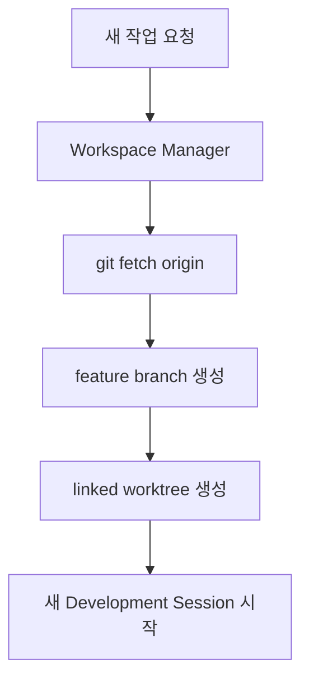
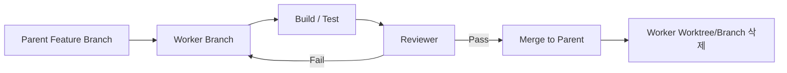

# Multi-Agent 역할과 모델 라우팅

Agent 운영은 “어려운 일은 비싼 모델”만으로 끝나지 않는다. **Role과 Difficulty를 분리**하는 것이 핵심이다.

## 3축 모델

```text
Task
├─ Role        무엇을 하는가?
├─ Difficulty  얼마나 어려운가?
└─ Model       어느 수준의 모델을 쓸 것인가?
```

예:

| Task | Role | Difficulty | Model Tier |
|---|---|---|---|
| 파일 위치 찾기 | Researcher | Easy | Fast |
| Camera API 분석 | Researcher | Normal | Standard |
| SceneGraph 재설계 | Architect | Difficult | Deep reasoning |
| 문자열 수정 | Worker | Easy | Fast |
| 일반 기능 구현 | Worker | Normal | Standard |
| 구조 변경 | Worker | Difficult | Deep reasoning |

Claude Code의 구체적인 모델 이름은 시점에 따라 달라질 수 있으므로, 정책에서는 **Fast / Standard / Deep** 같은 역할을 먼저 정의하고 현재 사용 가능한 Haiku / Sonnet / Opus 계열에 매핑하는 방식이 안전하다.

## Manager와 Dispatcher

둘은 비슷하지만 질문이 다르다.

### Dispatcher

> “이 일을 누구에게 보낼 것인가?”

- 요청 분류
- 난이도 판정
- Role 선택
- Model 선택

### Manager

> “이 작업 전체를 어떻게 끝낼 것인가?”

- Task 분해
- 의존성 관리
- Worker 배치
- Review 호출
- 재작업 판단
- 통합

초기에는 **Manager / Dispatcher를 한 역할로 합치는 것**이 단순하다.

## 추천 역할 집합

### Control Plane

| Role | 책임 |
|---|---|
| Manager / Dispatcher | 분석, 분배, 통합 판단 |
| Workspace Manager | fetch, branch/worktree 생성·정리 |
| Integration Manager | Worker 결과 통합, conflict 관리 |

### Development Plane

| Role | 책임 |
|---|---|
| Researcher / Explorer | 기존 코드·API 탐색 |
| Planner | 구현 순서와 위험 정리 |
| Architect | 구조·ownership·serialization 판단 |
| Worker / Implementer | 실제 구현 |
| Debugger | 오류·Crash·상태 문제 추적 |
| Refactorer | 기능 유지하며 구조 개선 |

### Assurance Plane

| Role | 책임 |
|---|---|
| Test Runner | 기존 테스트 실행 |
| Test Designer | 새로운 회귀·경계 테스트 설계 |
| Reviewer | 일반 코드 리뷰 |
| Adversarial Reviewer | 숨은 문제를 공격적으로 탐색 |
| QA Agent | 사용자 Workflow 기준 검증 |

## Workspace Manager

Git 작업 공간만 담당한다.



Workspace Manager가 하지 않아야 할 것:

- Feature 코드 구현
- stable에 임의 Merge
- Force Push
- 승인 없는 Branch 삭제
- 다른 Worktree의 개발

## Worker Branch를 임시로 만드는 패턴

큰 Feature 내부를 여러 Worker가 동시에 구현할 때:

```text
feature/camera-animation
├─ worker/camera-animation/parser
├─ worker/camera-animation/ui
└─ worker/camera-animation/tests
```

각 Worker는 별도 Worktree에서 구현하고, 검증 후 Parent Branch에 통합한다.



## Escalation

난이도는 고정하지 않는다.

```text
Easy → Normal → Difficult
```

작업 중 serialization, cross-module dependency, ownership, threading 같은 예상 밖 영향이 발견되면 구현을 무리하게 계속하기보다 Manager에게 escalation한다.

## 최소 Agent 원칙

작은 작업까지 Researcher → Planner → Worker → Reviewer → QA를 전부 거치면 오히려 비효율적이다.

> 작은 작업: Worker + Reviewer  
> 일반 작업: Researcher(필요 시) + Worker + Reviewer  
> 고위험 작업: Planner/Architect + Worker + 독립 Reviewer + Integration

**Agent 수가 아니라 승인된 결과 대비 비용과 품질**을 최적화한다.