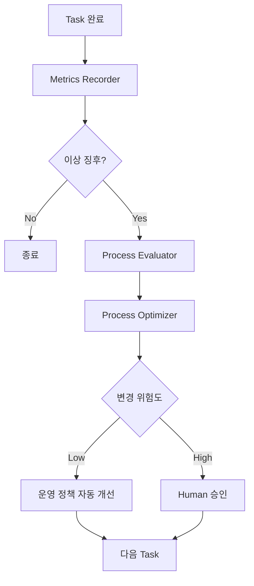

# 스스로 개선되는 AI 개발 프로세스

개발 루프를 오래 돌리면 다음 문제가 나타난다.

- 토큰 비용이 계속 증가
- Agent 간 설명·handoff 비용 증가
- 같은 문제가 반복
- Review에서 같은 지적 반복
- 재작업 횟수 증가
- Build/Test 실패가 반복
- Agent 수는 늘지만 품질은 좋아지지 않음

이때 단순히 “더 좋은 모델을 쓰자”로 끝내지 않고 **프로세스 자체를 학습 대상으로 만든다.**

## Learning Plane



## 기록할 지표

| Metric | 의미 |
|---|---|
| Agent Count | 투입된 작업자 수 |
| Handoff Count | Agent 간 전달 횟수 |
| Iterations | 반복 횟수 |
| Rework Count | 수정 사이클 |
| Build Failures | 빌드 실패 |
| Test Failures | 테스트 실패 |
| Review Findings | 리뷰 지적 |
| Human Intervention | 사람의 직접 개입 |
| Token Cost | 모델 비용 |
| Completion Time | 완료 시간 |

가장 중요한 관점은:

> **Cost per Accepted Change**

즉 토큰이 적은지가 아니라 **실제로 승인된 변경 하나를 얻는 데 얼마가 들었는지**다.

## 반복 실패를 정책으로 승격한다

예를 들어 Save/Load 누락이 세 번 반복되면 개별 버그로만 보지 않는다.

```md
## FP-003 — Serialization Impact Missed

Occurrences: 3

Symptoms:
Save/Load 누락이 반복됨.

Root Cause:
Planning 단계에서 persistence 검토가 없음.

Improvement:
Data 구조 변경 Task는 구현 전 serialization impact 확인.
```

이후 `TEST_POLICY.md`나 `DEVELOPMENT_POLICY.md`에 체크를 추가할 수 있다.

## 실패뿐 아니라 불필요한 절차도 학습한다

예:

```md
Observation:
Localized bug fix에서 별도 Researcher 없이
Worker + Reviewer만으로 안정적으로 완료됨.

Lesson:
작은 Scope 작업에서는 Researcher를 기본 생성하지 않는다.
```

이런 학습이 있어야 시스템이 시간이 갈수록 복잡해지는 것을 막을 수 있다.

## 실험 후 정책화

바로 규칙을 바꾸지 말고 작은 실험을 한다.

```text
Hypothesis:
5개 이하 파일을 수정하는 Normal Task에는 별도 Researcher가 필요 없다.

Sample:
다음 5개 Task

Success:
- Regression 증가 없음
- Review Findings 증가 없음
- Token 20% 이상 감소
```

성공하면 정책으로 승격한다.

## 정책 변경 위험도

### 자동 변경 가능

- Role routing
- Model routing
- Metric 기록 방식
- 반복 실패 목록
- 학습 기록

### Human 승인 필요

- Git 정책
- Commit 정책
- Build 정책
- Review gate

### AI가 임의 변경하면 안 되는 것

- 제품 방향
- 핵심 Architecture 원칙
- 보안 정책
- Human approval 규칙
- 파괴적 Git 정책

## Repository 구조 예

```text
.ai/
├─ ROLE_POLICY.md
├─ MODEL_ROUTING.md
├─ DEVELOPMENT_POLICY.md
├─ GIT_POLICY.md
└─ PROCESS/
   ├─ METRICS.md
   ├─ FAILURE_PATTERNS.md
   ├─ LESSONS_LEARNED.md
   ├─ EXPERIMENTS.md
   └─ PROCESS_CHANGELOG.md
```

핵심은 “AI가 스스로 똑똑해진다”는 추상적 개념이 아니다.

> **실행 결과를 기록하고 → 반복 패턴을 발견하고 → 작은 개선을 실험하고 → 검증된 규칙만 Repository에 반영한다.**

즉 개발 프로세스 자체를 버전 관리한다.