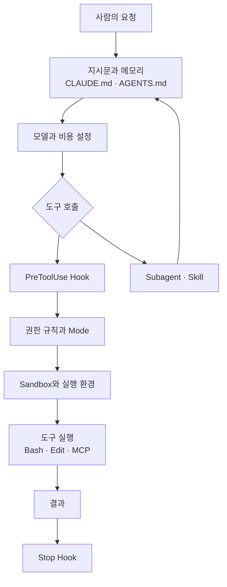

# AI Agent 세팅 지도: 설정을 층으로 나누어 보기

> **학습 목표**: Agent 설정을 여러 층으로 나누고, 각 층이 Claude Code와 Codex에서 어느 파일에 있으며 어떤 우선순위로 합쳐지는지 설명할 수 있다. 1인 스튜디오에 맞는 최소 설정과 확장 설정을 고를 수 있다.

앞의 문서들(「AI 개발 운영 개요」, 「Session · Agent · Subagent」, 「Multi-Agent 역할과 모델 라우팅」)은 AI를 *어떻게 조직할지*를 다뤘다. 이 문서부터는 그 조직을 **실제 설정 파일로 옮기는 방법**을 다룬다. 설정 키와 경로는 2026-09 기준으로 공식 문서와 소스에서 확인한 것만 적었다.

## 핵심 개념

Agent의 능력은 모델만으로 정해지지 않는다. 같은 모델도 무엇을 읽고, 무엇을 할 수 있고, 무엇이 자동으로 실행되느냐에 따라 전혀 다르게 행동한다. 이 바깥 구조를 **harness**라 하고, harness를 구성하는 것이 **agent setup**이다.

| 층 | 답하는 질문 | Claude Code | Codex |
|---|---|---|---|
| 지시문 · 메모리 | 무엇을 항상 알고 시작하는가 | `CLAUDE.md`, `.claude/rules/`, auto memory | `AGENTS.md`, `AGENTS.override.md` |
| 권한 · Mode | 묻지 않고 무엇을 해도 되는가 | `settings.json`의 `permissions`, permission mode | `approval_policy`, `.rules` 파일 |
| Sandbox | OS가 무엇을 막는가 | `sandbox` 설정 (Bash 대상) | `sandbox_mode` |
| Hook | 어떤 시점에 무엇이 반드시 실행되는가 | `settings.json`의 `hooks` | `hooks.json` 또는 `config.toml`의 `[hooks]` |
| Subagent | 누구에게 격리된 일을 맡기는가 | `.claude/agents/*.md` | `.codex/agents/*.toml` |
| Skill · Slash command | 반복 절차를 어떻게 부르는가 | `.claude/skills/<name>/SKILL.md` | `.agents/skills/<name>/SKILL.md` |
| Plugin | 설정 묶음을 어떻게 배포하는가 | plugin · marketplace | plugin (`plugins` 설정) |
| MCP · 외부 도구 | 무엇에 연결되는가 | `.mcp.json`, `~/.claude.json` | `config.toml`의 `[mcp_servers.<name>]` |
| 환경 | 어디서 실행되는가 | 로컬, cloud session, CI | 로컬, cloud, CI (`codex exec`) |
| 모델 · 비용 | 어떤 모델을 얼마나 쓰는가 | `model`, subagent `model` 필드 | `model`, `model_reasoning_effort` |

### 층마다 힘의 종류가 다르다

- **권고(advisory)**: 지시문과 Skill은 모델이 읽고 따르려고 *노력*하는 문맥이다. Claude Code 문서도 CLAUDE.md를 "context, not enforced configuration"이라고 부른다.
- **강제(enforced)**: 권한 규칙, Sandbox, Hook은 모델의 판단과 무관하게 harness가 실행한다.
- **연결 · 위임**: Subagent, MCP, Plugin은 능력을 넓히거나 일을 격리한다.

"절대 `.env`를 수정하지 마라"를 CLAUDE.md에만 적으면 권고다. 반드시 지켜져야 한다면 deny 규칙이나 `PreToolUse` hook으로 옮겨야 강제가 된다. 이 구분이 설정 설계의 출발점이다.

## 원리

### Claude Code: scope와 우선순위

Claude Code의 settings 파일은 네 scope에 있고, 높은 쪽이 같은 키를 덮어쓴다(2026-09 기준).

| 우선순위 | Scope | 파일 | 용도 |
|---|---|---|---|
| 1 | Managed | `managed-settings.json`, MDM, 서버 관리 설정 | 조직 정책. 사용자가 덮어쓸 수 없다 |
| 2 | Command line | `claude --settings`, `--permission-mode` 등 | 이번 세션만 |
| 3 | Project local | `.claude/settings.local.json` | 나만, 이 프로젝트만. git에서 제외 |
| 4 | Shared project | `.claude/settings.json` | 팀 전체. commit한다 |
| 5 | User | `~/.claude/settings.json` | 나만, 모든 프로젝트 |

단, "덮어쓰기"는 단일 값에만 해당한다. 층마다 합쳐지는 방식이 다르다.

- `permissions.allow` 같은 **목록은 합쳐진다**. 그리고 deny는 어느 scope에 있든 allow보다 먼저 평가되므로, user의 deny가 project의 allow를 막는다.
- **CLAUDE.md는 누적된다**. 모든 층의 내용이 함께 context에 들어간다.
- **Skill과 Subagent는 이름으로 하나만 이긴다**. Subagent는 managed > `--agents` > project > user > plugin 순이다.
- **MCP 서버도 이름으로 하나만 이긴다**. local > project > user 순이다.
- **Hook은 모두 실행된다**. 출처와 상관없이 일치하는 hook이 전부 실행된다.

### Codex: 설정 층과 신뢰

Codex는 TOML 층을 낮은 우선순위부터 쌓는다(openai/codex 소스의 설정 로더 주석, 2026-09 기준). 시스템 `/etc/codex/config.toml` → 사용자 `~/.codex/config.toml` → 선택한 profile → 프로젝트 `.codex/config.toml` → 실행 시 `--config`와 플래그 순이다. 조직이 강제할 제약은 별도의 `requirements.toml`에 둔다.

중요한 차이는 **프로젝트 설정이 신뢰(trust)를 받아야 켜진다**는 점이다. 신뢰하지 않은 디렉터리의 `.codex/config.toml`은 읽히지만 비활성 상태로 남는다. Claude Code도 비슷하게, 커밋된 `.claude/settings.json`의 `permissions.allow`는 workspace trust 대화상자를 수락한 뒤에야 적용된다. 반면 deny와 ask는 제한만 하므로 즉시 적용된다.

```toml
model = "gpt-6-sol"
model_reasoning_effort = "medium"
approval_policy = "on-request"
sandbox_mode = "workspace-write"

[sandbox_workspace_write]
network_access = false

[projects."/Users/me/work/product-a"]
trust_level = "trusted"
```

위는 `~/.codex/config.toml`의 예다. 모델 이름은 이 저장소 `.ai/HARNESS.md`의 라우팅 표를 따랐다.

### 커밋할 것과 개인 것

이 저장소의 `.ai/HARNESS.md`는 설정을 나누는 시험을 이렇게 적는다. *새 기여자가 clone했을 때 그것이 없으면 다르게 동작하는가?* 그렇다면 project capability이므로 commit한다. 말투만 달라진다면 개인 선호이므로 commit하지 않는다. 기본 모델, 응답 언어는 개인 선호이고, 권한, hook, 역할 agent, MCP 서버는 capability다.



그림은 한 번의 도구 호출이 층을 통과하는 순서다. 권고 층(지시문)은 호출이 *만들어지기 전에* 영향을 주고, 강제 층(hook, 권한, sandbox)은 호출이 *실행되기 전에* 개입한다.

## 적용: 이 저장소의 설정

이 사이트의 저장소는 Claude Code와 Codex를 함께 쓰는 설정의 실제 사례다.

```text
tech-jeongsu/
├─ CLAUDE.md                     Claude Code 진입 계약 (31줄)
├─ AGENTS.md                     Codex 진입 계약 (34줄)
├─ .ai/                          공유 정책 세트 (CORE, MANAGER, HARNESS …)
│  └─ tools/check_policy_set.py  정책 세트 구조 검사
├─ .claude/
│  ├─ agents/fast-explorer.md          읽기 전용 탐색 subagent
│  ├─ agents/adversarial-reviewer.md   독립 리뷰 subagent
│  └─ skills/auto-dev/SKILL.md         자동 개발 루프 skill
├─ .codex/agents/                dispatcher · fast-explorer · adversarial-reviewer (.toml)
└─ .agents/skills/auto-dev/      같은 skill의 Codex 판 + agents/openai.yaml
```

| 층 | 이 저장소에서 | 관찰 |
|---|---|---|
| 지시문 | `CLAUDE.md`, `AGENTS.md`가 `.ai/`를 가리킴 | 진입 파일은 짧은 계약, 본문은 trigger로 on demand 로드 |
| Subagent | 두 Claude agent, 세 Codex agent | 모두 읽기 전용: `permissionMode: plan`, `sandbox_mode = "read-only"` |
| Skill | `auto-dev` 두 판 | Codex 판은 `allow_implicit_invocation: false`로 자동 실행 금지 |
| 모델 | dispatcher만 모델 고정 | reviewer는 일부러 비워 둠. 구현자와 다른 모델을 호출 시점에 고르기 위해 |
| 권한 · Hook · MCP | 커밋된 파일 없음 | HARNESS.md는 "commit하라"고 하지만 강제 층은 아직 비어 있다 |

마지막 줄이 이 저장소의 가장 큰 빈칸이다. 권고와 역할 정의는 충실하지만, 강제 층은 각자의 개인 설정에 맡겨져 있다. 「권한 · Sandbox · Hook」 문서에서 이 저장소에 맞는 `.claude/settings.json` 초안을 제안한다.

## 심화

### 최소 설정과 스튜디오 설정

| 항목 | 최소 설정 (제품 1개, 첫 주) | 스튜디오 설정 (제품 여러 개, 1인 운영) |
|---|---|---|
| 지시문 | 60줄 이하 `CLAUDE.md` 하나, 또는 `AGENTS.md` 하나 | 짧은 진입 계약 + 공유 정책 폴더 + trigger 표 |
| 도구 호환 | 한 도구만 | `AGENTS.md`를 기준으로 두고 Claude Code는 import 또는 별도 진입 파일 |
| 권한 | 기본 mode, 떠오를 때마다 승인 | 커밋된 allow/ask/deny + 위험 등급 표 |
| Sandbox | 없음 | 로컬은 Claude `/sandbox` 또는 Codex `workspace-write`, 무인 실행은 container |
| Hook | 없음 | force push 차단, 미커밋 종료 방지, 편집 후 lint |
| Subagent | 기본 제공 agent | 읽기 전용 explorer, 모델이 다른 reviewer |
| Skill | 없음 | 배포, 릴리스, 자동 개발 루프 같은 반복 절차 |
| 공유 | 없음 | 여러 저장소가 같은 설정을 쓰면 plugin으로 묶기 |

최소 설정에서 시작해 **같은 문제가 두 번 생길 때 한 층씩** 추가하는 것이 Claude Code 문서가 권하는 순서이기도 하다. 규칙을 두 번 틀리면 CLAUDE.md, 같은 프롬프트를 세 번 붙여 넣으면 skill, 매번 반드시 일어나야 하면 hook, 두 번째 저장소가 같은 설정을 원하면 plugin이다.

### 환경: 로컬 설정이 따라가지 않는 곳

- Claude Code cloud session에는 로컬 `~/.claude/skills/`와 기기의 `managed-settings.json`이 전달되지 않는다. 서버 관리 설정과 **저장소에 commit된 파일**만 도착한다.
- `claude -p`나 SDK 실행에는 trust 대화상자가 없다. 남의 저장소에서 실행할 때는 `--setting-sources user`나 `--bare`로 프로젝트 설정을 읽지 않게 할 수 있다.
- CI에서는 묻는 대신 거부하는 `dontAsk` mode와 명시 allowlist(`--allowedTools`)를 조합한다. Codex는 `codex exec --sandbox workspace-write`처럼 sandbox를 명시하고, 필요하면 `--ignore-user-config`로 개인 설정을 배제한다.

결론은 같다. **여러 환경에서 같아야 하는 설정은 저장소에 있어야 한다.**

### 모델과 비용 설정

Claude Code는 `model` 키(보통 user scope), subagent 파일의 `model` 필드, 조직용 `availableModels` 허용 목록으로 모델을 정한다. Codex는 `model`, `model_reasoning_effort`, subagent 기본값 `[agents] default_subagent_model`을 쓴다. 역할별 모델 배정 원칙은 「Multi-Agent 역할과 모델 라우팅」을 참고한다. 나머지 층(Subagent · Skill, MCP, 실행 환경과 비용)의 상세는 이어지는 09–11번 문서에서 다룬다.

## 흔한 오해

- **"CLAUDE.md에 금지 규칙을 적었으니 안전하다."** 지시문은 권고다. 금지는 deny 규칙, hook, sandbox로 강제한다.
- **"project 설정의 allow가 user 설정의 deny를 이긴다."** 어느 scope든 deny가 먼저 평가된다.
- **"설정은 한 번 만들면 끝이다."** 도구 버전마다 키가 바뀐다. 이 문서의 키도 2026-09 기준이므로 날짜를 적고 주기적으로 다시 확인한다.
- **"설정이 많을수록 강력하다."** 항상 로드되는 층은 매 턴 token을 쓴다. 필요할 때 로드되는 층으로 옮길수록 싸고 정확해진다.

## 자기 점검 질문

1. 어떤 규칙을 CLAUDE.md에 둘지 deny 규칙으로 둘지 가르는 기준은 무엇인가?
2. user 설정에 `Bash(git push *)` deny가 있고 project 설정에 같은 allow가 있으면 결과는 무엇이며 왜 그런가?
3. Codex에서 프로젝트 `.codex/config.toml`이 무시되는 대표적인 이유는 무엇인가?
4. 이 저장소의 reviewer agent가 모델을 고정하지 않는 이유를 설정 우선순위와 연결해 설명하라.
5. cloud session에서 개인 skill이 "not found"가 되는 이유와 해결책은 무엇인가?

## 참고 자료

- Claude Code, [Settings files and precedence](https://code.claude.com/docs/en/settings) (2026-09-29 확인)
- Claude Code, [Extend Claude Code](https://code.claude.com/docs/en/features-overview) (2026-09-29 확인)
- Claude Code, [Subagents](https://code.claude.com/docs/en/sub-agents) · [MCP](https://code.claude.com/docs/en/mcp) (2026-09-29 확인)
- OpenAI Codex, [Config basics](https://developers.openai.com/codex/config-basic) (2026-09-29, 소스 `codex-rs/config/src/loader/mod.rs`로 교차 확인)
- 이 저장소: `.ai/HARNESS.md`, `.claude/agents/`, `.codex/agents/`, `.agents/skills/auto-dev/`
