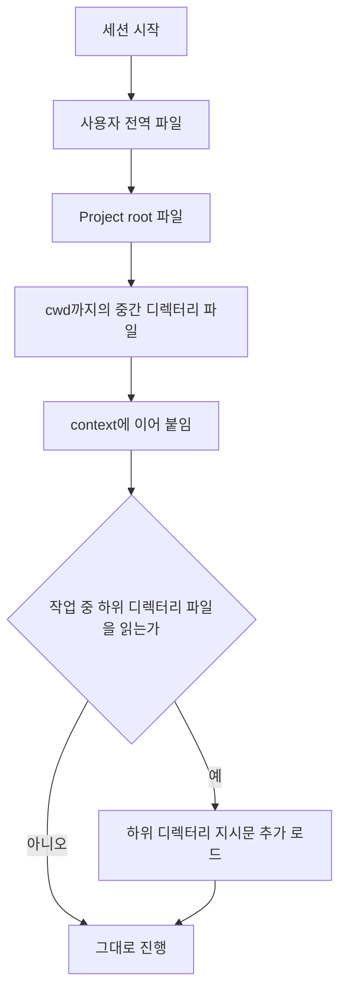

# 지시문과 메모리: CLAUDE.md · AGENTS.md

> **학습 목표**: 지시문 파일이 어디서 발견되고 어떤 순서로 context에 들어가는지 설명할 수 있다. 매 턴 비용을 치를 가치가 있는 내용만 남기고, agent가 실제로 따르는 규칙을 쓰며, 그 파일이 낡지 않도록 검사할 수 있다.

「AI Agent 세팅 지도」에서 지시문은 **권고 층**이라고 했다. 이 문서는 그 층을 깊게 다룬다. 동작 설명은 2026-09 기준 Claude Code 공식 문서와 openai/codex 소스, agents.md 명세를 따른다.

## 핵심 개념

**지시문 파일(instruction file)**은 세션이 시작될 때 자동으로 context에 들어가는 Markdown이다. 대화 기록은 세션이 끝나면 사라지지만, 파일은 다음 세션과 다른 도구에도 남는다. 그래서 오래 유지할 결정은 대화가 아니라 파일에 적는다(「Claude Code + Codex 공동 개발」 참고). 반면 **메모리(memory)**는 사람이 아니라 agent가 스스로 쓰는 기록이다. Claude Code의 auto memory가 대표적이며, 기계 로컬이고 공유되지 않는다.

| 도구 | 파일 | Scope | 비고 |
|---|---|---|---|
| Claude Code | `/etc/claude-code/CLAUDE.md` (Linux) 등 | 조직 managed | 제외할 수 없다 |
| Claude Code | `~/.claude/CLAUDE.md`, `~/.claude/rules/` | 사용자, 모든 프로젝트 | 개인 선호 |
| Claude Code | `./CLAUDE.md` 또는 `./.claude/CLAUDE.md` | 프로젝트, commit | 팀 공유 |
| Claude Code | `./CLAUDE.local.md` | 나만, 이 프로젝트 | `.gitignore`에 추가 |
| Claude Code | `.claude/rules/*.md` | 프로젝트 | `paths`가 없으면 시작 시, 있으면 일치하는 파일을 읽을 때 로드 |
| Codex | `~/.codex/AGENTS.md` (`AGENTS.override.md` 우선) | 사용자 전역 | |
| Codex | 각 디렉터리의 `AGENTS.md` (`AGENTS.override.md` 우선) | project root부터 cwd까지 | 합계 `project_doc_max_bytes` 32 KiB 기본 |

## 원리

### 발견과 로드 순서

Claude Code는 실행한 디렉터리와 그 **모든 상위 디렉터리**의 `CLAUDE.md`, `CLAUDE.local.md`를 시작 시 읽고, 서로 덮어쓰지 않고 **이어 붙인다**. 파일시스템 root에서 작업 디렉터리 쪽으로 쌓이므로, 가까운 파일이 나중에 읽힌다. 같은 디렉터리에서는 `CLAUDE.local.md`가 `CLAUDE.md` 뒤에 붙는다. **하위 디렉터리**의 파일은 시작 시가 아니라 Claude가 그 디렉터리의 파일을 읽을 때 로드된다.

Codex는 `.git` 같은 root marker로 project root를 찾고, root에서 cwd까지 각 디렉터리에서 `AGENTS.override.md` → `AGENTS.md` → `project_doc_fallback_filenames` 순으로 **첫 번째 파일 하나**를 골라 이어 붙인다. root 위로는 올라가지 않으며, 합계가 32 KiB를 넘으면 뒤쪽이 잘린다(소스 `codex-rs/core/src/agents_md.rs`, 2026-09 기준).



**Import**: CLAUDE.md는 `@path/to/file`로 다른 파일을 가져올 수 있다. 상대 경로는 *import하는 파일* 기준이고, 최대 4단계까지 재귀한다. 단, import한 파일도 시작 시 전부 로드되므로 **정리는 되지만 token은 줄지 않는다**. 코드 span 안의 `` `@README` ``는 import되지 않는다. 블록 단위 HTML 주석 `<!-- -->`은 context에 들어가기 전에 제거되므로 사람용 메모에 쓸 수 있다.

### AGENTS.md와 Claude Code의 관계

AGENTS.md는 여러 coding agent가 함께 읽는 공개 형식이다. agents.md 명세는 충돌 시 "편집하는 파일에 가장 가까운 AGENTS.md가 이기고, 사용자의 명시적 채팅 지시가 모든 것을 이긴다"고 정한다. Claude Code는 v2.1.277부터 AGENTS.md를 직접 읽지만, 기본값에서는 **CLAUDE.md가 하나라도 있으면 CLAUDE.md만** 읽는다. 이 동작은 `/config`의 **Project instructions** 항목, 또는 user 설정 `pluginConfigs`의 `"agents-md@builtin"` → `options.instructionFiles` 키로 바꾸며, 값은 `claude-md-or-agents-md`(기본), `claude-md-and-agents-md`, `claude-md`, `managed-only`다. project · local 설정에 둔 이 키는 무시된다.

| 저장소 상태 | Claude Code가 읽는 것 (기본값) |
|---|---|
| `AGENTS.md`만 있음 | `AGENTS.md` |
| `AGENTS.md`와 `CLAUDE.md`가 함께 있음 | `CLAUDE.md`만 |
| `CLAUDE.md`가 `@AGENTS.md`를 import | 둘 다, 중복 없이 |

한 파일을 두 도구의 공통 원본으로 쓰려면 CLAUDE.md 첫 줄에 import를 두고, Claude 전용 내용만 그 아래에 적는다. 심볼릭 링크도 되지만 Windows clone에서 한 줄짜리 텍스트 파일로 풀릴 수 있다.

```markdown
@AGENTS.md

Claude Code 전용: `src/billing/` 변경은 plan mode에서 시작한다.
```

### 무엇을 넣고 무엇을 뺄 것인가

지시문은 **매 턴 비용을 치르는 context**다. Claude Code 문서는 파일당 200줄 이하를 권하고, 길수록 준수율이 떨어진다고 적는다.

| 내용 | 둘 곳 | 이유 |
|---|---|---|
| 매 세션 필요한 사실: 빌드 · 테스트 명령, 금지 경로 | CLAUDE.md / AGENTS.md | 항상 필요하다 |
| 특정 경로에만 해당하는 규칙 | `.claude/rules/`의 `paths` 규칙, 하위 디렉터리 AGENTS.md | 그 파일을 만질 때만 로드 |
| 여러 단계의 절차: 배포, 릴리스 | Skill | 호출될 때만 본문 로드 |
| 반드시 지켜져야 하는 금지 | 권한 deny, hook | 권고가 아니라 강제 |
| 긴 설계 문서 | 일반 문서 + 지시문에는 pointer 한 줄 | 필요할 때 읽게 한다 |
| 코드에서 알 수 있는 구조 설명 | 넣지 않는다 | agent가 직접 읽는다 |

### 따르게 되는 규칙 쓰기

좋은 규칙은 **하나의 원본(single source)**을 가리키고, **확인 가능(testable)**하며, 언제 적용되는지 **trigger**가 있다.

나쁜 예:

```text
코드를 깔끔하게 유지하고 테스트를 잘 작성할 것.
Git 정책: 1) main에 직접 push 금지 2) commit은 작게 3) … (GIT_POLICY.md 내용 40줄 복사)
중요!!! 절대 .env를 건드리지 말 것!!!
```

좋은 예:

```text
Before reporting done, run `node --test tests/*.test.cjs` and quote the result.
Any merge → read `.ai/REPOSITORY.md` first.
Secrets: `.env*` is blocked by a deny rule in `.claude/settings.json`; do not work around it.
```

첫 번째 나쁜 예는 확인할 수 없다. 두 번째는 원본을 복사해 두 곳이 서로 어긋나게 된다. 세 번째는 강조로 강제를 대신하려 한다. 좋은 예는 명령, trigger, 강제 위치를 각각 한 줄로 가리킨다.

## 적용: 이 저장소의 설정

이 저장소의 `CLAUDE.md`(31줄)는 설명서가 아니라 **진입 계약**이다. 앞부분과, 거기서 읽을 네 가지는 다음과 같다.

```text
First check that `.ai/PROJECT_CONTEXT.md` exists and describes *this*
repository. Missing → the set is not adopted here: stop and run
`python3 .ai/tools/adopt.py`, which is the procedure and travels with the set.

Read at the start of a run, and nothing more:
`.ai/CORE.md`, `.ai/MANAGER.md`, `.ai/PROJECT_CONTEXT.md`.

Load on demand:
- parallel work → `.ai/EXECUTION.md`
- review → `.ai/REVIEW.md`
- any merge → `.ai/REPOSITORY.md`
```

1. **채택 확인**: 다른 저장소에서 복사해 온 정책을 그대로 믿지 않도록 첫 줄에서 전제 조건을 검사한다. `AGENTS.md`는 이 저장소가 정책 세트의 원본(`LESSONS_FROM_PRACTICE.md`가 있음)일 때는 인스턴스 파일이 없는 것이 정상이라고 한 줄 더 적는다.
2. **"and nothing more"**: 시작 시 읽을 파일을 셋으로 못 박아 context 비용의 상한을 정한다.
3. **Trigger 표**: 나머지는 "merge → REPOSITORY.md"처럼 조건이 생겼을 때만 읽는다. Skill의 on demand 로딩을 문서 수준에서 흉내 낸 것이다.
4. **두 진입 파일**: Claude Code는 CLAUDE.md가 있으면 AGENTS.md를 읽지 않으므로, 이 저장소는 두 도구에 각자의 진입 파일을 둔다. AGENTS.md에는 Codex 모델 라우팅 pointer 같은 Codex 전용 줄이 더 있다. 대신 두 파일이 어긋날 위험을 진다.

`.ai/HARNESS.md`는 이 원칙을 "The entry file is read every turn"이라는 절로 명문화한다. 다른 문서를 요약하는 절은 진입 파일에 두지 않는다. 요약은 매 턴 비용을 치르고, 원본과 어긋나며, 제목이 다르면 검사로도 잡히지 않기 때문이다.

**낡지 않게 하는 장치**가 `.ai/tools/check_policy_set.py`다. 각 검사는 자신이 답하는 질문을 함께 출력하고, 구조만 볼 뿐 문장의 옳고 그름은 보지 않는다는 한계를 각 검사의 `NOT VERIFIED` 주석에 스스로 밝혀 둔다.

| 검사 | 답하는 질문 |
|---|---|
| front matter | 모든 정책 문서에 `doc_id`, `version`, `canonical_path`, `updated`가 있는가 |
| cross-references | `` `file.md` § *Section* `` 참조가 실제로 존재하는 곳을 가리키는가 |
| one owner per heading | 같은 제목을 두 정책 문서가 소유하지 않는가 (규칙 중복의 구조적 대리 지표) |
| portability | 프로젝트 고유 용어가 허용된 파일 밖으로 새지 않았는가 |
| changelog | 모든 변경 기록에 version, 날짜, 개선 내용이 있는가 |
| project context | 채택된 저장소의 `.ai/PROJECT_CONTEXT.md`가 필요한 사실을 모두 갖는가 |
| capability definitions | 모든 agent · skill 정의에 `name`, `description`이 있고 이름이 파일 · 폴더와 일치하는가 |

```bash
python3 .ai/tools/check_policy_set.py
```

## 심화

### 메모리 기능과 그 한계

Claude Code의 **auto memory**는 기본으로 켜져 있고, `~/.claude/projects/<project>/memory/`에 `MEMORY.md` 색인과 주제별 파일을 쓴다. 매 세션 `MEMORY.md`의 처음 200줄 또는 25KB만 로드되고, 주제 파일은 필요할 때 읽는다. 끄려면 `/memory`의 토글이나 `"autoMemoryEnabled": false`를 쓴다.

한계도 분명하다. **기계 로컬**이라 같은 저장소의 worktree끼리만 공유되고 다른 기계, cloud 환경, Codex와는 공유되지 않는다. 일반 subagent에는 주 대화의 auto memory가 로드되지 않으며, 사람이 검토하지 않은 기록이 쌓인다.

Codex에도 `[memories]` 설정 묶음이 있지만 세부 동작은 이 문서에서 확인하지 못했다(확인 필요). 그래서 이 저장소의 `.ai/CORE.md`는 "from now on" 같은 지속 지시를 들으면 **그 턴에 바로** `.ai/PROJECT_CONTEXT.md`나 `.ai/memory/PROJECT_LESSONS.md`에 적으라고 한다. 모든 도구와 기계가 공유하고, git으로 검토되는 메모리는 결국 저장소의 파일이다.

### 지시문의 상태를 확인하는 도구

- `/context`: 이번 세션에 실제로 로드된 memory 파일 목록.
- `/memory`: CLAUDE.md, CLAUDE.local.md, auto memory 위치를 열고 편집.
- `/doctor prompt-audit`: 낡거나 서로 모순되는 지시를 찾아 수정안을 제안(v2.1.283 이상).
- `InstructionsLoaded` hook: 어떤 파일이 언제 왜 로드되었는지 기록. 경로 한정 규칙을 디버깅할 때 유용하다.

### Subagent는 무엇을 물려받는가

Claude Code의 일반 subagent는 CLAUDE.md 계층을 그대로 로드한다. 예외는 기본 제공 Explore, Plan agent이며, 직접 만든 agent도 `omitClaudeMd: true`로 user · project · local CLAUDE.md를 끌 수 있다. 이때도 조직의 managed policy 파일(managed CLAUDE.md)은 로드된다. 단, managed 설정으로 배포된 subagent는 예외라서 이 값을 켜면 managed policy 파일도 로드하지 않는다. 대화 기록과 auto memory는 물려받지 않는다. 이 저장소가 Worker에게 `.ai/` 전체 대신 **Mission Packet**만 주는 이유와 같다. Subagent의 context는 작을수록 싸고, 필요한 것은 packet에 명시해야 확실히 전달된다.

## 흔한 오해

- **"CLAUDE.md는 system prompt라서 반드시 지켜진다."** Claude Code 문서에 따르면 CLAUDE.md는 system prompt 뒤의 user message로 전달되며, 엄격한 준수는 보장되지 않는다.
- **"@import로 쪼개면 token이 준다."** import도 시작 시 로드된다. 줄이려면 `paths` 규칙이나 skill로 옮긴다.
- **"AGENTS.md를 두면 Claude Code도 읽는다."** CLAUDE.md가 함께 있으면 기본값(`instructionFiles`: `claude-md-or-agents-md`)에서는 읽지 않는다.
- **"auto memory가 있으니 결정 기록은 필요 없다."** auto memory는 기계 로컬이고 다른 도구와 공유되지 않는다.

## 자기 점검 질문

1. `foo/bar/`에서 Claude Code를 시작했다. `foo/CLAUDE.md`, `foo/bar/CLAUDE.md`, `foo/bar/baz/CLAUDE.md`는 각각 언제 로드되는가?
2. Codex에서 같은 디렉터리에 `AGENTS.override.md`와 `AGENTS.md`가 함께 있으면 무엇이 읽히는가?
3. 40줄짜리 배포 절차를 CLAUDE.md에서 옮겨야 한다면 어디로, 왜 옮기는가?
4. 이 저장소가 CLAUDE.md에서 `@AGENTS.md`를 import하지 않고 두 진입 파일을 따로 두면서 치르는 비용은 무엇인가?
5. `check_policy_set.py`가 잡을 수 있는 결함과 잡을 수 없는 결함을 하나씩 들어라.

## 참고 자료

- Claude Code, [How Claude remembers your project](https://code.claude.com/docs/en/memory) (2026-09-29 확인)
- Claude Code, [Extend Claude Code: context costs](https://code.claude.com/docs/en/features-overview) (2026-09-29 확인)
- OpenAI Codex, [Custom instructions with AGENTS.md](https://developers.openai.com/codex/guides/agents-md) (2026-09-29, 소스 `codex-rs/core/src/agents_md.rs`로 교차 확인)
- [AGENTS.md 명세](https://agents.md) (2026-09-29, `agentsmd/agents.md` 저장소로 확인)
- 이 저장소: `CLAUDE.md`, `AGENTS.md`, `.ai/HARNESS.md`, `.ai/CORE.md`, `.ai/tools/check_policy_set.py`
