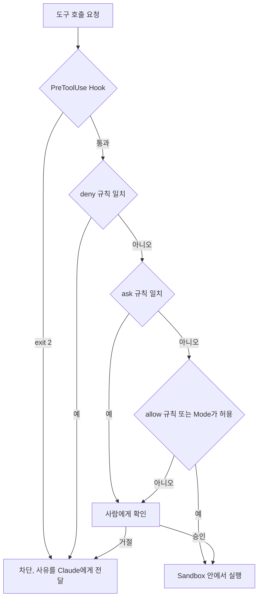

# 권한 · Sandbox · Hook: 강제 층 설계하기

> **학습 목표**: Claude Code의 권한 규칙과 permission mode, Codex의 approval policy와 sandbox mode를 구분해 설명할 수 있다. Hook의 입출력 계약으로 force push 차단과 미커밋 종료 방지를 직접 구현하고, 1인 스튜디오에 맞는 위험 등급별 권한을 설계할 수 있다.

「지시문과 메모리」가 다룬 권고 층은 agent가 *따르려고 노력하는* 것이다. 이 문서는 agent의 판단과 무관하게 harness가 실행하는 **강제 층**을 다룬다. 키 이름과 동작은 2026-09 기준 공식 문서와 openai/codex 소스로 확인했다.

## 핵심 개념

세 장치를 겹쳐 쓰는 이유는 빈틈이 서로 다르기 때문이다. 권한 규칙은 명령 **텍스트**를, sandbox는 **실제 시스템 호출**을, hook은 **맥락**(branch, git 상태)을 본다.

| 장치 | 무엇을 막는가 | 판단 기준 | 한계 |
|---|---|---|---|
| 권한 규칙 (allow · ask · deny) | 도구 호출 | 도구 이름과 인자 텍스트 | Bash는 같은 프로그램의 다른 표기로 빠져나갈 수 있다 |
| Permission mode · approval policy | 묻지 않고 실행할 범위 | 세션 전체 기본값 | 규칙이 mode 위에 얹힌다 |
| Sandbox | 파일시스템 · 네트워크 접근 | OS 수준 (Seatbelt, bubblewrap) | 대상이 셸 명령에 한정된다 |
| Hook | 생명주기 시점의 행동 | 직접 작성한 코드 | 코드가 보는 만큼만 막는다 |

## 원리

### Claude Code 권한 규칙

규칙은 **deny → ask → allow** 순서로 평가되고 처음 일치한 것이 결과를 정한다. 구체성은 순서를 바꾸지 못하므로 `Bash(aws *)` deny는 `Bash(aws s3 ls)` allow보다 항상 먼저다. 어느 scope의 deny든 다른 scope의 allow를 막는다.

| 규칙 | 의미 |
|---|---|
| `Bash(npm run *)` | `npm run`으로 시작하는 명령. `*`는 subcommand 뒤에 둔다 (`:*` 접미사도 같은 뜻) |
| `Read(./.env)`, `Edit(/src/**/*.ts)` | gitignore 문법. `/`는 settings 파일 기준, `//`는 절대 경로, `~/`는 홈 |
| `WebFetch(domain:*.example.com)` | 하위 도메인 fetch |
| `mcp__github__get_*` | 특정 MCP 서버의 도구들 |

Claude Code는 `&&`, `;`, `|`로 이어진 명령을 subcommand마다 검사하고 `timeout`, `nice` 같은 wrapper를 벗겨서 본다. 그래도 **Bash 규칙은 보안 경계가 아니다**. 공식 문서의 예로 `Bash(git push *)` deny는 `git -C . push origin main`을 막지 못한다. 또 커밋된 `.claude/settings.json`의 `allow`는 workspace trust를 수락한 뒤에 적용되고, `deny`와 `ask`는 즉시 적용된다.

### Permission mode

| Mode | 묻지 않고 실행하는 것 | 용도 |
|---|---|---|
| `default` (UI 표기 Manual) | 읽기만 | 민감한 작업 |
| `acceptEdits` | 읽기, 작업 디렉터리 파일 편집, `mkdir` · `mv` 같은 흔한 파일 명령 | 검토하며 반복 |
| `plan` | 읽기 (auto mode가 가능하면 classifier가 승인한 명령도) | 변경 전 탐색 |
| `auto` | 전부, 단 classifier가 배경에서 검사 | 긴 작업 |
| `dontAsk` | 사전 허용된 것만, 나머지는 거부 | CI, 스크립트 |
| `bypassPermissions` | 전부 | 격리된 container · VM 전용 |

`Shift+Tab`으로 순환하고 `--permission-mode`로 시작 mode를 정한다. `auto`와 `bypassPermissions`는 project · local 설정에서 기본값으로 지정할 수 없다. `.git`, `.claude`, `.husky`, `.mcp.json` 같은 **protected path** 쓰기는 원칙적으로 `bypassPermissions`에서만 자동 승인된다. deny 규칙은 모든 mode에서 막는다.

### Sandbox

Claude Code의 sandbox는 Bash · PowerShell · Monitor 명령과 자식 프로세스에 OS 경계를 씌운다. macOS는 Seatbelt, Linux · WSL2는 `bubblewrap`과 `socat`을 쓰며, `/sandbox`로 켜거나 설정에 적는다. 쓰기는 기본적으로 작업 디렉터리와 임시 디렉터리로 제한되지만 읽기는 넓으므로 `~/.ssh` 같은 경로는 직접 막는다. 아래의 `allowUnsandboxedCommands: false`는 sandbox 밖 재시도라는 탈출구를 닫는다. `autoAllowBashIfSandboxed` 기본값 때문에 sandbox 안의 Bash는 묻지 않고 실행되지만, `Bash(git push *)` 같은 내용 지정 ask 규칙과 deny 규칙은 여전히 적용된다.

```json
{
  "sandbox": {
    "enabled": true, "allowUnsandboxedCommands": false,
    "filesystem": { "denyRead": ["~/.ssh", "~/.aws"] },
    "network": { "allowedDomains": ["github.com", "registry.npmjs.org"] }
  }
}
```

### Codex: approval policy와 sandbox mode

| 키 | 값 | 의미 |
|---|---|---|
| `sandbox_mode` | `read-only` · `workspace-write` · `danger-full-access` | `workspace-write`의 네트워크는 기본 꺼짐 (`[sandbox_workspace_write] network_access`) |
| `approval_policy` | `on-request` (기본, `on-failure`는 별칭) | 모델이 필요할 때 승인을 요청 |
| `approval_policy` | `never` | 묻지 않는다. 실패는 모델에게 그대로 반환 |
| `approval_policy` | `{ granular = { … } }` | 범주별 허용 또는 자동 거절 |

이처럼 Codex는 **무엇을 할 수 있는가**(`sandbox_mode`)와 **언제 묻는가**(`approval_policy`)를 분리한다. `untrusted` 값은 2026-09 main 소스에서 "no longer supported" 오류를 낸다. CLI에서는 `-s`/`--sandbox`, `-a`/`--ask-for-approval`로 바꾸며, `--dangerously-bypass-approvals-and-sandbox`(별칭 `--yolo`)는 외부에서 이미 격리된 환경 전용이다. 명령 단위 규칙은 설정 폴더의 `rules/*.rules`(예: `~/.codex/rules/default.rules`)에 Starlark로 적는다. 예: `prefix_rule(pattern = ["git", "push", ["--force", "-f"]], decision = "forbidden")`. 이 규칙은 **앞에서부터** 토큰을 맞추므로 `git push origin --force`는 걸리지 않는다.

### Hook: 이벤트와 입출력 계약

Claude Code hook은 생명주기 이벤트에 실행되는 command · http · mcp_tool · prompt · agent 처리기다. 2026-09 기준 이벤트는 30개가 넘으며 자주 쓰는 것은 `SessionStart`, `UserPromptSubmit`, `PreToolUse`, `PermissionRequest`, `PostToolUse`, `Stop`, `SubagentStop`, `PreCompact`, `SessionEnd`다.

- **입력**: stdin JSON. 공통 필드 `session_id`, `transcript_path`, `cwd`, `permission_mode`, `hook_event_name`에 이벤트별 필드(`tool_name`, `tool_input`, `stop_hook_active` 등)가 붙는다.
- **Exit code**: 0은 성공이며 stdout JSON을 읽는다. 2는 차단이며 stderr가 사유로 Claude에게 간다. `PreToolUse`의 exit 2는 권한 규칙 평가 전에 호출을 멈춘다. **그 밖의 값은 대부분 non-blocking 오류라 행동이 그대로 진행된다.**
- **JSON 출력**: `PreToolUse`는 `hookSpecificOutput.permissionDecision`(`allow` · `deny` · `ask` · `defer`), `Stop`은 최상위 `"decision": "block"`과 `reason`을 쓴다. hook의 `allow`도 deny · ask 규칙을 넘지 못한다.



## 적용: 이 저장소의 설정

이 저장소는 역할 agent에 권한을 박아 두었다. Claude agent 두 개는 `tools: Read, Grep, Glob, Bash`와 `permissionMode: plan`, Codex agent 세 개는 `sandbox_mode = "read-only"`다. `.ai/HARNESS.md`는 parent runtime override가 파일의 sandbox 설정을 이길 수 있으니 실제 권한을 확인하라고 덧붙인다. 그러나 **커밋된 `.claude/settings.json`과 hook은 없다**. 아래는 이 빈칸을 채우는 초안이며, 테스트 명령은 이 저장소의 `node --test tests/*.test.cjs`다.

```json
{
  "permissions": {
    "allow": ["Bash(node --test *)", "Bash(python3 .ai/tools/check_policy_set.py)", "Bash(git diff *)", "Bash(git log *)", "Bash(git commit *)"],
    "ask": ["Bash(git push *)", "Bash(git reset --hard *)", "WebFetch"],
    "deny": ["Read(./.env)", "Read(./.env.*)", "Bash(git push --force *)", "Bash(git push -f *)"]
  },
  "hooks": {
    "SessionStart": [{ "hooks": [{ "type": "command", "command": "bash \"$CLAUDE_PROJECT_DIR\"/.claude/hooks/session-baseline.sh" }] }],
    "PreToolUse": [{ "matcher": "Bash", "hooks": [{ "type": "command", "if": "Bash(git *)", "command": "bash \"$CLAUDE_PROJECT_DIR\"/.claude/hooks/block-force-push.sh" }] }],
    "Stop": [{ "hooks": [{ "type": "command", "command": "bash \"$CLAUDE_PROJECT_DIR\"/.claude/hooks/stop-if-dirty.sh" }] }]
  }
}
```

**Hook 1, force push 차단** (`.claude/hooks/block-force-push.sh`). 한 글자 따옴표를 풀고 여러 단어짜리 따옴표 문자열(commit 메시지 등)은 지운 뒤, `&&` · `;` · `|` · 줄바꿈으로 명령을 나눠 **각 `push` 뒤의 인자만** 검사한다. `jq`가 없거나 입력을 읽지 못하면 **닫힌 쪽으로 실패**(exit 2)한다. `jq` 실패로 `CMD`가 비어 exit 0으로 끝나면 차단이 조용히 꺼지고, exit 0의 stderr는 debug log에만 남아 아무도 모른다.

```bash
command -v jq >/dev/null || { echo "Blocked: jq is missing, so the force-push check cannot run." >&2; exit 2; }
CMD=$(jq -r '.tool_input.command // empty') || exit 2
S=$(printf '%s\n' "$CMD" | sed -E "s/[\"']([^\"'[:space:]]*)[\"']/\1/g; s/\"[^\"]*\"|'[^']*'//g; s/(&&|\|\||[;&|])/\n/g")
ARGS=$(printf '%s\n' "$S" | sed -nE 's/^(.*[[:space:]])?push([[:space:]].*)?$/ \2 /p')
if printf '%s\n' "$ARGS" | grep -Eq '[[:space:]]-[A-Za-z]*f[A-Za-z]*([[:space:]]|$)|[[:space:]]--force(-with-lease|-if-includes)?(=|[[:space:]]|$)|[[:space:]]--mirror([[:space:]]|$)|([[:space:]]|:)\+[^[:space:]]'; then
  echo "Blocked: force push is not allowed from an agent session. Ask the owner." >&2
  exit 2
fi
exit 0
```

아래는 실제로 실행한 29개 사례 중 일부다(2026-09-29, bash 5 · GNU grep/sed · jq 1.7). "jq 없음"은 `PATH`에서 `jq`를 뺀 실행이다. 줄바꿈 치환은 GNU sed 문법이므로 macOS 기본 sed에서는 따로 시험해야 한다.

| 명령 | 기대 | jq 있음 | jq 없음 |
|---|---|---|---|
| `git push origin main` | 0 | 0 | 2 |
| `git push -u origin feature` | 0 | 0 | 2 |
| `git push origin fix-foo` | 0 | 0 | 2 |
| `git commit -m "push -f later" && git status` | 0 | 0 | 2 |
| `git push -fu origin main` · `-uf` · `-nf` | 2 | 2 | 2 |
| `git -C . push -f origin main` | 2 | 2 | 2 |
| `git push origin "+main"` · `'+main'` · `HEAD:+main` | 2 | 2 | 2 |
| `git push --force-with-lease=main:abc123 origin main` | 2 | 2 | 2 |
| `git push --force-if-includes origin main` | 2 | 2 | 2 |
| `git push --mirror origin` | 2 | 2 | 2 |
| `git commit -m "push" && git push -f origin main` | 2 | 2 | 2 |

**Hook 2 · 3, 이번 세션이 만든 변경을 커밋하지 않은 채 끝내지 않기**. 세션은 주인의 WIP가 남은 더러운 트리에서 시작할 수 있다. 그래서 `SessionStart`(`session-baseline.sh`)가 `git status --porcelain`을 세션별 기준선으로 저장하고, `Stop`(`stop-if-dirty.sh`)은 **새로 생긴 줄만** 문제 삼는다. 경로는 `$CLAUDE_PROJECT_DIR`이 아니라 stdin의 `cwd`를 쓴다. worktree에 들어가면 `CLAUDE_PROJECT_DIR`은 시작 위치에 머물고 `cwd`만 따라가기 때문이다. 기준선은 없을 때만 쓰므로 compact · resume으로 `SessionStart`가 다시 불려도 유지된다.

```bash
command -v jq >/dev/null || exit 0
INPUT=$(cat)
SID=$(printf '%s' "$INPUT" | jq -r '.session_id'); DIR=$(printf '%s' "$INPUT" | jq -r '.cwd')
cd "$DIR" 2>/dev/null && GITDIR=$(git rev-parse --absolute-git-dir 2>/dev/null) || exit 0
[ -e "$GITDIR/agent-baseline-$SID" ] || git status --porcelain > "$GITDIR/agent-baseline-$SID"
exit 0
```

```bash
command -v jq >/dev/null || { echo '{"systemMessage":"stop-if-dirty: jq is missing, uncommitted-work check skipped"}'; exit 0; }
INPUT=$(cat)
[ "$(printf '%s' "$INPUT" | jq -r '.stop_hook_active')" = "true" ] && exit 0
SID=$(printf '%s' "$INPUT" | jq -r '.session_id'); DIR=$(printf '%s' "$INPUT" | jq -r '.cwd')
cd "$DIR" 2>/dev/null && GITDIR=$(git rev-parse --absolute-git-dir 2>/dev/null) || exit 0
BASE="$GITDIR/agent-baseline-$SID"
[ -f "$BASE" ] || { echo '{"systemMessage":"stop-if-dirty: no session baseline, check skipped"}'; exit 0; }
NEW=$(git status --porcelain | grep -vxF -f "$BASE")
if [ -n "$NEW" ]; then
  printf 'Files changed during this session are uncommitted:\n%s\nCommit your own changes in meaningful units, or say in the report why they stay uncommitted. Do not commit files that were already modified before the session.\n' "$NEW" >&2
  exit 2
fi
exit 0
```

| 상황 | 기대 | 결과 |
|---|---|---|
| 깨끗한 트리 | 0 | 0 |
| 세션 전부터 주인이 수정한 파일만 있음 | 0 | 0 |
| agent가 tracked 파일 수정 / 새 파일 생성 | 2 | 2 |
| 같은 상황, `stop_hook_active: true` | 0 | 0 |
| agent는 commit했고 주인 WIP만 남음 | 0 | 0 |
| 기준선 없음 · `jq` 없음 | 0 + 경고 | 0 + `systemMessage` |

한계도 적어 둔다. 주인이 이미 수정한 파일을 agent가 더 고치면 `git status` 줄이 같아 잡지 못한다. 기준선이 없을 때(세션 도중 설치, 새 worktree)와 `jq`가 없을 때는 막지 않고 `systemMessage`로 알린다. Stop에서 닫힌 쪽으로 실패하면 세션을 끝낼 수 없기 때문이다. 기준선 파일은 `.git/` 안에 남으므로 필요하면 `SessionEnd` hook으로 지운다.

## 심화

### 1인 스튜디오의 위험 등급 설계

혼자 여러 제품을 운영하면 승인 요청이 많아지고, 많아지면 읽지 않고 승인하게 된다. 그래서 **위험 등급마다 장치를 하나씩** 정한다. 「Claude Code를 Git Client처럼 쓰기」의 안전 루프를 설정으로 옮긴 것이며, T3는 GitHub branch protection처럼 agent 바깥의 마지막 방어선까지 둔다.

| 등급 | 예 | Claude Code | Codex |
|---|---|---|---|
| T0 조회 | 읽기, 검색, `git diff` | 기본 허용 | `read-only` |
| T1 로컬 · 되돌릴 수 있음 | 편집, 테스트, 로컬 commit | `acceptEdits` 또는 allow + sandbox | `workspace-write` + `on-request` |
| T2 공유 상태 | push, PR, 의존성 설치, 네트워크 | ask | sandbox 밖 요청은 승인 |
| T3 비가역 · 외부 비용 | force push, 배포, 결제 API, 대량 삭제 | deny + hook + 사람 | `forbidden` 규칙 + 서버 쪽 보호 |

### Secrets 위생

- 권한 규칙은 Read 도구를, sandbox는 `cat` 같은 Bash 경로를 막으므로 **둘 다** 쓴다. sandbox의 `credentials`는 파일 읽기를 막고(`"mode": "deny"`), 나열한 환경 변수를 sandbox 명령 실행 전에 지운다. 기본 목록은 없으므로 직접 적는다. `permissions.blockReadsOutsideWorkingDirectories`는 file 도구가 작업 디렉터리 밖을 읽지 못하게 한다.
- `.claude/settings.local.json`과 `CLAUDE.local.md`는 commit하지 않는다. 프로젝트 `.mcp.json`의 원격 `url` · `headers`에서는 일부 자격 증명 변수(문서의 예: `ANTHROPIC_AUTH_TOKEN`)가 빈 값으로 읽힌다. Codex는 `shell_environment_policy`(`inherit`, `exclude`, `include_only`, `set`)로 명령에 전달할 환경 변수를 줄인다.

```json
{
  "permissions": { "blockReadsOutsideWorkingDirectories": true, "deny": ["Read(./.env)", "Read(./.env.*)"] },
  "sandbox": {
    "enabled": true,
    "credentials": {
      "files": [{ "path": "~/.ssh", "mode": "deny" }, { "path": "~/.aws/credentials", "mode": "deny" }],
      "envVars": [{ "name": "GITHUB_TOKEN", "mode": "deny" }, { "name": "NPM_TOKEN", "mode": "deny" }]
    }
  }
}
```

### 흔한 실패 모드

- **Hook이 알림과 함께 꺼진다**: 스크립트 경로가 틀렸거나 실행할 수 없으면 셸이 127 같은 코드로 끝나고, transcript에 `Failed with non-blocking status code: …` 알림이 뜨지만 행동은 진행된다. 첫 실행에서 이 알림을 확인한다.
- **Hook이 알림 없이 꺼진다**: 더 위험하다. `jq` 같은 도구가 없어 입력이 비고 스크립트가 exit 0으로 끝나면 아무 표시도 없다. 차단 hook은 도구가 없을 때 exit 2로 끝나게 쓰고, 설치 직후 도구가 있을 때와 없을 때를 모두 시험한다(둘 다 `exit=2`가 나와야 한다).
- **project allow가 먹지 않는다**: workspace trust 전이거나, trust 대화상자가 없는 `claude -p` 실행이다. Codex도 신뢰하지 않은 프로젝트의 `.codex/config.toml`은 비활성이다.

```bash
printf '%s' '{"tool_input":{"command":"git push -f"}}' | bash .claude/hooks/block-force-push.sh; echo "exit=$?"
printf '%s' '{"tool_input":{"command":"git push -f"}}' | env PATH=/nonexistent /bin/bash .claude/hooks/block-force-push.sh; echo "exit=$?"
```

## 흔한 오해

- **"allow를 넓게 주고 deny로 위험한 것만 막으면 된다."** Bash deny는 표기만 바꿔도 빠져나간다. 넓은 allow에는 sandbox를 겹친다.
- **"bypassPermissions에서도 protected path는 보호된다."** 그 mode는 protected path 쓰기까지 허용한다. container 밖에서 쓰지 않는다.
- **"Codex의 `never`는 안전 모드다."** 묻지 않을 뿐이며, 안전은 `sandbox_mode`가 정한다.

## 자기 점검 질문

1. `Bash(git push *)`가 ask에, `Bash(git push origin main)`이 allow에 있다. `git push origin main`은 어떻게 처리되는가?
2. 차단 hook이 exit 1로 끝나면 어떤 일이 일어나며, 왜 위험한가?
3. Stop hook에서 `stop_hook_active`를 확인하지 않으면 어떻게 되는가?
4. Codex에서 `approval_policy = "never"`와 `sandbox_mode = "workspace-write"`를 함께 쓰면 무엇이 허용되고 무엇이 막히는가?
5. 위험 등급 T3의 작업을 agent 설정만으로 막으면 부족한 이유는 무엇인가?

## 참고 자료

- Claude Code, [Configure permissions](https://code.claude.com/docs/en/permissions) · [Permission modes](https://code.claude.com/docs/en/permission-modes) · [Sandboxing](https://code.claude.com/docs/en/sandboxing) (2026-09-29 확인)
- Claude Code, [Hooks reference](https://code.claude.com/docs/en/hooks) · [Hooks guide](https://code.claude.com/docs/en/hooks-guide) (2026-09-29 확인)
- OpenAI Codex, [Agent approvals & security](https://developers.openai.com/codex/agent-approvals-security) · [Sandbox](https://developers.openai.com/codex/concepts/sandboxing) (2026-09-29, 소스 `protocol.rs`, `config.schema.json`, `execpolicy/README.md`로 교차 확인)
- 이 저장소: `.ai/HARNESS.md`, `.claude/agents/*.md`, `.codex/agents/*.toml`
