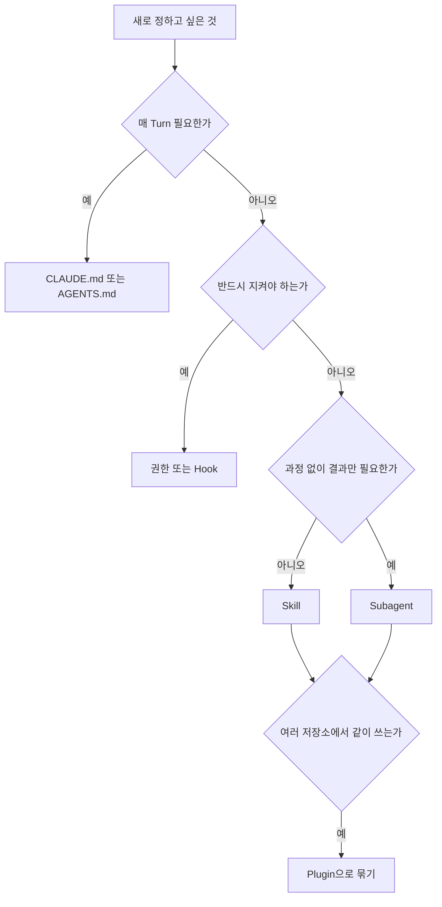

# Subagent · Skill · Command · Plugin

> **학습 목표**: Subagent, Skill, Command, Plugin이 각각 무엇을 담고 언제 Context에 들어오는지 구분하고, Claude Code와 Codex에서 파일로 정의하는 방법을 알며, 역할 하나당 파일 하나라는 원칙으로 이 저장소의 탐색자·검토자·자동 개발 Skill을 읽고 고칠 수 있다.

기준일: 2026-09-29. 필드 이름과 경로는 Claude Code 공식 문서와 Codex 공개 소스·문서 기준이며 자주 바뀐다. 개념은 「Session · Agent · Subagent」와 「Multi-Agent 역할과 모델 라우팅」에 있고, 이 문서는 그 개념을 **실제 설정 파일**로 옮긴다. 지시문 파일은 「지시문과 메모리」, 권한과 Hook은 「권한 · Sandbox · Hook」에서 다룬다.

## 핵심 개념

| 구성요소 | 한 줄 정의 | Context에 들어오는 시점 | Claude Code 위치 | Codex 위치 |
|---|---|---|---|---|
| Subagent | 별도 Context에서 일하는 **작업자** 정의 (지시문 + 도구 + 모델) | 위임될 때, 새 Context로 | `.claude/agents/*.md` | `.codex/agents/*.toml` |
| Skill | 필요할 때 꺼내 쓰는 **절차와 참고 자료** | 설명은 늘, 본문은 호출될 때 | `.claude/skills/<name>/SKILL.md` | `.agents/skills/<name>/SKILL.md` |
| Command | 사람이 `/이름`으로 당기는 **방아쇠** | 사람이 입력할 때 | `.claude/commands/*.md` (Skill로 통합됨) | Skill을 `$이름`으로 명시 호출 |
| Plugin | 위 구성요소와 Hook · MCP Server를 묶은 **배포 단위** | 활성화된 모든 Session | `.claude-plugin/plugin.json` + Marketplace | `codex plugin` 명령 (세부는 확인 필요) |

한 문장으로 줄이면 **Subagent는 "누가", Skill은 "어떻게", Command는 "언제 사람이", Plugin은 "어떻게 나눠 줄까"** 에 답한다. Claude Code에서 Custom Command는 Skill로 합쳐졌다. `.claude/commands/deploy.md`와 `.claude/skills/deploy/SKILL.md`는 둘 다 `/deploy`를 만들고, 새로 만든다면 보조 파일과 호출 제어 필드를 쓸 수 있는 Skill이 낫다.

SKILL.md는 [Agent Skills](https://agentskills.io) 공개 표준을 따른다. 표준 필드는 `name`, `description`, `license`, `compatibility`, `metadata`, `allowed-tools`이고, `disable-model-invocation`이나 `context: fork`는 Claude Code 확장이다. 같은 SKILL.md를 두 도구가 읽어도 **확장 필드의 효과는 Claude Code에서만** 기대한다.

## 원리

### Context 격리: 아끼는 것과 쓰는 것

Subagent(Fork가 아닌 것)는 **빈 Context에서 시작**한다. 대화 이력도, 이미 읽은 파일도 모르고, 위임 메시지와 자기 정의 파일만 받는다. 조사 과정의 Tool 결과가 Main Context에 쌓이지 않는 대신 대가가 있다. Subagent의 요청도 Main 대화와 **같은 사용량 한도**에 합산되고, 필요한 사실을 다시 모으느라 시간이 걸리며, 요약 형식을 정하지 않으면 과정 설명이 돌아와 절약한 Context를 다시 쓴다. Claude Code는 기본적으로 3단계까지 중첩(`CLAUDE_CODE_MAX_SUBAGENT_SPAWN_DEPTH`)과 동시 20개를 허용한다.

공식 문서의 기준: 주고받기가 잦거나, 단계들이 Context를 많이 공유하거나, 작은 수정이거나, 지연이 중요하면 **Main 대화**에서 한다. 결과만 필요하고 과정이 길거나 서로 독립적인 조사는 **Subagent**에 맡긴다.

### Progressive Disclosure: Skill이 싼 이유

1. **목록**: 모든 Skill의 이름과 설명이 늘 들어간다. Claude Code는 목록에 Context Window의 약 1%를 쓰고, Skill 하나의 `description` + `when_to_use`를 1,536자에서 자른다. 넘치면 덜 쓰는 Skill의 설명부터 빠진다. 그래서 **설명 첫 문장에 "언제 쓰는지"를 넣는 것**이 Skill 설계의 절반이다.
2. **본문**: 호출될 때 SKILL.md 본문이 들어온다. 공식 권장은 500줄 이하다.
3. **보조 파일**: 본문이 가리키는 참고 문서와 Script는 필요할 때만 읽는다.

### 누가 호출하는가

| 목적 | Claude Code | Codex |
|---|---|---|
| 사람만 호출 (배포, 자동 개발처럼 부작용이 큰 절차) | `disable-model-invocation: true` — 설명도 목록에서 빠진다 | `agents/openai.yaml`의 `policy.allow_implicit_invocation: false` — `$이름`으로만 호출 |

### 무엇을 어디에 둘까



## 적용: 이 저장소의 설정

### Claude Code Subagent: 읽기 전용 탐색자

`.claude/agents/fast-explorer.md`의 Front Matter:

```yaml
---
name: fast-explorer
description: Read-only search across the repository. Use when finding where something already exists would cost the main context more than the answer is worth.
tools: Read, Grep, Glob, Bash
permissionMode: plan
maxTurns: 6
---
```

| 필드 | 값 | 이유 |
|---|---|---|
| `tools` | Edit · Write 없음 | 생략하면 **모든 도구를 상속**한다. 목록은 허용 목록이다 |
| `permissionMode` | `plan` | 읽기 전용 탐색 모드(Plan Mode)로 시작한다. 단, 부모 mode가 덮어쓸 수 있다(아래 흔한 오해 참고) |
| `maxTurns` | `6` | 한도에 닿으면 멈추고 부분 결과를 돌려준다 |
| `model` | 없음 | 가장 싼 유능한 Model이 이기는 역할이라 Harness에 맡긴다 |

본문은 반환 형식을 `FILES / FINDINGS / RISK`, 150 Token 이하로 고정한다. **반환 형식이 곧 Context 예산**이다. `adversarial-reviewer.md`도 같은 도구 · `plan` 모드에 `maxTurns: 8`인데, Model을 고정하지 않는 이유는 다르다. 독립 검토는 "구현자와 **다른** Model"로 정의되므로 누가 구현했는지 알기 전에는 정할 수 없다.

### Codex Custom Agent: 같은 역할의 TOML 번역

`.codex/agents/dispatcher.toml` (발췌):

```toml
name = "dispatcher"
description = "Low-cost first-pass request router. Classifies intent, risk, repository, cost exposure, required tools and the next agent; never edits or merges."
model = "gpt-5.6-luna"
model_reasoning_effort = "low"
sandbox_mode = "read-only"
developer_instructions = '''
You are the first-pass Dispatcher. You classify and route; you do not edit,
implement, choose product scope, approve paid automation, or merge.
'''
```

| Claude Code 필드 | Codex 대응 | 차이 |
|---|---|---|
| `name`, `description`, 본문 | `name`, `description`, `developer_instructions` | `name`과 `developer_instructions`는 필수다. `description`은 파일에서 생략할 수 있지만 적었다면 비어 있으면 안 되고, 다른 설정 층의 같은 이름 역할도 설명을 채우지 않으면 그 역할은 경고와 함께 무시된다(`codex-rs/agent-roles/src/`, 2026-09-29 main) |
| `tools` 허용 목록 | 없음 | `sandbox_mode`와 지시문으로 대신한다 |
| `permissionMode: plan` | `sandbox_mode = "read-only"` | 양쪽 모두 부모나 Runtime이 덮어쓸 수 있으므로 실효 권한을 확인한다(아래 흔한 오해 참고) |
| `maxTurns` | 없음 | 지시문의 "at most eight rounds"는 강제되는 카운터가 아니다 |
| `model` | `model`, `model_reasoning_effort` | Agent 파일의 `model`이 Spawn 요청보다 우선하므로 검토자 파일은 일부러 비운다 |

Codex는 **명시적으로 요청받을 때만** Subagent를 띄운다. 설명만 보고 자동 위임하는 Claude Code와 다르므로, Codex 쪽 지시문에는 "언제 어떤 Agent를 부를지"를 적어야 한다.

### Skill: 스스로 시작하지 않는 자동 개발

`auto-dev`는 두 플랫폼에 같은 절차로 들어 있다. Codex 쪽은 `.agents/skills/auto-dev/agents/openai.yaml`로 호출 정책을 강제한다.

```yaml
policy:
  allow_implicit_invocation: false
```

Claude 쪽은 설명문("Invoke ONLY when the user explicitly asks…")과 본문 첫 절 *This mode never starts itself*로 막는다. 기계적으로도 막고 싶다면 `disable-model-invocation: true`를 더할 수 있다. 이 필드는 Subagent 사전 로드와, 이 Skill을 Prompt로 쓰는 예약 작업 실행도 막는다.

## 심화

### Command형 Skill 작성

```markdown
---
name: release-notes
description: Draft release notes from commits since a tag. Use only when the owner asks for release notes.
disable-model-invocation: true
argument-hint: [since-tag]
allowed-tools: Bash(git log *) Bash(git tag *)
---

Draft release notes for commits since $ARGUMENTS, grouped by user-visible change.
```

`$ARGUMENTS`, `$0`, `${CLAUDE_SKILL_DIR}` 같은 치환을 쓸 수 있다. Script를 Skill 폴더에 넣고 `${CLAUDE_SKILL_DIR}/scripts/…`로 부르면 작업 위치와 무관하게 동작한다. `context: fork`를 주면 Skill이 Subagent Context에서 돌아 긴 조사형 절차에 맞다.

### Plugin과 Marketplace

Plugin은 `.claude-plugin/plugin.json` Manifest와 `skills/`, `agents/`, `hooks/hooks.json`, `.mcp.json`을 담은 폴더다. Marketplace는 `.claude-plugin/marketplace.json`이 있는 저장소로, **호스팅 상점이 아니라 목록**이다. 개발 중에는 `--plugin-dir`로 폴더를 바로 불러 시험한다.

활성화된 Plugin의 Skill · Agent 설명은 쓰지 않는 Session에서도 **매 Turn** Context에 들어가고, Plugin이 실행하는 것은 **내 권한으로** 실행된다. Cloud Session은 저장소 설정에 적힌 Plugin을 설치하지 않으므로 Cloud에서 필요한 것은 `.claude/` 아래에 직접 커밋한다. 1인 스튜디오라면 처음에는 **저장소마다 `.claude/`를 커밋**하고, 같은 파일을 세 번째 저장소에 복사할 때 Plugin으로 옮긴다.

### 설계 규칙

1. **Agent 하나에 책임 하나.** "탐색하고 고치고 검토한다"는 세 Agent다.
2. **검토자는 읽기 전용.** 고칠 수 있는 검토자는 자기 의견을 구현하고 통과시킨다.
3. **검토는 다른 Model로.** 불가능하면 결과에 `FALLBACK REVIEW`라고 붙인다.
4. **반환 형식을 고정한다.** 형식 없는 Subagent는 과정 보고서를 돌려준다.
5. **능력은 커밋한다.** 홈 폴더에만 있는 Agent는 다른 Run과 Cloud Session에 없다.

```text
나쁜 예: description: Helps with code.
좋은 예: description: Independent review of a diff against its requirement.
        Use at MEDIUM and HIGH risk, after build and tests, before merge.
```

## 흔한 오해

- **"`tools`를 비워 두면 안전하다."** 생략은 전부 상속이다. 제한하려면 적는다.
- **"Skill이 많으면 Context가 가득 찬다."** 늘 들어가는 것은 설명뿐이다. 문제는 설명이 잘려 **호출이 안 되는** 쪽이다.
- **"Subagent를 늘리면 싸고 빠르다."** 각자 새 Context에서 다시 읽고, 사용량은 같은 한도에 쌓인다.
- **"Claude 설정을 Codex가 그대로 읽는다."** SKILL.md 형식은 공유하지만 폴더(`.claude/skills` vs `.agents/skills`)와 Agent 형식(Markdown vs TOML)이 다르다.
- **"Agent 파일의 `permissionMode`/`sandbox_mode`가 곧 실효 권한이다."** Claude Code에서는 부모 대화가 acceptEdits · auto · bypassPermissions면 `permissionMode`가 무시되고 부모 mode로 돈다. 파일의 mode가 적용되는 것은 부모가 default · dontAsk · plan일 때뿐이다. Codex의 `sandbox_mode`도 상위 Runtime 설정이 덮어쓸 수 있다. 실제로 확인한다.

## 자기 점검 질문

1. Subagent의 `tools` 필드를 생략했을 때와 `Read, Grep`만 적었을 때 무엇이 다른가?
2. Skill 설명이 1,536자를 넘거나 목록 예산을 넘으면 어떤 증상이 나타나는가?
3. 이 저장소의 `adversarial-reviewer`가 Model을 고정하지 않는 이유를 Codex의 우선순위 규칙과 함께 설명하라.
4. 배포 절차를 CLAUDE.md, Skill, Hook 중 어디에 두어야 하는지 판단 기준을 말하라.
5. Cloud Session에서 Plugin의 Skill이 보이지 않을 때 가장 먼저 의심할 것은?

## 참고 자료

- [Create custom subagents](https://code.claude.com/docs/en/sub-agents) — Claude Code Docs, 접근일 2026-09-29
- [Extend Claude with skills](https://code.claude.com/docs/en/skills) — Claude Code Docs, 접근일 2026-09-29
- [Plugins overview](https://code.claude.com/docs/en/plugins) — Claude Code Docs, 접근일 2026-09-29
- [Agent Skills](https://agentskills.io) — Agent Skills 공개 표준, 접근일 2026-09-29
- [Subagents](https://developers.openai.com/codex/subagents) — OpenAI Codex Docs, 검색 결과로 확인, 접근일 2026-09-29
- [Build skills](https://developers.openai.com/codex/skills) — OpenAI Codex Docs, 검색 결과로 확인, 접근일 2026-09-29
- 이 저장소의 `.claude/agents/`, `.codex/agents/`, `.agents/skills/auto-dev/`, `.ai/HARNESS.md` — 2026-09-29 기준
