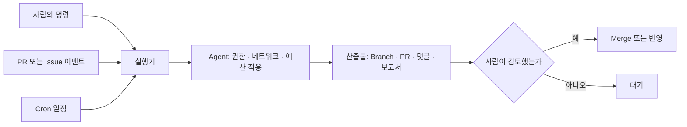

# Headless · CI · Cloud 실행

> **학습 목표**: 사람이 지켜보지 않는 Agent 실행(Headless CLI, SDK, GitHub Actions, Cloud Session, 예약 실행)을 구분하고, 각 실행에서 권한 · 네트워크 · 비용 한도를 명시적으로 정하며, 실행 기록을 남기고 흔한 설정 문제를 순서대로 진단할 수 있다.

기준일: 2026-09-29. Claude Code는 공식 문서, Codex는 공개 소스와 공식 Action 저장소 기준이며 Flag 이름은 자주 바뀐다. 이 문서의 모든 명령은 실행 전에 `--help`로 다시 확인한다.

## 핵심 개념

| 실행 방식 | Claude Code | Codex | 맞는 일 |
|---|---|---|---|
| Headless CLI | `claude -p` | `codex exec` | Script · Makefile에서 한 번 묻고 결과 받기 |
| SDK | Claude Agent SDK (Python · TypeScript) | 확인 필요 | 내 Program 안에 Agent Loop 넣기 |
| CI Action | `anthropics/claude-code-action` | `openai/codex-action` | PR · Issue 이벤트에 반응 |
| Cloud Session | Claude Code on the web | Codex cloud | 노트북을 닫아도 계속되는 작업 |
| 예약 실행 | Routines, Actions `schedule` | Actions `schedule` | 매일 보고서, 주간 정리 |



## 원리

### 사람이 없으면 설정이 대신 답한다

대화형 Session에서는 사람이 권한 질문에 답하고, 멈추고, 비용을 본다. Headless에서는 그 답을 **미리 적어 두어야** 한다.

| 질문 | Claude Code | Codex |
|---|---|---|
| 무엇을 묻지 않고 해도 되나 | `--allowedTools "Read,Bash(git diff *)"`, `--permission-mode dontAsk` | `--sandbox read-only` · `workspace-write` |
| 어디까지 닿나 | Cloud Environment의 네트워크 수준, `--strict-mcp-config` | Sandbox, Cloud의 Agent 단계 인터넷 설정 |
| 얼마나 쓰나 | `--max-turns`, `--max-budget-usd`, `--model` | `--model`, Workflow `timeout-minutes` |

`dontAsk`는 물어야 할 호출을 전부 거부하고, 허용 규칙에 걸린 것만 실행한다. 잠근 CI에 맞다. 규칙 `Bash(git diff *)`의 공백은 중요하다. 공백 없이 `Bash(git diff*)`라 쓰면 `git diff-index`도 맞는다.

### 재현 가능한 실행은 암묵적 설정을 싫어한다

`claude -p`는 기본적으로 대화형과 같은 설정(CLAUDE.md, Hook, Skill, Plugin, `.mcp.json`)을 읽고, **신뢰 확인 없이** 저장소의 Hook과 MCP Server를 실행한다. `--bare`는 이 자동 탐색을 모두 건너뛰며 Script용으로 권장되고, 앞으로 `-p`의 기본값이 될 예정이다. 대신 필요한 것을 `--append-system-prompt-file`, `--mcp-config`, `--agents`, `--settings`로 **명시적으로** 넘긴다. 남이 올린 코드를 도는 CI일수록 이쪽이 안전하다.

## 적용: 이 저장소의 설정

2026-09-29 현재 이 저장소에는 `.github/workflows/`도 `.claude/settings.json`도 없다. 대신 `.ai/HARNESS.md`가 두 가지를 요구한다.

- **비용이 드는 자동화**는 켜기 전에 제공자, 과금 단위, 예상 상한, 소유자 승인, 만료일을 기록한다. 하나라도 모르면 켜지 않고 로컬 검증으로 대신한다.
- **실행 재현**: 나중에 인용될 결과에는 기준 Commit, 정확한 명령, 명령이 의존한 도구 Version을 남긴다.

그래서 아래 설정은 "도입한다면"의 형태다. Model 이름은 예시이고, `<commit-sha>`는 검토한 Action Commit으로 고정한다.

### Headless 한 줄

```bash
claude --bare -p "Summarize the failing tests in test.log" --allowedTools "Read" --output-format json --max-turns 5 --max-budget-usd 1.00
codex exec --sandbox read-only --json -o summary.md "Summarize the failing tests in test.log"
codex exec resume --last "Now propose a fix for the first failure"
```

- Claude의 `--output-format`은 `text` · `json` · `stream-json`이다. `json` 결과에는 `result`, `session_id`, `total_cost_usd`가 들어 있고, `--json-schema`를 주면 `structured_output`으로 형식을 강제한다. 후속 질문은 `--resume <session_id>` 또는 `--continue`.
- Codex의 `--json`은 이벤트를 JSONL로 흘리고, `-o`(`--output-last-message`)는 마지막 답만 파일로 쓴다. 구조화 출력은 `--output-schema <file>`. 오래된 글의 `--full-auto`는 2026-09 현재 main 소스의 공통 옵션에 보이지 않으니 `--sandbox`를 직접 쓴다.
- `--dangerously-bypass-approvals-and-sandbox`(Codex)와 `bypassPermissions`(Claude)는 이미 격리된 일회용 Runner에서만 쓴다.

### GitHub Actions

```yaml
name: agent-review
on:
  pull_request:
    types: [opened, synchronize]
permissions:
  contents: read
  pull-requests: read
  id-token: write
jobs:
  review:
    runs-on: ubuntu-latest
    timeout-minutes: 15
    concurrency:
      group: agent-review-${{ github.event.pull_request.number }}
      cancel-in-progress: true
    steps:
      - uses: actions/checkout@<commit-sha>
      - uses: anthropics/claude-code-action@<commit-sha>
        with:
          anthropic_api_key: ${{ secrets.ANTHROPIC_API_KEY }}
          prompt: "Use the adversarial-reviewer subagent to review this pull request against its description."
          claude_args: |
            --max-turns 8
            --allowedTools "Read,Grep,Glob,Bash(git diff *)"
```

```yaml
      - uses: openai/codex-action@<commit-sha>
        with:
          openai-api-key: ${{ secrets.OPENAI_API_KEY }}
          prompt-file: .github/codex/review.md
          sandbox: read-only
          safety-strategy: drop-sudo
          output-file: codex-review.md
```

- Claude Action은 `prompt`가 있으면 자동화 모드로 돌고, 허용한 도구 외에는 Shell도 GitHub API도 쓰지 못한다. 결과를 PR 댓글로 달려면 공식 예시처럼 댓글용 도구를 `--allowedTools`에 명시한다. `id-token: write`는 기본 GitHub App 인증에 필요하다. 가장 쉬운 설치는 Claude Code 안에서 `/install-github-app`이다.
- Codex Action의 `safety-strategy` 기본값 `drop-sudo`는 Codex 실행 전에 sudo 권한을 뺀다. 사람이 PR에서 `@claude`나 `@codex review`로 부르는 대화형 연동도 있다.
- Fork에서 온 PR에는 Secret이 없다. 이를 피하려고 `pull_request_target`에서 PR 코드를 Checkout하면 남의 코드가 내 Secret과 함께 돈다. 하지 않는다.

## 심화

### Claude Agent SDK

```python
import asyncio
from claude_agent_sdk import query, ClaudeAgentOptions

async def main():
    options = ClaudeAgentOptions(allowed_tools=["Read", "Grep", "Glob"], max_turns=5, max_budget_usd=1.0)
    async for message in query(prompt="List TODO comments in src/ grouped by file.", options=options):
        print(message)

asyncio.run(main())
```

설치는 `pip install claude-agent-sdk` 또는 `npm install @anthropic-ai/claude-agent-sdk`. Claude Code와 같은 도구 · Agent Loop · Context 관리를 Library로 쓰며, `.claude/`의 Skill과 설정도 읽는다. 다른 언어에서는 `claude -p --output-format json`을 Subprocess로 부르면 된다. 제3자 제품에서 claude.ai 로그인을 제공하는 것은 허용되지 않으므로 API Key 인증을 쓴다.

### Cloud Session

| 항목 | Claude Code on the web | Codex cloud |
|---|---|---|
| 네트워크 | Environment마다 None · Trusted(기본) · Full · Custom | Setup 단계는 인터넷 가능, Agent 단계는 기본 차단 + 허용 목록 |
| 준비 | Setup Script: Claude Code 시작 전 root로 실행, Ubuntu 24.04, 0으로 끝나야 함 | Setup Script, 선택적 Maintenance Script |
| Cache | 약 5분 안에 끝난 Setup 결과를 Snapshot, 약 7일 뒤 재생성 | Script · 변수 · Secret이 바뀌면 무효화 |
| Secret | 환경 변수는 그 Environment 사용자 모두가 읽는다. Secret을 넣지 않는다 | Secret은 Setup Script에만 주고 Agent 단계 전에 제거 |
| 저장소 설정 | CLAUDE.md, `.claude/settings.json`, `.mcp.json`, Skill · Agent는 따라온다. `~/.claude`와 Plugin은 안 온다 | AGENTS.md를 읽는다 |

Claude Code에서 Setup Script는 **VM 준비**(도구 설치), SessionStart Hook은 로컬과 Cloud 모두에서 도는 **Project 준비**(`npm install`)에 쓴다. 터미널에서는 `claude --cloud "작업"`으로 Cloud Session을 만들고 `claude --teleport`로 가져온다.

### 예약 실행

- **Claude Routines**: 일정 · API · GitHub 이벤트로 Cloud Session을 띄운다. CLI에서는 `/schedule`. 최소 간격은 1시간이고, 개인 계정 소속이라 Commit과 댓글이 **내 이름**으로 남는다.
- **GitHub `schedule`**: 기본 Branch에서만 돌고, 공개 저장소는 60일간 활동이 없으면 일정이 꺼진다.
- 예약 Prompt가 "무엇을 만들지 결정하는" Skill을 부르면 안 된다. 이 저장소의 `auto-dev`가 스스로 시작하지 않는 이유다.

### 비용 통제와 관측

| 수단 | 설정 | 효과 |
|---|---|---|
| Model | `--model`, Subagent `model: haiku` | 단순 분류 · 탐색을 싼 Model로 |
| 턴 · 예산 | `--max-turns`, `--max-budget-usd`(print 모드, Subagent 사용량 포함) | 폭주 차단 |
| 시간 · 동시성 | `timeout-minutes`, `concurrency` | 중복 실행 · 무한 대기 차단 |
| Context | `--bare`, 짧은 CLAUDE.md | 매 실행 고정 비용 감소 |
| 기록 | JSON의 `total_cost_usd`, `/usage`, `CLAUDE_CODE_ENABLE_TELEMETRY=1`(OpenTelemetry), Codex `[otel]` | 추정 비용 · 이벤트 수집. 청구서의 정답은 Console |

### 문제 해결 체크리스트

| 증상 | 먼저 볼 것 | 흔한 원인 |
|---|---|---|
| 지시를 무시한다 | `/context`에 CLAUDE.md가 있는가 | `--bare`로 안 읽힘, 하위 폴더 CLAUDE.md는 그 폴더 파일을 읽을 때 로드, 지시가 모호하거나 충돌. 반드시 지킬 규칙은 권한 · Hook으로 |
| 권한 질문이 계속 뜬다 | `/permissions` | 규칙 문법 오류, 로컬에서만 허락하고 커밋 안 함. Headless는 `--allowedTools` |
| MCP Server가 안 뜬다 | `/mcp`, `claude mcp list`, `codex mcp list` | 승인 대기, 환경 변수 누락 경고, OAuth 미완료. `claude --debug=mcp` 로그 |
| Hook이 안 돈다 | `/hooks` | 별도 파일에 정의(설정 파일의 `"hooks"` 키여야 함), `matcher`를 배열로 씀, `--bare`, Cloud에 없는 사용자 설정 |
| Cloud Session이 시작 안 됨 | Setup 단계 Log | Script가 0이 아닌 값으로 끝남, 네트워크 None에서 설치 시도 |
| 429 · 529 오류 | 오류 Reference, `/usage` | 동시 Subagent · Job 과다. 동시성 제한, `--fallback-model` |

마지막 수단은 `claude doctor` · `/doctor`와 `codex doctor`다.

## 흔한 오해

- **"Headless는 대화형과 같은 설정으로 돈다."** 같을 수도 있고(`-p`), 거의 없을 수도 있다(`--bare`). 어떤 것을 읽었는지 확인한다.
- **"CI의 Agent는 Secret을 볼 수 없다."** 같은 Job의 모든 Step은 Job 수준 환경 변수를 읽을 수 있다. Key는 필요한 Step에만 준다.
- **"Cloud 환경 변수는 비밀 저장소다."** Environment를 쓰는 사람이 모두 읽는다.
- **"`--max-budget-usd`면 청구액이 확정된다."** Client 쪽 추정치다. 정답은 청구 Console이다.
- **"예약해 두면 알아서 좋아진다."** 사람이 검토하지 않는 산출물은 쌓이기만 한다. 예약 실행도 PR로 끝내고 사람이 Merge한다.

## 자기 점검 질문

1. `claude -p`와 `claude --bare -p`는 저장소의 Hook과 `.mcp.json`을 어떻게 다르게 다루는가?
2. 잠근 CI에서 `dontAsk`와 `--allowedTools`를 함께 쓰는 이유는?
3. Fork PR을 리뷰하는 Workflow에서 `pull_request_target`이 위험한 이유를 설명하라.
4. Cloud Setup Script와 SessionStart Hook에 각각 무엇을 넣어야 하는가?
5. 에이전트 실행 결과를 나중에 인용하려면 무엇을 함께 기록해야 하는가?

## 참고 자료

- [Run Claude Code programmatically](https://code.claude.com/docs/en/headless) — Claude Code Docs, 접근일 2026-09-29
- [CLI reference](https://code.claude.com/docs/en/cli-reference) — Claude Code Docs, 접근일 2026-09-29
- [Agent SDK overview](https://code.claude.com/docs/en/agent-sdk/overview) — Claude Code Docs, 접근일 2026-09-29
- [Claude Code GitHub Actions](https://code.claude.com/docs/en/github-actions) — Claude Code Docs, 접근일 2026-09-29
- [Claude Code on the web](https://code.claude.com/docs/en/claude-code-on-the-web), [Configure cloud environments](https://code.claude.com/docs/en/cloud-environments), [Routines](https://code.claude.com/docs/en/routines) — Claude Code Docs, 접근일 2026-09-29
- [Debug your configuration](https://code.claude.com/docs/en/debug-your-config), [Monitoring](https://code.claude.com/docs/en/monitoring-usage) — Claude Code Docs, 접근일 2026-09-29
- [codex exec CLI 정의](https://github.com/openai/codex/blob/main/codex-rs/exec/src/cli.rs) — OpenAI Codex 소스, 접근일 2026-09-29
- [openai/codex-action](https://github.com/openai/codex-action) — GitHub, 접근일 2026-09-29
- [Non-interactive mode](https://developers.openai.com/codex/noninteractive), [Cloud environments](https://developers.openai.com/codex/cloud/environments) — OpenAI Codex Docs, 검색 결과로 확인, 접근일 2026-09-29
