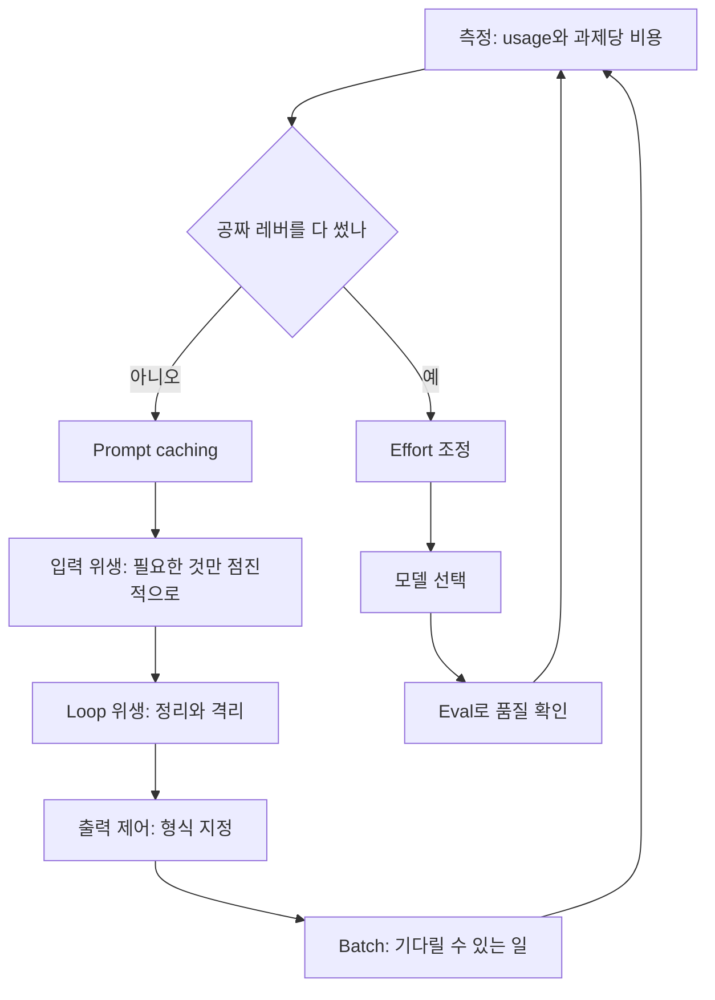

# AI 토큰 효율화의 원리: 비용은 완료된 과제 단위로 센다

> **학습 목표**: Token이 무엇이고 어떤 항목에 돈을 내는지 설명하고, Agent loop의 비용이 왜 불어나는지 계산하며, 공짜 레버부터 trade-off 레버 순서로 절약 계획을 세우고 측정할 수 있다.

Claude Code와 Codex로 여러 제품을 만드는 1인 스튜디오에서 AI 비용은 "요청 한 번에 얼마"가 아니라 "기능 하나를 끝내는 데 얼마"로 봐야 한다. 이 문서는 원리를 다루고, 도구별 실전 방법은 「토큰 절약 실전: 도구별 방법」에서 다룬다. 가격과 기능은 **2026-09 기준**이며, 공식 문서에서 확인한 것만 적었다. 달러→원 환산은 **1 USD = 1,400원(계산 편의용 가정)**으로 한다.

## 핵심 개념

### Token과 Tokenizer

**Token**은 모델이 텍스트를 처리하는 단위다. Tokenizer가 텍스트를 token으로 자르고, 과금·context 한도·속도가 모두 token 수로 정해진다. 같은 글도 tokenizer마다 token 수가 다르다.

| 사실 | 출처(2026-09 확인) |
|---|---|
| 영어는 대략 1 token ≈ 4글자 ≈ 0.75단어. 언어와 내용에 따라 달라진다 | Anthropic Pricing FAQ |
| Claude 4.7 이후 모델의 tokenizer는 같은 텍스트에 약 30% 더 많은 token을 만든다(내용에 따라 다름) | Anthropic Pricing |
| 같은 문장을 번역해도 언어에 따라 token 길이가 최대 약 15배까지 차이 난다 | Petrov 외, NeurIPS 2023 |
| Claude token 수를 OpenAI tokenizer(tiktoken)로 추정하면 틀린다. 모델별 `count_tokens`를 쓴다 | Anthropic Token counting |

한국어·영어·코드 중 무엇이 몇 배 비싼지는 **모델마다 직접 재야 한다.** 인터넷에 도는 "한국어는 N배"라는 숫자는 다른 tokenizer로 잰 값인 경우가 많다. `count_tokens`는 무료(분당 요청 한도만 있음)이므로 같은 내용을 한국어·영어·코드로 준비해 한 번 재 두면 된다.

```python
import anthropic

client = anthropic.Anthropic()
for path in ["sample_ko.txt", "sample_en.txt", "sample_code.ts"]:
    text = open(path, encoding="utf-8").read()
    for model in ["claude-opus-5-5", "claude-haiku-4-5"]:
        n = client.messages.count_tokens(
            model=model,
            messages=[{"role": "user", "content": text}],
        ).input_tokens
        print(f"{path}\t{model}\t{len(text)} chars\t{n} tokens\t{len(text)/n:.2f} chars/token")
```

### 무엇에 돈을 내는가

API 응답의 `usage`에는 네 가지 token 수가 따로 찍히고, 각각 다른 단가가 붙는다. 전체 prompt 크기는 `input_tokens + cache_creation_input_tokens + cache_read_input_tokens`이다. `input_tokens`는 캐시되지 않은 나머지일 뿐이다.

| 항목 | `usage` 필드 | 단가(입력 단가 대비) |
|---|---|---|
| 일반 입력 | `input_tokens` | 1× |
| Cache 쓰기 | `cache_creation_input_tokens` | 5분 TTL 1.25×, 1시간 TTL 2× |
| Cache 읽기 | `cache_read_input_tokens` | 0.1× (Opus 5.5는 0.05×, Fable 5.1은 0.025×) |
| 출력 | `output_tokens` | 출력 단가. **Thinking token 포함**, 화면에 안 보여도 과금 |
| Batch API | 위 전부 | 모든 항목 50% 할인, cache 할인과 중첩 |

| 모델(2026-09, USD / 1M token) | 입력 | 5분 쓰기 | 1시간 쓰기 | Cache 읽기 | 출력 |
|---|---:|---:|---:|---:|---:|
| Claude Fable 5.1 | 10 | 12.50 | 20 | 0.25 | 50 |
| Claude Opus 5.5 | 4 | 5 | 8 | 0.20 | 20 |
| Claude Sonnet 5.5 | 2 | 2.50 | 4 | 0.20 | 10 |
| Claude Haiku 4.5 | 1 | 1.25 | 2 | 0.10 | 5 |

## 원리

### 1. Agent loop는 매 턴 이력 전체를 다시 보낸다

모델은 요청 사이에 아무것도 기억하지 않는다. Claude Code와 Codex는 매 턴 system prompt, 도구 정의, 이전 대화와 도구 결과 전체를 다시 보낸다. 고정 prefix가 S, 턴마다 Δ씩 늘고, N턴 돈다면:

```text
total_input = N*S + D*N*(N-1)/2
assumption: S = 20,000, D = 3,000, N = 30, output 800 per turn
total_input = 600,000 + 1,305,000 = 1,905,000 tokens
output      = 30 * 800 = 24,000 tokens
```

N이 두 배가 되면 입력은 약 네 배가 된다. **Prompt caching**은 재전송을 막지 않고 이미 처리한 prefix의 단가를 낮춘다. 턴 1은 S를 쓰고, 이후 턴은 직전 prompt를 읽고 새로 붙은 Δ만 쓴다고 가정하면 읽기 1,798,000, 쓰기 107,000 token이다(합 1,905,000).

| 가정한 30턴 세션 | Cache 없음 | Cache 사용 | 배율 |
|---|---:|---:|---:|
| Opus 5.5 | 1,905,000×$4 + 24,000×$20 = **$8.10** (11,340원) | 107,000×$5 + 1,798,000×$0.20 + $0.48 = **$1.37** (1,924원) | 약 5.9× |
| Sonnet 5.5 | 1,905,000×$2 + 24,000×$10 = **$4.05** (5,670원) | 107,000×$2.50 + 1,798,000×$0.20 + $0.24 = **$0.87** (1,214원) | 약 4.7× |

(×$ 표기는 1M token당 단가를 곱한 뒤 1,000,000으로 나눈 값이다.) Cache가 켜지면 두 모델의 차이가 2배에서 약 1.6배로 줄어든다. Cache 읽기 단가가 둘 다 $0.20이기 때문이다. Anthropic은 공개 측정에서 caching이 agent loop 비용을 2.7~5.3배 줄였다고 보고한다.

### 2. Context window는 작업 기억이다

Context window는 모델이 한 번에 보는 작업 기억이다. 1M token 모델도 900k token 요청을 9k 요청과 같은 token 단가로 받지만, **넣을 수 있다고 넣어서 좋은 것은 아니다.**

- Liu 외 「Lost in the Middle」(TACL 2024): 관련 정보가 긴 입력의 중간에 있을 때 성능이 크게 떨어졌다.
- Anthropic 「Effective context engineering for AI agents」(2025-09): token이 늘수록 context에서 정보를 정확히 찾아내는 능력이 떨어지는 **context rot**이 모든 모델에서 나타난다며, "원하는 결과를 낼 가능성이 가장 높은, 가장 작은 고신호 token 집합"을 찾으라고 권한다.

불필요한 context는 돈을 두 번 쓴다. 한 번은 token 값으로, 또 한 번은 품질 저하로 인한 재시도로.

### 3. 비용의 단위는 요청이 아니라 완료된 과제다

싼 모델이 실패하면 그 token 값, 재시도 값, 사람이 고치는 시간이 모두 붙는다. 실패하면 성공할 때까지 다시 돌린다고 가정하면:

```text
cost_per_completed_task = cost_per_attempt / success_rate
model A: 0.20 / 0.50 = 0.40 USD
model B: 0.30 / 0.90 = 0.33 USD   (attempt price is higher, task price is lower)
```

Anthropic의 측정(SWE-bench Pro, Claude Opus 5.5)에서는 전부 `low` effort로 돌린 뒤 실패한 13%만 `high`로 다시 돌렸더니 약 97%가 과제당 약 $0.17에 통과했다. 전부 `high`로 돌리면 95.3%에 $0.29였다. 실패를 판별할 신호(테스트, 검증기)가 있을 때만 쓸 수 있는 방법이다.

### 4. 레버의 순서: 공짜 레버 먼저, trade-off는 나중

Anthropic의 비용 최적화 지침은 레버를 두 종류로 나눈다. **공짜 레버**는 품질을 깎지 않고 값을 낮춘다. **Trade-off 레버**는 지능을 비용과 바꾼다. 순서가 중요하다.



| 구분 | 레버 | 효과 | 조건 |
|---|---|---|---|
| 공짜 | Prompt caching | 반복 prefix를 0.1× 이하로 | Prefix를 바이트 단위로 고정 |
| 공짜 | 입력 위생 | 참고 문서·도구 정의를 필요할 때만 로드 | 대부분의 호출이 문서 전체를 쓰면 이득 없음 |
| 공짜 | Loop 위생 | 부피 큰 도구 결과를 요약·격리 | Loop가 길 때만 |
| 공짜 | 출력 제어 | 답의 형식을 정해 출력 token 축소 | 형식 예시 제공 |
| 공짜 | Batch | 모든 token 50% 할인 | 24시간 안에만 끝나면 되는 일 |
| Trade-off | Effort | Thinking·도구 호출 깊이 조절 | Eval로 품질 확인 |
| Trade-off | 모델 선택 | 단가 자체를 바꿈 | 가장 마지막, 한 단계씩 |

### 5. 측정 방법

| 보고 싶은 것 | Claude API | Claude Code | Codex |
|---|---|---|---|
| 요청별 token | 응답 `usage`의 네 필드 | Status line의 `current_usage`, `claude -p --output-format json` | `codex exec --json`의 `turn.completed` 이벤트 `usage` |
| 보내기 전 크기 | `POST /v1/messages/count_tokens` | `/context`(context 구성과 최적화 제안) | `/status`(설정과 token 사용량) |
| 세션·계정 누계 | Console Usage, Usage & Cost Admin API | `/usage`(`/cost`는 별칭), cache 적중률 줄 포함 | `/usage`(계정 사용량) |

Codex의 `usage`에는 `cached_input_tokens`와 `reasoning_output_tokens`가 따로 있어 cache 적중과 추론 token을 구분할 수 있다(openai/codex 소스, 2026-09 확인). Claude Code의 `/usage` 달러 값은 목록가 기준 추정치이고, 구독 플랜이면 비용이 아니라 플랜 한도 소모로 읽는다.

## 적용: 1인 스튜디오의 하루

아래 숫자는 모두 **가정**이다. Claude는 API 키로 쓴다고 보고 달러로 환산했다.

| 시간 | 작업 | 도구 · 모델 | Token(가정) | 비용 |
|---|---|---|---|---|
| 09:00 | 결제 화면 기능 구현, 30턴 | Claude Code · Opus 5.5 `medium` | 읽기 1,798,000 / 쓰기 107,000 / 출력 24,000 | $1.37 |
| 12:30 | 점심 뒤 같은 세션 재개. 5분 TTL이 지나 107,000 token prefix를 다시 씀 | Claude Code · Opus 5.5 | 쓰기 107,000 | 107,000×$5 = $0.54 (적중했다면 $0.02) |
| 14:00 | 다른 제품 리팩터링 | Codex CLI | 입력 400,000(그중 cache 320,000) / 출력 30,000(추론 18,000) | ChatGPT 플랜 한도에서 차감 |
| 22:00 | 상품 설명 1,000건 생성 | Claude API · Sonnet 5.5 Batch | 건당 입력 2,000 / 출력 500 | 표준 $9.00 → Batch $4.50 |

Claude 쪽 합계는 $1.37 + $0.54 + $4.50 = **$6.41**(약 8,970원)이다. 눈여겨볼 줄은 모델 단가가 아니라 **cache miss 한 번**(적중 대비 약 25배)과 **밤에 돌려도 되는 작업**(Batch로 절반)이다. 오후에 다른 일을 할 거라면 점심 전에 `/clear`로 세션을 끝내고, API 키 사용자가 긴 공백 뒤 같은 세션을 이어 가야 한다면 1시간 TTL을 검토한다. 도구별 방법은 「토큰 절약 실전: 도구별 방법」에 있다.

## 심화

### Tokenizer가 바뀌면 단가 비교가 왜곡된다

Sonnet 4.6($3/$15)에서 Sonnet 5($2/$10)로 옮기면 입력 단가는 33% 내려가지만 새 tokenizer가 같은 글에 약 30% 더 많은 token을 만든다. 예전 tokenizer로 1,000,000 token이던 글은 약 1,300,000 token이 되어 1.3×$2 = $2.60, 즉 $3 대비 약 13% 절감이다. 모델을 바꿀 때는 단가표가 아니라 **같은 과제의 `usage`**를 비교한다.

### Cache 손익분기

5분 TTL은 두 번째 요청에서 이미 이득이다: 1.25 + 0.1 = 1.35 < 2(cache 없이 두 번). 1시간 TTL은 세 번째 요청부터다: 2 + 0.1×2 = 2.2 < 3. Opus 5.5는 읽기가 0.05×라 1.25 + 0.05 = 1.30이다. 요청 간격(시작 기준)이 5분 미만이면 5분 TTL이 항상 더 싸고, 5~60분이면 1시간 TTL이 이득이다.

### Thinking token은 출력 단가로 과금된다

화면에 보이는 답이 500 token이어도 thinking이 4,000 token이면 Opus 5.5에서 출력 비용은 4,500×$20 = $0.09다. 보이는 부분만 세면 $0.01로 9배 과소평가한다. Opus 5.5·Sonnet 5.5·Fable 모델은 thinking을 끌 수 없고 effort로만 조절한다(Claude Code 문서, 2026-09).

### `max_tokens`는 절약 도구가 아니다

`max_tokens`는 안전장치일 뿐, 모델은 이 값을 보지 못한다. 한도에 걸린 응답은 중간에 잘린 실패이고, 다시 돌리는 비용이 붙는다. 답을 짧게 하려면 출력 형식을 지정하고, 생각을 줄이려면 effort를 낮춘다.

## 흔한 오해

- **"싼 모델이 항상 싸다."** 과제당 비용 = 시도당 비용 ÷ 성공률이다. Cache가 켜지면 모델 간 차이도 줄어든다.
- **"캐시는 켜 두면 알아서 된다."** System prompt의 시각·UUID, 정렬되지 않은 JSON, 턴마다 바뀌는 도구 목록은 오류 없이 cache를 깬다. `cache_read_input_tokens`로 확인해야 한다.
- **"한국어로 쓰면 N배 비싸다."** Tokenizer마다 다르다. `count_tokens`로 직접 잰 값만 믿는다.
- **"Context window가 크면 다 넣는 게 낫다."** 단가는 같아도 품질은 떨어질 수 있다(context rot).
- **"`/compact`는 공짜다."** 요약 요청 자체가 대화 전체를 읽는다. Cache가 식은 뒤라면 비싸다.

## 자기 점검 질문

1. `usage`의 네 필드 중 `input_tokens`만 보고 "입력이 4K뿐"이라고 판단하면 무엇을 놓치는가?
2. S = 10,000, Δ = 2,000, N = 20일 때 cache 없는 총 입력 token은 얼마인가?
3. 시도당 $0.10에 성공률 40%인 설정과 $0.25에 성공률 95%인 설정 중 과제당 더 싼 것은?
4. 요청이 평균 20분 간격으로 들어오는 기능에는 어떤 TTL이 맞고, 그 이유는?
5. Effort와 모델 선택이 레버 순서의 마지막에 오는 이유는 무엇인가?

## 참고 자료

- [Pricing](https://platform.claude.com/docs/en/about-claude/pricing) — Anthropic, 2026-09-29 확인
- [Prompt caching](https://platform.claude.com/docs/en/build-with-claude/prompt-caching) — Anthropic, 2026-09-29 확인
- [Token counting](https://platform.claude.com/docs/en/build-with-claude/token-counting) — Anthropic, 2026-09-29 확인
- [Optimizing for cost and intelligence](https://platform.claude.com/docs/en/about-claude/models/optimizing-for-cost-and-intelligence) — Anthropic, 2026-09-29 확인
- [Manage costs effectively](https://code.claude.com/docs/en/costs) · [Commands](https://code.claude.com/docs/en/commands) — Claude Code Docs, 2026-09-29 확인
- [Effective context engineering for AI agents](https://www.anthropic.com/engineering/effective-context-engineering-for-ai-agents) — Anthropic Engineering, 2025-09
- [Lost in the Middle: How Language Models Use Long Contexts](https://aclanthology.org/2024.tacl-1.9/) — Liu 외, TACL 2024
- [Language Model Tokenizers Introduce Unfairness Between Languages](https://arxiv.org/abs/2305.15425) — Petrov 외, NeurIPS 2023
- [openai/codex `exec_events.rs`](https://github.com/openai/codex/blob/main/codex-rs/exec/src/exec_events.rs) — OpenAI, 2026-09-29 확인
