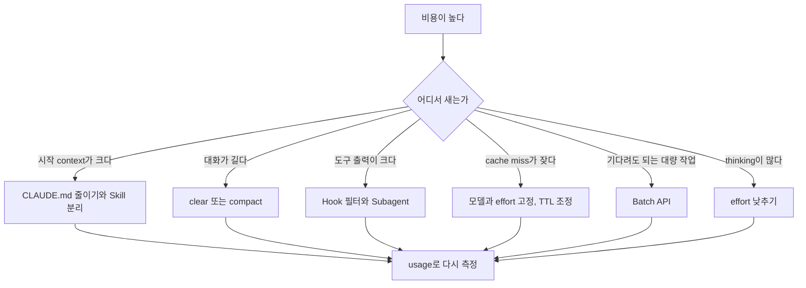

# 토큰 절약 실전: 도구별 방법

> **학습 목표**: Claude Code, Codex, 직접 만든 API 앱에서 token이 새는 지점을 찾아 도구별 설정과 습관으로 줄이고, 절약 전후를 숫자로 비교할 수 있다.

원리(과금 항목, loop 누적, 레버 순서)는 「AI 토큰 효율화의 원리」에서 다뤘다. 이 문서는 도구별 실전 방법이다. 설정 파일의 위치와 우선순위는 「AI Agent 세팅 지도」, 지시문 작성은 「지시문과 메모리」, 권한과 hook은 「권한 · Sandbox · Hook」, Subagent와 Skill은 「Subagent · Skill · Plugin」, MCP는 「MCP와 외부 도구」, headless·CI의 비용 통제는 「Headless · CI · Cloud 실행」에서 자세히 다루므로 여기서는 token 관점만 짚는다. 명령과 설정 키는 **2026-09 기준** 공식 문서와 소스에서 확인한 것만 적었다. 달러→원 환산은 1 USD = 1,400원(가정)이다.

## 핵심 개념

### 세 방향: 덜 넣고, 덜 반복하고, 덜 생성한다

| 방향 | 뜻 | 대표 수단 |
|---|---|---|
| 덜 넣기 | 매 요청의 context를 작게 | 짧은 CLAUDE.md·AGENTS.md, Skill, MCP tool search, 좁은 파일 읽기, 출력 필터 |
| 덜 반복하기 | 같은 prefix를 싸게 다시 쓰기 | Prompt caching 유지, 모델·effort 고정, `/clear`로 이력 끊기, Subagent 격리 |
| 덜 생성하기 | 출력과 thinking 줄이기 | 출력 형식 지정, effort 조정, Batch |

비용이 튀었을 때는 추측하지 말고 어디서 새는지부터 본다.



## 원리

### Claude Code

| 방법 | 줄이는 것 | 명령 · 설정(2026-09) |
|---|---|---|
| CLAUDE.md는 200줄 이하, 특정 작업 지침은 Skill로 옮긴다 | 매 턴 실리는 기본 context | `/memory`, `/context` |
| Skill은 설명만 상주하고 본문은 호출될 때 로드된다 | 기본 context | `/skills`에서 `t`로 token 순 정렬 |
| 탐색·로그·테스트처럼 출력이 큰 일은 Subagent에 맡긴다 | 본 대화 context | Subagent 설정의 `model: haiku` |
| 작업이 바뀌면 `/clear`, 경계에서 `/compact <남길 것>`, 잘못 간 길은 `/rewind` | 이력 | `/autocompact 500k` |
| 곁가지 질문은 이력에 남기지 않는다 | 이력 | `/btw` |
| 세션 시작 때 모델과 effort를 정하고 도중에 바꾸지 않는다 | Cache miss | `/model`, `/effort` |
| MCP tool 정의는 기본 지연 로드(tool search). 안 쓰는 서버는 끄고, CLI가 있으면 CLI를 쓴다 | 시작 context | `/mcp`, `/context`(`ENABLE_TOOL_SEARCH`는 proxy·base URL 경유 시에만 필요) |
| 테스트 출력은 hook으로 실패 줄만 남긴다 | 도구 출력 | `PreToolUse` hook |
| "코드베이스 개선해" 대신 파일과 함수를 지목한다 | 읽기량 | 구체적인 prompt, plan mode |
| API 키 사용자가 긴 공백 뒤에도 같은 세션을 쓴다 | Cache miss | `promptCacheTtl: "1h"` |

**`.claudeignore`는 공식 기능이 아니다**(2026-09 공식 문서에 없음, GitHub에는 기능 요청만 있다). 읽힐 필요 없는 파일은 `permissions.deny`의 `Read` 규칙으로 막는다. 이 규칙은 Claude의 파일 도구를 막을 뿐 보안 경계는 아니므로 권한 설계는 「권한 · Sandbox · Hook」을 따른다.

```json
{
  "permissions": {
    "deny": ["Read(./dist/**)", "Read(./coverage/**)", "Read(./.env)"]
  },
  "autoCompactWindow": "500k"
}
```

Cache를 깨는 행동과 지키는 행동을 구분해 둔다(Claude Code 「How Claude Code uses prompt caching」).

| Cache를 깨는 행동 | Cache를 지키는 행동 |
|---|---|
| 모델 전환(`opusplan`의 plan mode 전환, `model`을 지정한 Skill 포함) | 저장소 파일 편집(변경 알림만 덧붙음) |
| 대부분의 모델에서 effort 변경(Opus 5.5·Sonnet 5.5·Fable 5.1은 API 키·구독에서 유지) | CLAUDE.md 편집(대신 `/clear`·`/compact`·재시작 전까지 반영 안 됨) |
| Fast mode 켜기, tool search가 꺼진 상태의 MCP 연결 변경 | 권한 모드 변경, Skill·명령 호출, `/recap`, `/rewind` |
| `/compact`(대화 층을 새로 씀), Claude Code 업그레이드 뒤 첫 세션 | Subagent 생성(부모 prefix는 그대로) |

### Codex

| 방법 | 줄이는 것 | 설정 · 명령(2026-09, openai/codex 소스 확인) |
|---|---|---|
| AGENTS.md를 짧게. 결합 크기 상한은 기본 32 KiB이고, 상한은 목표가 아니다 | 매 턴 기본 context | `project_doc_max_bytes` |
| 추론 수준을 작업에 맞춘다. 선택지는 모델마다 다르다 | Reasoning token | `model_reasoning_effort`, `plan_mode_reasoning_effort` |
| 작업 유형별 설정 층을 만든다 | 잘못된 기본값 | `codex --profile <name>` → `$CODEX_HOME/<name>.config.toml` |
| 긴 대화를 요약하거나 새로 시작한다 | 이력 | `/compact`, `/new` |
| 사용량을 확인한다 | 측정 | `/status`, `/usage` |
| 반복 작업은 비대화형으로 돌리고 결과 형식을 고정한다 | 이력 · 출력 | `codex exec --json`, `--output-schema` |

`tool_output_token_limit`(도구 출력을 context에 저장할 때의 token 예산)과 `model_auto_compact_token_limit`(자동 compact 기준) 키도 있지만 기본값은 버전마다 달라 확인이 필요하다. config.toml 안의 `profile`·`[profiles.<name>]`는 legacy다. `--profile <name>`을 쓰면서 config.toml에도 `profile = "<name>"`이나 `[profiles.<name>]`가 있으면 오류가 나고, `$CODEX_HOME/<name>.config.toml`로 옮기라고 안내한다.

```bash
codex exec --profile cheap --json "Summarize the last 10 commits into CHANGELOG.md" > run.jsonl
jq -s '[.[] | select(.type=="turn.completed") | .usage] | {input: (map(.input_tokens) | add), cached: (map(.cached_input_tokens) | add), reasoning: (map(.reasoning_output_tokens) | add)}' run.jsonl
```

### 직접 만든 API 앱

- **Caching 설계**: 렌더 순서는 `tools` → `system` → `messages`이고, 바이트 하나만 달라도 그 뒤가 전부 무효가 된다. 안 바뀌는 것을 앞에, 턴마다 바뀌는 것을 뒤에 둔다. Breakpoint는 최대 4개이고 top-level `cache_control`로 자동 배치할 수도 있다. 최소 cache 길이는 모델마다 다르며(512~4,096 token), 짧으면 오류 없이 cache되지 않는다.
- **조용한 무효화 요인**: system prompt의 현재 시각·UUID, 정렬하지 않은 JSON 직렬화, 사용자별로 달라지는 도구 목록, 조건에 따라 붙는 system 문단. 동적 지시는 `messages` 뒤쪽에 넣는다.
- **Batch API**: 기다려도 되는 일은 모든 token 50% 할인이고 cache 할인과 중첩된다. 결과는 24시간 안에 온다.
- **Context editing과 compaction(beta)**: context editing은 오래된 도구 결과를 지워 창을 비우는 도구이지 절약 레버가 아니다. 지울 때마다 cache가 다시 써진다. 드물게, 크게 정리한다.
- **출력 형식**: Anthropic 측정에서 메모 형식 답은 한 줄 답보다 출력 token이 6배, 비용이 2.8배였고 정확도 차이는 측정 오차 안이었다. 형식과 예시를 지정하고, `max_tokens`는 안전장치로만 둔다.
- **넣지 말고 찾게 하기**: 큰 참고 문서는 도구나 Skill 뒤로 옮기고, 도구 정의가 약 10K token을 넘으면 tool search(`defer_loading`)를 쓴다. Anthropic 측정에서 도구 502개일 때 비용이 45% 적었다. 사용자 입력은 `count_tokens`로 먼저 재서 자른다.

### 다른 벤더와의 비교(2026-09 기준)

| 항목 | Anthropic Claude API | OpenAI API | Google Gemini |
|---|---|---|---|
| 방식 | `cache_control` 명시 또는 top-level 자동 | 자동(1,024 token 이상 prefix) | Implicit 자동 + explicit 수동 |
| Cache 읽기 | 입력의 0.1×(Opus 5.5 0.05×, Fable 5.1 0.025×) | 최대 90% 할인(모델별 cached input 단가) | Gemini 2.5 이상 90% 할인 |
| Cache 쓰기 | 1.25×(5분), 2×(1시간) | 확인 필요(2차 출처는 write 배수를 확인해 주지 않는다) | 일반 입력 단가, explicit는 시간당 저장 비용 추가 |
| 수명 | 5분 또는 1시간 | GPT-6 계열(Sol · Luna) 30분 창(2026-09-22 발표, 2차 출처로만 확인) | Explicit는 TTL 지정 |
| Batch | 50% | 50% | 50% |

## 적용: 1인 스튜디오의 하루

아래는 하루 동안 실제로 자주 나오는 안티패턴이다. Token 수와 비용은 모두 **가정**이며 Claude는 API 키, Opus 5.5 기준이다.

| 안티패턴 | 나쁜 예(가정) | 좋은 예(가정) | 차이 |
|---|---|---|---|
| 비대한 CLAUDE.md | 600줄 ≈ 12,000 token이 30턴 동안 실림 | 150줄 ≈ 3,000 token + Skill 2개 | 턴 1 쓰기 9,000×$5 + 턴 2~30 읽기 261,000×$0.20 ≈ **$0.10/세션** |
| 테스트 로그 전체 | 40,000 token 로그가 이후 15턴 동안 실림 | Hook으로 실패 줄 1,500 token | 38,500×$5 + 577,500×$0.20 ≈ **$0.31/회** |
| 메인에서 파일 20개 탐색 | 60,000 token이 이후 20턴 동안 실림: $0.30 + $0.24 = $0.54 | Haiku 4.5 Subagent가 탐색하고 1,000 token 요약만 반환 ≈ $0.14 | **약 $0.40/회** |
| 곁가지 질문에 Sonnet으로 잠깐 전환 | 150,000 token context를 Sonnet 5.5가 새로 씀: $0.375 | 그대로 Opus에 묻기: 150,000×$0.20 = $0.03 | **약 12.5배** |
| API 앱 system prompt에 현재 시각 | 10,000 token × 하루 2,000건을 매번 새로 씀: 20M×$2.50 = $50/일 (Sonnet 5.5) | 시각을 user 메시지로 옮김: 20M×$0.20 ≈ $4/일 | **약 $46/일** |

마지막 줄은 cache를 아예 안 쓸 때(20M×$2 = $40/일)보다도 비싸다. 깨진 cache는 쓰기 할증만 낸다. Subagent 줄의 $0.14는 Haiku 쪽 쓰기 60,000×$1.25 + 읽기 300,000×$0.10 + 출력 5,000×$5 = $0.13에 요약 반환 약 $0.01을 더한 값이다. CLAUDE.md 줄처럼 cache가 잘 돌면 달러 차이는 작다. 그래도 줄이는 이유는 context 품질과 cache miss 때의 비용 때문이다.

**1인 스튜디오 점검표**

- [ ] 제품 저장소마다 CLAUDE.md·AGENTS.md가 200줄 안쪽이고, 절차성 지침은 Skill에 있다
- [ ] 세션 시작 때 모델과 effort를 정하고, 작업이 바뀌면 `/clear`한다
- [ ] 로그·테스트·탐색은 Subagent나 hook을 거쳐 요약만 본 대화로 온다
- [ ] 안 쓰는 MCP 서버는 꺼 두고, `/context`로 시작 context를 주 1회 본다
- [ ] 빌드 산출물·minified 파일은 `Read` deny 규칙에 있다
- [ ] 밤에 돌려도 되는 대량 생성은 Batch API로, 반복 코딩 작업은 `codex exec` 스크립트로 돌린다
- [ ] API 앱은 `cache_read_input_tokens > 0`을 테스트로 확인한다
- [ ] `/usage`의 cache 적중률 줄과 월 청구액을 월 1회 기록한다

## 심화

### 절약 레버끼리 부딪힐 때

Prefix를 바꾸는 절약은 모두 cache를 한 번 깬다. Compaction, context editing, client 쪽 이력 정리가 그렇고, Subagent는 부모와 cache를 공유하지 않는 새 prefix로 시작한다. 같은 prefix로 여러 작업자를 동시에 띄우면 서로의 cache를 읽지 못하고 각자 쓴다. 원칙은 **자연스러운 경계에서 드물게, 크게** 정리하는 것이다. Claude Code 문서가 agent team이 plan mode에서 일반 세션의 약 7배 token을 쓴다고 밝힌 것도 teammate마다 context를 따로 유지하기 때문이다.

### 한 번에 한 레버, 측정으로 확정

레버를 하나 바꾸고 같은 과제를 다시 돌려 `usage`와 결과 품질을 함께 본다. 좋아지면 남기고 아니면 되돌린다. 두 개를 한꺼번에 바꾸면 무엇이 효과였는지 알 수 없다. Effort와 모델처럼 품질을 건드리는 레버는 테스트나 체크리스트 같은 합격 기준이 있을 때만 바꾼다.

## 흔한 오해

- **"`.claudeignore`를 만들면 된다."** 2026-09 기준 공식 기능이 아니다. `Read` deny 규칙을 쓴다.
- **"싼 모델로 잠깐 바꾸면 싸다."** 새 모델은 cache가 없어 대화 전체를 새로 쓴다.
- **"Subagent는 항상 절약이다."** Subagent도 자기 요청을 보내고 새 prefix로 시작한다. 출력이 큰 일을 격리할 때만 이득이다.
- **"CLAUDE.md를 고치면 바로 반영된다."** 다음 `/clear`, `/compact`, 재시작 때 반영된다.
- **"Context editing은 절약 기능이다."** 창을 비우는 도구다. 자주 쓰면 cache를 계속 깬다.

## 자기 점검 질문

1. `/context`에서 MCP 항목이 크게 보인다면 먼저 무엇을 확인하고 바꾸겠는가?
2. 곁가지 질문에 모델을 바꾸는 대신 쓸 수 있는 방법 두 가지는?
3. Codex에서 야간 반복 작업의 token 사용량을 합산하려면 어떤 출력을 어떻게 읽는가?
4. API 앱의 `cache_creation_input_tokens`가 매 요청 대화 전체 크기라면 무엇을 의심하는가?
5. 1인 스튜디오 점검표에서 이번 주에 가장 먼저 적용할 항목과 측정 방법은?

## 참고 자료

- [Manage costs effectively](https://code.claude.com/docs/en/costs) — Claude Code Docs, 2026-09-29 확인
- [How Claude Code uses prompt caching](https://code.claude.com/docs/en/prompt-caching) — Claude Code Docs, 2026-09-29 확인
- [Explore the context window](https://code.claude.com/docs/en/context-window) · [Model configuration](https://code.claude.com/docs/en/model-config) — Claude Code Docs, 2026-09-29 확인
- [Configure permissions](https://code.claude.com/docs/en/permissions) — Claude Code Docs, 2026-09-29 확인
- [Prompt caching](https://platform.claude.com/docs/en/build-with-claude/prompt-caching) · [Batch processing](https://platform.claude.com/docs/en/build-with-claude/batch-processing) — Anthropic, 2026-09-29 확인
- [Optimizing for cost and intelligence](https://platform.claude.com/docs/en/about-claude/models/optimizing-for-cost-and-intelligence) — Anthropic, 2026-09-29 확인
- [openai/codex](https://github.com/openai/codex) — `codex-rs/core/src/config/mod.rs`, `codex-rs/exec/src/cli.rs`, `codex-rs/tui/src/slash_command.rs`, 2026-09-29 확인
- [Codex configuration reference](https://developers.openai.com/codex/config-reference) — OpenAI, 2026-09-29 검색 결과로 확인
- [Prompt caching](https://developers.openai.com/api/docs/guides/prompt-caching) · [Pricing](https://developers.openai.com/api/docs/pricing) · [Better prompt caching for GPT-6](https://openai.com/index/better-prompt-caching-for-gpt-6/) — OpenAI, 2026-09-29 검색 결과로 확인(2차 출처상 2026-09-22 발표, 원문 미확인)
- [Context caching](https://ai.google.dev/gemini-api/docs/caching) · [Context caching overview(Google Cloud)](https://docs.cloud.google.com/vertex-ai/generative-ai/docs/context-cache/context-cache-overview) · [Batch API](https://ai.google.dev/gemini-api/docs/batch-api) — Google, 2026-09-29 검색 결과로 확인
- [.claudeignore 기능 요청 #29455](https://github.com/anthropics/claude-code/issues/29455) — GitHub, 2026-09-29 검색 결과로 확인
