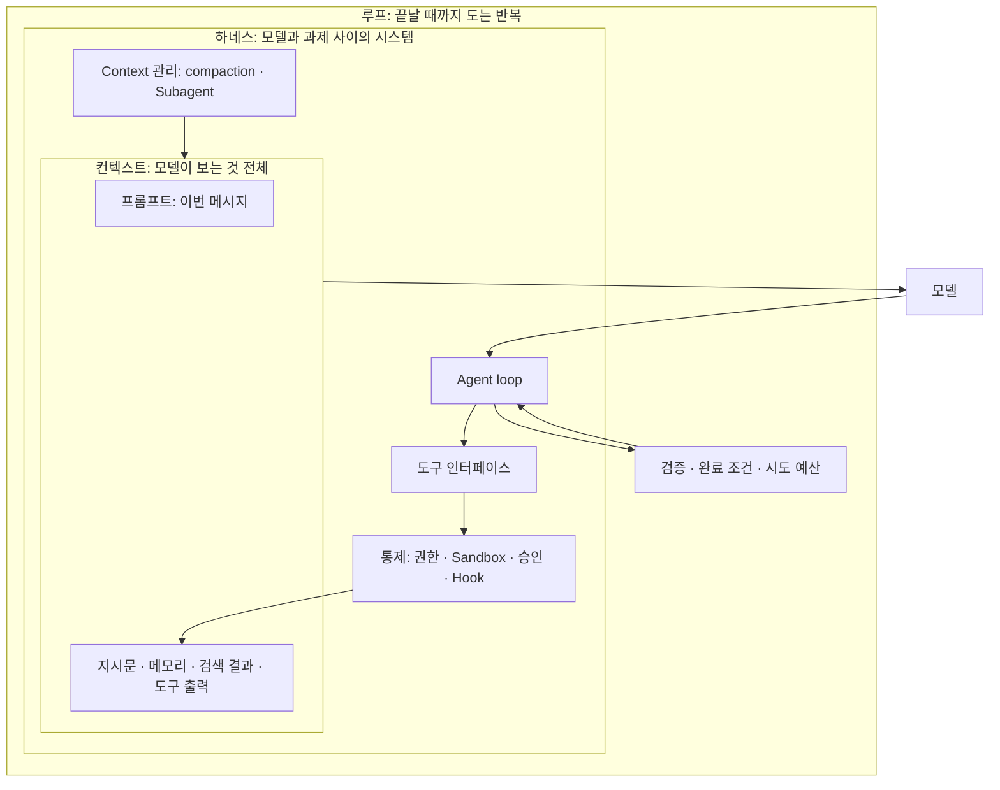

# AI 엔지니어링의 층: 프롬프트 · 컨텍스트 · 하네스

> **학습 목표**: 프롬프트 · 컨텍스트 · 하네스 · 루프 엔지니어링이 각각 무엇을 설계하는지 구분하고, 눈앞의 실패가 어느 층의 문제인지 가려낸 뒤, "지시는 요청하고 hook과 권한은 강제한다"는 원칙으로 자기 저장소의 하네스를 설계하고 그 변경을 측정할 수 있다.

같은 모델에게 같은 일을 시켜도 결과가 다른 것은 모델 바깥이 다르기 때문이다. 이 문서는 그 바깥을 네 층으로 나눈다. 이번 메시지(프롬프트), 모델이 보는 것 전체(컨텍스트), 모델과 과제 사이의 시스템(하네스), 끝날 때까지 도는 반복(루프)이다. 설정 파일의 위치는 「AI Agent 세팅 지도」, 지시문 작성은 「지시문과 메모리」, 권한과 hook 구현은 「권한 · Sandbox · Hook」, Subagent와 Skill은 「Subagent · Skill · Plugin」, 외부 도구는 「MCP와 외부 도구」에서 자세히 다룬다. 여기서는 개념, 원칙, 설계 판단만 다룬다. 루프 층은 「루프 엔지니어링」에서 따로 깊게 다루며, 이름에 같은 말이 들어가는 「리버스 엔지니어링: 법과 합법적 활용」은 이 층 구조가 아니라 법적 쟁점을 다룬다. 용어의 기원과 사례는 **2026-09 기준**으로 확인한 것만 적었고, 원문을 직접 열지 못한 출처는 그렇다고 표시했다.

## 핵심 개념

### 네 층은 안쪽에서 바깥쪽으로 감싼다



바깥 층은 안쪽 층을 포함한다. 좋은 프롬프트도 context에 필요한 사실이 없으면 소용없고, 좋은 context도 하네스가 위험한 행동을 막지 못하면 사고가 난다. 하네스가 튼튼해도 루프가 "다 됐다"를 검증하지 못하면 거짓 완료가 나온다.

| 층 | 설계하는 것 | 범위 | 막는 실패 | 대표 산출물 |
|---|---|---|---|---|
| 프롬프트 | 이번 요청의 문장, 예시, 출력 형식 | 메시지 한 개 | 형식 오류, 모호한 요청, 엉뚱한 톤 | 프롬프트 템플릿, few-shot 예시, 출력 스키마 |
| 컨텍스트 | 모델이 한 번의 추론에서 보는 token 전체의 구성 | 요청 한 번(창 하나) | 모르는 사실, 낡은 정보, context rot로 초점 상실 | CLAUDE.md·AGENTS.md, 문서 색인, 검색 도구, compaction 규칙 |
| 하네스 | Agent loop, 도구, context 관리, 통제 장치 | 세션과 저장소 | 금지된 행동, 반복되는 같은 실수, 도구 오용 | 권한 규칙, Sandbox, hook, Subagent 정의, linter, 구조 테스트 |
| 루프 | 반복의 완료 조건, 검증, 중단 규칙 | 과제 하나가 끝날 때까지 | 끝나지 않음, 거짓 성공 선언, 같은 시도의 반복 | 완료 기준, 검증 명령, 시도 예산, 상태 기록 파일 |

### 이름이 붙은 순서

| 층 | 널리 쓰인 시점 | 계기 | 확인 수준 |
|---|---|---|---|
| 프롬프트 | 2020년대 초 | 대화형 LLM 보급 | 일반 통념 |
| 컨텍스트 | 2025년 6월 무렵 | Tobi Lütke와 Andrej Karpathy가 "prompt engineering 대신 context engineering"을 말함. Anthropic 「Effective context engineering for AI agents」(2025-09-29) | Anthropic 글은 원문 확인, 6월 발언은 검색 결과로 확인 |
| 하네스 | 2026년 2월 | Anthropic이 2025-11-26 글 「Effective harnesses for long-running agents」 제목에 이미 'harness'를 썼고(원문 확인), 'harness engineering'이라는 분야 이름은 2026년 2월에 퍼졌다. Mitchell Hashimoto가 글에서 "Engineer the Harness"를 한 단계로 꼽음(2월 초). OpenAI Ryan Lopopolo 「Harness engineering: leveraging Codex in an agent-first world」(2차 출처상 2026-02-11). Birgitta Böckeler가 martinfowler.com에 체계화(2026-04) | Anthropic 글은 원문 확인, 나머지는 검색 결과로 확인(원문 미확인) |

Anthropic 글은 둘을 이렇게 구분한다. 프롬프트 엔지니어링은 "최적의 결과를 위해 LLM 지시를 쓰고 조직하는 방법"이고, 컨텍스트 엔지니어링은 "추론 중 최적의 token(정보) 집합을 선별하고 유지하는 전략"이다. 목표는 "원하는 결과의 가능성을 최대화하는, 가능한 가장 작은 고신호 token 집합"이다.

### 하네스의 네 부품

| 부품 | 결정하는 것 | 자세히 |
|---|---|---|
| Agent loop | 모델 호출 → 도구 실행 → 결과를 다시 넣기의 반복과 종료 | 「Session · Agent · Subagent」 |
| 도구 인터페이스 | 모델이 무엇을 할 수 있고, 결과가 어떤 모양으로 돌아오는가 | 「MCP와 외부 도구」 |
| Context 관리 | 무엇을 상주시키고, 언제 불러오고, 언제 요약·격리하는가 | 「지시문과 메모리」, 「Subagent · Skill · Plugin」 |
| 통제 장치 | 권한, Sandbox, 승인, hook: 모델의 판단과 무관하게 실행되는 것 | 「권한 · Sandbox · Hook」 |

Böckeler는 하네스를 **guide**(행동 전에 방향을 주는 feedforward)와 **sensor**(행동 뒤에 관찰해 스스로 고치게 하는 feedback)로 나누고, 각각을 결정적인 **computational**(linter, 테스트)과 모델이 판단하는 **inferential**(LLM 리뷰)로 다시 나눈다고 소개된다(검색 결과로 확인). 도구 제작사가 만든 안쪽 하네스와 사용자가 그 위에 얹는 바깥 하네스를 구분하는 것도 같은 글의 틀이다. 1인 스튜디오가 설계하는 것은 바깥 하네스다.

## 원리

### 1. 요청은 묻고, 강제는 막는다

| 수단 | 성격 | 어긴다면 |
|---|---|---|
| 프롬프트, CLAUDE.md·AGENTS.md, Skill 본문 | **요청**: 모델이 읽고 따르려 노력한다 | 모델이 잊거나 다르게 해석하면 그대로 일어난다 |
| 권한 규칙, Sandbox, 승인, hook, CI의 테스트 | **강제**: harness나 OS가 실행한다 | 도구 호출이 거부되거나 merge가 막힌다 |

Claude Code 문서는 CLAUDE.md와 auto memory를 "context, not enforced configuration"이라 부르고, 모델의 판단과 무관하게 막으려면 `PreToolUse` hook을 쓰라고 한다. 설정의 권한 규칙은 "Claude가 무엇을 하기로 하든 client가 강제"하고, hook은 LLM이 실행하기로 고르는 데 기대지 않는 "deterministic control"이다. 설계 규칙은 하나다. **두 번 어겨진 요청은 강제로 승격한다.** 반대로 모든 것을 강제로 만들면 판단이 필요한 일까지 막힌다. 강제는 "절대 일어나면 안 되는 것"과 "기계가 판정할 수 있는 것"에만 쓴다.

### 2. 프롬프트가 아니라 환경을 고친다

Agent가 실수했을 때 프롬프트에 "다음엔 조심해"를 더하는 것은 그 세션에만 듣는 요청이다. 하네스 엔지니어링의 출발점은 실수를 **환경의 결함 신호**로 읽는 것이다. OpenAI 팀은 agent가 막히면 "무슨 능력이 빠졌고, 그것을 어떻게 읽을 수 있고 강제할 수 있게 만들까"를 물었고, 빠진 도구·문서·검사를 저장소에 넣되 그 수정도 Codex가 쓰게 했다고 소개된다. 이 팀은 약 5개월 동안 손으로 쓴 코드 없이 약 1,500개 PR, 약 100만 줄을 만들었다고 한다(세 명으로 시작, 2차 출처 기준이며 원문 미확인). 숫자보다 옮길 만한 것은 순서다. 실수 → 원인 층 판정 → 저장소에 영구 수정 → 같은 실수가 구조적으로 불가능해졌는지 확인.

### 3. AGENTS.md는 매뉴얼이 아니라 지도다

진입 파일은 매 턴 context에 실리므로 길수록 비싸고, 길수록 덜 지켜진다. Claude Code 문서는 CLAUDE.md 한 파일을 200줄 아래로 두라고 권한다. OpenAI 팀은 큰 AGENTS.md 하나가 실패한 뒤 "1,000쪽짜리 매뉴얼이 아니라 지도"를 주기로 했고, 약 100줄의 AGENTS.md가 `docs/` 아래의 설계 문서·아키텍처 지도·실행 계획을 가리키게 했다고 전해진다(검색 결과로 확인). 진입 파일에는 역할, 처음 읽을 것, 언제 무엇을 더 읽을지만 둔다.

### 4. 규칙은 기계가 검사하게 한다

"레이어 방향을 지켜라"를 문장으로 쓰면 요청이고, 의존 방향을 검사하는 구조 테스트로 쓰면 강제다. OpenAI 팀은 custom linter와 구조 테스트로 아키텍처 규칙을 검사하고, **linter 오류 메시지에 고치는 방법을 담아** agent context에 바로 들어가게 했다고 한다(검색 결과로 확인). 오류 메시지가 곧 다음 프롬프트가 되는 셈이다. 1인 스튜디오라면 이미 있는 type checker, linter, 테스트의 실패 메시지를 agent가 읽기 좋게 다듬는 것부터 한다.

### 5. 도구 출력이 피드백이 된다

Agent는 볼 수 있는 것만 고친다. OpenAI 팀은 agent가 브라우저(Chrome DevTools Protocol)와 로그·지표를 직접 조회하게 해 UI와 성능 문제를 스스로 확인하게 했다고 소개된다(2차 출처 기준). 원칙은 두 가지다. 검증 결과를 **agent가 읽을 수 있는 형태**로 돌려주고, 로그 전체가 아니라 **판단에 필요한 줄**만 돌려준다. 뒤쪽은 비용 문제이기도 하다(「AI 토큰 효율화의 원리」).

### 6. 실패가 속한 층 가리기

| 증상 | 층 | 먼저 볼 것 |
|---|---|---|
| JSON 대신 산문, 요청과 다른 길이·톤 | 프롬프트 | 형식 지정과 예시가 있었나 |
| 저장소 규칙을 모름, 낡은 API를 씀 | 컨텍스트 | `/context`에 그 사실이 들어 있었나, 찾을 도구가 있었나 |
| 긴 세션 뒤 앞의 결정을 잊음 | 컨텍스트 | 이력이 너무 길지 않나, compaction과 상태 기록 |
| `.env` 수정, force push 같은 금지 행동 | 하네스 | 그 금지가 요청이었나 강제였나 |
| 같은 규칙 위반이 세션마다 반복 | 하네스 | 검사하는 linter나 테스트가 있나 |
| 테스트를 안 돌리고 "완료", 끝없이 재시도 | 루프 | 완료 조건이 기계적으로 판정되나, 시도 상한이 있나 |

표는 위에서부터 차례로 확인하고, 처음 들어맞는 줄에서 시작한다. 판정 규칙 하나를 더한다. **한 층에서 고쳤는데 같은 실패가 다시 나면 한 층 바깥을 의심한다.** 프롬프트를 두 번 고쳐도 반복되면 컨텍스트나 하네스의 문제다.

### 7. 루프 엔지니어링 한눈에

루프 층은 "언제 끝났다고 말할 수 있는가"를 설계한다. 완료 조건을 테스트처럼 기계가 판정하게 하고, 같은 실패의 재시도에 상한을 두고, 세션을 넘는 일은 진행 상태를 파일과 git에 남긴다. Anthropic의 장기 실행 agent 글(2025-11-26)은 Claude가 "프로젝트 전체에 대해 너무 일찍 승리를 선언"하는 실패를 보고하고, 기능 목록 파일, 진행 기록, 기능 하나씩 끝내기, end-to-end 테스트로 대응했다. 설계 방법은 「루프 엔지니어링」에서 다룬다.

## 적용: 이 저장소의 하네스를 층으로 읽기

파일 배치는 「AI Agent 세팅 지도」에 있다. 여기서는 이 사이트의 저장소에 **실제로 있는 것**을 네 층에 대응시킨다.

### 층별 대응

| 층 | 이 저장소에 있는 것 | 요청 / 강제 |
|---|---|---|
| 프롬프트 | 커밋된 프롬프트 템플릿은 없다. `adversarial-reviewer`와 `fast-explorer` 정의가 반환 형식(`PASS`/`FAIL` 블록, `FILES:`·`FINDINGS:`·`RISK:`)을 고정한다 | 요청 |
| 컨텍스트 | `CLAUDE.md`(31줄)·`AGENTS.md`(34줄)가 시작 때 읽을 `.ai/` 파일 세 개와 trigger별로 불러올 파일을 가리킨다. `.ai/HARNESS.md`는 진입 파일을 "contracts, not manuals"로 규정한다 | 요청 |
| 하네스: 위임 | Claude agent 2개(`tools` 허용 목록, `permissionMode: plan`, `maxTurns` 6·8), Codex agent 3개(`sandbox_mode = "read-only"`) | 부분 강제 |
| 하네스: 호출 통제 | `auto-dev` Skill 두 판. Codex 판은 `allow_implicit_invocation: false`, Claude 판은 설명문과 본문 첫 절로만 막는다 | Codex 강제, Claude 요청 |
| 하네스: 검사 | `tests/*.test.cjs`(한·영 제목 수, heading 순서, fence, 한글 누락, Mermaid edge 비교), `.ai/tools/check_policy_set.py` | 강제력 있는 검사지만 자동 실행 경로가 없다 |
| 하네스: 권한 · hook | 커밋된 `.claude/settings.json`, hook 스크립트, `.mcp.json`, CI 설정(`.github/`)이 없다 | 없음 |
| 루프 | `.ai/LOOP.md`의 시도 예산(같은 실패에 세 번이면 멈춤)과 수렴 실패 신호, `auto-dev`의 제안→도전→실행→검증 순서 | 요청 |

### 보이는 빈칸 세 가지

1. **같은 규칙이 도구마다 강제력이 다르다.** 탐색자의 "최대 6라운드"는 Claude에서는 `maxTurns: 6`으로 강제되지만 Codex에서는 지시문의 문장이다. `.ai/HARNESS.md`도 "Claude의 도구 허용 목록과 `maxTurns`는 Codex 설정 키가 아니다"라고 인정한다. 또 Claude agent의 `permissionMode: plan`은 부모 mode가 덮어쓸 수 있다(「Subagent · Skill · Plugin」 참고).
2. **검사는 있지만 아무도 부르지 않으면 돌지 않는다.** 테스트는 이 문서 같은 한·영 쌍의 구조를 기계적으로 검사하는 좋은 sensor다. 하지만 hook도 CI도 없으니 실행 여부는 agent가 지시를 따르느냐에 달려 있다. 강제력 있는 검사가 요청으로 호출되는 셈이다.
3. **진입 계약 두 개가 같은 상황을 다르게 읽는다.** 이 저장소에는 `.ai/PROJECT_CONTEXT.md`가 없고 템플릿만 있다. `CLAUDE.md`는 없을 때 "the set is not adopted here: stop and run `python3 .ai/tools/adopt.py`"라고 하고, `AGENTS.md`는 정책 템플릿 자체를 관리할 때(`LESSONS_FROM_PRACTICE.md`가 있을 때) "project instance files are intentionally absent; do not create them"이라고 한다. `check_policy_set.py`도 이 상태를 "the set as shipped"로 읽고 통과시킨다. 사람이 쓴 요청끼리 어긋나면 모델마다 다르게 행동한다. 이것은 컨텍스트 층의 결함이다.

**다음 한 걸음.** 모든 빈칸을 한 번에 채우지 않는다. 가장 자주 어겨진 요청 하나를 골라 강제로 옮기고, 아래 *하네스 변경을 측정하기* 절의 방식으로 전후를 비교한다. 이 저장소라면 후보는 "끝내기 전에 `node --test tests/*.test.cjs`를 돌린다"를 `Stop` hook이나 CI로 옮기는 것이다. hook 설정 형식과 `Stop` hook 예시는 「권한 · Sandbox · Hook」, CI 초안은 「Headless · CI · Cloud 실행」에 있다. 테스트를 돌리는 hook 자체는 두 문서에 없으니 그 예시를 바탕으로 직접 만든다.

## 심화

### 하네스 투자와 모델 업그레이드

모델은 몇 달마다 좋아지고 업그레이드는 대개 설정 한 줄이다. 하네스는 직접 만들고 유지해야 한다. 그래서 하네스 부품을 두 종류로 나눠 본다. **프로젝트의 사실과 규칙을 담은 부품**(테스트, 아키텍처 검사, 권한, 문서 지도)은 모델이 바뀌어도 가치가 남고, 더 좋은 모델일수록 더 잘 활용한다. **모델의 약점을 메우는 부품**(단계를 잘게 지시하는 긴 프롬프트, 특정 실수를 피하는 우회 지시)은 모델이 바뀌면 불필요해지거나 오히려 방해가 될 수 있다. 모델을 올릴 때마다 뒤쪽 부품을 하나씩 빼 보고 고정 과제 세트로 확인한다. 이 구분은 이 문서의 설계 판단이며 공개 측정으로 확인한 결론은 아니다.

### 하네스 잠금

권한 문법, hook 이벤트 스키마, agent 정의 형식은 도구마다 다르다. 이 저장소가 같은 역할을 `.claude/agents/*.md`와 `.codex/agents/*.toml`로, 같은 Skill을 `.claude/skills/`와 `.agents/skills/`로 두 번 쓰고, 그 과정에서 `maxTurns`처럼 한쪽에만 강제되는 규칙이 생긴 것이 잠금 비용의 실례다. 대응은 규칙의 본체를 **이식 가능한 층**(테스트, 스크립트, Markdown 문서)에 두고, 도구별 파일은 그것을 부르는 얇은 포장으로 유지하는 것이다. 예를 들어 금지 규칙은 스크립트 하나에 쓰고, Claude hook과 Codex hook이 같은 스크립트를 호출하게 한다.

### 하네스 변경을 측정하기

하네스 변경의 효과는 느낌이 아니라 **고정 과제 세트의 전후 비교**로 확인한다. Anthropic 「Demystifying evals for AI agents」(2026-01-09, 원문 확인)는 agent 평가를 과제, 시도(trial), 채점기(grader), 기록(transcript) 등으로 나누고, 도구 호출 순서 같은 경로보다 agent가 만든 결과를 채점하는 편이 대개 낫다고 쓴다("grade what the agent produced, not the path it took"). 아래 과제 수는 출발점일 뿐 권장값이 아니며, 과제 세트가 작으면 우연한 차이를 효과로 오해하기 쉬우니 차이가 작을 때는 결론을 미룬다.

```text
1. 과제 세트: 지난 버그와 기능 요청에서 10~20개, 각각 기계적 합격 기준(테스트, 검사 명령)
2. 고정: 모델, effort, 기준 commit, 도구 버전
3. 변경: 하네스 한 가지만(예: Stop hook 추가)
4. 반복: 과제마다 여러 번 실행(모델 출력이 매번 다르므로)
5. 기록: 과제별 합격률, 사람 개입 횟수, 턴 수, token 사용량
6. 판정: 합격률이 오르고 비용이 감당 가능하면 유지, 아니면 되돌림
```

### 이웃 엔지니어링 분야

| 분야 | 한 줄 정의 | 1인 스튜디오에서의 쓰임 |
|---|---|---|
| Eval engineering | AI 시스템의 품질을 과제·채점기로 반복 측정하는 일 | 하네스·프롬프트·모델 변경의 합격 판정. 위의 고정 과제 세트가 최소형이다 |
| SRE | 서비스 신뢰성을 SLO와 오류 예산으로 운영하는 일 | 제품 하나에 SLO 한 줄과 알림 하나부터 |
| Chaos engineering | 장애를 일부러 주입해 복원력을 확인하는 실험 | 대규모 도입보다 백업 복구와 외부 API 실패 처리를 직접 시험해 보는 정도 |
| Platform engineering | 개발자가 쓰는 공통 도구·경로를 제품처럼 만드는 일 | 여러 제품이 공유하는 템플릿 저장소와 하네스가 곧 1인 플랫폼 |
| Release engineering | 빌드·버전·배포를 재현 가능하게 만드는 일 | 태그, 변경 기록, 되돌리기 절차를 자동화 |
| Data engineering | 데이터를 모으고 옮기고 정제하는 파이프라인 설계 | 사용 로그와 결제 데이터를 한곳에 모으는 최소 파이프라인 |
| Feature engineering | 모델 입력용 특징을 설계하는 ML 작업 | 자체 ML 모델을 학습할 때만. LLM 앱에서는 컨텍스트 엔지니어링이 그 자리를 대신한다 |
| Growth engineering | 획득·전환·유지를 실험으로 개선하는 엔지니어링 | 가입·결제 흐름의 계측과 작은 A/B 실험 |

## 흔한 오해

- **"CLAUDE.md에 '절대'라고 쓰면 막힌다."** 지시문은 요청이다. 반드시 막아야 하면 권한 규칙이나 hook으로 옮긴다.
- **"컨텍스트 엔지니어링은 context를 많이 넣는 일이다."** 반대다. 결과를 낼 가장 작은 고신호 token 집합을 찾는 일이다.
- **"하네스는 큰 팀이나 만드는 것이다."** 짧은 진입 파일, 테스트 하나, deny 규칙 하나도 하네스다. 1인 스튜디오일수록 사람의 검토 시간이 가장 비싸서 이득이 크다.
- **"더 좋은 모델이 나오면 하네스는 필요 없다."** 모델의 약점을 메우는 부품은 줄어도, 프로젝트의 사실과 규칙을 담은 부품은 남는다.
- **"테스트가 저장소에 있으면 강제된다."** 누가 언제 실행하는지가 hook이나 CI로 정해져 있을 때만 강제다.

## 자기 점검 질문

1. "배포 스크립트는 수정하지 마"가 두 번 어겨졌다. 어느 층의 무엇으로 옮기고, 무엇으로 효과를 확인하겠는가?
2. Agent가 저장소에 없는 옛 함수 이름을 계속 쓴다. 프롬프트 층과 컨텍스트 층 중 어디를 먼저 의심하고, 그 근거는?
3. 같은 "최대 6라운드" 규칙이 Claude에서는 강제되고 Codex에서는 요청인 이유를 이 저장소의 파일로 설명하라.
4. 모델을 업그레이드한 뒤 하네스에서 먼저 빼 볼 부품과 끝까지 남길 부품을 하나씩 들어 보라.
5. Stop hook을 추가하는 변경의 효과를 측정하려면 무엇을 고정하고 무엇을 기록해야 하는가?

## 참고 자료

- [Effective context engineering for AI agents](https://www.anthropic.com/engineering/effective-context-engineering-for-ai-agents) — Anthropic Engineering, 2025-09-29 게시, 2026-09-29 확인
- [Effective harnesses for long-running agents](https://www.anthropic.com/engineering/effective-harnesses-for-long-running-agents) — Anthropic Engineering, 2025-11-26 게시, 2026-09-29 확인
- [Demystifying evals for AI agents](https://www.anthropic.com/engineering/demystifying-evals-for-ai-agents) — Anthropic Engineering, 2026-01-09 게시, 2026-09-29 확인
- [How Claude remembers your project](https://code.claude.com/docs/en/memory) — Claude Code Docs, 2026-09-29 확인
- [Automate actions with hooks](https://code.claude.com/docs/en/hooks-guide) — Claude Code Docs, 2026-09-29 확인
- [Harness engineering: leveraging Codex in an agent-first world](https://openai.com/index/harness-engineering/) — OpenAI, Ryan Lopopolo, 2026-09-29 검색 결과로 확인(2차 출처상 2026-02-11 게시, 원문 미확인)
- [OpenAI harness engineering 정리 노트](https://github.com/celesteanders/harness/blob/main/docs/research/260211_openai_harness_engineering_codex.md) — GitHub(2차 출처), 2026-09-29 확인
- [Harness engineering for coding agent users](https://martinfowler.com/articles/harness-engineering.html) — martinfowler.com, Birgitta Böckeler, 2026-09-29 검색 결과로 확인
- [My AI Adoption Journey](https://mitchellh.com/writing/my-ai-adoption-journey) — Mitchell Hashimoto, 2026-09-29 검색 결과로 확인
- [Context engineering](https://simonwillison.net/2025/Jun/27/context-engineering/) — Simon Willison, 2025-06-27, 2026-09-29 검색 결과로 확인
