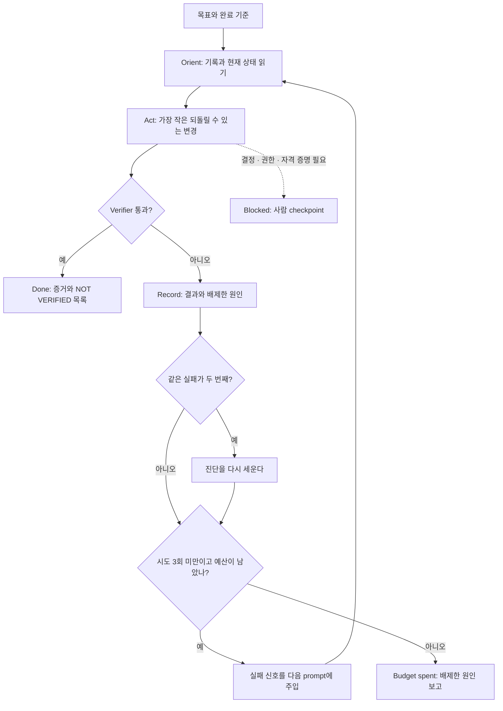

# 루프 엔지니어링: 에이전트를 부르는 반복을 설계하기

> **학습 목표**: 에이전트에게 직접 prompt를 보내는 대신 prompt · 검증 · 재시도 · 멈춤을 맡는 루프를 설계하고, 루프의 여섯 구성 요소와 모양을 구분하며, 멈춤 조건과 비용 상한을 숫자로 정하고, 흔한 실패 모드를 미리 막을 수 있다.

「AI 엔지니어링의 층: 프롬프트 · 컨텍스트 · 하네스」가 에이전트 한 번의 실행을 둘러싼 층을 다뤘다면, 이 문서는 그 위층, 곧 **여러 번의 실행을 누가 어떻게 이어 붙이는가**를 다룬다. 루프 엔지니어링은 에이전트에게 prompt를 보내고, 결과를 검증하고, 실패를 되먹여 다시 시도하고, 언제 멈출지 정하는 제어 시스템을 설계하는 일이다. Headless 실행과 예약 실행의 세부는 「Headless · CI · Cloud 실행」, hook과 권한은 「권한 · Sandbox · Hook」, token 단가와 누적 공식은 「AI 토큰 효율화의 원리」에 있으므로 여기서는 루프 관점만 짚는다. 도구와 기능은 **2026-09 기준**이며, 공식 문서와 소스에서 확인하지 못한 것은 그렇다고 적었다. 달러→원 환산은 1 USD = 1,400원(가정)이다.

## 핵심 개념

### 이름과 뿌리

2026-06-07 Peter Steinberger가 X에 "coding agent에게 prompt를 보낼 게 아니라, agent에게 prompt를 보내는 루프를 설계해야 한다"는 취지의 글을 올렸다(검색 결과로 확인, 원문 게시물은 열지 못함). 같은 달 Claude Code를 이끄는 Boris Cherny가 "더 이상 Claude에게 prompt하지 않는다. 루프가 prompt한다. 내 일은 루프를 쓰는 것"이라는 취지로 말했다고 널리 인용되지만, 원본 영상 · 게시물은 확인하지 못했고 2차 출처로만 봤다. 2026-06-08 무렵 Addy Osmani는 에세이 「Loop Engineering」에서 prompt engineering 위에 harness engineering, 그 한 층 위에 loop engineering을 두는 층 구조를 제시했다(검색 결과로 확인, 본문 열지 못함). Harness가 **한 번의 실행**에서 에이전트가 무엇을 할 수 있는지를 정한다면, loop는 **다음에 무엇을 시키고, 무엇으로 합격을 판정하고, 언제 멈추는지**를 정한다. 아래층은 「AI 엔지니어링의 층: 프롬프트 · 컨텍스트 · 하네스」에서 다룬다.

- **ReAct**(Yao 외, 2022-10 arXiv, ICLR 2023): 모델이 추론(thought)과 행동(action)을 번갈아 내고, 환경의 관찰(observation)을 받아 다음 추론에 쓴다. 오늘날 agent가 한 턴 안에서 도구를 부르고 결과를 읽는 **inner loop**의 원형이다.
- **Ralph**(Geoffrey Huntley, 2025): agent를 shell의 `while` 루프 안에서 같은 prompt로 계속 다시 부르는 기법이다. 반복마다 context는 비워지고, 상태는 디스크의 계획 파일과 commit에 남는다. 테스트 · type check · lint가 잘못된 작업을 되돌려 보내는 **backpressure** 역할을 한다. 핵심은 `while :; do cat PROMPT.md | claude ; done` 한 줄이다(ghuntley/how-to-ralph-wiggum). 2025-07의 첫 예시가 Amp CLI였다는 것은 검색 결과로만 확인했다. Anthropic 공식 plugin 저장소의 「ralph-loop」는 같은 발상을 shell 대신 **Stop hook**으로 구현한다. 세션이 끝나려 할 때 hook이 막고 같은 prompt를 다시 넣는다. `--max-iterations`의 기본값은 무제한이고, README는 이것을 **항상** 지정하라고 권한다(`--completion-promise`는 정확한 문자열 일치 하나뿐이기 때문).

### 여섯 가지 구성 요소

| 구성 요소 | 설계 질문 | 예 |
|---|---|---|
| 목표와 완료 기준 | 무엇이 참이 되면 끝인가? 기계가 판정할 수 있나? | "`npm test`가 0으로 끝나고, 기존 테스트 파일은 바뀌지 않는다" |
| Verifier | 누가, 무엇으로 합격을 판정하나? 만든 쪽과 분리돼 있나? | 테스트, linter, type check, eval, 다른 모델의 적대적 reviewer |
| 피드백 주입 | 실패의 어느 부분을 다음 반복에 넣나? | 실패한 테스트 이름과 로그 마지막 40줄, 리뷰 지적 목록 |
| 멈춤 조건 | 몇 번, 얼마, 몇 분까지? 진전이 없으면? | 시도 3회, `--max-budget-usd 3`, 같은 실패 문구가 두 번이면 중단 |
| 상태와 기록 | 반복 사이에 무엇이 디스크에 남나? | Commit, `PROGRESS.md`, 배제한 원인 목록 |
| 사람 checkpoint | 어디서 사람이 승인하나? | Merge · 배포 · 되돌릴 수 없는 작업 앞, Blocked 보고 |

## 원리

### 1. 루프의 모양

| 모양 | 한 바퀴 | 다음 반복을 시작하는 쪽 | 예 |
|---|---|---|---|
| Inner loop(도구 호출) | 추론 → 도구 호출 → 결과 관찰 | 모델 자신(도구가 이미 돌려 줌) | Claude Code 한 턴 안의 tool call, ReAct |
| Outer loop | 세션 하나 → 검증 → 다음 세션 | 스크립트 · hook · scheduler | Ralph, `claude -p` shell loop, `/goal` |
| Retry loop | 실패 → 피드백 → 재시도 | Verifier 결과 | 테스트가 통과할 때까지 최대 3회 |
| Review loop | Writer → reviewer → fixer | 리뷰 지적의 유무와 등급 | 이 사이트의 문서 작성(아래 적용 절) |
| 예약 · 반복 loop | 시각이나 이벤트마다 한 번 | Cron, Routine, `/loop` | 매일 아침 PR 정리, 배포 확인 |
| Fan-out / fan-in | 여러 작업자가 병렬로 → 결과를 모아 통합 | Manager | Worktree별 작업 묶음, 통합 wave |

### 2. 루프는 verifier보다 나아질 수 없다

Anthropic 「Building effective agents」(2024-12)는 agent가 매 단계 환경에서 **ground truth**(도구 결과, 코드 실행)를 받아 진행을 판단해야 한다고 쓰고, 한 LLM이 만들고 다른 LLM이 평가해 되먹이는 **evaluator-optimizer** 흐름을 소개한다. 루프가 "끝났다"고 믿는 근거는 verifier뿐이므로, verifier가 약하면 루프는 빠르게 **틀린 답으로 수렴**한다. 그래서 **결정적 검증**(테스트, type check, lint, build)을 먼저 두고, 판단이 필요한 검증은 만든 모델의 추론 이력을 보지 않은 **새 context의 reviewer**에게 diff와 증거만 주어 맡기며, 가능하면 **다른 모델**을 쓴다. LLM 평가자는 자기 출력을 알아보고 더 높게 치는 경향(self-preference)이 있고(Panickssery 외, NeurIPS 2024), 같은 모델끼리는 맹점도 겹친다.

### 3. 멈춤 조건은 세 겹으로 건다

하나만 걸면 새어 나간다. **시도 예산**(몇 번), **비용 · 시간 예산**(얼마, 몇 분), **무진전 감지**(같은 실패가 반복되는가)를 함께 건다.



### 4. 상태는 context 밖, 디스크에 둔다

긴 루프에서 context는 흐려진다(context rot, 「AI 토큰 효율화의 원리」). 그래서 반복마다 새 context로 시작하고, 이어 가야 할 것은 파일로 넘긴다. Anthropic 「Effective harnesses for long-running agents」(2025-11)는 첫 세션이 환경을 준비하고, 이후 세션은 진행 로그 파일(`claude-progress.txt`), `passes` 필드가 있는 JSON 기능 목록, 설명이 붙은 git commit으로 이어 가는 구조를 보여 준다. 같은 글은 agent가 너무 일찍 완료를 선언하고, 테스트 없이 기능을 완료로 표시하는 실패를 관찰했다. 넘겨야 할 기록은 셋이다: **무엇을 했나**(commit), **무엇이 남았나**(계획 · 진행 파일), **무엇을 배제했나**(시도한 원인과 그 결과).

### 5. 도구로 루프 만들기(2026-09)

| 필요 | Claude Code | Codex |
|---|---|---|
| 조건이 참이 될 때까지 계속 | `/goal <조건>`: 매 턴 뒤 small fast model(Claude API 기본 Haiku)이 대화에 드러난 증거로 판정. 조건 최대 4,000자, `/goal clear`로 해제. 턴 상한은 조건 문장에 직접 쓴다 | 확인 안 함 |
| 일정 간격으로 반복 | `/loop 5m <prompt>`. 간격을 빼면 1분~1시간 사이에서 스스로 조절. 반복 작업은 7일 뒤 만료, 세션당 최대 50개 | 확인 안 함 |
| 멈추려는 것을 막기 | `Stop` hook이 `"decision": "block"`과 `reason`을 돌려주거나, prompt hook이 `ok: false`. 진전 없이 연속 8회 막으면 무시된다(`CLAUDE_CODE_STOP_HOOK_BLOCK_CAP`) | 확인 안 함 |
| 스크립트 실행과 상한 | `claude -p`, `--output-format json`(`total_cost_usd`), `--resume <id>`. `--max-turns`(도달 시 오류로 종료), `--max-budget-usd`(subagent 사용분 포함)는 print 모드 전용 | `codex exec`, `--json`, `-o <file>`, `--output-schema`, `codex exec resume --last`. 턴 · 비용 상한 flag는 확인 안 함 |
| 다른 모델의 리뷰 | 새 context의 subagent 또는 별도 세션 | `codex exec review --uncommitted`, `--base <branch>` |
| 세션 밖 예약 | Routines(`/schedule`, 최소 1시간, research preview, 내 계정으로 행동), Desktop 예약 작업 | CI의 `schedule`에서 `codex exec` 실행 |

`/goal`은 내부적으로 세션 범위의 prompt 기반 Stop hook이다. 평가자는 도구를 쓰지 않으므로 "테스트가 통과한다"는 조건은 agent가 테스트를 돌려 결과가 대화에 찍혀야 판정된다. 권한 · hook 설정은 「권한 · Sandbox · Hook」, headless 인증과 CI는 「Headless · CI · Cloud 실행」을 따른다. 아래는 세 겹 멈춤 조건을 건 outer loop의 뼈대다.

```bash
#!/usr/bin/env bash
set -u
echo "none" > prev-failure.txt
for i in 1 2 3; do                                   # attempt budget
  claude -p "$(cat PROMPT.md)" --permission-mode acceptEdits \
    --allowedTools "Bash(git add *)" "Bash(git commit *)" \
    --max-turns 30 --max-budget-usd 3 --output-format json > "run-$i.json"   # turn and cost cap per run
  if npm test > "test-$i.log" 2>&1; then echo "DONE at attempt $i"; exit 0; fi
  grep -E "FAIL|Error" "test-$i.log" | head -n 40 > last-failure.txt       # feedback for PROMPT.md to read
  cmp -s last-failure.txt prev-failure.txt && { echo "NO PROGRESS: rethink the diagnosis"; exit 2; }
  cp last-failure.txt prev-failure.txt
done
echo "BUDGET SPENT: see PROGRESS.md for ruled-out causes"; exit 1
```

`PROMPT.md`에는 "`PROGRESS.md`와 `last-failure.txt`를 먼저 읽고, 끝에 배제한 원인을 `PROGRESS.md`에 적고 commit하라, 테스트 파일은 고치지 마라"를 넣는다. Verifier(`npm test`)가 agent 밖에서 돈다는 점이 핵심이다.

## 적용: 이 저장소의 루프

### 단위 루프: `.ai/LOOP.md`

이 저장소의 agent 규칙 `.ai/LOOP.md`는 한 번의 시도를 네 단계로 고정한다. **Orient**(바꿀 대상과 그 변경이 실제로 닿는지 정하는 관문을 읽는다) → **Act**(질문을 가를 가장 작은 되돌릴 수 있는 변경) → **Verify**(실제로 가진 질문에 답하는 가장 싼 검사, 그 질문을 적는다) → **Record**(결과와, 그 결과가 답하지 않은 것). 시간에 쫓기면 Record가 빠지고, 그러면 세 번의 시도가 같은 시도 세 번이 된다고 경고한다.

| `.ai/LOOP.md` 규칙 | 루프 구성 요소 |
|---|---|
| 같은 실패가 두 번이면 틀린 것은 값이 아니라 진단이다. 한 실패에 세 번 시도하면 끝내고 배제한 원인을 보고. 결과를 읽지 않은 행동은 반복하지 않는다 | 무진전 감지, 시도 예산, 상태와 기록, 피드백 주입 |
| 수렴하지 않는 징후: 같은 오류 문구, 실패는 그대로인데 diff만 커짐, 앞선 수정을 되돌리는 수정, 검증 대상이 더 쉬운 쪽으로 이동, 반박될 때마다 새 가정 | 무진전 · reward hacking 감지 |
| 기다림은 루프가 아니다: 예약할 수 있으면 예약하고 턴을 끝낸다 | 예약 loop |
| 끝은 Done · Blocked · Budget spent 셋 중 하나이고, 어느 것인지 말한다 | 멈춤 조건, 사람 checkpoint |

### 이 사이트를 만든 리뷰 루프

이 사이트의 문서는 다음 review loop로 만들어졌다. **Writer agent**가 초안을 쓰고 → **다른 모델의 적대적 reviewer**가 새 context에서 초안을 공격하듯 읽고 지적에 등급을 붙이고 → **Fixer**가 지적을 고친다. 이것을 3라운드 반복한 뒤, 고친 내용만 다시 보는 **수정 확인 패스**를 거치고, 마지막에 build · test · 배포를 한다. 라운드 상한(3회)이 시도 예산이고, 수정 확인과 build · test가 최종 verifier이며, merge와 배포가 사람 checkpoint다. `.ai/EXECUTION.md`는 reviewer에게 요구사항 · 관련 구조 · diff · 테스트와 build 증거 · 리뷰 규칙만 주고 **구현자의 추론 이력은 넘기지 않는다**고 정한다. 아래는 라운드별 기록 형식이다. **등급별 지적 수는 설명을 위한 예시 숫자**이고, "무엇이 바뀌었나"는 이 저장소의 commit 기록(AI 문서 06~13)에서 옮겼다.

| 라운드 | Critical | Major | Minor | 무엇이 바뀌었나 |
|---|---:|---:|---:|---|
| 1 | 2 | 6 | 9 | Hook이 닫힌 쪽으로 실패하고 모든 force-push 형태를 잡게 함, 기준선을 아는 Stop hook, Codex profile, bare mode 인증, TTL 안내, nav 제목 참조 |
| 2 | 1 | 4 | 5 | Hook 1 우회(숫자 결합 short flag, long option 접두어, backslash escape, `$` 확장, 줄 이음) 차단, `session_id` 정리, Codex profile 오류와 TOML 필드 정정, keep-alive 안내 범위 축소 |
| 3 | 0 | 2 | 3 | Hook 1 우회 추가 차단(brace 확장은 닫힌 쪽으로 실패, 사례표 71개), branch 삭제는 범위 밖(branch protection 담당)으로 명시 |
| 수정 확인 | 0 | 0 | 1 | (예시) 남은 Minor는 다음 작업으로 넘기고 build · test · 배포 |

기록에서 읽을 교훈이 하나 있다. **Hook 1 우회는 1 · 2 · 3라운드 모두에서 다시 나왔다.** 매 라운드 새 우회 형태를 막는 것은 "같은 실패를 파라미터만 바꿔 반복"하는 모양이다. `.ai/LOOP.md`의 규칙을 적용하면 두 번째 재등장에서 진단(shell 명령 문자열 매칭으로 모든 형태를 잡을 수 있다)부터 의심할 차례였다. 3라운드에서 일부를 branch protection에 넘긴 것은 그 진단 변경으로 볼 수 있다.

### 루프 설계 점검표: 시작 전에 정할 것

| 결정 | 물어볼 것 | 이 저장소의 답(예) |
|---|---|---|
| 완료 기준과 끝 보고 | 기계가 판정할 수 있는 문장인가? 어떤 끝 상태로 보고하나? | Build · test 통과, 리뷰의 미해결 Critical · Major 0건. Done · Blocked · Budget spent 중 하나 + NOT VERIFIED 목록 |
| Verifier | 만든 쪽과 분리됐나? 일부러 깨뜨린 변경을 떨어뜨리나? | 다른 모델의 새 context reviewer + build · test |
| 피드백 | 다음 반복에 무엇을, 얼마나 넣나? | 등급이 붙은 지적 목록만. 전체 로그는 넣지 않는다 |
| 예산 | 몇 번, 얼마, 몇 분 뒤에 멈추나? | 한 실패에 3회, 리뷰 3라운드, 실행별 `--max-budget-usd` · `--max-turns`, 전체 상한은 아래 비용 절로 계산 |
| 무진전 감지 | 무엇이 같으면 진전이 없다고 보나? | 같은 실패 문구 2회, 같은 종류의 지적이 라운드마다 재등장 |
| 상태와 기록 | 반복 사이에 무엇을 남기나? | Commit, 라운드별 지적 표, 배제한 원인 |
| 금지 변경 | Verifier를 약하게 만드는 변경을 어떻게 막나? | 테스트 · 검사 스크립트 변경은 별도 승인, diff에서 확인 |
| 사람 checkpoint | 어디서 사람이 보나? | Merge · 배포 전, Blocked 보고 시 |

## 심화

### 반복은 token 비용을 곱한다

「AI 토큰 효율화의 원리」의 가정(고정 prefix S = 20,000, 턴마다 Δ = 3,000, 턴당 출력 800, cache 사용, Opus 5.5 · Sonnet 5.5 단가)을 그대로 쓴다. 역할마다 새 세션을 열면 루프 비용은 **반복 횟수에 비례**하고, 한 세션에 몰아넣으면 이력 재전송 때문에 **턴 수의 제곱에 가깝게** 는다. Reviewer는 계산 편의상 Sonnet 5.5로 두었다. 다른 벤더 모델이면 그 단가로 바꿔 넣는다.

```text
writes = S + (N-1)*D ; reads = N*S + D*N*(N-1)/2 - writes
writer   Opus 5.5,   N=30: 107,000*$5   + 1,798,000*$0.20 + 24,000*$20 = $1.3746
reviewer Sonnet 5.5, N=10:  47,000*$2.5 +   288,000*$0.20 +  8,000*$10 = $0.2551
fixer    Opus 5.5,   N=15:  62,000*$5   +   553,000*$0.20 + 12,000*$20 = $0.6606
3 rounds + fix check = 1.3746 + 3*(0.2551 + 0.6606) + 0.2551 = $4.3768
```

| 설계(가정) | 비용 |
|---|---:|
| 한 번 쓰고 끝(writer만) | $1.37 (1,924원) |
| 재시도 loop, 시도당 $1.37, 상한 3회를 다 쓴 경우 | $4.12 (5,773원) |
| 리뷰 3라운드 + 수정 확인, 역할마다 새 세션 | $4.38 (6,128원) |
| 같은 일을 Opus 5.5 한 세션 115턴(30 + 3×(10 + 15) + 10)에 몰아넣음: 쓰기 362,000×$5 + 읽기 21,603,000×$0.20 + 출력 92,000×$20 | $7.97 (11,159원) |

리뷰 루프는 한 번 쓰기의 약 3.2배지만, 같은 일을 한 세션에 쌓으면 그보다 약 1.8배 더 든다. 상한이 없는 루프는 여기에 반복 횟수만큼 곱해진다. 「AI 토큰 효율화의 원리」의 **과제당 비용 = 시도당 비용 ÷ 성공률**도 그대로 적용된다. Verifier가 약해 성공률을 과대평가하면 과제당 비용은 과소평가된다. `/goal` 평가는 small fast model로 과금되며 공식 문서는 본 작업 대비 대개 무시할 수준이라고 한다.

### 실패 모드

| 실패 모드 | 징후 | 대책 |
|---|---|---|
| 약한 verifier로 거짓 수렴 | 초록불은 빨리 나오는데 사람이 보면 틀림 | Verifier부터 검증: 일부러 깨뜨린 변경이 떨어지는지 확인 |
| 비용 폭주 | 끝나지 않고 반복마다 비용이 같거나 늘어남 | 실행별 `--max-budget-usd` · `--max-turns`, 전체 시도 상한, 반복마다 새 세션 |
| 같은 실패를 값만 바꿔 반복 | 같은 오류 문구, diff만 커짐 | 같은 실패 두 번이면 진단을 바꾼다. 세 번이면 멈추고 배제한 원인을 보고 |
| Reward hacking | 테스트 삭제 · 약화 · skip, 채점 코드 수정 | 완료 기준에 "테스트 파일 불변"을 넣고 diff로 확인, 보호 경로 hook. METR(2025-06)은 frontier model이 테스트나 채점 코드를 고쳐 점수를 올리려 한 사례를 보고했다 |
| Context drift | 긴 루프 뒤 처음의 제약을 잊음 | 반복마다 새 context, 목표와 제약을 매번 다시 주입, 기록은 디스크에 |
| Writer와 reviewer의 공통 맹점 | 둘 다 같은 곳을 놓침 | 다른 모델(가능하면 다른 벤더) reviewer, 추론 이력 대신 diff와 증거만 전달 |

루프를 남의 소프트웨어나 서비스를 대상으로 돌린다면, 시작 전에 법적 경계부터 「리버스 엔지니어링: 법과 합법적 활용」에서 확인한다.

## 흔한 오해

- **"루프를 돌리면 결국 맞는다."** 루프는 verifier가 말하는 쪽으로 수렴한다. Verifier가 약하면 틀린 답으로 빠르게 수렴한다.
- **"한 번 더 돌리면 된다."** 같은 실패가 두 번이면 진단이 틀린 것이다. 세 번째 시도보다 배제한 원인 목록이 더 값지다.
- **"Reviewer도 같은 모델이면 충분하다."** 자기 출력을 선호하는 편향과 공통 맹점이 있다. 새 context와 다른 모델이 기본이다.
- **"`/loop`와 `/goal`은 같은 것이다."** `/loop`는 시간 간격으로, `/goal`은 조건이 참이 될 때까지 다음 턴을 시작한다. 세션 밖에서 돌려야 하면 Routines를 쓴다.
- **"긴 한 세션이 여러 짧은 세션보다 싸다."** 이력 재전송은 턴 수의 제곱에 가깝게 는다. 기록을 디스크에 두고 새 세션으로 끊는 편이 대개 싸고 정확하다.

## 자기 점검 질문

1. 지금 쓰는 작업 하나에서 완료 기준을 기계가 판정할 수 있는 한 문장으로 적어 보라. 그 문장을 약하게 만드는 가장 쉬운 변경은 무엇이고, 어떻게 막겠는가?
2. 세 겹의 멈춤 조건(시도, 비용 · 시간, 무진전)을 위 shell loop에서 각각 어느 줄이 맡는가?
3. Review loop에서 같은 종류의 지적이 세 라운드 연속 나오면, fixer에게 무엇을 다르게 시키겠는가?
4. Writer N = 30, reviewer N = 10, fixer N = 15로 리뷰를 2라운드만 하고 수정 확인을 생략하면 비용은 얼마인가(위 가정 그대로)?
5. `/goal`의 평가자가 파일을 직접 읽지 않는다는 사실은 완료 조건을 쓰는 방법을 어떻게 바꾸는가?

## 참고 자료

- [Run prompts on a schedule](https://code.claude.com/docs/en/scheduled-tasks) · [Keep Claude working toward a goal](https://code.claude.com/docs/en/goal) · [Automate actions with hooks](https://code.claude.com/docs/en/hooks-guide) — Claude Code Docs, 2026-09-29 확인
- [Automate work with routines](https://code.claude.com/docs/en/routines) · [Run Claude Code programmatically](https://code.claude.com/docs/en/headless) · [CLI reference](https://code.claude.com/docs/en/cli-reference) — Claude Code Docs, 2026-09-29 확인
- [openai/codex `codex-rs/exec/src/cli.rs`, `codex-rs/utils/cli/src/shared_options.rs`](https://github.com/openai/codex) — OpenAI, 2026-09-29 확인
- [Building effective agents](https://www.anthropic.com/engineering/building-effective-agents)(2024-12-19) · [Effective harnesses for long-running agents](https://www.anthropic.com/engineering/effective-harnesses-for-long-running-agents)(2025-11-26) — Anthropic Engineering, 2026-09-29 확인
- [ghuntley/how-to-ralph-wiggum](https://github.com/ghuntley/how-to-ralph-wiggum) · [anthropics/claude-plugins-official `plugins/ralph-loop`](https://github.com/anthropics/claude-plugins-official/tree/main/plugins/ralph-loop) — GitHub, 2026-09-29 확인
- [Ralph Wiggum as a "software engineer"](https://ghuntley.com/ralph/) — Geoffrey Huntley, 2025 · [Peter Steinberger의 X 게시물](https://x.com/steipete/status/2063697162748260627) — 2026-06-07 · [Loop Engineering](https://addyo.substack.com/p/loop-engineering) — Addy Osmani, 2026-06(O'Reilly Radar 게재본 있음). 모두 2026-09-29 검색 결과로 확인
- [ReAct: Synergizing Reasoning and Acting in Language Models](https://arxiv.org/abs/2210.03629) — Yao 외, 2022-10, ICLR 2023, 2026-09-29 검색 결과로 확인
- [Recent Frontier Models Are Reward Hacking](https://metr.org/blog/2025-06-05-recent-reward-hacking/) — METR, 2025-06-05 · [LLM Evaluators Recognize and Favor Their Own Generations](https://proceedings.neurips.cc/paper_files/paper/2024/hash/7f1f0218e45f5414c79c0679633e47bc-Abstract-Conference.html) — Panickssery 외, NeurIPS 2024. 둘 다 2026-09-29 검색 결과로 확인
