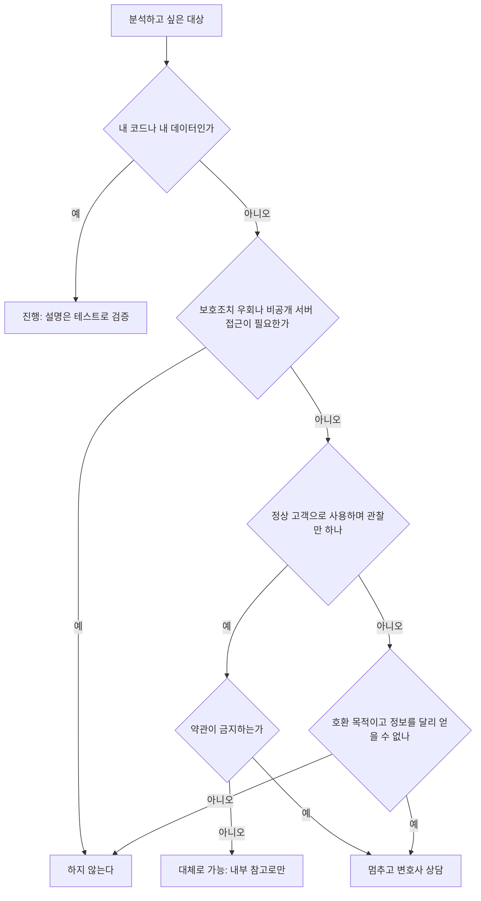

# 리버스 엔지니어링: 법과 합법적 활용

> **학습 목표**: 리버스 엔지니어링이 무엇이고 왜 하는지 설명하고, 한국·미국·EU 법과 계약이 정한 경계를 구분하며, 경쟁 제품 분석과 자기 레거시 해독을 합법적인 범위에서 검증하며 진행할 수 있다.

1인 스튜디오도 리버스 엔지니어링과 마주친다. 경쟁 서비스의 가격 구조를 살펴볼 때, 문서 없이 남은 자기 코드와 데이터 파일을 다시 읽을 때다. 이 문서는 분석 기법이 아니라 **법의 경계와 합법적 활용**을 다룬다. Agent에게 줄 권한은 「권한 · Sandbox · Hook」, 모델에게 무엇을 보여 줄지는 「AI 엔지니어링의 층: 프롬프트 · 컨텍스트 · 하네스」, 검증을 되먹이는 반복 구조는 「루프 엔지니어링」, 외주 코드의 권리 귀속은 「계약 · 지식재산 · 오픈소스」에서 다룬다. 법 조문과 판례는 **2026-09 기준**이며, 원문을 직접 열지 못하고 검색 결과로만 확인한 것은 참고 자료에 표시했다.

> **이 문서는 일반 정보이며 법률 자문이 아니다.** 법 해석은 사실관계와 시점에 따라 달라진다. 타인의 소프트웨어나 서비스를 분석하기 전에는 변호사와 상담한다.

## 핵심 개념

### 정의

**Forward engineering**은 요구사항에서 설계와 구현을 거쳐 완성품으로 간다. **Reverse engineering**은 방향이 반대다. 이미 완성된 제품에서 출발해 그 설계, 구조, 동작을 되찾는다. 좋은 산출물은 원본의 사본이 아니라 **근거가 붙은 설명**이다. "무료 체험 7일 뒤 결제 화면이 뜬다", "이 저장 파일의 첫 필드는 버전 번호다" 같은 문장과, 그것을 다시 확인하는 방법이 결과물이다.

### 왜 하는가

- **호환(interoperability)**: 내 프로그램이 다른 프로그램이나 파일과 정보를 주고받게 하려고.
- **자기 레거시 유지보수**: 문서와 작성자가 사라진 내 코드, 내 데이터 형식을 다시 이해하려고.
- **경쟁 제품 연구**: 정상 고객으로 사용하며 온보딩, 가격, 기능 구성을 배우려고.
- **보안 연구**: 권한을 받은 전문가가 결함을 찾아 고치려고.

목적이 같아도 대상과 방법에 따라 합법 여부가 갈린다. 아래 원리는 그 경계를 다룬다.

## 원리

### 한국: 저작권법의 프로그램코드역분석

- **정의(제2조 제34호)**: 독립적으로 창작된 프로그램과 다른 프로그램의 호환에 필요한 정보를 얻기 위해 프로그램 코드를 복제하거나 변환하는 것.
- **허용 요건(제101조의4 제1항, 「프로그램코드역분석」)**: ① 정당한 권한으로 프로그램을 이용하는 자이거나 그의 허락을 받은 자가, ② 호환에 필요한 정보를 쉽게 얻을 수 없고 그 획득이 불가피한 경우, ③ 호환에 필요한 부분에 한정해서 할 수 있다.
- **이용 제한(같은 조 제2항)**: 얻은 정보를 호환 목적 외에 쓰거나 제3자에게 제공할 수 없고, 대상 프로그램과 표현이 실질적으로 유사한 프로그램을 개발·제작·판매하거나 그 밖의 저작권 침해에 쓸 수 없다.
- **기술적 보호조치(제104조의2, 「기술적 보호조치의 무력화 금지」)**: 정당한 권한 없이 보호조치를 무력화하는 것을 금지한다. 같은 조에 호환을 위한 프로그램코드역분석 등 몇 가지 예외가 있지만 범위가 좁다. 예외에 해당하는지는 혼자 판단하지 않는다.

### 한국: 영업비밀과 정보통신망

- **영업비밀(부정경쟁방지법 제2조 제2호·제3호)**: 공공연히 알려지지 않고, 독립된 경제적 가치가 있으며, 비밀로 관리된 기술·경영 정보가 영업비밀이다. 절취·기망 등 부정한 수단으로 취득하거나 그렇게 얻은 것을 사용·공개하면 침해가 된다.
- **역설계와 영업비밀(대법원 1996. 12. 23. 선고 96다16605 판결)**: 대법원은 독자 개발이나 역설계 같은 합법적 방법으로 영업비밀을 취득할 수 있다는 전제에서 침해금지 기간을 판단했다. 시중 제품을 정당하게 사서 분석하는 것 자체를 부정한 수단으로 보지 않는다는 취지로 읽힌다. 다만 개별 사안의 판단은 다를 수 있다.
- **정보통신망 침입(정보통신망법 제48조 제1항)**: 정당한 접근권한 없이 또는 허용된 접근권한을 넘어 정보통신망에 침입하는 것을 금지하고, 위반은 형사처벌 대상이 될 수 있다. 벌칙 조항은 이 문서에서 확정하지 않았다.
- **크롤링 사건(대법원 2022. 5. 12. 선고 2021도1533 판결)**: 경쟁사 앱의 비공개 API로 숙박업소 정보를 수집한 사건에서 정보통신망 침입 등 형사 혐의는 무죄가 확정됐다. 같은 사실관계의 **민사 1심에서는 성과물 무단 사용형 부정경쟁행위(부정경쟁방지법 제2조 제1호의 보충 조항)로 약 10억 원 배상 판결이 보도됐다.** 항소심 결과는 확인하지 못했다. 형사 무죄가 곧 안전하다는 뜻은 아니다.

### 미국과 EU

- **미국 DMCA §1201(f)**: 프로그램을 적법하게 사용할 권리를 가진 자가, 독립적으로 만든 프로그램의 호환에 필요하고 이전에 쉽게 얻을 수 없었던 요소를 파악하는 목적에 한해 기술적 보호조치를 우회할 수 있게 한다. 저작권 침해가 되지 않는 범위라는 단서가 붙는다.
- **Sega v. Accolade(9th Cir. 1992)**: 호환 게임을 만들려고 한 역분석이, 보호받지 않는 요소에 접근할 유일한 방법이고 정당한 이유가 있을 때 fair use라고 봤다.
- **Bowers v. Baystate(Fed. Cir. 2003)**: 라이선스 계약의 역분석 금지 조항을 집행했다. 미국에서는 계약이 법정 허용 범위를 좁힐 수 있다는 사례다.
- **EU Directive 2009/24/EC**: 제6조는 라이선스 보유자 등이, 호환 정보를 쉽게 얻을 수 없을 때, 필요한 부분에 한해 decompile할 수 있게 하고, 얻은 정보의 목적 외 사용·제3자 제공·유사 프로그램 개발을 막는다. 제8조는 제6조에 반하는 계약 조항을 무효로 본다.

### 계약: EULA와 ToS

소프트웨어 EULA와 서비스 이용약관(ToS)에는 역분석, 자동 수집, 비공식 client 사용을 금지하는 조항이 흔하다. 한국에서 이런 조항이 제101조의4의 허용 범위를 얼마나 좁힐 수 있는지는 이 문서에서 확인하지 못했다. 법적 결론과 별개로 실무 위험은 분명하다. 계정 정지, 앱 스토어·API 접근 차단, 계약 위반 청구, 협력 관계 단절이다. 1인 스튜디오에는 하나의 계정 정지도 사업 중단이 될 수 있다.

### "해도 되나?" 판단



| 상황 | 허용되는 조건 | 위험 |
|---|---|---|
| 경쟁 서비스에 정상 가입해 화면·가격·온보딩 기록 | 정상 가입·결제, 약관 준수, 수작업 관찰, 내부 참고용 | 낮음 |
| 공개 문서·공개 API·SDK로 연동 | 문서의 이용 조건과 호출 한도 준수 | 낮음 |
| 내 코드, 권리를 넘겨받은 외주 코드, 내 데이터 파일 해독 | 권리 귀속을 계약으로 확인 | 낮음 |
| 구매한 소프트웨어와 호환되는 도구를 만들기 위한 분석 | 제101조의4 요건 충족, EULA 확인, 사전 자문 | 중간~높음 |
| 권한을 받은 보안 점검 | 서면 허가나 bug bounty 범위 안에서만 | 허가 없으면 높음 |
| 경쟁 앱을 분석해 기능·코드를 옮겨 오기 | 호환 목적이 아니고 유사 프로그램 금지에 걸릴 수 있음 | 높음 |
| 비공개 API로 경쟁사 데이터 자동 수집 | 약관 위반, 정보통신망법·부정경쟁 쟁점 | 높음 |
| DRM·라이선스 확인 무력화 | 제104조의2의 좁은 예외 밖이면 금지 | 높음 |
| 추출한 이미지·음원·폰트 재사용·재배포 | 권리자 허락 없이는 불가 | 높음 |

위험 등급은 이 문서의 일반적 판단이며 법적 결론이 아니다.

## 적용: 1인 스튜디오의 합법적 리버스 엔지니어링

### 경쟁 제품 teardown: 고객으로 사용하고 기록한다

정상 고객으로 가입하고, 필요하면 실제로 결제한다. 자동화 도구나 비공개 경로 없이 사람이 사용하며 본 것만 기록한다.

| 기록 항목 | 무엇을 적나 | 쓰는 곳 |
|---|---|---|
| 온보딩 | 가입 단계 수, 첫 가치까지 걸린 시간, 요구하는 정보 | Activation 설계 |
| 가격 | 요금제 이름, 가격, 무료 한도, 체험 기간, 연간 할인, 해지 절차 | 가격 설계 |
| Funnel | 결제 유도 시점, paywall 위치, 이메일·푸시 순서와 간격 | Lifecycle 설계 |
| 기능 구조 | 메뉴 구조, 요금제별 기능 차이, 빠진 기능 | Positioning, roadmap |
| 고객 목소리 | 공개 리뷰의 반복 불만과 칭찬 | 차별점 가설 |

1. 기록은 날짜와 화면 캡처를 붙여 한 표에 모은다. 가격과 약관은 자주 바뀐다.
2. 여러 경쟁 제품을 같은 열로 비교하고, 모두가 하는 것과 아무도 안 하는 것을 표시한다.
3. 빈칸을 고객 문제로 바꿔 「시장·고객 리서치 · Segmentation」의 인터뷰로 검증하고, 「문제 발견 · 전략 · Roadmap」에 올린다.
4. 검증된 차이를 「Positioning · Messaging · Brand」의 positioning 문장으로 만든다. 가격은 「유료 판매·구독과 가격 설계」의 틀로 정한다.
5. 경쟁사 이름을 광고에 쓰려면 먼저 「법 · 윤리 · 광고 표시」를 본다. 캡처와 문구는 내부 자료로만 쓰고 공개하지 않는다.

### 내 레거시 코드와 데이터 파일을 AI agent와 읽기

문서 없이 남은 내 코드나 내 앱이 만든 저장 파일을 이해할 때 AI agent는 빠른 조수다. 다만 agent의 설명은 **가설**이지 사실이 아니다. 그럴듯하지만 틀린 설명이 가장 위험하다.

1. **권리 확인**: 내 코드이거나 권리를 넘겨받은 코드인지 계약으로 확인한다.
2. **작업 공간 분리**: 원본이 아니라 사본에서 작업하고, agent의 쓰기와 네트워크 권한을 좁힌다(「권한 · Sandbox · Hook」). 샘플은 내 앱이 만든 파일만 쓰고, 고객 데이터가 섞였다면 먼저 익명화한다.
3. **질문 하나씩**: "이 모듈은 무엇을 하나"보다 "이 함수가 저장 파일의 버전 필드를 어떻게 쓰나"처럼 좁게 묻는다.
4. **설명을 가설로 기록**: agent 설명마다 확인 방법을 한 줄 붙인다.
5. **실행으로 검증**: 기존 테스트를 돌리고, 현재 동작을 고정하는 characterization test를 추가하고, 옛 프로그램과 새 코드의 출력을 같은 입력으로 비교한다. 실패하면 가설을 고쳐 다시 묻는다(「루프 엔지니어링」).
6. **확인된 것만 문서화**: 검증을 통과한 설명만 README나 형식 문서에 옮긴다.

```python
# Characterization test: pin today's behaviour before trusting any explanation
import json
import subprocess


def test_new_reader_matches_legacy_output(tmp_path):
    out = tmp_path / "new.json"
    subprocess.run(["python", "new_reader.py", "samples/save_001.dat", str(out)], check=True)
    legacy = json.loads(open("samples/save_001.legacy.json", encoding="utf-8").read())
    assert json.loads(out.read_text(encoding="utf-8")) == legacy
```

## 심화

### 경계가 흐려지는 곳

- **공개 페이지 수집과 비공개 API**: 누구나 보는 공개 페이지와, 앱 내부 통신을 흉내 내 접근하는 비공개 API는 법적 평가가 다를 수 있다. 2021도1533의 형사 무죄 뒤에도 민사 1심 배상 판결이 보도됐다는 점이 그 차이를 보여 준다.
- **계약과 법률**: EU는 제8조로 역분석 허용 범위를 계약으로 없애지 못하게 했지만, 미국 Bowers 사건은 계약 금지 조항을 집행했다. 한국의 입장은 이 문서에서 확정하지 않았다.
- **국경을 넘는 서비스**: 해외 서비스의 약관은 대개 준거법과 관할을 정한다. 한국에서 적법해 보여도 약관이 정한 나라의 법으로 다툴 수 있다.

### 변호사에게 가야 할 때

- 타인의 소프트웨어를 호환 목적으로 분석하려 할 때
- 보호조치, 라이선스 확인, 비공개 서버가 조금이라도 얽힐 때
- 경쟁사로부터 경고장이나 약관 위반 통지를 받았을 때
- 분석 결과를 제품, 광고, 공개 글에 쓰려 할 때

## 흔한 오해

- **"샀으니 마음대로 분석해도 된다."** 소유와 무관하게 제101조의4 요건과 이용 제한, 계약 조항이 따라온다.
- **"공개된 앱이면 비공개 API도 공개다."** 앱 안에 있다고 공개 API가 되는 것은 아니다. 약관과 정보통신망법 쟁점이 남는다.
- **"형사 무죄면 문제없다."** 민사 책임과 계정 정지는 별개다.
- **"호환 목적이라고 말하면 된다."** 실제로 필요한 부분에 한정됐는지, 정보를 달리 얻을 수 없었는지가 따져진다.
- **"AI가 설명해 줬으니 맞다."** 검증하지 않은 설명은 가설이다. 테스트와 출력 비교로 확인한다.

## 자기 점검 질문

1. 제101조의4 제1항의 세 요건과 제2항의 이용 제한을 각각 설명할 수 있는가?
2. 경쟁 서비스 teardown에서 허용되는 관찰과 피해야 할 행위를 하나씩 들면?
3. 2021도1533 형사 판결과 보도된 민사 1심 판결은 무엇이 달랐고, 스튜디오에 주는 교훈은?
4. EU 제8조와 Bowers v. Baystate는 계약 조항의 효력을 어떻게 다르게 봤는가?
5. AI agent가 레거시 파일 형식을 설명했을 때, 그 설명을 문서에 옮기기 전에 무엇으로 검증하겠는가?

## 참고 자료

- [저작권법 제101조의4(프로그램코드역분석)](https://www.law.go.kr/%EB%B2%95%EB%A0%B9/%EC%A0%80%EC%9E%91%EA%B6%8C%EB%B2%95/%EC%A0%9C101%EC%A1%B0%EC%9D%984) — 국가법령정보센터, 2026-09-29 검색 결과로 확인
- [저작권법 제2조(정의)](https://www.law.go.kr/%EB%B2%95%EB%A0%B9/%EC%A0%80%EC%9E%91%EA%B6%8C%EB%B2%95/%EC%A0%9C2%EC%A1%B0) · [제104조의2(기술적 보호조치의 무력화 금지)](https://www.law.go.kr/%EB%B2%95%EB%A0%B9/%EC%A0%80%EC%9E%91%EA%B6%8C%EB%B2%95/%EC%A0%9C104%EC%A1%B0%EC%9D%982) — 국가법령정보센터, 2026-09-29 검색 결과로 확인
- [부정경쟁방지 및 영업비밀보호에 관한 법률 제2조(정의)](https://www.law.go.kr/%EB%B2%95%EB%A0%B9/%EB%B6%80%EC%A0%95%EA%B2%BD%EC%9F%81%EB%B0%A9%EC%A7%80%EB%B0%8F%EC%98%81%EC%97%85%EB%B9%84%EB%B0%80%EB%B3%B4%ED%98%B8%EC%97%90%EA%B4%80%ED%95%9C%EB%B2%95%EB%A5%A0/%EC%A0%9C2%EC%A1%B0) — 국가법령정보센터, 2026-09-29 검색 결과로 확인
- [정보통신망 이용촉진 및 정보보호 등에 관한 법률 제48조](https://www.law.go.kr/%EB%B2%95%EB%A0%B9/%EC%A0%95%EB%B3%B4%ED%86%B5%EC%8B%A0%EB%A7%9D%EC%9D%B4%EC%9A%A9%EC%B4%89%EC%A7%84%EB%B0%8F%EC%A0%95%EB%B3%B4%EB%B3%B4%ED%98%B8%EB%93%B1%EC%97%90%EA%B4%80%ED%95%9C%EB%B2%95%EB%A5%A0/%EC%A0%9C48%EC%A1%B0) — 국가법령정보센터, 2026-09-29 검색 결과로 확인
- [대법원 1996. 12. 23. 선고 96다16605 판결](https://law.go.kr/LSW/precInfoP.do?evtNo=96%EB%8B%A416605) — 국가법령정보센터, 2026-09-29 검색 결과로 확인
- [대법원 2022. 5. 12. 선고 2021도1533 판결](https://casenote.kr/%EB%8C%80%EB%B2%95%EC%9B%90/2021%EB%8F%841533) — CaseNote, 2026-09-29 검색 결과로 확인
- [야놀자·여기어때 민사 1심 보도(「'무단 크롤링'으로 야놀자 정보 빼간 여기어때」)](https://v.daum.net/v/kpTVF0ahwV) — 언론 보도, 2026-09-29 검색 결과로 확인(판결문 원문과 항소심 결과 미확인)
- [17 U.S. Code § 1201](https://www.law.cornell.edu/uscode/text/17/1201) — Cornell LII, 2026-09-29 검색 결과로 확인
- [Sega Enterprises Ltd. v. Accolade, Inc., 977 F.2d 1510 (9th Cir. 1992)](https://law.justia.com/cases/federal/appellate-courts/F2/977/1510/305345/) — Justia, 2026-09-29 검색 결과로 확인
- [Bowers v. Baystate Technologies, Inc., 320 F.3d 1317 (Fed. Cir. 2003)](https://law.justia.com/cases/federal/appellate-courts/F3/320/1317/615628/) — Justia, 2026-09-29 검색 결과로 확인
- [Directive 2009/24/EC on the legal protection of computer programs](https://eur-lex.europa.eu/eli/dir/2009/24/oj/eng) — EUR-Lex, 2026-09-29 검색 결과로 확인
