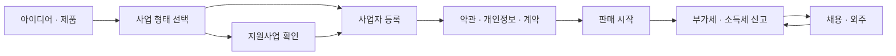

# 비즈니스 트랙 개요

> 이 문서는 일반 정보이며 법률·세무 자문이 아닙니다. 제도는 자주 바뀌므로 실행 전에 공식 출처나 세무사·변호사에게 확인하세요.

**기준일: 2026-09-28**

좋은 제품을 만들어도 사업의 형식이 틀리면 나중에 세금, 가산세, 계약 분쟁으로 비용을 치른다.

> 이 트랙의 목표는 **1인·소규모 소프트웨어 사업자가 "무엇을, 언제, 어디에" 신고·등록·보관해야 하는지 스스로 판단할 수 있는 지도**를 주는 것이다.

대상 독자:

- 앱·SaaS·웹 서비스를 혼자 또는 소수로 시작하려는 개발자
- 외주 개발을 하면서 자기 제품을 준비하는 프리랜서
- 회사를 세우기 전에 구조를 정하려는 Product Owner

## 네 개의 기둥

| 기둥 | 핵심 질문 | 문서 |
|---|---|---|
| 사업자 등록 | 어떤 형태로, 어떤 업종으로, 어디에 등록하는가 | 01, 02 |
| 법무 | 고객·직원·외주·오픈소스와의 관계를 무엇으로 정리하는가 | 03, 04, 05 |
| 세무 | 어떤 세금을 언제 신고하고, 어떤 증빙을 남기는가 | 06, 07, 08 |
| 공공 지원 | 어떤 지원사업을 어디서 찾는가 | 09 |



## 문서 지도

| 번호 | 문서 | 한 줄 요약 |
|---|---|---|
| 01 | 개인 · 법인 · 과세유형 | 개인사업자와 법인, 간이과세와 일반과세를 고르는 기준과 법인 설립 기본 |
| 02 | 사업자 등록 · 통신판매업 | 업종코드, 홈택스 등록, 사업장 주소, 사업용 계좌·카드, 통신판매업 신고 |
| 03 | 약관 · 개인정보 · 전자상거래 | 이용약관, 개인정보 처리방침, 청약철회와 구독 결제 규칙 |
| 04 | 계약 · 지식재산 · 오픈소스 | 용역계약, NDA, 상표 출원, 저작권 귀속, 오픈소스 라이선스 |
| 05 | 채용 · 4대보험 · 프리랜서 | 근로계약서, 4대보험, 3.3% 계약과 위장 프리랜서 위험 |
| 06 | 부가세 · 영세율 · 세금계산서 | 부가세 신고 시기, 해외 매출 영세율, 전자세금계산서 |
| 07 | 소득세 · 법인세 · 원천징수 · 장부 | 종합소득세·법인세, 원천징수, 지급명세서, 장부와 경비 |
| 08 | 창업 감면 · 세무 달력 · 세무사 | 창업중소기업 세액감면, 연간 세무 일정, 세무사가 필요한 시점 |
| 09 | 창업 지원사업 | K-Startup, 통합공고, 사업자 등록 시점과 지원 자격 |

## 읽는 순서

```text
아직 등록 전이다
→ 09 (지원사업 자격 먼저 확인)
→ 01 → 02
→ 03 → 04
→ 06 → 07 → 08
→ 사람을 쓰게 되면 05
```

순서가 중요한 이유: **예비창업자 대상 지원사업은 사업자 등록이 없어야 신청할 수 있는 경우가 있다.** 등록부터 하면 지원 자격을 잃을 수 있다.

## 이 트랙의 원칙

- 수치(기준금액, 세율, 기한)는 **공식 출처와 적용 연도를 함께** 적는다.
- 공식 출처에서 확인하지 못한 수치는 쓰지 않거나 **확인 필요**로 표시한다.
- 법령 조문은 개정되므로 링크를 따라가 **현행 조문**을 다시 확인한다.
- 판단이 갈리는 문제(해외 앱마켓 매출의 과세 구조 등)는 세무사 확인을 전제로 한다.

나쁜 예:

> 블로그에서 본 기준금액으로 간이과세를 신청했다.

좋은 예:

> 국세청 안내 페이지에서 올해 적용 기준금액과 적용 시작일을 확인하고, 신청 화면 캡처를 장부 폴더에 남겼다.

## 첫 해 핵심 체크리스트

- [ ] 지원사업 신청 계획이 있다면 등록 시점부터 결정했다
- [ ] 개인/법인, 간이/일반 중 하나를 근거를 갖고 골랐다
- [ ] 업종코드를 홈택스에서 조회해 실제 매출 구조와 맞췄다
- [ ] 통신판매업 신고 대상인지 확인했다
- [ ] 이용약관·개인정보 처리방침을 서비스 공개 전에 게시했다
- [ ] 사업용 계좌·카드를 분리했다
- [ ] 세무 달력을 캘린더에 등록했다

## 참고 자료

- [국세청 - 사업자등록 안내](https://www.nts.go.kr/nts/cm/cntnts/cntntsView.do?mi=2443&cntntsId=7776) (접근 2026-09-28)
- [국세청 - 부가가치세 기본정보](https://www.nts.go.kr/nts/cm/cntnts/cntntsView.do?cntntsId=7693&mi=2272) (접근 2026-09-28)
- [기업마당 - 2026년 예비창업패키지 모집 공고](https://www.bizinfo.go.kr/sii/siia/selectSIIA200Detail.do?pblancId=PBLN_000000000119019) (2026년 공고, 접근 2026-09-28)
- [국가법령정보센터](https://www.law.go.kr/) (접근 2026-09-28)
