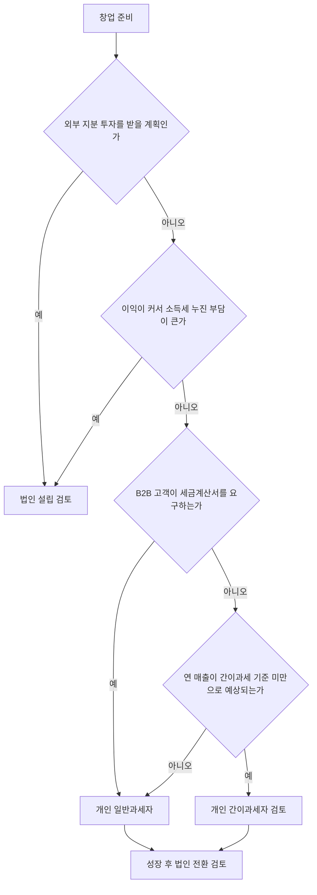

# 개인 · 법인 · 과세유형

> 이 문서는 일반 정보이며 법률·세무 자문이 아닙니다. 제도는 자주 바뀌므로 실행 전에 공식 출처나 세무사·변호사에게 확인하세요.

사업을 시작할 때 가장 먼저 정하는 것은 두 가지다.

1. **누가 사업의 주체인가** — 나 개인(개인사업자)인가, 별도의 법인인가
2. **부가가치세를 어떤 방식으로 내는가** — 간이과세자인가, 일반과세자인가

두 번째 선택은 개인사업자에게만 해당한다. 법인은 간이과세자가 될 수 없다.

## 개인사업자와 법인 비교

| 항목 | 개인사업자 | 법인(주식회사) |
|---|---|---|
| 설립 | 사업자 등록만으로 시작 | 정관 작성, 자본금 납입, 설립등기 후 사업자 등록 |
| 소득 과세 | 종합소득세 (국세청 안내 기준 세율 6%~45%) | 법인세 (2026년 1월 1일 이후 개시 사업연도: 10%·20%·22%·25%) |
| 돈의 소유 | 사업 계좌의 돈 = 대표자의 돈 | 법인의 돈. 대표가 가져가려면 급여·배당 등 근거가 필요 |
| 책임 | 대표자가 사업상 채무에 무한 책임 | 주주는 원칙적으로 출자액 한도 |
| 투자 유치 | 지분 투자 구조가 없음 | 신주 발행으로 지분 투자 가능 |
| 관리 비용 | 낮음 | 등기, 복식부기, 주총·이사회 기록 등 관리 비용 |

> 세율만 보고 법인을 고르면 안 된다. 법인의 돈을 개인이 쓰는 순간 **급여·배당에 대한 세금**이 다시 붙고, 근거 없이 인출하면 문제가 된다.

### 세금 비교 예시 (2026년 귀속, 설명용)

같은 금액의 **과세표준**에 세율표만 적용한 단순 예시다. 실제로는 개인과 법인의 과세표준이 같은 숫자가 되지 않고(대표 급여는 법인의 비용, 개인은 종합소득공제 등), 감면·세액공제·4대보험을 모두 빼고 계산했다.

| 과세표준 | 개인: 종합소득세 | 개인: 지방소득세 (10%) | 개인 합계 | 법인: 법인세 | 법인: 법인지방소득세 | 법인 합계 |
|---|---|---|---|---|---|---|
| 1억원 | 1,956만원 | 195.6만원 | 약 2,152만원 | 1,000만원 | 100만원 | 1,100만원 |
| 3억원 | 9,406만원 | 940.6만원 | 약 1억 347만원 | 4,000만원 | 400만원 | 4,400만원 |

계산 근거:

- 개인 종합소득세 = 과세표준 × 세율 − 누진공제 (국세청 종합소득세 세율표). 1억원은 8,800만원 초과~1억5천만원 이하 구간(35%, 누진공제 1,544만원): 1억 × 35% − 1,544만 = 1,956만원. 3억원은 1억5천만원 초과~3억원 이하 구간(38%, 누진공제 1,994만원): 3억 × 38% − 1,994만 = 9,406만원.
- 개인지방소득세는 종합소득세 산출세액의 10% 수준으로 계산했다 (지방소득세 세율표가 국세의 1/10 구조).
- 법인세 (2026년 1월 1일 이후 개시 사업연도, 국세청): 2억원 이하 10%, 2억원 초과분 20%. 3억원 = 2억 × 10% + 1억 × 20% = 4,000만원.
- 법인지방소득세는 2026년 1월 1일 이후 개시 사업연도부터 전 구간 0.1%p 올라 1%·2%·2.2%·2.5%가 되었다 (2026년 지방세 개정, 지자체 안내). 3억원 = 2억 × 1% + 1억 × 2% = 400만원.

읽는 법:

- 위 표의 법인 합계는 **이익을 법인 안에 남겨 둘 때**의 세금이다. 그 돈을 대표가 가져가면 급여는 **근로소득세와 4대보험(법인·대표 양쪽 부담)**, 배당은 **배당소득세**가 추가로 붙는다.
- 그래서 법인이 유리한 경우는 주로 **이익을 재투자·유보할 여력이 클 때**다. 번 돈을 매년 거의 다 생활비로 가져가야 한다면 차이가 크게 줄거나 뒤집힐 수 있다.
- 실제 판단은 대표 급여 수준, 배당 계획, 창업 감면(08 문서)을 넣어 세무사와 계산한다.

## 선택 흐름



## 간이과세자와 일반과세자

| 항목 | 간이과세자 | 일반과세자 |
|---|---|---|
| 기준 | 직전 연도 공급대가 1억400만원 미만 개인 (2024년 7월 1일 이후 적용 기준) | 그 외 개인, 모든 법인 |
| 부가세 납부 면제 | 해당 과세기간 공급대가 4,800만원 미만이면 납부의무 면제 (2021년 이후 개시 과세기간부터) | 없음 |
| 신고 횟수 | 연 1회 확정신고(1월). 단, 1~6월에 세금계산서를 발급했으면 7월 25일까지 예정신고 의무 (부가가치세법 제66조 제3항) | 연 2회 확정신고 (개인) |
| 세금계산서 | 직전 연도 공급대가 4,800만원 이상이면 발급 의무, 신규·4,800만원 미만은 영수증 | 발급 |
| 매입세액 | 세금계산서 등 수취 금액의 0.5% 공제 (2021년 7월 1일 이후 공급분) | 매입세액 전액 공제, 환급 가능 |

간이과세가 항상 유리하지는 않다.

- 초기 장비·외주 비용이 커서 **매입세액을 환급받고 싶다면** 일반과세자가 유리할 수 있다.
- 해외 매출이 많아 **영세율**이 적용되는 구조라면 환급이 생길 수 있는데, 간이과세자는 이 구조에서 불리할 수 있다. 06 문서를 함께 본다.
- 간이과세를 포기하면 **적용받으려는 달의 전달 마지막 날까지** 포기신고를 해야 하고, 이후 3년간 간이과세를 다시 적용받지 못한다 (부가가치세법 제70조).
  - 예외 (2024년 7월 1일 시행, 제70조 제4항·제5항): 포기 당시 신규 사업자이거나 직전 연도 공급대가가 4,800만원 미만이었던 개인사업자는, 직전 연도 공급대가가 **4,800만원 이상 1억400만원 미만**이면 3년이 지나기 전이라도 적용받으려는 과세기간 개시 10일 전까지 신고해 간이과세를 다시 적용받을 수 있다 (국세청 간이과세 Q&A).

### 전환 시점과 배제

| 상황 | 내용 (국세청 간이과세 Q&A·조문 기준) |
|---|---|
| 신규 사업자 | 첫 해 공급대가가 기준금액에 못 미칠 것으로 예상되면 **사업자등록 신청 때 간이과세 적용 여부를 함께 신고**한다 (부가가치세법 제61조) |
| 기준 초과 | 1년(1월~12월) 공급대가가 기준금액 이상이면 **다음 해 7월 1일**부터 일반과세자로 바뀐다. 관할 세무서의 과세유형 전환 통지를 확인한다 |
| 7월 1일 전환 직전 | 간이→일반으로 바뀌는 사업자는 1월 1일~6월 30일을 과세기간으로 **7월 25일까지** 신고·납부한다 |
| 금액과 무관한 배제 | 제조업·도매업 등 시행령 제109조 제2항의 배제 업종, 국세청장이 고시하는 **「간이과세 배제기준」**(지역·업종, 2024년 7월 1일 시행 기준 고시)에 해당하면 매출이 적어도 간이과세를 받을 수 없다 |
| 부동산임대업·과세유흥장소 | 배제 업종은 아니지만 기준금액이 **4,800만원**으로 따로 적용된다 |

- 소프트웨어 개발·공급업이 배제기준에 해당하는지는 사업장 지역과 겸영 업종에 따라 달라질 수 있으므로 등록 전에 홈택스나 세무서에서 확인한다.

## 법인 설립 기본

주식회사는 다음 순서로 만든다.

```text
상호·목적·본점 결정
→ 정관 작성
→ 자본금 납입 (잔고증명)
→ 등록면허세 신고·납부
→ 설립등기 (인터넷등기소 또는 온라인 법인설립시스템)
→ 법인 사업자 등록
→ 4대보험 사업장 신고 (직원·대표 보수 발생 시)
```

알아둘 점:

- **최저자본금 제도는 폐지**되었다 (2009년 5월 28일 공포된 상법 개정, 법률 제9746호. 법 전체는 2010년 5월 29일 시행이지만 제329조 개정은 공포일 시행, 부칙 단서). 액면주식 1주의 금액은 100원 이상 (상법 제329조).
- **정관 공증**: 원칙적으로 공증인 인증이 필요하지만, 자본금 총액 10억원 미만 회사를 발기설립하는 경우 발기인의 기명날인 또는 서명으로 효력이 생긴다 (상법 제292조).
- 자본금 10억원 미만이면 중소벤처기업부 **온라인 법인설립시스템**으로 온라인 설립이 가능하다. 다만 표준 정관만 제공되므로 주식 관련 특약이 필요하면 별도로 작성한다.
- 본점을 어디에 두느냐에 따라 등록면허세 부담과 창업 감면(08 문서)이 달라질 수 있다. 금액은 관할 지자체와 법무사에게 확인한다.

나쁜 예:

> 자본금 100만원으로 설립하고 첫 달부터 대표가 법인 카드로 개인 비용을 결제했다.

좋은 예:

> 운영비 6개월분을 자본금으로 잡고, 대표 보수를 정관·주총 결의로 정한 뒤 급여로 지급했다.

## 개인에서 법인으로 전환

처음에는 개인으로 시작하고, 이익이 안정되면 법인으로 옮기는 경우가 많다.

전환을 검토할 신호:

- 과세표준이 누진세율 35% 구간(8,800만원 초과)에 들어서고, 그 이익을 당장 생활비로 다 쓰지 않아도 될 때 (위 세금 비교 예시)
- 수입금액이 **복식부기의무** 기준(정보통신업 등 1억5천만원)을 넘어 장부 부담이 법인과 비슷해질 때 (07 문서)
- 수입금액이 **성실신고확인** 기준(정보통신업 등 7억5천만원)에 가까워질 때 (07 문서)
- 외부 투자 유치나 스톡옵션이 필요해질 때

| 방법 | 개요 |
|---|---|
| 신규 법인 설립 후 사업 이전 | 새 법인을 만들고 개인 사업은 폐업. 계약·계정 이전이 필요 |
| 사업양수도 | 개인 사업 전체를 법인에 양도 |
| 현물출자 | 개인 사업의 자산을 법인에 출자 |

사업용고정자산을 현물출자나 사업양수도로 넘기면 요건을 갖춘 경우 **양도소득세 이월과세**를 받을 수 있다 (조세특례제한법 제32조). 순자산가액 요건과 신청 기한이 있으므로 전환 전에 세무사와 설계한다.

전환 시 점검할 것:

- [ ] 앱스토어·결제대행사·도메인 계정의 명의 이전 절차
- [ ] 진행 중인 고객 계약의 양도 동의
- [ ] 상표·저작권 등 지식재산의 권리자 변경
- [ ] 창업 감면 대상 여부 (전환은 "창업"으로 보지 않을 수 있음)

## 참고 자료

- [국세청 - 부가가치세 기본정보](https://www.nts.go.kr/nts/cm/cntnts/cntntsView.do?cntntsId=7693&mi=2272) (접근 2026-09-28)
- [국세상담센터 - 간이과세 자주묻는 Q&A](https://call.nts.go.kr/call/qna/selectQnaInfo.do?mi=1329&ctgId=CTG11937) (접근 2026-09-28)
- [국세청 - 법인세 세율 (2026년 이후)](https://www.nts.go.kr/nts/cm/cntnts/cntntsView.do?cntntsId=7746&mi=2372) (접근 2026-09-28)
- [국세청 - 종합소득세 세율](https://www.nts.go.kr/nts/cm/cntnts/cntntsView.do?mi=2227&cntntsId=7667) (접근 2026-09-28)
- [안양시 - 2026년 달라지는 지방세 (법인지방소득세율 0.1%p 인상)](https://www.anyang.go.kr/main/contents.do?key=482) (2026년 시행, 접근 2026-09-28)
- [국세청 - 부가가치세 신고납부기한 (간이과세자 예정신고)](https://www.nts.go.kr/nts/cm/cntnts/cntntsView.do?mi=2273&cntntsId=7694) (접근 2026-09-28)
- [국가법령정보센터 - 부가가치세법 시행령 제109조 간이과세의 적용 범위](https://www.law.go.kr/LSW/lsLawLinkInfo.do?lsJoLnkSeq=1015986155&chrClsCd=010202&ancYnChk=) (접근 2026-09-28)
- [국가법령정보센터 - 간이과세 배제기준 (국세청 고시)](https://law.go.kr/LSW/admRulLsInfoP.do?admRulSeq=2100000231706) (접근 2026-09-28)
- [국가법령정보센터 - 부가가치세법 제61조 간이과세의 적용 범위](https://www.law.go.kr/LSW//lsLawLinkInfo.do?lsJoLnkSeq=1000920535&lsId=001571&chrClsCd=010202&print=print) (접근 2026-09-28)
- [국가법령정보센터 - 상법 제292조 정관의 효력발생](https://www.law.go.kr/LSW/lsLawLinkInfo.do?chrClsCd=010202&lsJoLnkSeq=900729564) (접근 2026-09-28)
- [찾기쉬운 생활법령정보 - 주식회사의 개념](https://easylaw.go.kr/CSP/CnpClsMain.laf?popMenu=ov&csmSeq=736&ccfNo=1&cciNo=1&cnpClsNo=2) (접근 2026-09-28)
- [찾기쉬운 생활법령정보 - 개인사업자의 법인전환](https://easylaw.go.kr/CSP/CnpClsMain.laf?popMenu=ov&csmSeq=632&ccfNo=3&cciNo=1&cnpClsNo=2) (접근 2026-09-28)
- [온라인 법인설립시스템 - 설립 유의사항](https://www.startbiz.go.kr/contents/intr/startBizAtpn.do) (접근 2026-09-28)
