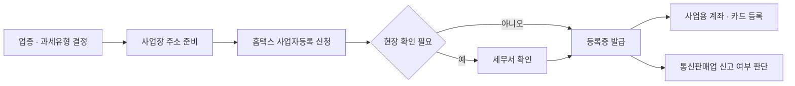
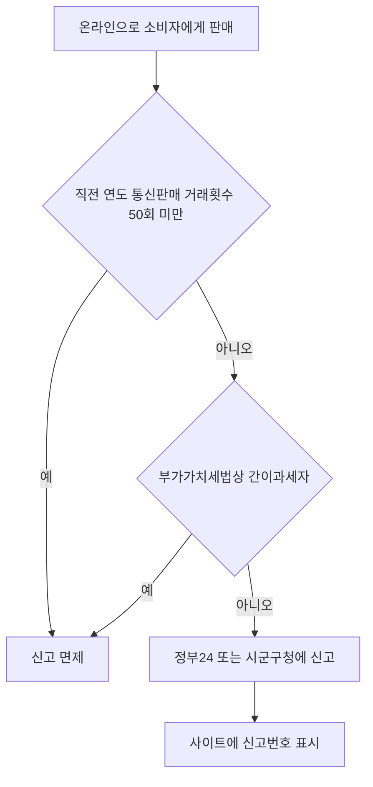

# 사업자 등록 · 통신판매업

> 이 문서는 일반 정보이며 법률·세무 자문이 아닙니다. 제도는 자주 바뀌므로 실행 전에 공식 출처나 세무사·변호사에게 확인하세요.

사업자 등록은 "세무서에 내가 이런 사업을 한다"고 알리는 절차다. 소프트웨어 사업은 설비가 거의 없어서 등록을 미루기 쉽지만, 기한과 불이익이 있다.

## 언제 등록하는가

- 사업자는 **사업 개시일부터 20일 이내**에 사업장 관할 세무서장에게 등록을 신청해야 한다 (부가가치세법 제8조).
- 사업 개시일 **이전에도** 등록할 수 있다.
- 등록 전에 산 장비·외주 비용의 매입세액은, 공급시기가 속하는 과세기간이 끝난 후 **20일 이내**에 등록을 신청한 경우에 한해 공제 대상이 될 수 있다 (부가가치세법 제39조).

> 예외: 예비창업자 대상 지원사업을 준비 중이라면 등록 시점을 먼저 정한다. 09 문서를 본다.

## 업종코드 고르기

업종코드는 경비율, 감면 대상 여부, 통계 분류에 영향을 준다. **실제 매출이 어떻게 생기는지**를 기준으로 고른다.

| 매출 구조 | 검토할 업종 (예시) | 비고 |
|---|---|---|
| 앱·SaaS를 직접 개발해 판매·구독 | 응용 소프트웨어 개발 및 공급업 | 코드 722000으로 알려져 있음. 홈택스에서 확인 필요 |
| 고객 의뢰로 개발하는 외주 | 컴퓨터 프로그래밍 서비스업 등 | 홈택스에서 확인 필요 |
| 온라인으로 상품을 판매 | 전자상거래 소매업 (525101) | 국세청 온라인 업종 안내 |
| 영상 플랫폼 수익 | 미디어 콘텐츠 창작업 (921505), 1인 미디어 콘텐츠 창작자 (940306) | 인적·물적 시설 여부로 과세/면세가 갈림 |

- 주업종 1개와 부업종 여러 개를 함께 등록할 수 있다.
- 업종코드와 명칭은 해마다 바뀔 수 있으므로 **홈택스 업종코드 목록조회**에서 최신 코드를 확인한다.

업종에 따라 **현금영수증 의무**가 달라진다.

- **현금영수증 의무발행업종**: 전자상거래 소매업은 의무발행업종에 들어간다 (국세청 안내상 "의무업종에서 공급하는 재화·용역을 판매하는 경우"로 한정). 의무발행업종은 건당 10만원 이상(부가세 포함)을 현금(계좌이체 포함)으로 받으면 **소비자가 요청하지 않아도** 현금영수증을 발급해야 하고, 미발급 금액의 20% 가산세가 있다 (국세청 현금영수증 발급의무 안내; 거래일부터 10일 이내 자진 발급 시 50% 감면). 의무발행업종 목록은 해마다 추가되므로 (2026년에도 확대) 최신 목록을 확인한다.
- **현금영수증가맹점 가입 의무**: 소비자상대업종으로서 직전 과세기간 수입금액이 **2,400만원 이상**이면 요건에 해당한 날이 속한 달의 말일부터 3개월 이내(연 단위 판단이면 **3월 31일**까지) 가맹점에 가입해야 한다. 의무발행업종은 수입금액과 관계없이 60일 이내 가입 (소득세법 제162조의3, 시행령 제210조의3). 미가입 시 가산세가 있다.
- 소프트웨어 개발·공급업이 소비자상대업종에 해당하는지는 **소득세법 시행령 업종별 별표에서 확인**한다.

## 등록 절차

| 채널 | 용도 |
|---|---|
| 홈택스 / 손택스 | 개인·법인 사업자 등록 신청, 정정, 휴·폐업 |
| 정부24 | 개인사업자 등록 신청, 통신판매업 신고 |
| 인터넷등기소 / 온라인 법인설립시스템 | 법인 설립등기 (법인은 등기 후 사업자 등록) |

국세청 안내 기준 처리기간은 **기본 2일**이고, 현장 확인이 필요하면 늘어날 수 있다.

## 사업장 주소

소프트웨어 사업은 자택을 사업장으로 쓰는 경우가 많다.

| 형태 | 확인할 것 |
|---|---|
| 자택 | 자가라면 비교적 단순. 임차 주택이면 임대차 계약상 사업자 등록이 가능한지 임대인과 확인 |
| 임차 사무실 | 임대차계약서 사본 제출. 건물 일부만 빌리면 해당 부분 도면 제출 |
| 공유 오피스 | 운영사와의 계약이 전대차인지, 사업자 등록용 주소 제공이 계약에 포함되는지 확인 |
| 주소만 빌리는 서비스 | 실제 사업 활동 장소와 달라 현장 확인·감면 요건에서 문제가 될 수 있음 |

나쁜 예:

> 지방 창업 감면을 받으려고 실제로 일하지 않는 지역의 주소만 빌려 등록했다.

좋은 예:

> 실제 근무하는 공유 오피스와 계약하고, 계약서에 사업자 등록 주소 사용이 명시된 것을 확인했다.

## 사업용 계좌와 카드

- **사업용 계좌**: 복식부기의무자는 해당 과세기간 개시일부터 6개월 이내에 사업용 계좌를 신고해야 한다. 사업 개시와 동시에 복식부기의무자가 되면 다음 과세기간 개시일부터 6개월 이내 (소득세법 제160조의5). 미신고·미사용 시 가산세와 감면 배제 불이익이 있다.
- 간편장부대상자라도 **처음부터 계좌를 분리**하면 장부 작성과 증빙이 쉬워진다.
- **사업용 신용카드**를 홈택스에 등록하면 매입 내역이 자동으로 모여 부가세·소득세 신고 때 쓸 수 있다.

## 통신판매업 신고

온라인으로 소비자에게 재화나 용역을 판매하면 **통신판매업자**가 될 수 있다 (전자상거래법 제12조).

- 면제 기준은 공정거래위원회 **「통신판매업 신고 면제 기준에 대한 고시」**에 있다 (2022년 4월 5일 시행 고시 기준). 청약철회된 거래는 거래횟수에 넣지 않는다.
- 면제 대상이어도 **신원정보 표시 등 전자상거래법상 의무는 그대로** 적용된다 (03 문서).
- 선불식 통신판매라면 구매안전서비스 이용확인증이 필요할 수 있다 (정부24 구비서류 안내).
- 앱마켓에만 앱을 올리는 경우 신고 대상인지는 판매 구조에 따라 판단이 갈릴 수 있으므로 관할 시군구청에 확인한다.

## 등록 직후 체크리스트

- [ ] 사업자등록증의 업종·과세유형이 의도와 같은지 확인
- [ ] 사업용 계좌 분리, 사업용 카드 홈택스 등록
- [ ] 통신판매업 신고 대상 여부 판단, 대상이면 신고
- [ ] 앱스토어·결제대행사 계정에 사업자 정보 등록
- [ ] 전자세금계산서 발급용 인증서 준비 (06 문서)
- [ ] 첫 부가세 신고 달을 캘린더에 등록 (08 문서)

## 휴업 · 폐업

사업을 잠시 멈추거나 접을 때도 신고할 것이 있다. 등록만큼 기한이 중요하다.

| 할 일 | 기한·요점 | 근거 |
|---|---|---|
| 휴업·폐업 신고 | 홈택스·손택스 또는 세무서(정부24)에 사업자등록증을 첨부해 신고 | 부가가치세법 제8조, 정부24 휴업·폐업 신고 안내 |
| 잔존재화 간주공급 | 폐업 때 남아 있는 재화(매입세액을 공제받은 장비 등)는 자기에게 공급한 것으로 보아 부가세 과세 대상이 된다 | 부가가치세법 제10조 제6항 |
| 폐업 부가세 확정신고 | 과세기간 개시일부터 폐업일까지 실적과 잔존재화를 **폐업일이 속한 달의 다음 달 25일**까지 신고·납부 | 부가가치세법 제49조, 찾기쉬운 생활법령정보 |
| 종합소득세 | 폐업한 해의 소득도 **다음 해 5월**에 다른 소득과 합산해 신고 | 소득세법 (국세청 종합소득세 신고 안내) |
| 통신판매업 폐업신고 | 통신판매업 신고를 했다면 시군구(정부24)에 휴업·폐업 신고 | 전자상거래법, 정부24 |
| 4대보험 사업장 탈퇴(소멸) 신고 | 직원이 있었다면 가입자 상실신고와 사업장 탈퇴신고. 건강보험은 사유 발생 후 **14일 이내** 통보. 국민연금 사업장 탈퇴신고·자격상실신고는 사유 발생일이 속한 달의 **다음 달 15일까지**이며, 사업장 탈퇴 시 가입자 자격이 함께 상실 처리된다 | 정부24 건강보험 사업장 탈퇴신고, 국민건강보험 EDI 안내, 국민연금공단 사업장 실무안내 |
| 원천세·지급명세서 | 폐업일까지 지급한 급여·사업소득의 원천세와 지급명세서 정리 | 07 문서 |

- 폐업 후 **같은 종류의 사업을 다시 시작**하면 창업중소기업 세액감면의 "창업"으로 보지 않는다 (조세특례제한법 제6조 제10항, 08 문서). 잠시 쉬려는 것이면 폐업 대신 휴업을 검토한다.
- 앱스토어·결제대행사 계정, 사업용 계좌·카드, 도메인 명의를 폐업 전에 정리한다.

## 참고 자료

- [국가법령정보센터 - 부가가치세법 제8조 사업자등록](https://www.law.go.kr/LSW/lsLawLinkInfo.do?lsJoLnkSeq=1011773243&chrClsCd=010202&ancYnChk=) (접근 2026-09-28)
- [국세청 - 사업자등록 신청](https://www.nts.go.kr/nts/cm/cntnts/cntntsView.do?mi=2444&cntntsId=7777) (접근 2026-09-28)
- [국세청 - 사업자등록 제출서류 및 교부](https://www.nts.go.kr/nts/ad/cntnts/cntntsView.do?mi=2445) (접근 2026-09-28)
- [국세청 - 1인미디어 창작자 세무 안내](https://www.nts.go.kr/nts/cm/cntnts/cntntsView.do?mi=2480&cntntsId=7802) (접근 2026-09-28)
- [국세청 - SNS마켓 사업자 세무 안내](https://www.nts.go.kr/nts/cm/cntnts/cntntsView.do?mi=2483&cntntsId=7804) (접근 2026-09-28)
- [국세상담센터 - 사업용 계좌 Q&A](https://call.nts.go.kr/call/qna/selectQnaInfo.do?mi=1441&ctgId=CTG11781) (접근 2026-09-28)
- [정부24 - 통신판매업 신고](https://www.gov.kr/mw/AA020InfoCappView.do?CappBizCD=11300000006) (접근 2026-09-28)
- [국가법령정보센터 - 통신판매업 신고 면제 기준에 대한 고시](https://www.law.go.kr/admRulLsInfoP.do?admRulSeq=2100000191541) (접근 2026-09-28)
- [홈택스 - 업종코드 목록조회](https://mob.tbht.hometax.go.kr/jsonAction.do?actionId=UTBABAAB78F001) (접근 2026-09-28)
- [국세청 - 현금영수증 발급의무](https://www.nts.go.kr/nts/cm/cntnts/cntntsView.do?mi=2471&cntntsId=7796) (접근 2026-09-28)
- [국세청 - 현금영수증 가맹점 가입](https://www.nts.go.kr/nts/cm/cntnts/cntntsView.do?mi=2470&cntntsId=7795) (접근 2026-09-28)
- [국가법령정보센터 - 소득세법 제162조의3 현금영수증가맹점 가입·발급의무 등](https://www.law.go.kr/LSW//lsLawLinkInfo.do?chrClsCd=010202&lsJoLnkSeq=900636995&lsId=001565&print=print) (접근 2026-09-28)
- [대한민국 정책브리핑 - 2026년부터 확대되는 현금영수증 의무발행업종](https://www.korea.kr/news/policyNewsView.do?newsId=148956966) (접근 2026-09-28)
- [정부24 - 사업자의 휴업(폐업)신고](https://www.gov.kr/mw/AA020InfoCappView.do?CappBizCD=12100000078) (접근 2026-09-28)
- [찾기쉬운 생활법령정보 - 인터넷쇼핑몰 창업자 휴업·폐업·영업재개신고](https://easylaw.go.kr/CSP/CnpClsMain.laf?popMenu=ov&csmSeq=25&ccfNo=2&cciNo=2&cnpClsNo=2) (접근 2026-09-28)
- [찾기쉬운 생활법령정보 - 사업자 폐업신고 (폐업 부가세 확정신고)](https://easylaw.go.kr/CSP/CnpClsMain.laf?popMenu=ov&csmSeq=534&ccfNo=5&cciNo=1&cnpClsNo=2) (접근 2026-09-28)
- [정부24 - 통신판매업 휴업·폐업·영업재개 신고](https://www.gov.kr/mw/AA020InfoCappView.do?HighCtgCD=A09006&CappBizCD=11300000008&tp_seq=03) (접근 2026-09-28)
- [정부24 - 건강보험 사업장 탈퇴신고](https://gov.kr/mw/AA020InfoCappView.do?CappBizCD=14600000324&HighCtgCD=A05007&tp_seq=) (접근 2026-09-28)
- [국민건강보험 EDI - 사업장 탈퇴(소멸) 신고](https://edi.nhis.or.kr/webedi/help/html/appli/ap_06.html) (접근 2026-09-28)
- [국민연금공단 - 사업장 실무안내 2026 (PDF)](https://edi.nps.or.kr/cm/main/guide/edi_workguide_new.pdf) (2026년판, 접근 2026-09-28)
- [국가법령정보센터 - 부가가치세법](https://law.go.kr/LSW/lsInfoP.do?lsiSeq=269797) (제10조 제6항 폐업 시 잔존재화, 접근 2026-09-28)
