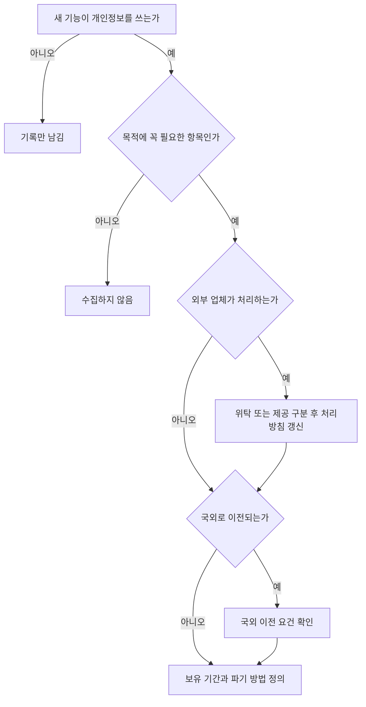

# 약관 · 개인정보 · 전자상거래

> 이 문서는 일반 정보이며 법률·세무 자문이 아닙니다. 제도는 자주 바뀌므로 실행 전에 공식 출처나 세무사·변호사에게 확인하세요.

온라인 서비스는 출시하는 순간 세 가지 법률 관계가 생긴다.

| 관계 | 주요 법 | 결과물 |
|---|---|---|
| 서비스 이용 조건 | 약관의 규제에 관한 법률 | 이용약관 |
| 개인정보 처리 | 개인정보 보호법 | 개인정보 처리방침, 동의 화면 |
| 온라인 판매·구독 | 전자상거래 등에서의 소비자보호에 관한 법률 | 신원정보 표시, 청약철회 안내, 결제 화면 |

## 이용약관

약관은 사업자가 여러 고객과 계약하기 위해 미리 만든 계약 내용이다.

- **명시·설명 의무**: 고객이 쉽게 알 수 있도록 한글로, 표준화된 용어로 작성하고, 중요한 내용은 부호·색채 등으로 명확히 표시한다. 계약 체결 때 약관 내용을 밝히고, 고객이 요구하면 사본을 준다 (약관규제법 제3조).
- 설명해야 하는 "중요한 내용"은 고객이 계약 여부나 대가를 결정하는 데 직접 영향을 주는 사항이다.
- 공정거래위원회 **표준약관**(예: 인터넷 사이버몰 이용표준약관)을 출발점으로 쓸 수 있다. 표준약관은 권장사항이다.

나쁜 예:

> 다른 서비스 약관을 복사해 회사 이름만 바꿨다. 환불 조항이 우리 결제 구조와 맞지 않는다.

좋은 예:

> 표준약관을 바탕으로 실제 요금제, 해지·환불 방식, 데이터 보관 기간을 반영하고 변경 이력을 남겼다.

## 개인정보 처리방침

개인정보처리자는 개인정보 처리방침을 정하고 정보주체가 쉽게 확인할 수 있게 공개해야 한다 (개인정보 보호법 제30조).

처리방침에 들어가는 대표 항목:

- 개인정보의 처리 목적
- 처리 및 보유 기간
- 제3자 제공 (해당하는 경우)
- 처리 위탁 (해당하는 경우)
- 파기 절차 및 방법
- 정보주체의 권리와 행사 방법
- 개인정보 보호책임자

개인정보보호위원회가 **「개인정보 처리방침 작성지침」**을 공개한다. 2025년 4월 개정본이 있으므로 최신본을 기준으로 작성한다.

## 개인정보 처리에서 자주 놓치는 것

| 상황 | 확인할 조문 | 요점 |
|---|---|---|
| 해외 클라우드·SaaS에 데이터 저장 | 제28조의8 국외 이전 | 별도 동의 등 법에 정한 요건 중 하나가 필요 |
| 만 14세 미만 이용자 | 제22조의2 아동의 개인정보 보호 | 법정대리인 동의와 동의 확인 |
| 책임자 지정 | 제31조 개인정보 보호책임자 | 원칙적으로 지정. 일정 기준 이하 사업자 예외 |
| 분석·광고 SDK | 제30조 처리방침, 위탁·제공 구분 | SDK가 무엇을 수집하는지 목록화 |

## 전자상거래법 의무

### 신원정보 표시

사이버몰 운영자는 상호, 대표자 성명, 영업소 주소, 전화번호, 전자우편주소, 사업자등록번호, 이용약관 등을 초기화면에 표시해야 한다 (전자상거래법 제10조). 통신판매업자는 광고할 때 통신판매업 신고번호 등 신원정보를 표시한다.

### 청약철회

- 소비자는 계약 내용 서면을 받은 날부터 **7일 이내**, 공급이 늦으면 공급받거나 공급이 시작된 날부터 7일 이내에 청약철회를 할 수 있다 (전자상거래법 제17조).
- **디지털콘텐츠**처럼 청약철회가 제한되는 경우, 사업자는 그 사실을 명확히 표시하고 **시험 사용 상품 제공** 등으로 권리 행사가 방해받지 않게 조치해야 한다.

### 구독 결제와 다크패턴

2024년 2월 13일 공포된 개정 전자상거래법이 **2025년 2월 14일부터 시행**되어 다크패턴 6개 유형을 직접 규율한다.

| 규율 대상 | 조문 | 구독형 SaaS에서의 의미 |
|---|---|---|
| 정기결제 대금 증액, 무료→유료 전환 | 제13조 제6항 | 시행령상 전환·증액 전 30일 이내에 소비자 동의를 받고 취소 방법을 고지 |
| 총비용이 아닌 일부 금액만 표시 | 제21조의2 제1항 제1호 | 요금제 화면에 실제 결제 총액 표시 |
| 특정 옵션 사전 선택 | 제21조의2 제1항 제2호 | 유료 옵션 기본 체크 금지 |
| 잘못된 계층구조 | 제21조의2 제1항 제3호 | "해지" 버튼만 흐리게 만드는 설계 금지 |
| 취소·탈퇴 방해 | 제21조의2 제1항 제4호 | 가입만큼 쉬운 해지 경로 |
| 반복 간섭 | 제21조의2 제1항 제5호 | 거절 후 반복 팝업 금지 |

나쁜 예:

> 무료 체험 종료 알림 없이 자동으로 연간 요금제로 전환했다.

좋은 예:

> 무료 체험 종료 전에 유료 전환 동의를 받고, 동의 화면에 해지 방법과 결제 금액을 함께 보여줬다.

## 출시 전 체크리스트

- [ ] 이용약관: 요금, 해지, 환불, 서비스 변경, 책임 제한 조항 검토
- [ ] 개인정보 처리방침: 실제 수집 항목·SDK·보관 위치와 일치
- [ ] 회원가입 동의 화면: 필수/선택 구분
- [ ] 초기화면 하단: 사업자 신원정보, 통신판매업 신고번호
- [ ] 결제 화면: 총액 표시, 청약철회 제한 안내
- [ ] 구독: 무료→유료 전환 동의 흐름, 해지 경로

## 참고 자료

- [국가법령정보센터 - 약관의 규제에 관한 법률](https://www.law.go.kr/LSW/lsInfoP.do?lsiSeq=203797) (접근 2026-09-28)
- [국가법령정보센터 - 개인정보 보호법 제30조](https://www.law.go.kr/LSW/lsLinkCommonInfo.do?lsJoLnkSeq=1033215151) (접근 2026-09-28)
- [개인정보 포털 - 개인정보 처리방침 작성지침 (2025.4.)](https://www.privacy.go.kr/front/bbs/bbsView.do?bbsNo=BBSMSTR_000000000049&bbscttNo=20806) (2025년 4월 발간, 접근 2026-09-28)
- [개인정보 포털 - 법정대리인 동의확인 의무](https://www.privacy.go.kr/front/contents/cntntsView.do?contsNo=94) (접근 2026-09-28)
- [국가법령정보센터 - 전자상거래 등에서의 소비자보호에 관한 법률](https://www.law.go.kr/lsInfoP.do?lsId=009318&ancYnChk=0) (접근 2026-09-28)
- [대한민국 정책브리핑 - 정기결제 대금 인상 또는 유료 전환 전 30일 이내 소비자 동의](https://www.korea.kr/news/policyNewsView.do?newsId=148939436) (접근 2026-09-28)
- [공정거래위원회 - 전자상거래 등에서의 소비자보호 지침 개정](https://www.ftc.go.kr/www/selectBbsNttView.do?key=12&bordCd=3&nttSn=46527) (접근 2026-09-28)
- [공정거래위원회 - 표준약관](https://www.ftc.go.kr/www/selectBbsNttView.do?pageUnit=10&pageIndex=1&searchCnd=all&key=202&bordCd=201&nttSn=11139) (접근 2026-09-28)
