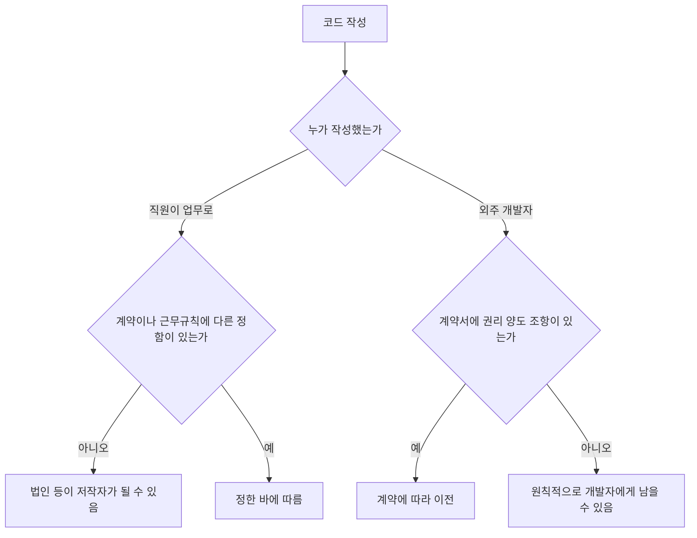

# 계약 · 지식재산 · 오픈소스

> 이 문서는 일반 정보이며 법률·세무 자문이 아닙니다. 제도는 자주 바뀌므로 실행 전에 공식 출처나 세무사·변호사에게 확인하세요.

소프트웨어 사업의 자산은 대부분 **코드, 이름, 데이터, 관계**다. 이 문서는 그 자산을 누가 갖는지 정하는 계약과 권리를 다룬다.

## 용역계약 기본

외주를 받거나 줄 때 최소한 다음을 문서로 남긴다.

| 항목 | 정할 내용 |
|---|---|
| 범위 | 기능 목록, 제외 범위, 변경 요청 절차 |
| 검수 | 검수 기준, 기간, 검수 간주 조건 |
| 대금 | 금액, 부가세 포함 여부, 지급 시기, 지연 시 처리 |
| 권리 귀속 | 결과물 저작권, 기존 코드·라이브러리의 권리 |
| 하자 보수 | 기간과 범위 |
| 비밀유지 | 대상 정보, 기간, 반환·폐기 |
| 해지 | 해지 사유, 해지 시 정산 |

과학기술정보통신부는 소프트웨어진흥법 제38조(공정계약의 원칙)에 근거해 **SW 분야 표준계약서 6종**(SW 사업자 간 4종, SW 종사자와 사업자 간 2종)을 2020년 12월 31일부터 보급했다. 초안을 쓸 때 출발점으로 쓸 수 있다.

나쁜 예:

> 메신저로 "앱 하나 500"이라고 합의하고 착수했다. 검수 기준이 없어 잔금 지급이 6개월 밀렸다.

좋은 예:

> 표준계약서를 바탕으로 기능 목록과 검수 기간을 부속서로 붙이고, 변경 요청은 별도 견적으로 처리한다고 적었다.

## NDA와 기술자료 보호

- 비밀유지계약서에는 **기술자료의 명칭·범위, 사용기간, 접근 인원, 목적 외 사용 금지, 위반 시 배상, 반환·폐기 방법**을 넣는다.
- 중소벤처기업부 등 공공기관이 **표준비밀유지계약서** 양식을 배포하므로 초안으로 쓸 수 있다.
- 거래 상대에게 핵심 소스코드를 넘겨야 한다면 **기술자료 임치제도**(대·중소기업·농어업협력재단)를 검토할 수 있다 (대·중소기업 상생협력 촉진에 관한 법률 제24조의2).

## 저작권: 코드는 누구의 것인가



- 업무상저작물은 요건을 갖추면 법인 등이 저작자가 된다 (저작권법 제9조). 컴퓨터프로그램은 "법인 명의 공표" 요건이 적용되지 않는다.
- 판례는 제9조를 **예외 규정으로 좁게 해석**하며, 외주(도급) 관계에 확장 적용하지 않는다. 외주 결과물의 권리는 **계약서에 명시**해야 한다.
- 권리를 넘기더라도 개발자가 기존에 가진 라이브러리·템플릿은 제외하는 경우가 많다. 그 범위를 목록으로 남긴다.

## 상표: 서비스 이름 지키기

- 2025년 10월 1일 특허청이 **지식재산처**로 승격 개편되었다. 출원 창구는 계속 **특허로**(patent.go.kr)다.
- 전자출원 전에 특허고객번호를 받고 인증서를 등록한다.
- 출원료 (지식재산처 안내 기준): 전자출원 1상품류 구분마다 52,000원, 지정상품이 10개를 넘으면 초과 1개마다 2,000원 가산. 고시된 상품명칭만으로 지정하면 1상품류마다 46,000원. 등록료와 감면은 별도 확인한다.
- 상표권 존속기간은 설정등록일부터 **10년**이고, 10년씩 갱신할 수 있다 (상표법 제83조).

상표 출원 전 확인:

- [ ] 키프리스 등에서 동일·유사 상표 검색
- [ ] 앱 이름, 도메인, SNS 계정명이 같은 방향인지
- [ ] 지정상품: 소프트웨어, SaaS 제공 서비스 등 실제 사업 범위
- [ ] 출원인 명의: 개인인지 법인인지 (법인 전환 시 이전 필요)

## 오픈소스 라이선스 준수

한국저작권위원회는 **OLIS**(오픈소스SW 라이선스 종합정보시스템)에서 라이선스 가이드, 비교표, 검사 도구를 제공한다. 가이드 5.0은 2025년 6월에 발표되었다.

| 유형 | 예 | 배포 시 핵심 의무 |
|---|---|---|
| 퍼미시브 | MIT, BSD, Apache-2.0 | 저작권·라이선스 고지 유지 (Apache-2.0은 NOTICE 등 추가 조건) |
| 약한 카피레프트 | LGPL, MPL | 해당 라이브러리·파일 수정분 공개 등 |
| 강한 카피레프트 | GPL, AGPL | 결합 저작물 소스 공개 의무 가능. AGPL은 네트워크 서비스 제공도 고려 |

```text
의존성 목록 추출 (SBOM)
→ 라이선스 식별
→ 배포 형태 확인 (앱 배포 / SaaS / 온프레미스)
→ 고지 파일 생성
→ 카피레프트 결합 여부 검토
→ 릴리스 체크리스트에 포함
```

라이선스 위반은 저작권 침해나 계약 위반 문제가 될 수 있다.

## 참고 자료

- [NIPA - SW종사자 표준계약서(6종) 활용 안내](https://www.nipa.kr/home/2-1/7817) (접근 2026-09-28)
- [과학기술정보통신부 - SW 분야 표준계약서 보도](https://www.msit.go.kr/bbs/view.do?sCode=user&mPid=122&mId=123&bbsSeqNo=96&nttSeqNo=3179216) (접근 2026-09-28)
- [중소벤처기업부 - 표준비밀유지계약서](https://mss.go.kr/site/smba/ex/bbs/View.do?cbIdx=81&bcIdx=1031902) (접근 2026-09-28)
- [중소기업 기술보호울타리 - 기술자료 임치](https://www.ultari.go.kr/portal/psi/techData.do) (접근 2026-09-28)
- [찾기쉬운 생활법령정보 - 저작자](https://easylaw.go.kr/CSP/CnpClsMain.laf?popMenu=ov&csmSeq=695&ccfNo=1&cciNo=1&cnpClsNo=2) (접근 2026-09-28)
- [한국저작권위원회 - 업무상저작물](https://www.copyright.or.kr/information-materials/dictionary/view.do?glossaryNo=400) (접근 2026-09-28)
- [지식재산처 - 상표 전자출원 절차 FAQ](https://kipo.go.kr/kcall/faqRead.do?curMenuCd=SCD0300093&pgmSeq=60&pgmId=PGM0000014&sysCd=60&urlDo=/cFaqChargeList.do) (접근 2026-09-28)
- [특허로 - 수수료 안내](https://www.patent.go.kr/smart/jsp/ka/menu/fee/main/FeeMain01.do) (접근 2026-09-28)
- [지식재산처 - 존속기간갱신등록](https://www.kipo.go.kr/ko/kpoContentView.do?menuCd=SCD0200209) (접근 2026-09-28)
- [지식재산처 - 주요연혁](https://www.kipo.go.kr/ko/kpoContentView.do?menuCd=SCD0200442) (접근 2026-09-28)
- [OLIS - 라이선스 가이드](https://www.olis.or.kr/license/licenseGuide.do) (접근 2026-09-28)
