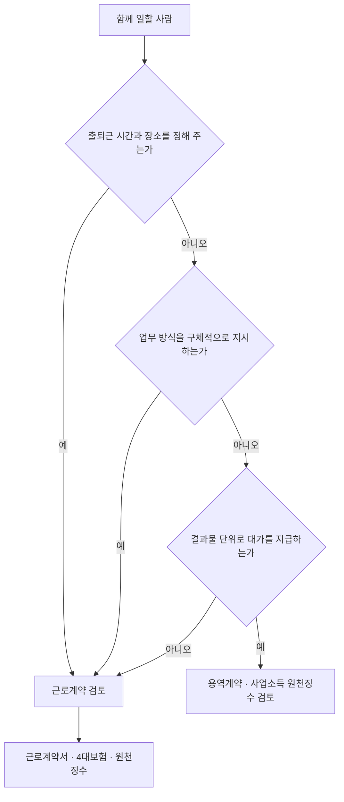

# 채용 · 4대보험 · 프리랜서

> 이 문서는 일반 정보이며 법률·세무 자문이 아닙니다. 제도는 자주 바뀌므로 실행 전에 공식 출처나 세무사·변호사에게 확인하세요.

첫 사람을 쓰는 순간 사업자는 **사용자** 또는 **발주자**가 된다. 어떤 형태로 함께 일하는지가 세금, 보험, 노동법 적용을 모두 바꾼다.

## 근로자인가, 프리랜서인가

계약서 제목이 아니라 **실제 일하는 방식**으로 판단한다. 대법원 판례가 제시하는 사용종속관계 판단 요소는 다음과 같다 (고용노동부 안내 요약).

| 요소 | 근로자 쪽으로 기우는 사정 |
|---|---|
| 업무 내용 | 사용자가 업무 내용을 정함 |
| 지휘·감독 | 업무 수행 과정에서 구체적·직접적 지휘를 받음 |
| 시간·장소 | 근무 시간과 장소가 지정되고 구속됨 |
| 대체성 | 스스로 제3자를 고용해 대신 일하게 할 수 없음 |
| 도구 | 비품·작업 도구를 사용자가 제공 |
| 보수 | 일의 결과가 아니라 근로 자체의 대가 |
| 계속성·전속성 | 한 사용자에게 계속적으로 전속 |

기본급 여부, 근로소득세 원천징수 여부, 4대보험 가입 여부는 사용자가 임의로 정할 수 있어서, **이것만으로 근로자성을 부정하지 않는다.**

## 가짜 3.3 계약의 위험

- "가짜 3.3 계약"은 실제로는 근로자인데 4대보험·노동법 적용을 피하려고 사업소득(3.3%)으로 처리하는 계약을 말한다.
- 고용노동부는 **2025년 12월 1일부터 2026년 3월 5일까지** 의심 사업장 108곳을 기획 감독했고, 72곳(67%)에서 1,070명이 이런 방식으로 처리된 사실을 적발했다고 발표했다.
- 근로자로 판단되면 미가입 기간의 보험료, 연차·퇴직금 등 노동법상 의무가 소급될 수 있다.

나쁜 예:

> 매일 10시 출근, 팀 슬랙 상주, 월 고정액 지급인데 "프리랜서 계약서"만 쓰고 3.3%를 뗐다.

좋은 예:

> 출퇴근 없이 기능 단위 결과물로 검수·지급하는 구조를 계약서와 실제 운영 모두에서 지켰다. 상시 근무가 필요해지자 근로계약으로 바꿨다.

## 근로계약서

- 사용자는 근로계약 체결 때 임금, 소정근로시간, 휴일, 연차 유급휴가 등을 명시하고, **임금의 구성항목·계산방법·지급방법 등이 명시된 서면을 교부**해야 한다 (근로기준법 제17조).
- 고용노동부 **표준근로계약서**를 출발점으로 쓴다.
- 서면 교부 위반은 벌칙 대상이다. 기간제·단시간 근로자는 별도 법률에 따른 과태료 규정도 있다. 금액은 현행 조문으로 확인한다.

## 4대보험

| 보험 | 2026년 요율 | 비고 |
|---|---|---|
| 국민연금 | 9.5% | 2026년부터 매년 0.5%p 인상해 13%까지 (보건복지부 안내). 근로자·사용자 절반씩 |
| 건강보험 | 7.19% | 근로자·사용자 절반씩 |
| 장기요양보험 | 소득 대비 0.9448% | 보건복지부 2026년도 요율 발표 |
| 고용보험 | 실업급여 1.8% (근로자 0.9%, 사업주 0.9%) + 고용안정·직업능력개발사업 0.25%~0.85% (사업주만, 150인 미만 0.25%부터 규모별) | 고용보험 및 산업재해보상보험의 보험료징수 등에 관한 법률 시행령 제12조. 4대사회보험 정보연계센터 계산기로 확인 |
| 산재보험 | 업종별 고시 | 매년 말 고시되어 다음 해 적용 |

- 사람을 고용하면 **사업장 성립신고**와 **근로자 자격취득신고**를 한다. 보험마다 기한이 다르므로 4대사회보험 정보연계센터(4insure.or.kr)에서 확인하고 EDI로 신고한다.
- 2027년부터 실업급여 보험료율을 2.0%(근로자·사업주 각 1.0%)로 올리는 정부 개편안이 2026년 9월 고용보험위원회에서 심의되었다는 **언론 보도**가 있다. 시행령 개정 전이므로 확정된 요율이 아니다 (미확인).

### 대표자 본인은?

| 구분 | 국민연금·건강보험 | 고용보험 | 산재보험 |
|---|---|---|---|
| 개인사업자, 근로자 1명 이상 | 사용자 본인도 **사업장(직장)가입자** | 사업주 본인은 원칙적으로 적용 제외. 근로자 50명 미만이면 **자영업자 고용보험 임의가입** 가능 | 사업주 본인은 원칙적으로 적용 제외. 근로자 300명 미만이면 **중소기업 사업주 산재보험 임의가입** 가능 |
| 개인사업자, 근로자 없음 | **지역가입자** | 자영업자 고용보험 임의가입 가능 | 중소기업 사업주 산재보험 임의가입 가능 (업종 요건 확인) |
| 법인 대표이사 | 보수를 받으면 대표 1인만 있는 법인도 **사업장가입 대상**. 무보수면 무보수 확인 자료를 내고 지역가입 | 법인 대표이사는 근로자가 아니어서 원칙적으로 적용 제외. 자영업자 고용보험 임의가입 대상에 법인 대표이사 포함 | 중소기업 사업주 산재보험 임의가입 가능 |

- 근거: 찾기쉬운 생활법령정보 「4대 사회보험 신고」, 국민연금공단 사업장가입자 안내, 근로복지공단 자영업자 고용보험·중소기업 사업주 산재보험 안내. 가입 요건과 보험료 산정 기준은 공단에 확인한다.
- 대표 보수를 정하면 법인세 비용, 근로소득세, 4대보험이 함께 움직이므로 01 문서의 세금 비교 예시와 같이 본다.

## 프리랜서(사업소득) 계약

- 인적용역 대가를 지급할 때 지급액의 **3.3%(지방소득세 포함)**를 원천징수한다.
- 원천징수한 세금은 **지급한 달의 다음 달 10일까지** 납부한다 (반기별 납부 승인 사업자는 예외).
- 사업소득 **간이지급명세서**를 매월 제출하면 연 1회 지급명세서 제출이 면제된다 (2023년 1월 1일 이후 지급분, 연말정산 사업소득 제외).
- 자세한 절차는 07 문서를 본다.

## 첫 채용 체크리스트

- [ ] 근로자인지 프리랜서인지 판단 근거를 기록
- [ ] 근로계약서 서면 작성·교부
- [ ] 4대보험 사업장 성립신고, 자격취득신고
- [ ] 급여 원천징수와 간이지급명세서 일정 등록
- [ ] 개인정보(주민등록번호 등) 보관 방법 정리
- [ ] 결과물 저작권 귀속 조항 확인 (04 문서)

## 참고 자료

- [고용노동부 - 가짜 3.3 위장 고용 감독 결과](https://www.moel.go.kr/news/enews/report/enewsView.do?news_seq=19096) (접근 2026-09-28)
- [대한민국 정책브리핑 - 가짜 3.3 위장 고용 기획 감독](https://www.korea.kr/news/policyNewsView.do?newsId=148955889) (접근 2026-09-28)
- [국가법령정보센터 - 근로기준법 제17조](https://www.law.go.kr/lsLawLinkInfo.do?chrClsCd=010201&lsJoLnkSeq=1015677481) (접근 2026-09-28)
- [국민연금공단 - 연금보험료](https://www.nps.or.kr/pnsinfo/ntpsklg/getOHAF0038M0.do) (접근 2026-09-28)
- [국민건강보험 EDI - 2026년도 보험료율 인상 안내](https://edi.nhis.or.kr/portal/images/popup/20251204_pop01longdesc.html) (2025년 12월 게시, 접근 2026-09-28)
- [보건복지부 - 2026년도 장기요양보험료율](https://www.mohw.go.kr/board.es?mid=a10503010100&bid=0027&act=view&list_no=1487817) (접근 2026-09-28)
- [4대사회보험 정보연계센터 - 보험료 모의계산](https://www.4insure.or.kr/pbiz/ntcn/inscSmlCalcView.do) (접근 2026-09-28)
- [찾기쉬운 생활법령정보 - 4대 사회보험 신고](https://easylaw.go.kr/CSP/CnpClsMain.laf?popMenu=ov&csmSeq=632&ccfNo=3&cciNo=4&cnpClsNo=1) (접근 2026-09-28)
- [국가법령정보센터 - 고용보험 및 산업재해보상보험의 보험료징수 등에 관한 법률 시행령 제12조 (고용보험료율)](http://www.law.go.kr/%EB%B2%95%EB%A0%B9/%EA%B3%A0%EC%9A%A9%EB%B3%B4%ED%97%98%EB%B0%8F%EC%82%B0%EC%97%85%EC%9E%AC%ED%95%B4%EB%B3%B4%EC%83%81%EB%B3%B4%ED%97%98%EC%9D%98%EB%B3%B4%ED%97%98%EB%A3%8C%EC%A7%95%EC%88%98%EB%93%B1%EC%97%90%EA%B4%80%ED%95%9C%EB%B2%95%EB%A5%A0%EC%8B%9C%ED%96%89%EB%A0%B9/%EC%A0%9C12%EC%A1%B0) (접근 2026-09-28)
- [국민연금공단 - 사업장가입자](https://www.nps.or.kr/pnsinfo/ntpsklg/getOHAF0016M0.do) (접근 2026-09-28)
- [근로복지공단 - 자영업자 고용보험 가입대상](https://www.comwel.or.kr/comwel/paym/ownr/targ.jsp) (접근 2026-09-28)
- [찾기쉬운 생활법령정보 - 중소기업 사업주등에 대한 산재보험 특례](https://easylaw.go.kr/CSP/CnpClsMain.laf?popMenu=ov&csmSeq=570&ccfNo=2&cciNo=3&cnpClsNo=4) (접근 2026-09-28)
- [서울신문 - 내년부터 고용보험료율 1.8%→2.0%로 오른다 (언론 보도, 비공식)](https://www.seoul.co.kr/news/society/2026/09/01/20260901500315) (2026-09-01 보도, 접근 2026-09-28)
- [국세청 - 간이지급명세서 (거주자의 사업소득)](https://www.nts.go.kr/nts/cm/cntnts/cntntsView.do?mi=40349&cntntsId=238925) (접근 2026-09-28)
