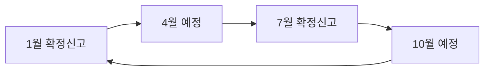

# 부가세 · 영세율 · 세금계산서

> 이 문서는 일반 정보이며 법률·세무 자문이 아닙니다. 제도는 자주 바뀌므로 실행 전에 공식 출처나 세무사·변호사에게 확인하세요.

부가가치세는 **매출에서 받은 세금에서 매입 때 낸 세금을 빼서** 내는 세금이다. 소프트웨어 사업자에게는 해외 매출(영세율)과 앱마켓 매출 처리 방식이 특히 중요하다.

## 과세기간과 신고 시기

- 부가가치세는 6개월 단위 과세기간으로 신고·납부하고, 각 과세기간을 3개월씩 나눠 예정신고 기간을 둔다.
- 확정신고는 **과세기간이 끝난 후 25일 이내**에 한다 (부가가치세법 제49조). 폐업하면 폐업일이 속한 달의 다음 달 25일 이내.

| 사업자 | 연간 흐름 (1월~12월 과세기간 기준) |
|---|---|
| 개인 일반과세자 | 1월 확정신고(전년 2기), 4월 예정고지 납부, 7월 확정신고(1기), 10월 예정고지 납부 |
| 법인 | 원칙적으로 1·4·7·10월 연 4회 신고. 직전 과세기간 공급가액 1억5천만원 미만 소규모 법인은 4·10월 예정고지 |
| 간이과세자 | 1월 확정신고(연 1회). 7월 예정부과 기간 |

- 개인 일반과세자는 예정신고 대신 **직전 과세기간 납부세액의 50%**를 4월·10월에 고지받아 낸다 (국세청 안내).



## 매출을 올바르게 잡기

- 앱마켓 매출은 **용역의 공급**으로 부가세 과세 대상이라는 것이 일반적인 설명이다.
- 조세심판원 사례를 소개한 보도와 세무 전문가 해설에 따르면, 매출은 **플랫폼 수수료를 빼기 전 결제총액**으로 신고하고 수수료는 비용으로 처리해야 한다는 판단이 있었다. 거래 구조에 따라 달라질 수 있으므로 세무사와 확인한다 (확인 필요).
- 앱마켓·결제대행사 정산서에서 **국가별 매출**을 분리해 보관한다. 국내·해외 구분이 세율을 가른다.

## 영세율: 해외 매출

영세율은 세율 0%를 적용하는 제도다. 매출세액은 0이지만 매입세액은 공제·환급받을 수 있다.

| 상황 | 검토할 근거 | 요점 |
|---|---|---|
| 국내사업장이 없는 외국법인·비거주자에게 용역 공급 | 부가가치세법 시행령 제33조 (외화 획득 용역 등) | 대가를 외국환은행을 통해 받는 등 요건 충족 필요 |
| 해외 소비자가 앱마켓에서 앱을 구매 | 세무 전문가 해설은 해외 소비자분 영세율, 국내 소비자분 10% 과세로 설명 | 공식 해석과 거래 구조 확인 필요 |
| 해외 결제대행사(Stripe 등)로 받는 SaaS 구독 | 공급받는 자와 대금 수령 경로에 따라 판단 | 세무사 확인 필요 |

- 영세율을 적용해 신고할 때는 국세청장이 정하는 **외화획득명세서, 영세율 증빙서류** 등을 제출해야 할 수 있다.
- 영세율 매출로 환급이 생기면 **조기환급**을 신청할 수 있는 경우가 있다.
- 간이과세자는 매입세액을 환급받는 구조가 아니다. 해외 매출 비중이 크고 매입이 많다면 일반과세자 선택을 검토한다 (01 문서).

나쁜 예:

> 앱마켓 입금액 전체를 한 줄로 "해외 매출"로 신고했다. 국내 소비자 매출이 섞여 있었다.

좋은 예:

> 매월 정산 리포트를 국가별로 내려받아 국내분과 해외분을 나누고, 영세율 증빙과 함께 보관했다.

## 세금계산서와 전자세금계산서

| 사업자 | 발급 의무 |
|---|---|
| 법인 | 전자세금계산서 의무 발급 |
| 개인 일반과세자 | 직전 연도 사업장별 공급가액(면세 포함) **8천만원 이상**이면 전자 발급 의무 (2024년 7월 1일부터 확대 적용) |
| 간이과세자 | 직전 연도 공급대가 **4,800만원 이상**이면 세금계산서 발급 의무 (2021년 7월 1일 이후 공급분부터). 신규·4,800만원 미만은 영수증 |

- 개인은 기준을 넘은 해의 **다음 해 제2기 과세기간 시작일(7월 1일)**부터 전자 발급 의무가 생긴다.
- 원칙: 공급할 때마다 공급시기를 작성일자로 발급.
- 예외: 거래처별로 한 달 공급가액을 합쳐 **그 달 말일자로, 다음 달 10일까지** 발급 가능 (10일이 토요일·공휴일이면 다음 영업일).
- 발급 기한과 국세청 전송 기한을 넘기면 가산세가 있다. 세부 요율은 국세청 "혜택과 가산세" 페이지를 확인한다.

```text
B2B 계약 체결
→ 공급시기 확인 (용역 완료일 / 대가 지급일 등)
→ 홈택스 또는 ERP로 전자세금계산서 발급
→ 국세청 전송 완료 확인 (전송 기한은 국세청 안내 확인)
→ 부가세 신고 때 합계표 자동 반영 확인
```

## 참고 자료

- [국세청 - 부가가치세 신고납부기한](https://www.nts.go.kr/nts/cm/cntnts/cntntsView.do?mi=2273&cntntsId=7694) (접근 2026-09-28)
- [국세청 - 법인 부가가치세 신고납부기한](https://www.nts.go.kr/nts/cm/cntnts/cntntsView.do?mi=2402&cntntsId=238927) (접근 2026-09-28)
- [국가법령정보센터 - 부가가치세법 제49조 확정신고와 납부](https://www.law.go.kr/LSW//lsLawLinkInfo.do?lsJoLnkSeq=1000920200&lsId=001571&chrClsCd=010202&print=print) (접근 2026-09-28)
- [국가법령정보센터 - 부가가치세법 시행령 제33조](https://www.law.go.kr/lsLawLinkInfo.do?lsJoLnkSeq=900327125&chrClsCd=010202) (접근 2026-09-28)
- [국세청 - 전자(세금)계산서 발급의무대상자](https://www.nts.go.kr/nts/cm/cntnts/cntntsView.do?mi=2461&cntntsId=7787) (접근 2026-09-28)
- [국세청 - 전자(세금)계산서 발급시기 및 발급·전송기한](https://www.nts.go.kr/nts/cm/cntnts/cntntsView.do?mi=2463&cntntsId=7789) (접근 2026-09-28)
- [국세청 - 전자(세금)계산서 혜택과 가산세](https://www.nts.go.kr/nts/cm/cntnts/cntntsView.do?mi=2464&cntntsId=7790) (접근 2026-09-28)
- [국세상담센터 - 부가가치세 신고 관련 주요 질의](https://call.nts.go.kr/call/qna/selectQnaInfo.do?mi=1329&ctgId=CTG11943) (접근 2026-09-28)
- [택스워치 - 앱 개발 매출은 플랫폼 수수료 포함해 신고해야 (언론 보도, 비공식)](https://www.taxwatch.co.kr/article/tax/2022/05/16/0002) (2022-05-16 보도, 접근 2026-09-28)
