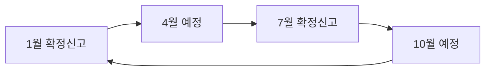

# 부가세 · 영세율 · 세금계산서

> 이 문서는 일반 정보이며 법률·세무 자문이 아닙니다. 제도는 자주 바뀌므로 실행 전에 공식 출처나 세무사·변호사에게 확인하세요.

부가가치세는 **매출에서 받은 세금에서 매입 때 낸 세금을 빼서** 내는 세금이다. 소프트웨어 사업자에게는 해외 매출(영세율)과 앱마켓 매출 처리 방식이 특히 중요하다.

## 과세기간과 신고 시기

- 부가가치세는 6개월 단위 과세기간으로 신고·납부하고, 각 과세기간을 3개월씩 나눠 예정신고 기간을 둔다.
- 확정신고는 **과세기간이 끝난 후 25일 이내**에 한다 (부가가치세법 제49조). 폐업하면 폐업일이 속한 달의 다음 달 25일 이내.

| 사업자 | 연간 흐름 (1월~12월 과세기간 기준) |
|---|---|
| 개인 일반과세자 | 1월 확정신고(전년 2기), 4월 예정고지 납부, 7월 확정신고(1기), 10월 예정고지 납부 |
| 법인 | 원칙적으로 1·4·7·10월 연 4회 신고. 직전 과세기간 공급가액 1억5천만원 미만 소규모 법인은 4·10월 예정고지 |
| 간이과세자 | 1월 확정신고(전년 1~12월분). 7월: 세무서가 1~6월분 예정부과세액을 고지해 7월 25일까지 납부. 단, **1~6월에 세금계산서를 발급한 간이과세자는 7월 25일까지 예정신고**를 해야 한다 (부가가치세법 제66조 제3항) |

- 개인 일반과세자는 예정신고 대신 **직전 과세기간 납부세액의 50%**를 4월·10월에 고지받아 낸다 (국세청 안내). 고지할 금액이 **50만원 미만**이면 예정고지를 하지 않고 확정신고 때 한꺼번에 낸다 (개인 일반과세자와 소규모 법인 공통).
- 간이과세자의 7월 예정신고 때는 매출·매입처별 세금계산서 합계표도 함께 낸다 (국세청 국세상담센터 Q&A). 7월 1일에 간이→일반으로 바뀌는 사업자도 1월 1일~6월 30일분을 7월 25일까지 신고·납부한다.



## 매출을 올바르게 잡기

- 앱마켓 매출은 **용역의 공급**으로 부가세 과세 대상이라는 것이 일반적인 설명이다.
- 조세심판원 사례를 소개한 보도와 세무 전문가 해설에 따르면, 매출은 **플랫폼 수수료를 빼기 전 결제총액**으로 신고하고 수수료는 비용으로 처리해야 한다는 판단이 있었다. 거래 구조에 따라 달라질 수 있으므로 세무사와 확인한다 (확인 필요).
- 앱마켓·결제대행사 정산서에서 **국가별 매출**을 분리해 보관한다. 국내·해외 구분이 세율을 가른다.
- **외화 환산**: 대가를 외화로 받으면 공급시기가 되기 전에 원화로 바꾼 경우 **바꾼 금액**을, 공급시기 이후에도 외화로 갖고 있거나 받는 경우 **공급시기의 기준환율 또는 재정환율**로 계산한 금액을 과세표준으로 한다 (부가가치세법 시행령 제59조). 앱마켓 정산에서 공급시기를 언제로 볼지는 세무사와 확인한다 (확인 필요).

## 영세율: 해외 매출

영세율은 세율 0%를 적용하는 제도다. 매출세액은 0이지만 매입세액은 공제·환급받을 수 있다.

| 상황 | 검토할 근거 | 요점 |
|---|---|---|
| 국내사업장이 없는 외국법인·비거주자에게 용역 공급 | 부가가치세법 시행령 제33조 (외화 획득 용역 등) | 대가를 외국환은행을 통해 받는 등 요건 충족 필요 |
| 해외 소비자가 앱마켓에서 앱을 구매 | 세무 전문가 해설은 해외 소비자분 영세율, 국내 소비자분 10% 과세로 설명 | 공식 해석과 거래 구조 확인 필요 |
| 해외 결제대행사(Stripe 등)로 받는 SaaS 구독 | 공급받는 자와 대금 수령 경로에 따라 판단 | 세무사 확인 필요 |

- 영세율을 적용해 신고할 때는 국세청장이 정하는 **외화획득명세서, 영세율 증빙서류** 등을 제출해야 할 수 있다.
- 영세율 매출로 환급이 생기면 **조기환급**을 신청할 수 있는 경우가 있다.
- 간이과세자는 매입세액을 환급받는 구조가 아니다. 해외 매출 비중이 크고 매입이 많다면 일반과세자 선택을 검토한다 (01 문서).

### 계산 예시: 1인 개발자의 한 과세기간 (설명용)

2026년 제1기(1월~6월) 개인 일반과세자 가정이다. 금액은 설명을 위해 만든 숫자이고, 앱마켓 매출의 과세 방식은 아래 "확인 필요"를 전제로 한다.

| 거래 | 금액 (공급가액) | 적용 | 세액 |
|---|---|---|---|
| 국내 B2B 고객 외주 개발 (전자세금계산서 발급) | 2,000만원 | 10% 과세 | 매출세액 200만원 |
| 앱마켓 매출 중 해외 소비자분 | 1,000만원 | 영세율 가정 (확인 필요) | 0원 |
| 앱마켓 매출 중 국내 소비자분 (결제총액 550만원, 부가세 포함 가정) | 500만원 | 10% 과세 가정 (확인 필요) | 매출세액 50만원 |
| 국내 업체에서 산 개발 장비 (세금계산서 수취) | 300만원 | 매입세액 공제 | 매입세액 30만원 |
| 해외 클라우드 인보이스 (부가세 없이 청구되었다고 가정) | 외화 결제액 | 공제할 매입세액 없음 | 0원 |

```text
매출세액 = 200만 + 0 + 50만 = 250만원
매입세액 = 30만원
납부세액 = 250만 − 30만 = 220만원 (전자신고세액공제 등 공제 전)
```

- 해외 매출 비중이 더 크고 장비 매입이 많으면 매입세액이 매출세액보다 커져 **환급**이 생길 수 있다.
- **앱마켓 매출 확인 필요**: 해외 앱마켓(Google, Apple 등)이 국내 소비자에게 부가세를 걷어 내는 구조인지, 개발자의 공급 상대방이 소비자인지 앱마켓 사업자인지에 따라 국내분의 과세 방식이 달라질 수 있다. 공식 해석을 찾지 못했으므로 신고 전에 반드시 세무사와 확인한다.
- **국외사업자 용역의 대리납부**: 국내사업장이 없는 외국법인·비거주자에게서 용역을 공급받으면 공급받는 자가 부가세를 징수해 납부하는 대리납부 제도가 있다. 다만 그 용역을 **과세사업에 쓰는 경우는 제외**된다 (부가가치세법 제52조, 매입세액 불공제 대상은 포함). 과세사업자인 개발자가 사업용으로 쓰는 해외 클라우드는 보통 대리납부 대상이 아니지만, 면세사업·개인 용도가 섞이면 확인한다.
- 해외 인보이스 비용은 부가세 공제는 없어도 소득세 경비로는 처리한다 (07 문서).

나쁜 예:

> 앱마켓 입금액 전체를 한 줄로 "해외 매출"로 신고했다. 국내 소비자 매출이 섞여 있었다.

좋은 예:

> 매월 정산 리포트를 국가별로 내려받아 국내분과 해외분을 나누고, 영세율 증빙과 함께 보관했다.

## 세금계산서와 전자세금계산서

| 사업자 | 발급 의무 |
|---|---|
| 법인 | 전자세금계산서 의무 발급 |
| 개인 일반과세자 | 직전 연도 사업장별 공급가액(면세 포함) **8천만원 이상**이면 전자 발급 의무 (2024년 7월 1일부터 확대 적용) |
| 간이과세자 | 직전 연도 공급대가 **4,800만원 이상**이면 세금계산서 발급 의무 (2021년 7월 1일 이후 공급분부터). 신규·4,800만원 미만은 영수증 |

- 개인은 기준을 넘은 해의 **다음 해 제2기 과세기간 시작일(7월 1일)**부터 전자 발급 의무가 생긴다.
- 원칙: 공급할 때마다 공급시기를 작성일자로 발급.
- 예외: 거래처별로 한 달 공급가액을 합쳐 **그 달 말일자로, 다음 달 10일까지** 발급 가능 (10일이 토요일·공휴일이면 다음 영업일).
- 발급 기한과 국세청 전송 기한을 넘기면 가산세가 있다. 대표적인 요율은 아래 표와 같다.

### 가산세 요율

| 가산세 | 요율 | 근거 | 이런 상황 |
|---|---|---|---|
| 사업자 미등록 | 사업 개시일~등록 신청 전날 공급가액의 1% (간이과세자는 공급대가의 0.5%) | 부가가치세법 제60조 제1항, 간이과세자는 제68조의2 | 3월에 외주 매출이 생겼는데 사업자 등록을 6월에야 신청했다 |
| 세금계산서 미발급 | 공급가액의 2% | 부가가치세법 제60조 제2항 | 발급 기한이 지나고 그 과세기간 확정신고 기한까지도 발급하지 않았다 |
| 세금계산서 지연발급 | 공급가액의 1% | 부가가치세법 제60조 제2항 | 3월 용역분을 4월 10일이 지나 발급했지만 7월 25일 전에는 발급했다 |
| 전자세금계산서 지연전송 | 공급가액의 0.3% | 부가가치세법 제60조 제2항 | 전송 기한은 넘겼지만 확정신고 기한까지는 전송했다 |
| 전자세금계산서 미전송 | 공급가액의 0.5% | 부가가치세법 제60조 제2항 | 확정신고 기한까지도 국세청에 전송하지 않았다 |
| 무신고 (일반) | 납부할 세액의 20% | 국세기본법 제47조의2 | 7월 확정신고를 잊고 넘겼다 (부정행위는 40%) |
| 납부지연 | 미납세액 × 경과일수 × 0.022% | 국세기본법 제47조의4 | 신고는 했지만 납부를 30일 늦게 했다 (2022년 2월 15일 이후 1일 10만분의 22) |

- 요율과 적용 순서(중복 적용 배제 등)는 국세청 "부가가치세 가산세" 페이지와 조문으로 확인한다. 간이과세자는 2021년 7월 1일 이후 공급분부터 세금계산서 관련 가산세가 적용된다.

```text
B2B 계약 체결
→ 공급시기 확인 (용역 완료일 / 대가 지급일 등)
→ 홈택스 또는 ERP로 전자세금계산서 발급
→ 국세청 전송 완료 확인 (전송 기한은 국세청 안내 확인)
→ 부가세 신고 때 합계표 자동 반영 확인
```

## 참고 자료

- [국세청 - 부가가치세 신고납부기한](https://www.nts.go.kr/nts/cm/cntnts/cntntsView.do?mi=2273&cntntsId=7694) (접근 2026-09-28)
- [국세청 - 법인 부가가치세 신고납부기한](https://www.nts.go.kr/nts/cm/cntnts/cntntsView.do?mi=2402&cntntsId=238927) (접근 2026-09-28)
- [국가법령정보센터 - 부가가치세법 제49조 확정신고와 납부](https://www.law.go.kr/LSW//lsLawLinkInfo.do?lsJoLnkSeq=1000920200&lsId=001571&chrClsCd=010202&print=print) (접근 2026-09-28)
- [국가법령정보센터 - 부가가치세법 시행령 제33조](https://www.law.go.kr/lsLawLinkInfo.do?lsJoLnkSeq=900327125&chrClsCd=010202) (접근 2026-09-28)
- [국세청 - 전자(세금)계산서 발급의무대상자](https://www.nts.go.kr/nts/cm/cntnts/cntntsView.do?mi=2461&cntntsId=7787) (접근 2026-09-28)
- [국세청 - 전자(세금)계산서 발급시기 및 발급·전송기한](https://www.nts.go.kr/nts/cm/cntnts/cntntsView.do?mi=2463&cntntsId=7789) (접근 2026-09-28)
- [국세청 - 전자(세금)계산서 혜택과 가산세](https://www.nts.go.kr/nts/cm/cntnts/cntntsView.do?mi=2464&cntntsId=7790) (접근 2026-09-28)
- [국세청 - 부가가치세 가산세 (개인)](https://nts.go.kr/nts/cm/cntnts/cntntsView.do?mi=2276&cntntsId=7697) (접근 2026-09-28)
- [국가법령정보센터 - 부가가치세법 제60조 가산세](https://www.law.go.kr/LSW//lsLawLinkInfo.do?lsJoLnkSeq=900317806&lsId=001571&chrClsCd=010202&print=print) (접근 2026-09-28)
- [국가법령정보센터 - 국세기본법 제47조의2 무신고가산세](https://www.law.go.kr/LSW/lsLawLinkInfo.do?chrClsCd=010202&lsId=001586&lsJoLnkSeq=1000819702&print=print) (접근 2026-09-28)
- [국세청 - 가산세·과태료 (납부지연가산세)](https://www.nts.go.kr/gmt/cm/cntnts/cntntsView.do?mi=41010&cntntsId=239059) (접근 2026-09-28)
- [국가법령정보센터 - 부가가치세법 시행령 제59조 외화의 환산](https://www.law.go.kr/LSW/lsLawLinkInfo.do?chrClsCd=010202&lsJoLnkSeq=900331724&lsId=003666&print=print) (접근 2026-09-28)
- [국가법령정보센터 - 부가가치세법 제52조 대리납부](https://www.law.go.kr/LSW//lsSideInfoP.do?lsiSeq=269797&joNo=0052&joBrNo=00&docCls=jo&urlMode=lsScJoRltInfoR) (접근 2026-09-28)
- [국세상담센터 - 간이과세 Q&A (예정신고)](https://call.nts.go.kr/call/qna/selectQnaInfo.do?mi=1329&ctgId=CTG11937) (접근 2026-09-28)
- [국세상담센터 - 부가가치세 신고 관련 주요 질의](https://call.nts.go.kr/call/qna/selectQnaInfo.do?mi=1329&ctgId=CTG11943) (접근 2026-09-28)
- [택스워치 - 앱 개발 매출은 플랫폼 수수료 포함해 신고해야 (언론 보도, 비공식)](https://www.taxwatch.co.kr/article/tax/2022/05/16/0002) (2022-05-16 보도, 접근 2026-09-28)
