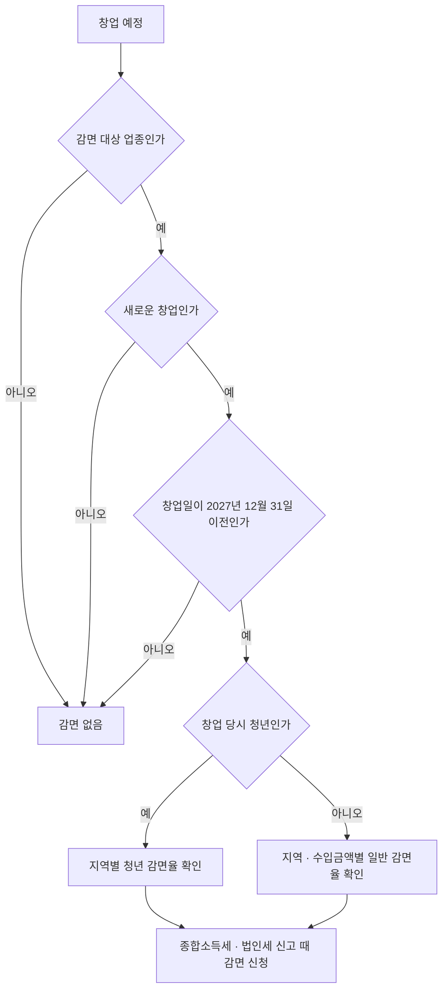

# 창업 감면 · 세무 달력 · 세무사

> 이 문서는 일반 정보이며 법률·세무 자문이 아닙니다. 제도는 자주 바뀌므로 실행 전에 공식 출처나 세무사·변호사에게 확인하세요.

창업 초기에 받을 수 있는 세제 혜택은 **창업 시점, 장소, 업종, 대표자 나이**로 결정된다. 등록한 뒤에는 바꾸기 어려운 조건이 많다.

## 창업중소기업 세액감면 (조세특례제한법 제6조)

| 항목 | 내용 (국가법령정보센터 조문 기준) |
|---|---|
| 대상 | **2027년 12월 31일 이전**에 법에서 정한 업종으로 창업한 중소기업 |
| 기간 | 최초로 소득이 발생한 과세연도와 그다음 과세연도 개시일부터 **4년 이내**에 끝나는 과세연도까지 (최대 5개 과세연도) |
| 대상 세금 | 해당 사업에서 생긴 소득에 대한 소득세 또는 법인세 |
| 청년 | 창업 당시 15세 이상 34세 이하 (병역 기간 산입 등 세부 규정은 조문 확인) |

### 2026년 1월 1일 이후 창업한 청년창업중소기업 감면율

| 창업 지역 | 감면율 |
|---|---|
| 수도권 외 지역, 또는 수도권 중 인구감소지역 | 100% |
| 수도권 (과밀억제권역과 인구감소지역 제외) | 75% |
| 수도권과밀억제권역 | 50% |

- 감면 한도: **각 과세연도에** 감면받는 소득세·법인세 합계가 **5억원을 초과하면 그 초과 금액은 감면하지 않는다** (조세특례제한법 제6조, 2026년 시행 조문). 한도는 전체 기간 누적이 아니라 과세연도마다 적용된다.
- 청년이 아닌 창업자, 소규모(수입금액 기준) 창업자에게도 지역별 감면율이 있다. 2026년 개정으로 구간이 바뀌었으므로 **조문 원문으로 확인**한다 (확인 필요).
- 2025년 12월 31일 이전 창업분은 종전 규정(과밀억제권역 안/밖 구분)이 적용된다.

### "창업"으로 보지 않는 경우

다음은 감면 대상 "창업"이 아닐 수 있다. 세부 요건은 조문과 세무사로 확인한다.

- 개인사업자를 법인으로 전환한 경우
- 폐업 후 같은 종류의 사업을 다시 시작한 경우 (조세특례제한법 제6조 제10항. 폐업 절차는 02 문서)
- 기존 사업을 승계·인수한 경우
- 업종만 추가하거나 바꾼 경우

나쁜 예:

> 5년 동안 운영하던 개인사업을 법인으로 바꾸고, 새 법인이 창업 감면을 받을 것이라고 가정했다.

좋은 예:

> 창업 전에 사업장 주소, 업종코드, 대표자 나이가 감면 요건에 맞는지 세무사와 확인하고 기록했다.

## 세무 달력 (12월 결산, 1월~12월 과세기간 기준)

| 월 | 개인 일반과세자 | 개인 간이과세자 | 법인 | 공통 (직원·프리랜서가 있을 때) |
|---|---|---|---|---|
| 1월 | 부가세 확정신고 (전년 2기) | 부가세 확정신고 (전년 1~12월, 1월 25일) | 부가세 확정신고 | 원천세, 간이지급명세서(근로, 전년 하반기 — 2026년 지급분까지) |
| 2월 | | | | 원천세, 연말정산 준비, 이자·배당·기타소득 지급명세서 (2월 말일. 일회성 원고료·강연료 등 기타소득 포함, 종교인소득 제외) |
| 3월 | | | 법인세 신고 (3월 31일) | 지급명세서 (3월 10일) |
| 4월 | 부가세 예정고지 납부 | | 부가세 예정신고 또는 예정고지 | 원천세 |
| 5월 | 종합소득세 신고 (5월 31일) | 종합소득세 신고 (5월 31일) | | 원천세 |
| 6월 | 성실신고확인 대상 종합소득세 (6월 30일) | | | 원천세 |
| 7월 | 부가세 확정신고 (1기) | 예정부과 고지분 납부 (7월 25일). **1~6월에 세금계산서를 발급했으면 7월 25일까지 예정신고** | 부가세 확정신고 | 원천세, 간이지급명세서(근로, 상반기 — 2026년 지급분까지) |
| 8월 | | | 법인세 중간예납 (8월 말) | 원천세 |
| 9월 | | | | 원천세 |
| 10월 | 부가세 예정고지 납부 | | 부가세 예정신고 또는 예정고지 | 원천세 |
| 11월 | 종합소득세 중간예납 (11월 말) | 종합소득세 중간예납 (11월 말) | | 원천세 |
| 12월 | 다음 해 계획 점검 | 다음 해 과세유형(7월 1일 전환 여부) 점검 | | 원천세 |

- 원천세는 매월 다음 달 10일(반기 납부 승인 시 1월·7월 10일), 사업소득 간이지급명세서는 매월 제출이다.
- 간이과세자의 예정신고 의무는 부가가치세법 제66조 제3항에 근거한다. 세금계산서를 발급하지 않은 간이과세자는 7월에 고지된 금액만 낸다 (06 문서).
- 근로소득 간이지급명세서는 2027년 1월 1일 지급분부터 매월 제출로 바뀐다. 유예와 가산세 면제는 「소득세 · 법인세 · 원천징수 · 장부」.
- 기한이 토요일·공휴일이면 다음 영업일로 미뤄진다. 매년 **국세청 세무일정**에서 실제 날짜를 확인한다.

## 세무사가 필요한 시점

| 신호 | 이유 |
|---|---|
| 법인 설립 또는 법인 전환을 검토 | 설계 단계에서 세금이 결정됨 |
| 해외 매출 비중이 커짐 | 영세율 요건과 증빙 |
| 복식부기의무자가 됨 | 재무제표 작성과 사업용 계좌 관리 |
| 첫 직원 채용 | 급여, 4대보험, 연말정산 |
| 창업 감면·세액공제를 받으려 함 | 요건 검토와 신청 서류 |
| 세무서에서 소명 요청을 받음 | 대응 기한과 방식 |

혼자 할 수 있는 것: 사업자 등록, 간편장부, 단순한 부가세 신고, 원천세 신고.
맡기는 편이 나은 것: 법인세 신고, 감면 적용, 조정이 필요한 종합소득세, 세무조사 대응.

## 참고 자료

- [국가법령정보센터 - 조세특례제한법 제6조 창업중소기업 등에 대한 세액감면](https://www.law.go.kr/LSW//lsLawLinkInfo.do?lsJoLnkSeq=1001035269&lsId=001584&chrClsCd=010202&print=print) (2026년 시행 조문, 접근 2026-09-28)
- [국가법령정보센터 - 조세특례제한법 시행령 연계정보](https://www.law.go.kr/LSW/lsLinkCommonInfo.do?lspttninfSeq=148488&chrClsCd=010202) (접근 2026-09-28)
- [국세청 - 창업한 중소기업에 대한 법인세 신고안내](https://www.nts.go.kr/nts/cm/cntnts/cntntsView.do?mi=6553&cntntsId=7979) (접근 2026-09-28)
- [국세청 - 청년지원정책 세액감면 및 절세혜택](https://nts.go.kr/nts/cm/cntnts/cntntsView.do?mi=41127&cntntsId=239082) (접근 2026-09-28)
- [찾기쉬운 생활법령정보 - 창업기업에 대한 세금혜택](https://easylaw.go.kr/CSP/CnpClsMain.laf?popMenu=ov&csmSeq=632&ccfNo=4&cciNo=3&cnpClsNo=1) (접근 2026-09-28)
- [국세청 - 세무일정](https://www.nts.go.kr/nts/ad/taxSchdul/selectList.do?taxMonth=&mi=135747) (접근 2026-09-28)
- [국세청 - 부가가치세 신고납부기한](https://www.nts.go.kr/nts/cm/cntnts/cntntsView.do?mi=2273&cntntsId=7694) (접근 2026-09-28)
- [국세청 - 법인세 중간예납](https://www.nts.go.kr/nts/cm/cntnts/cntntsView.do?mi=6565&cntntsId=7991) (접근 2026-09-28)
- [국세상담센터 - 간이과세 Q&A (세금계산서 발급 간이과세자 예정신고)](https://call.nts.go.kr/call/qna/selectQnaInfo.do?mi=1329&ctgId=CTG11937) (접근 2026-09-28)
- [국세청 - 기타소득 지급명세서 제출](https://www.nts.go.kr/nts/cm/cntnts/cntntsView.do?mi=12245&cntntsId=8634) (접근 2026-09-28)
- [국세청 - 지급명세서 제출 (소득별 기한)](https://www.nts.go.kr/nts/cm/cntnts/cntntsView.do?mi=12242&cntntsId=8631) (접근 2026-09-28)
- [국세청 - 간이지급명세서(근로소득) 제출기한 적용 사례](https://www.nts.go.kr/nts/cm/cntnts/cntntsView.do?mi=40678&cntntsId=239032) (접근 2026-09-28)
- [국세청 - 상용근로자 간이지급명세서 매월 제출 시행시기 유예 안내](https://www.nts.go.kr/nts/na/ntt/selectNttInfo.do?mi=2207&bbsId=1011&nttSn=1330270) (접근 2026-09-28)
