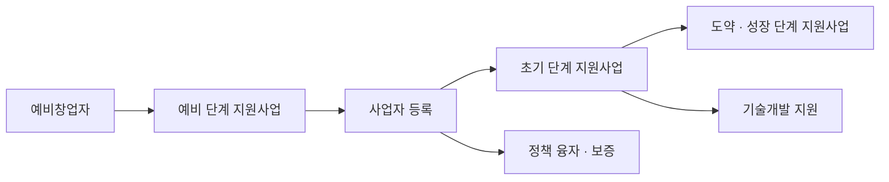

# 창업 지원사업

> 이 문서는 일반 정보이며 법률·세무 자문이 아닙니다. 제도는 자주 바뀌므로 실행 전에 공식 출처나 세무사·변호사에게 확인하세요.

정부·지자체 창업 지원사업은 매년 새로 공고된다. 이 문서는 개별 사업을 외우는 대신 **어디서 찾고, 어떤 자격 조건을 먼저 확인하는지**를 다룬다.

## 규모와 창구

- 중소벤처기업부는 매년 **중앙부처 및 지자체 창업지원사업 통합공고**를 낸다.
- 2026년 통합공고: **111개 기관, 508개 사업, 총 3조 4,645억원** (전년 대비 1,705억원, 5.2% 증가). 유형별로는 융자 1조 4,245억원(41.1%), 기술개발 8,648억원, 사업화 8,151억원 순이다.

| 창구 | 용도 |
|---|---|
| K-Startup (k-startup.go.kr) | 창업진흥원 사업 공고·신청, 통합공고 |
| 기업마당 (bizinfo.go.kr) | 부처·지자체 지원사업 공고 검색 |
| 중소벤처기업부 누리집 (mss.go.kr) | 통합공고 원문, 정책 발표 |
| 창업진흥원 (kised.or.kr) | 사업 공고, 문의처 |
| 온라인 법인설립시스템 (startbiz.go.kr) | 법인 설립 절차 (01 문서) |

## 법이 정한 "창업기업"

- **창업기업**: 중소기업을 창업해 사업을 개시한 날부터 **7년이 지나지 않은** 기업 (법인과 개인사업자 포함) (중소기업창업 지원법 제2조).
- **예비창업자**: 창업을 하려는 개인 등.
- 지원사업은 보통 이 정의와 업력(창업 후 경과 기간)을 기준으로 대상을 나눈다.

## 단계별로 찾는 법



| 단계 | 대표 사업 (2026년 공고 기준) | 먼저 볼 조건 |
|---|---|---|
| 예비 | 예비창업패키지 | **공고문이 정한 기준일**(2026년 1차 공고: 2026년 1월 22일) 현재 신청자 명의 사업자 등록(개인·법인)이 **없고** 법인 대표권도 없어야 함 |
| 초기 | 초기창업패키지 | 업력 요건 (공고문 확인) |
| 도약 | 창업도약패키지 | 업력 요건 (공고문 확인) |
| 기술개발 | 창업성장기술개발 | 기술성, 기업부설연구소 등 요건 |

- 2026년 예비창업패키지는 **1차(신청 2026년 3월 6일~3월 24일)**와 **6월 2차 모집**으로 두 번 공고되었다 (기업마당 공고 기준). 차수마다 기준일과 일정이 다를 수 있고 매년 바뀐다.
- 지원 금액, 자부담 비율, 업력 기준은 사업마다 다르고 해마다 바뀐다. **공고문 원문**을 기준으로 판단한다.

## 가장 흔한 실수: 등록 순서

```text
지원사업을 알게 됨
→ 공고문의 "신청 자격" 확인
→ 사업자 등록이 결격 사유인지 확인
→ 등록 시점 결정
→ 사업자 등록 (필요할 때)
```

나쁜 예:

> 사이드 프로젝트 수익이 조금 생겨서 개인사업자로 등록했다. 다음 해 예비창업패키지 공고를 보니 신청 자격이 없었다.

좋은 예:

> 지원사업 일정을 먼저 확인하고, 선정 후 협약 일정에 맞춰 사업자 등록을 했다.

- 예외 규정(업종이 다른 기존 사업자 등)이 있는 경우가 있으므로 공고문의 자격 조항과 FAQ를 끝까지 읽는다.
- 폐업 이력, 대표자 중복 신청, 다른 정부 사업과의 중복 수혜 제한도 공고문에서 함께 확인할 항목이다.

## 지원사업 준비 체크리스트

- [ ] K-Startup, 기업마당 회원가입과 관심 분야 알림 설정
- [ ] 통합공고 원문에서 내 단계에 맞는 사업 목록 작성
- [ ] 공고문 자격 조건 중 "사업자 등록", "업력", "중복 수혜" 항목 표시
- [ ] 사업계획서 초안 (문제, 해결, 시장, 팀, 자금 계획)
- [ ] 선정 후 협약·정산 규칙 확인 (사업비 사용 증빙 방식)
- [ ] 세무 신고와 정산 증빙을 같은 폴더 체계로 관리

## 참고 자료

- [대한민국 정책브리핑 - 내년 창업지원 예산 3조 4645억 원](https://www.korea.kr/news/policyNewsView.do?newsId=148956820) (접근 2026-09-28)
- [기업마당 - 2026년 중앙부처 및 지자체 창업지원사업 통합 공고](https://www.bizinfo.go.kr/sii/siia/selectSIIA200Detail.do?pblancId=PBLN_000000000116904) (접근 2026-09-28)
- [중소벤처기업부 - 2026년 중앙부처 및 지자체 창업지원사업 통합공고](https://www.mss.go.kr/site/ulsan/ex/bbs/View.do?cbIdx=254&bcIdx=1064200) (접근 2026-09-28)
- [기업마당 - 2026 예비창업패키지 예비창업자 모집 수정 공고](https://www.bizinfo.go.kr/sii/siia/selectSIIA200Detail.do?pblancId=PBLN_000000000119019) (접근 2026-09-28)
- [기업마당 - 2026년 2차 예비창업패키지 예비창업자 모집 수정 공고](https://www.bizinfo.go.kr/sii/siia/selectSIIA200Detail.do?pblancId=PBLN_000000000119859) (접근 2026-09-28)
- [기업마당 - 2026년 초기창업패키지(일반형) 창업기업 모집 공고](https://www.bizinfo.go.kr/sii/siia/selectSIIA200Detail.do?pblancId=PBLN_000000000117819) (접근 2026-09-28)
- [창업진흥원 - 사업공고](https://www.kised.or.kr/menu.es?mid=a10302000000) (접근 2026-09-28)
- [국가법령정보센터 - 중소기업창업 지원법](https://www.law.go.kr/LSW/lsInfoP.do?urlMode=lsInfoP&lsId=001472) (접근 2026-09-28)
- [찾기쉬운 생활법령정보 - 창업절차 및 지원 개요](https://easylaw.go.kr/CSP/CnpClsMain.laf?popMenu=ov&csmSeq=632&ccfNo=1&cciNo=1&cnpClsNo=2) (접근 2026-09-28)
