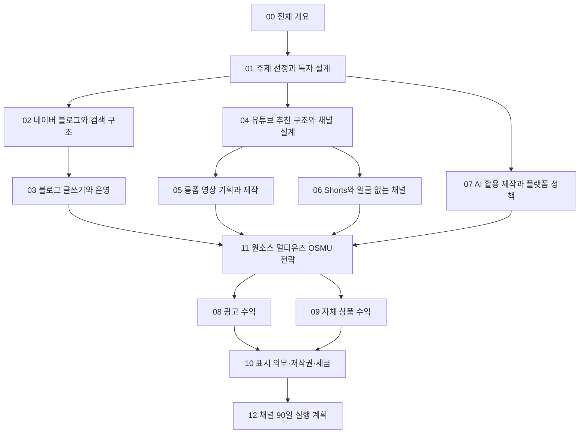

# 블로그·유튜브 수익화 전체 개요

> **학습 목표**: 네이버 블로그와 유튜브가 독자를 만나는 방식과 돈이 생기는 방식을 비교하고, 광고와 자체 상품이라는 두 수익 엔진을 첫날부터 함께 설계해야 하는 이유를 설명하며, 이 섹션 13개 문서를 어떤 순서로 읽을지 정하고, 수익화 임계값까지 걸리는 시간을 숫자로 가늠할 수 있다.

이 섹션은 블로그도 유튜브도 처음인 사람을 위한 교과서다. 블로그는 네이버 블로그만 다루고, 유튜브는 롱폼·Shorts·얼굴 없는 채널·AI 활용 제작을 모두 다룬다. 수익은 광고(네이버 애드포스트, YouTube 파트너 프로그램)와 자체 상품(강의·전자책·템플릿)을 중심에 둔다. 모든 정책과 숫자는 **2026-09 기준**이며, 공식 페이지를 직접 열지 못한 사실은 "검색 결과로 확인"이라고 적었다. 광고 지표의 기초는 「광고 수익 심화」, 가격 설계는 「유료 판매·구독과 가격 설계」에서 이미 다뤘으므로 여기서는 되풀이하지 않는다. 환율은 사이트 공통 가정 1달러 = 1,400원을 쓴다.

## 핵심 개념

| 용어 | 뜻 | 이 섹션에서 다루는 곳 |
|---|---|---|
| 발견(Discovery) | 아직 나를 모르는 사람이 내 글·영상을 처음 만나는 경로. 네이버는 주로 검색, 유튜브는 주로 추천 | 「네이버 블로그와 검색 구조」, 「유튜브 추천 구조와 채널 설계」 |
| 수익화 게이트 | 광고 수익을 받기 전에 넘어야 하는 플랫폼 기준. 애드포스트 심사, YPP 가입 기준 | 「광고 수익: 애드포스트와 YouTube 파트너 프로그램」 |
| 광고 엔진 | 조회 수 × 조회 1,000회당 수익(RPM)으로 돈이 되는 구조 | 「광고 수익: 애드포스트와 YouTube 파트너 프로그램」 |
| 자체 상품 엔진 | 구매자 수 × 가격으로 돈이 되는 구조. 템플릿·전자책·VOD 강의 | 「자체 상품 수익: 강의·전자책·템플릿」 |
| 누적 자산 | 한 번 만든 뒤에도 계속 발견되는 글·영상, 그리고 나를 다시 찾는 독자 | 이 문서의 원리 절 |
| 원소스 멀티유즈(OSMU) | 하나의 원천 자료(개요·녹화)를 롱폼, Shorts, 네이버 글, 상품 모듈로 나눠 쓰는 방식 | 「원소스 멀티유즈(OSMU) 전략」 |

### 원소스 멀티유즈(OSMU): 이 섹션의 뼈대

초보자가 블로그와 유튜브를 동시에 하면 일이 두 배가 된다고 생각하기 쉽다. 이 섹션은 반대로 설계한다. **하나의 개요를 먼저 만들고, 거기서 여러 결과물을 뽑는다.** 개요 하나가 롱폼 영상 대본, 그 영상에서 잘라 낸 Shorts, 같은 내용을 글로 풀어 쓴 네이버 포스트, 그리고 나중에 강의·전자책의 한 챕터가 된다. 결과물마다 형식은 다시 다듬어야 하지만, 조사와 구조 설계는 한 번만 한다. 구체적인 분해 방법과 재가공 규칙은 「원소스 멀티유즈(OSMU) 전략」에서 다룬다. 같은 내용을 그대로 복제해 여러 곳에 올리는 것은 OSMU가 아니며, 두 플랫폼 모두 반복·복제 콘텐츠를 불리하게 다룬다(「AI 활용 제작과 플랫폼 정책」).

## 원리

### 네이버 블로그와 유튜브는 어떻게 다른가

| 비교 항목 | 네이버 블로그 | 유튜브 |
|---|---|---|
| 발견 방식 | 검색 중심. 통합검색의 스마트블록·블로그 탭, 그리고 2025-03 도입된 AI 브리핑의 출처 링크 | 추천 중심(홈·다음 동영상·Shorts 피드)에 검색이 더해진다 |
| 독자의 상태 | 문제를 이미 느끼고 답을 찾는 중. 의도가 뚜렷하다 | 둘러보다가 흥미가 생긴 상태가 많다. 검색 유입은 의도가 뚜렷하다 |
| 제작 비용 | 글과 캡처. 시간 비용이 가장 크다 | 대본·녹화·편집·썸네일. 같은 주제라도 시간이 더 든다 |
| 수익이 시작되는 방식 | 애드포스트 심사 통과 후 광고. 네이버는 구체적 수치 기준을 공개하지 않는다 | YPP 가입 기준(구독자·시청 시간 또는 Shorts 조회 수)을 넘은 뒤 광고 수익 배분 |
| 누적되는 것 | 검색에 계속 걸리는 글, 이웃, 주제 전문성에 대한 평가(C-Rank로 설명되는 출처 신뢰도) | 추천에 계속 걸리는 영상, 구독자, 시청 기록 |
| 상품으로 이어지는 길 | 글 안의 자료 다운로드·상품 링크. 검색 의도가 구매 의도와 가깝다 | 영상 설명·고정 댓글·채널 멤버십. 얼굴·목소리에서 생기는 신뢰 |

두 플랫폼은 서로의 약점을 메운다. 블로그는 검색 의도가 분명한 독자를 싸게 모으고, 유튜브는 신뢰와 도달을 크게 만든다. 다른 블로그 플랫폼(예: 티스토리 + AdSense)은 광고 선택지가 다르지만, 이 섹션은 독자 설정에 따라 네이버 블로그만 다룬다.

### 두 개의 수익 엔진: 광고와 자체 상품

> 광고 수익 = 조회 수 × RPM ÷ 1,000
> 자체 상품 수익 = 방문자 수 × 구매 전환율 × 가격 − 판매 수수료

같은 월 50만 원을 두 엔진으로 벌려면 무엇이 필요한지 비교해 보자. **아래 RPM과 가격은 모두 가정이다.** 애드포스트와 YouTube 모두 공식 평균 RPM을 공개하지 않는다.

| 엔진 | 가정 | 월 50만 원에 필요한 것 |
|---|---|---|
| 광고 | 조회 1,000회당 게시자 수익 1,000원 (가정) | 월 500,000회 조회 |
| 광고 | 조회 1,000회당 게시자 수익 3,000원 (가정, 「광고 수익 심화」의 가정 범위) | 월 166,667회 조회 |
| 자체 상품 | 템플릿 팩 15,000원 (가정), 수수료 전 | 월 34건 판매 |

광고는 **조회 수가 많아야** 의미가 생기고, 상품은 **적은 수의 진지한 독자**로도 의미가 생긴다. 초보자의 첫해는 조회 수가 적은 시기이므로, 광고만 보고 시작하면 첫해 대부분을 수익 0원으로 보내게 된다.

### 왜 첫날부터 둘 다 설계하는가

1. **광고 게이트는 늦게 열린다.** YPP는 가입 기준을 넘기 전까지 광고 수익 배분이 없다. 애드포스트도 심사를 통과해야 한다.
2. **상품은 주제 선택에 묶인다.** 팔 수 있는 것이 없는 주제를 골랐다면, 1년 뒤 상품을 붙이려 해도 독자가 맞지 않는다(「주제 선정과 독자 설계」).
3. **상품 준비물은 콘텐츠를 만들며 쌓인다.** 무료 템플릿을 나눠 주는 글, 자주 받는 질문, 강의 목차는 모두 초기 콘텐츠의 부산물이다. OSMU로 처음부터 "상품 모듈"을 뽑을 수 있게 설계하면 따로 시간을 들이지 않아도 된다.
4. **광고는 바닥, 상품은 천장이다.** 광고는 트래픽을 돈으로 바꾸는 가장 쉬운 첫 단계이고, 독자 한 명당 수익은 상품이 훨씬 크다. 이 관점은 「광고 수익 심화」와 같다.

### 섹션 지도와 학습 순서

| 단계 | 문서 | 이 단계에서 답하는 질문 |
|---|---|---|
| 1. 방향 | 「블로그·유튜브 수익화 전체 개요」, 「주제 선정과 독자 설계」 | 무엇을, 누구를 위해 만들 것인가 |
| 2. 블로그 | 「네이버 블로그와 검색 구조」, 「블로그 글쓰기와 운영」 | 네이버에서 어떻게 발견되고, 어떻게 꾸준히 쓸 것인가 |
| 3. 유튜브 | 「유튜브 추천 구조와 채널 설계」, 「롱폼 영상 기획과 제작」, 「Shorts와 얼굴 없는 채널」 | 추천은 어떻게 작동하고, 영상은 어떻게 만들 것인가 |
| 4. 도구와 규칙 | 「AI 활용 제작과 플랫폼 정책」 | AI를 어디까지 써도 수익화가 안전한가 |
| 5. 연결 | 「원소스 멀티유즈(OSMU) 전략」 | 하나의 개요를 어떻게 여러 결과물과 상품으로 나눌 것인가 |
| 6. 수익 | 「광고 수익: 애드포스트와 YouTube 파트너 프로그램」, 「자체 상품 수익: 강의·전자책·템플릿」 | 두 엔진을 어떻게 켜고 키울 것인가 |
| 7. 규칙 | 「표시 의무·저작권·세금」 | 무엇을 표시하고, 무엇을 쓰면 안 되며, 세금은 어떻게 내는가 |
| 8. 실행 | 「채널 90일 실행 계획」 | 첫 90일을 주 단위로 어떻게 보낼 것인가 |

07은 도구를 쓰기 시작하기 전에 읽는 편이 안전하다. 05·06에서 AI 음성이나 자동 편집을 쓸 계획이라면 07을 먼저 본다.

## 적용: 예시 크리에이터 J의 출발점

이 섹션의 모든 적용 절은 같은 사람을 따라간다.

| 항목 | 내용 |
|---|---|
| 사람 | 예시 크리에이터 J. 직장인, 주당 10시간 사용 가능 |
| 주제 | 업무 자동화: 엑셀과 AI 도구 |
| 형식 | 얼굴 없이 화면 녹화 + 본인 목소리. 대본·편집에 AI 보조, AI 음성은 테스트용 선택지로만 |
| 채널 | 네이버 블로그(튜토리얼·템플릿), 유튜브(주 1회 8~12분 롱폼 강의 + 그 영상에서 자른 Shorts 3개) |
| 원칙 | "하나의 개요, 두 개의 결과물": 블로그 글과 영상을 같은 개요에서 만든다 |
| 기간 | D0 = 2026-10-05(월), D90 = 2027-01-03 |
| 수익 경로 | 광고는 먼저 켜지만 느리다. 상품은 무료 템플릿 → 유료 템플릿 팩 → 전자책 또는 VOD 강의 |

J의 주 10시간 배분은 시작 가정이며, 실제 소요 시간을 재서 「채널 90일 실행 계획」에서 조정한다.

| 작업 | 주당 시간 (가정) |
|---|---|
| 자료 조사·개요·대본 | 2.0 |
| 화면 녹화와 음성 녹음 | 1.5 |
| 롱폼 편집과 썸네일 (AI 보조 포함) | 3.0 |
| 같은 개요로 블로그 글 작성 | 2.0 |
| Shorts 3개 자르기 | 1.0 |
| 커뮤니티 (댓글·이웃 응대) | 0.5 |
| 합계 | 10 |

J가 13주 동안 만드는 것은 롱폼 13편, Shorts 39편(D90까지 발행 38편), 블로그 글 13편이다. D90에 J가 확인할 것은 수익이 아니라 **어떤 주제의 글·영상이 검색과 추천에서 반응했는지, 무료 템플릿을 몇 명이 받아 갔는지**다.

## 심화

### 현실적인 기대치: 임계값까지 걸리는 시간

YouTube는 2026년 8월 YPP 기준 변경을 발표했다(검색 결과로 확인). **2027-02-01부터 새로 신청하는 채널**의 광고 단계 기준이 두 배가 된다. J처럼 아직 가입하지 않은 채널에 중요한 부분은 다음과 같다.

| 단계 | 2027-01-31까지 신청 | 2027-02-01부터 신청 |
|---|---|---|
| 광고 단계 (구독자 1,000명과 함께) | 12개월 유효 시청 4,000시간 또는 90일 유효 Shorts 조회 1,000만 회 | 365일 유효 시청 8,000시간 또는 90일 유효 Shorts 조회 2,000만 회 |
| 팬 후원 단계 (광고 수익 배분 없음) | 구독자 500명, 최근 90일 공개 업로드 3개, 최근 12개월 유효 시청 3,000시간 또는 최근 90일 유효 Shorts 조회 300만 회 | 바뀌지 않는다 |

이미 YPP에 있는 채널은 지위를 유지하지만, 같은 날부터 활동 기준과 Shorts 수익 기준(최근 90일 유효 Shorts 조회 1,000만 회 이상이어야 Shorts 수익 배분)이 적용된다고 보도됐다. 낮은 단계(구독자 500명)는 2023-06 한국을 포함한 국가에 먼저 도입됐다. 수익 배분율은 롱폼 55%, Shorts는 크리에이터 풀 배분액의 45%다. 세부는 「광고 수익: 애드포스트와 YouTube 파트너 프로그램」에서 다룬다.

시청 시간을 조회 수로 바꿔 보면 규모가 보인다. 평균 시청 지속 시간을 **4분으로 가정**하면:

- 4,000시간 = 240,000분 → 12개월 동안 약 60,000회 조회. 주 1편이면 영상당 평균 약 1,150회.
- 8,000시간 → 약 120,000회. 영상당 평균 약 2,300회.
- Shorts 2,000만 회/90일 → 하루 평균 약 222,000회.

J의 D90(2027-01-03)은 기준이 바뀌기 전이지만, 옛 기준 4,000시간을 2027-01-31 전에 채우려면 첫 4개월 누적 조회 약 60,000회가 필요하다. 그래서 J는 **새 기준(1,000명 + 8,000시간)을 전제로** 계획한다. 「광고 수익: 애드포스트와 YouTube 파트너 프로그램」의 예시 계산(월 조회가 매달 일정하게 느는 가정, 예측이 아님)에서는 팬 후원 단계가 7~14개월 차, 광고 단계가 11~26개월 차에 온다. D90에는 어느 시나리오도 팬 후원 단계에 닿지 않는다. 그 사이 수익은 상품에서 찾는다. 애드포스트는 운영 기간, 공개 콘텐츠 수, 방문자 수 등을 종합 심사한다고 안내되지만, 공식 도움말에서 수치 기준을 확인하지 못했다. 흔히 도는 "90일·50개·100명"은 공식 페이지에서 확인되지 않은 통념이다(검색 결과로 확인).

### 결과의 분포

- 무작위 표본의 유튜브 채널을 분석한 연구(Bärtl, 2018)에서 **상위 3% 채널이 조회 수의 85%**를 가져갔다.
- 국세청 자료(2026-02 국회 공개 보도)에 따르면 2024년 귀속 1인 미디어 창작자 수입을 신고한 사람은 34,806명, 1인당 평균 약 7,100만 원이었다. 상위 1%(348명)는 평균 약 12.9억 원, 하위 50%로 보도된 17,404명은 평균 약 2,463만 원이었다.

두 숫자 모두 **이미 성과를 낸 쪽의 분포**다. 국세청 숫자는 경비를 빼기 전 수입금액이고, 신고할 수입이 생긴 사람만 포함한다. 시작했다가 수입 없이 그만둔 채널은 집계에 없다. 평균이 아니라 중앙값, 그리고 분모에 들어가지 않은 사람을 떠올려야 한다.

### 기타 수익: 제휴 마케팅·협찬·지원 프로그램

제휴 링크 수수료와 브랜드 협찬도 가능하지만 이 섹션의 중심은 아니다. 네이버는 2026-06 AI 브리핑 인용 수와 주제 전문성을 기준으로 월 약 3,000명에게 활동비를 주는 '네이버 메이트'를 시범 출시했고, 2026-08에는 애드포스트·브랜드 커넥트·메이트 지원 합계가 2025-02 대비 약 2배가 됐다고 발표했다(검색 결과로 확인). 어떤 형태든 대가를 받으면 **제목 또는 첫 부분에 경제적 이해관계를 표시**해야 한다. 규칙은 「표시 의무·저작권·세금」과 「법 · 윤리 · 광고 표시」에서 다룬다.

## 흔한 오해

- **"블로그와 유튜브를 같이 하면 일이 두 배다"** — 같은 개요에서 만들면 조사와 구조 설계는 한 번이다. 형식별 다듬기만 따로 한다.
- **"광고 수익이 먼저, 상품은 나중에"** — 광고 게이트는 늦게 열린다. 상품은 주제 선택 단계에서 이미 가능성이 정해진다.
- **"구독자 1,000명만 넘으면 수익 창출"** — 시청 시간 또는 Shorts 조회 수 기준도 함께 넘어야 하며, 2027-02-01부터 새로 신청하는 채널은 8,000시간 또는 Shorts 2,000만 회다. 구독자 500명의 팬 후원 단계에는 광고 수익 배분이 없다.
- **"평균 유튜버 수입이 7,100만 원이니 나도"** — 신고할 수입이 생긴 사람의 평균이다. 상위 1%가 평균을 끌어올린다.
- **"애드포스트는 90일·글 50개면 승인"** — 공식 도움말에서 수치 기준을 확인하지 못했다. 공식 페이지에서 확인되지 않은 통념이다.

## 자기 점검 질문

1. 네이버 블로그와 유튜브에서 "처음 만나는 경로"는 각각 무엇이 중심인가? 그 차이가 글과 영상의 첫 문장에 어떤 영향을 주는가?
2. 조회 1,000회당 게시자 수익 2,000원을 가정하면 월 30만 원에 필요한 조회 수는 얼마인가? 같은 금액을 12,000원짜리 템플릿으로 벌려면 몇 건이 필요한가?
3. 평균 시청 지속 시간 5분을 가정하면 8,000시간 기준은 12개월 동안 몇 회 조회에 해당하는가?
4. 국세청 1인 미디어 창작자 수입 통계를 "초보자의 기대 수입"으로 읽으면 안 되는 이유 두 가지는?
5. 개요 하나에서 J가 뽑을 수 있는 결과물 네 가지를 말해 보라.

## 참고 자료

- [New opportunities to earn and changes to the YouTube Partner Program — YouTube Official Blog](https://blog.youtube/news-and-events/youtube-partner-program-updates-2027-new-opportunities-earn/) — YouTube, 2026-08-10, 검색 결과로 확인 (2026-09-30)
- [Changes to the YouTube Partner Program — YouTube Help](https://support.google.com/youtube/answer/12843009?hl=en) — Google, 검색 결과로 확인 (2026-09-30)
- [YouTube partner earnings overview — YouTube Help](https://support.google.com/youtube/answer/72902?hl=en) — Google, 검색 결과로 확인 (2026-09-30)
- [YouTube Lowers Barriers To Join Partner Program In More Countries](https://www.searchenginejournal.com/youtube-lowers-barriers-to-join-partner-program-in-more-countries/495220/) — Search Engine Journal, 2023-06, 검색 결과로 확인 (2026-09-30)
- [유튜브 수익창출 조건 변경 정리: 2027년 2월부터 2배 상향](https://www.digitalmarketer.co.kr/insights/youtube-ypp-2027-threshold-change) — 디지털마케터, 검색 결과로 확인 (2026-09-30)
- [YouTube channels, uploads and views: A statistical analysis of the past 10 years](https://journals.sagepub.com/doi/abs/10.1177/1354856517736979) — Mathias Bärtl, Convergence, 2018, 검색 결과로 확인 (2026-09-30)
- [유튜버 연평균 수입, 하위 50% 2463만 원...상위 1% 13억 원](https://www.mediatoday.co.kr/news/articleView.html?idxno=332451) — 미디어오늘, 2026-02, 검색 결과로 확인 (2026-09-30)
- [AI 브리핑 도입 이후 창작자 지원 규모 약 2배 확대](https://navercorp.com/media/pressReleasesDetail?seq=10034578) — NAVER Corp. 보도자료, 2026-08, 검색 결과로 확인 (2026-09-30)
- [네이버, AI가 인용한 창작자 3000명 공개…'네이버 메이트' 시작](https://www.edaily.co.kr/News/Read?newsId=03466966645478440) — 이데일리, 2026-06, 검색 결과로 확인 (2026-09-30)
- [네이버 애드포스트 신청 조건과 수익](https://postdot.kr/blog/naver-adpost-guide) — 포스트닷, 검색 결과로 확인 (2026-09-30). 공식 도움말(adpost.naver.com)은 직접 열지 못했다.
- [대가 받은 블로그·후기글 제목·첫부분에 '광고'·'협찬' 명시해야](https://www.ajunews.com/view/20241115102251443) — 아주경제, 2024-11-15, 검색 결과로 확인 (2026-09-30)
