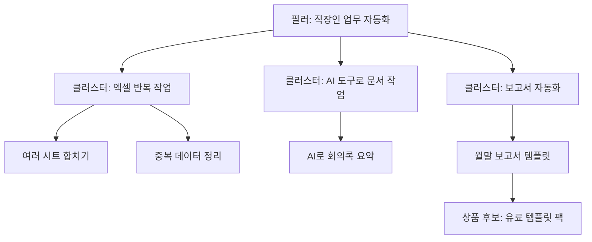

# 주제 선정과 독자 설계

> **학습 목표**: 수요·나의 우위·수익화 경로·지속 가능성의 네 기준으로 주제 후보를 비교하고, 만들기 전에 네이버와 유튜브의 도구로 수요를 확인하며, 독자·시청자 페르소나와 토픽 트리(필러·클러스터·개별 콘텐츠)를 설계하고, 주제가 광고 RPM과 상품 가능성의 상한을 어떻게 정하는지 설명할 수 있다.

「블로그·유튜브 수익화 전체 개요」에서 본 두 수익 엔진은 모두 주제 선택에서 출발한다. 이 문서는 무엇을 누구를 위해 만들지 정하는 단계만 다룬다. 네이버 검색이 글을 고르는 방식은 「네이버 블로그와 검색 구조」, 유튜브 추천과 채널 설계는 「유튜브 추천 구조와 채널 설계」, 제품 기회를 검증하는 일반론은 「기회 선택과 수요 검증」과 「시장·고객 리서치 · Segmentation」을 본다. 도구 화면과 기능은 **2026-09 기준**이며, 네이버 도움말을 직접 열지 못한 항목은 "검색 결과로 확인"으로 적었다.

## 핵심 개념

| 용어 | 뜻 |
|---|---|
| 니치(Niche) | 특정 독자가 반복해서 겪는 문제 하나를 중심으로 좁힌 주제. "엑셀"은 넓고, "직장인의 엑셀 반복 업무 자동화"는 니치다 |
| 수요 | 그 문제를 검색하거나 관련 영상을 보는 사람의 규모와 꾸준함 |
| 나의 우위(Edge) | 같은 주제를 다루는 다른 사람보다 내가 더 잘 설명할 수 있는 이유. 경험, 직업, 자료, 관점 |
| 수익화 경로 | 이 주제의 독자가 광고 외에 돈을 낼 만한 대상. 템플릿, 전자책, 강의 |
| 지속 가능성 | 주 몇 시간으로 1년 이상 새 글·영상을 만들 수 있는 소재의 깊이와 나의 흥미 |
| 페르소나 | 실제 조사에 근거해 그린 대표 독자 한 명. 상황·목표·막히는 지점·쓰는 말을 적는다 |
| 토픽 트리 | 필러(큰 주제) → 클러스터(하위 문제 묶음) → 개별 글·영상으로 내려가는 콘텐츠 설계도 |

## 원리

### 주제를 고르는 네 가지 기준

| 기준 | 물어볼 질문 | 확인 근거 |
|---|---|---|
| 수요 | 이 문제를 검색하거나 찾아보는 사람이 1년 내내 있는가? | 네이버 검색량, 검색어 추이, 유튜브 검색 제안, 경쟁 영상의 조회 수 |
| 나의 우위 | 내가 직접 해 봤거나 매일 하는 일인가? 남이 못 보여 주는 화면·자료가 있는가? | 내 작업 기록, 동료에게 자주 받는 질문 |
| 수익화 경로 | 이 독자가 시간을 아끼려고 돈을 쓰는가? 광고주가 이 독자를 원하는가? | 비슷한 유료 상품이 팔리고 있는지, 검색광고가 붙는 키워드인지 |
| 지속 가능성 | 글·영상 50개 분량의 하위 문제가 떠오르는가? 1년 뒤에도 이 주제가 재미있을까? | 토픽 트리 초안의 개별 항목 수 |

점수는 1~5점으로 매기고, 네 기준 중 하나라도 1점(사실상 없음)이면 그 주제는 탈락이다. 수요가 커도 우위가 없으면 경쟁에서 밀리고, 우위가 있어도 수익화 경로가 없으면 취미가 된다. 점수는 주관적이어도 괜찮다. 중요한 것은 **네 기준을 같은 표에서 비교**하는 것이다.

### 네이버에서 수요 확인하기

| 도구 | 보여 주는 것 | 주의할 점 |
|---|---|---|
| 네이버 데이터랩 검색어트렌드 | 주제어(키워드 묶음)별 검색 추이. 기간·기기·성별·연령으로 나눠 볼 수 있다 | 선택한 기간의 최댓값을 100으로 둔 **상대값**이다. 절대 검색량이 아니며, 비교 대상에 따라 숫자가 바뀐다 |
| 네이버 검색광고 키워드 도구 | 키워드별 월간 검색수(PC·모바일), 월평균 클릭수, 경쟁 정도, 연관 키워드 | 검색광고 계정이 필요하다. 광고를 집행하지 않아도 조회할 수 있다고 안내된다. 광고 관점 지표이므로 "경쟁 정도"는 광고주 경쟁이지 블로그 경쟁이 아니다 |
| 크리에이터 어드바이저 트렌드 | 블로그 주제 분야별로 많이 검색된 키워드 | 블로그를 개설해야 볼 수 있다. 짧은 기간의 유행이 섞여 있다 |
| 실제 검색 결과 보기 | 그 키워드에 스마트블록·블로그 글·AI 브리핑이 어떻게 나오는지 | 결과의 형태가 곧 내가 들어갈 자리다. 블로그 글이 거의 없는 결과라면 블로그로는 닿기 어렵다 |

순서는 이렇다. 데이터랩으로 **계절성과 추세**를 보고, 키워드 도구로 **규모와 연관 키워드**를 모으고, 실제 검색 결과로 **블로그가 설 자리**를 확인한다. 검색량이 큰 키워드 하나보다, 검색량이 작아도 구체적인 문제를 담은 연관 키워드 여러 개가 초보 블로그에는 더 현실적이다.

### 유튜브에서 수요 확인하기

- **검색 제안**: 유튜브 검색창에 주제어를 입력하면 이어지는 제안이 나온다. 제안에 나오는 표현은 시청자가 실제로 쓰는 말이다. 주제어 뒤에 "하는 법", "자동화", "초보" 같은 말을 붙여 여러 번 확인한다.
- **경쟁 채널**: 같은 주제의 채널 5~10개를 골라 최근 영상의 업로드 날짜, 조회 수, 구독자 수를 적는다. 구독자 수에 비해 조회 수가 높은 영상은 주제 자체의 수요가 크다는 신호다. 최근 1년 안에 시작한 채널이 성장했는지도 본다.
- **YouTube Studio의 영감(Inspiration) 탭(옛 리서치 탭)**: 내 시청자와 유튜브 전체 사용자가 무엇을 검색하는지, 검색은 많은데 알맞은 영상이 적은 "콘텐츠 격차"가 무엇인지 보여 준다고 안내된다(검색 결과로 확인). 채널을 만든 뒤 쓸 수 있으므로 검증 두 번째 단계에 쓴다. 다만 이 탭은 2026-08부터 단계적으로 종료되고 Ask Studio가 대신한다. Ask Studio로 아이디어를 찾는 방법은 「AI로 유튜브 영상 만들기: 도구와 튜토리얼」에서 다룬다.

유튜브는 추천이 중심이라 검색량이 작아도 추천으로 크게 퍼지는 주제가 있다. 반대로, 검색 수요가 분명한 주제는 첫 영상부터 검색 유입을 기대할 수 있어 초보에게 안전하다. 추천의 원리는 「유튜브 추천 구조와 채널 설계」에서 다룬다.

### 독자와 시청자 페르소나

블로그 독자와 유튜브 시청자는 같은 사람이어도 상태가 다르다.

| 항목 | 블로그 독자 | 유튜브 시청자 |
|---|---|---|
| 도착 순간 | 특정 문제를 검색해서 도착한다 | 추천이나 검색으로 도착해 첫 몇 초로 머물지 정한다 |
| 원하는 것 | 복사해 쓸 수 있는 단계, 수식, 파일 | 따라 하는 과정을 눈으로 보는 것, 설명하는 사람에 대한 신뢰 |
| 막히는 지점 | 내 상황과 예제가 다를 때 | 속도가 빠르거나 화면이 작을 때 |
| 상품으로 이어지는 순간 | "이 템플릿 파일을 받고 싶다" | "이 사람의 강의를 처음부터 듣고 싶다" |

페르소나는 상상으로 쓰지 않는다. 검색 제안, 연관 키워드, 경쟁 영상 댓글, 지식iN 질문, 주변 동료의 질문에서 **실제로 쓰인 문장**을 모아 만든다. 한 장에 상황, 목표, 막히는 지점, 쓰는 말, 돈을 쓰는 기준 다섯 줄이면 충분하다.

### 토픽 트리: 필러, 클러스터, 개별 글과 영상

| 층 | 역할 | 형태 |
|---|---|---|
| 필러(Pillar) | 채널 전체가 답하는 큰 질문. 보통 1~3개 | 긴 입문 글, 재생목록의 첫 영상 |
| 클러스터(Cluster) | 필러 아래의 하위 문제 묶음. 각 클러스터가 카테고리·재생목록이 된다 | 블로그 카테고리, 유튜브 재생목록 |
| 개별 콘텐츠 | 검색어 하나, 문제 하나에 답하는 글·영상 | 튜토리얼 글, 8~12분 강의, Shorts |

트리는 두 가지를 동시에 정한다. 네이버 블로그에서는 카테고리 구조와 주제 집중도가 되고(「네이버 블로그와 검색 구조」), 유튜브에서는 재생목록과 시청 흐름이 된다. 개별 콘텐츠 하나를 롱폼·Shorts·네이버 글·상품 모듈로 나누는 방법은 「원소스 멀티유즈(OSMU) 전략」에서 다룬다.

### 주제가 광고 RPM과 상품 가능성의 상한을 정한다

Google은 AdSense 수익이 콘텐츠 주제와 방문자 지역에 따라 달라진다고 안내하고, YouTube도 RPM이 주제·시청자 지역·광고주 친화성에 따라 달라진다고 설명한다. 애드포스트와 YouTube 모두 주제별 평균 RPM을 공개하지 않으므로, 아래 표는 **방향만 보는 정성 비교**다.

| 주제 유형 | 광고 RPM 경향 | 상품 가능성 | 이유 |
|---|---|---|---|
| 업무·재테크·교육처럼 구매·업무 결정과 가까운 주제 | 높은 편일 수 있다 | 높다 | 광고주가 원하는 독자이고, 독자가 시간을 아끼려 돈을 쓴다 |
| 취미·일상·연예 | 낮은 편일 수 있다 | 주제에 따라 다르다 | 조회는 많아도 구매 의도가 약하다 |
| 뉴스·이슈 요약 | 변동이 크다 | 낮다 | 짧게 소비되고, 팔 수 있는 자료가 적다 |
| 광고주 친화적이지 않은 주제 | 광고 제한 가능 | 낮다 | 광고 게재가 제한될 수 있다 |

주제는 광고의 천장과 상품의 천장을 **동시에** 정한다. 나중에 콘텐츠를 잘 만들어도 이 천장은 잘 올라가지 않는다. RPM 계산법은 「광고 수익 심화」, 상품 가격은 「유료 판매·구독과 가격 설계」에서 다룬다.

## 적용: 예시 크리에이터 J의 주제 검증

J는 후보 세 개를 같은 표에 놓고 1~5점으로 매겼다. 점수는 **J의 판단**이지 측정값이 아니다.

| 후보 | 수요 | 나의 우위 | 수익화 경로 | 지속 가능성 | 판단 |
|---|---|---|---|---|---|
| 업무 자동화: 엑셀과 AI 도구 | 4 | 4 (매일 쓰는 업무) | 5 (템플릿·강의) | 4 | 선택 |
| 출퇴근 독서 기록 | 3 | 3 | 2 | 4 | 보류: 수익화 경로 약함 |
| 최신 AI 뉴스 요약 | 4 | 1 | 2 | 2 | 탈락: 우위 1점(사실상 없음), 지속성 약함, 반복 요약은 정책 위험 |

J는 D0 전 1주일 동안 수요를 확인한다. 숫자는 도구에서 직접 확인해 적고, 이 문서에 예시 숫자를 만들어 넣지 않는다.

| 단계 | 할 일 | J의 통과 기준 (가정) |
|---|---|---|
| 1 | 키워드 도구로 연관 키워드 50개를 모은다 | 구체적 문제를 담은 키워드가 30개 이상 |
| 2 | 데이터랩으로 상위 주제어 5개의 2년 추이를 본다 | 뚜렷한 하락 추세가 없다 |
| 3 | 상위 키워드 10개의 실제 검색 결과를 본다 | 블로그 글이 노출되는 결과가 절반 이상 |
| 4 | 유튜브 검색 제안과 경쟁 채널 5개를 기록한다 | 최근 1년 안에 시작해 성장한 채널이 있다 |

J의 페르소나 두 명:

- **독자 "월말 보고서 담당자"**: 매달 같은 엑셀 작업을 3시간씩 한다. "엑셀 여러 시트 합치기"를 검색한다. 수식은 따라 하지만 매크로는 두렵다. 완성된 템플릿에 돈을 쓸 의향이 있다.
- **시청자 "AI 도구가 궁금한 직장인"**: 퇴근 뒤 휴대폰으로 본다. AI로 업무를 줄였다는 이야기에 반응한다. 따라 할 수 있는 짧은 과정과 실제 화면을 원한다.

J의 토픽 트리 (일부):

개별 항목 하나가 한 주의 개요가 된다. 예를 들어 "여러 시트 합치기"는 롱폼 강의 1편, Shorts 3편, 네이버 튜토리얼 글 1편, 그리고 템플릿 팩의 모듈 하나로 나뉜다(「원소스 멀티유즈(OSMU) 전략」).

## 심화

### 너무 좁은 주제와 너무 넓은 주제

너무 좁으면 50개 분량의 하위 문제가 나오지 않는다. 너무 넓으면 검색에서 주제 전문성이 흐려지고, 유튜브에서는 시청자가 "이 채널이 무슨 채널인지" 알기 어렵다. 필러는 좁게 시작하고, 반응을 본 뒤 인접 클러스터로 넓힌다. J는 "엑셀"이 아니라 "직장인의 반복 업무 자동화"에서 시작한다.

### 검색 수요가 약한 주제

검색량이 거의 없는 주제도 유튜브 추천이나 Shorts로 퍼질 수 있다. 다만 초보자는 추천 반응을 예측하기 어렵다. 첫 90일은 **검색 수요가 확인된 개별 콘텐츠를 70% 이상**으로 두고, 나머지로 추천형 주제를 실험하는 식의 비율을 정해 두는 편이 안전하다(비율은 가정).

### 주제를 바꿔야 할 신호

D90 이후 다음이 겹치면 주제나 페르소나를 다시 본다. 글과 영상 대부분이 검색·추천 모두에서 반응이 없다. 댓글과 질문이 내 예상 독자와 다른 사람에게서 온다. 무료 자료를 받아 가는 사람이 거의 없다. 신호 해석과 결정 방법은 「채널 90일 실행 계획」에서 다룬다.

## 흔한 오해

- **"검색량이 큰 키워드를 노려야 한다"** — 초보 블로그는 큰 키워드에서 밀리기 쉽다. 구체적 문제를 담은 연관 키워드 여러 개가 현실적이다.
- **"데이터랩 100은 검색 100회다"** — 기간 내 최댓값을 100으로 둔 상대값이다.
- **"RPM이 높은 주제를 고르면 된다"** — 우위가 없으면 품질이 떨어지고, 품질이 떨어지면 조회 수가 없다.
- **"페르소나는 상상력으로 쓰는 것"** — 검색 제안, 댓글, 질문에 실제로 쓰인 문장에서 만든다.
- **"주제는 넓을수록 기회가 많다"** — 넓으면 네이버에서는 주제 집중도가, 유튜브에서는 채널 정체성이 흐려진다.

## 자기 점검 질문

1. 네 가지 기준 중 하나가 1점(사실상 없음)인 주제를 왜 탈락시키는가? 예를 하나 들어 보라.
2. 데이터랩 검색어트렌드에서 A 키워드가 100, B 키워드가 50으로 나왔다. 이것으로 알 수 있는 것과 알 수 없는 것은?
3. 블로그 독자와 유튜브 시청자의 "도착 순간" 차이는 글과 영상의 첫 부분을 어떻게 다르게 만들게 하는가?
4. 내 주제로 필러 1개, 클러스터 3개, 개별 콘텐츠 6개를 적어 보라. 그중 상품으로 이어질 항목은 무엇인가?
5. 같은 조회 수라도 주제에 따라 수익이 달라지는 이유를 광고와 상품 양쪽에서 설명해 보라.

## 참고 자료

- [네이버 데이터랩 검색어트렌드](https://datalab.naver.com/keyword/trendSearch.naver) — NAVER, 검색 결과로 확인 (2026-09-30). 상대값 설명은 [TBWA 데이터랩](https://seo.tbwakorea.com/blog/naver-datalab/) 등 해설로 확인
- [네이버 검색광고](https://searchad.naver.com/) — NAVER, 검색 결과로 확인 (2026-09-30)
- [효과적인 네이버 키워드 도구 활용법](https://www.theegg.com/ko/insights/naver-keyword-tool-explained/) — The Egg, 검색 결과로 확인 (2026-09-30)
- [크리에이터 어드바이저 블로그 주제, 키워드 최근 트렌드 찾기](https://omgdesignmedia.com/%ED%81%AC%EB%A6%AC%EC%97%90%EC%9D%B4%ED%84%B0-%EC%96%B4%EB%93%9C%EB%B0%94%EC%9D%B4%EC%A0%80-%EB%B8%94%EB%A1%9C%EA%B7%B8-%EC%A3%BC%EC%A0%9C-%ED%82%A4%EC%9B%8C%EB%93%9C-%EC%B5%9C%EA%B7%BC-%ED%8A%B8/) — 오엠지뉴스, 검색 결과로 확인 (2026-09-30)
- [Understand research insights — YouTube Help](https://support.google.com/youtube/answer/11962757?hl=en) — Google, 검색 결과로 확인 (2026-09-30)
- [Understand ad revenue analytics — YouTube Help](https://support.google.com/youtube/answer/9314357) — Google, 검색 결과로 확인 (2026-09-30)
- [How much will you earn with AdSense? — Google AdSense Help](https://support.google.com/adsense/answer/9902?hl=en) — Google, 검색 결과로 확인 (2026-09-30)
