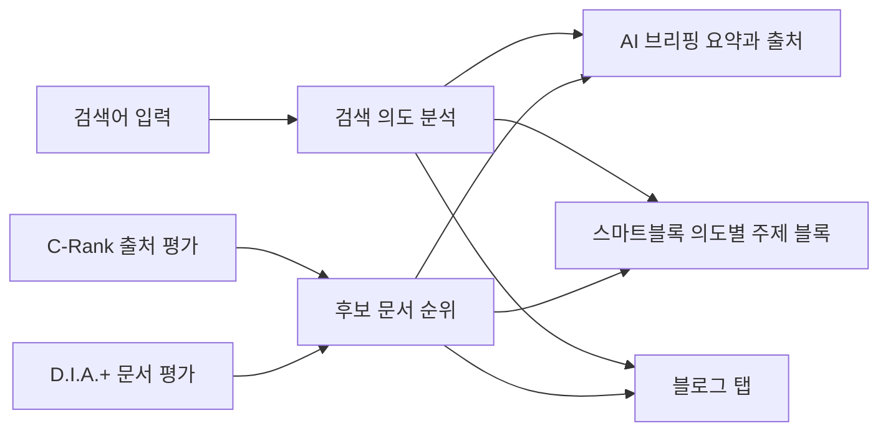

# 네이버 블로그와 검색 구조

> **학습 목표**: 네이버 통합검색이 스마트블록·블로그 탭·AI 브리핑으로 결과를 짜는 방식을 설명하고, 네이버가 공개한 C-Rank와 D.I.A.(+)의 뜻을 구분하며, 블로그를 주제에 맞게 개설하고, 네이버가 저품질·어뷰징으로 다루는 행동과 커뮤니티의 속설을 가려내고, 블로그 통계로 실제로 잴 수 있는 것을 고를 수 있다.

「주제 선정과 독자 설계」에서 정한 주제와 토픽 트리를 네이버 블로그에 옮기는 문서다. 여기서는 **검색이 글을 찾고 고르는 구조**만 다룬다. 글을 어떻게 쓰고 어떤 주기로 운영할지는 「블로그 글쓰기와 운영」, AI 도구 사용과 정책 위험은 「AI 활용 제작과 플랫폼 정책」, 광고성 글 표시와 저작권은 「표시 의무·저작권·세금」에서 다룬다. Google AI Overviews와 비교한 AI 검색 대응은 「AI 검색 · GEO/AEO」를 본다. 모든 내용은 **2026-09 기준**이다. 네이버 도움말과 공식 블로그는 이 작업 환경에서 직접 열리지 않아, 네이버 발표를 전한 기사와 해설을 교차 확인하고 "검색 결과로 확인"이라고 적었다. 네이버는 순위 공식을 공개하지 않으므로, 이 문서의 알고리즘 설명은 **네이버가 밝힌 개념 수준**이다.

## 핵심 개념

| 용어 | 뜻 |
|---|---|
| 통합검색 | 검색어를 입력하면 처음 나오는 결과 화면. 여러 출처의 결과를 블록 단위로 쌓는다 |
| 스마트블록 | 검색 의도를 AI로 나눠, 의도별 주제 블록으로 결과를 묶어 보여 주는 방식. 2021-10 '에어서치'와 함께 공개됐다 |
| 인기글 스마트블록 | 블로그·카페 등 이용자 생성 콘텐츠(UGC)를 모아 보여 주는 블록. 2024-02 기존 VIEW 탭을 대신하며 도입됐다고 보도됐다 |
| 블로그 탭 | 통합검색 위쪽 탭 중 블로그 글만 모아 보는 결과. 2024-02 VIEW 탭이 블로그 탭과 카페 탭으로 나뉘었다 |
| AI 브리핑 | 통합검색 위쪽에 생성형 AI 요약 답변과 근거 출처(블로그 원문 등)를 함께 보여 주는 기능. 2025-03-27 도입 |
| C-Rank | 문서 자체보다 **문서를 만든 출처(블로그)의 신뢰도**를 평가하는 개념. 2016년 도입 |
| D.I.A. / D.I.A.+ | 키워드별로 사용자가 선호한 문서의 특성을 학습해 **문서**의 점수를 매기는 모델. D.I.A.는 2018년, D.I.A.+는 2020년 적용으로 알려져 있다 |
| 네이버 인플루언서 | 주제별 창작자를 선정해 인플루언서 검색 결과와 인플루언서 홈에 노출하는 프로그램 |

## 원리

### 통합검색은 어떻게 짜이는가

- **스마트블록**: 네이버는 2021-10 에어서치를 발표하며, 하나의 검색어에 담긴 서로 다른 의도를 AI로 나눠 블록으로 제시한다고 설명했다. 당시 네이버 관계자는 이를 "통합검색의 발전적 해체"라고 표현했다(검색 결과로 확인). 같은 "엑셀 자동화"라도 "초보 입문", "매크로", "함수 모음" 같은 의도별 블록이 따로 생길 수 있다.
- **인기글과 블로그 탭**: 2024-02 VIEW 탭이 없어지고, 블로그·카페 글을 모은 '인기글' 스마트블록이 생겼으며, 탭은 블로그 탭과 카페 탭으로 나뉘었다고 보도됐다(검색 결과로 확인).
- **AI 브리핑**: 2025-03-27 도입됐고, 답변의 근거가 된 블로그 원문을 함께 제시한다. 2025년 말 통합검색 질의의 약 20%에 적용됐고, 네이버는 2026-02 실적 발표에서 2026년 말까지 적용 범위를 약 2배로 넓히겠다고 밝혔다고 보도됐다(검색 결과로 확인).
- **출처 신뢰 표시**: 네이버는 2026-05-14부터 공공기관 등 일부 공식 블로그에 AI가 운영 주체와 다루는 내용을 요약해 주는 'AI 출처 정보'를 붙인다고 발표했다. LLM과 시각언어모델(VLM)로 사이트 성격, 콘텐츠 구성, 디자인·레이아웃까지 분석한다고 설명했다(검색 결과로 확인).

결과 화면이 여러 블록으로 쪼개졌다는 것은, **"1위"라는 하나의 자리가 없다**는 뜻이다. 내 글은 어떤 의도 블록에, 블로그 탭에, 또는 AI 브리핑의 출처 링크로 나타날 수 있고, 각 자리마다 클릭률이 다르다.

### C-Rank: 누가 썼는가

네이버는 2016년 C-Rank를 도입하며, 문서 자체보다 문서의 출처인 블로그의 신뢰도와 인기도를 평가해 순위에 반영한다고 설명했다. 평가 요소로는 **Context**(주제 집중도), **Content**(콘텐츠의 품질), **Chain**(소비·생산의 연쇄 반응, 즉 읽히고 반응을 얻는 정도)이 소개됐다(검색 결과로 확인). 실무적으로 이 설명에서 읽을 수 있는 것은 두 가지다.

1. 한 블로그가 **한 주제를 꾸준히 깊게** 다루면 그 주제에서 출처로서 평가받기 쉽다.
2. 주제가 흩어진 블로그는 어느 주제에서도 출처로 인정받기 어렵다.

가중치와 계산식은 공개되지 않았다.

### D.I.A.와 D.I.A.+: 무엇을 썼는가

D.I.A.(Deep Intent Analysis)는 네이버 데이터로 키워드별 사용자가 선호한 문서의 점수를 순위에 반영하는 모델로 소개됐다. 반영 요소로는 문서의 주제 적합도, 경험 정보, 정보의 충실성, 문서의 의도, 상대적인 어뷰징 척도, 독창성, 적시성이 거론된다. 2020년 말 D.I.A.+는 사용자의 구체적 의도에 맞는 문서와 출처를 찾기 위해 딥 매칭, 패턴 분석, 동적 랭킹을 개선한 것으로 설명됐다(검색 결과로 확인). 요소 목록에 **경험**, **독창성**, **어뷰징 척도**가 함께 들어 있다는 점이 중요하다. 직접 해 본 과정과 화면은 올리고, 남의 글을 재조합하거나 같은 글을 반복하면 내려가는 방향이다.

### AI 브리핑과 출처 선정

AI 브리핑이 어떤 문서를 출처로 고르는지 네이버는 공식 수치를 공개하지 않았다. 다만 두 가지 공개 신호가 있다. 하나는 2026-06 시범 출시한 '네이버 메이트'가 **AI 브리핑 인용 수와 주제별 전문성, 활동성**을 기준으로 창작자를 고른다는 점이고, 다른 하나는 네이버가 검색의 방향을 "신뢰할 수 있는 출처"로 반복해 설명한다는 점이다(검색 결과로 확인). AI 브리핑에 인용되더라도 사용자가 원문을 클릭할지는 별개다. 요약이 있는 결과에서 클릭이 줄어든다는 Google 쪽 조사는 「광고 수익 심화」에서 소개했다.

### 네이버가 저품질·어뷰징으로 보는 것

네이버 블로그 운영정책과 검색 도움말 원문을 직접 열지 못해, 아래는 D.I.A. 요소 설명과 운영정책 관련 보도에서 확인한 **범주**다.

| 유형 | 예 | 연결된 근거 |
|---|---|---|
| 반복·복제 | 같은 글을 제목만 바꿔 여러 번 발행, 남의 글을 옮겨 붙이기 | D.I.A. 요소의 독창성·어뷰징 척도 |
| 키워드 채우기 | 본문과 상관없는 인기 키워드 나열, 같은 키워드 과다 반복 | 주제 적합도·문서 의도 |
| 대량 자동 생성 | 짧은 간격으로 비슷한 구조의 글을 대량 발행 | 어뷰징 척도. AI 사용 자체보다 대량·저가치 패턴이 문제로 설명된다 |
| 반응 조작 | 매크로·프로그램으로 공감·댓글·이웃·방문 부풀리기 | 운영정책의 금지 행위(검색 결과로 확인) |
| 대가 미표시 | 협찬·체험단 글에 경제적 이해관계를 숨기기 | 공정위 추천·보증 심사지침(2024-12-01 시행: 제목 또는 첫 부분에 표시) |
| 권리 침해 | 무단 이미지·영상·폰트 사용 | 저작권 신고에 따른 게시 중단 |

AI 생성 콘텐츠에 대해서는, 네이버가 2025-05 블로그·카페 등에 'AI 활용' 표시 기능을 도입했고 블로그에서는 표시가 자율이라고 보도됐다(검색 결과로 확인). "AI로 쓴 글은 자동으로 검색에서 제외된다"는 네이버의 공식 문서는 찾지 못했다. AI 사용의 경계는 「AI 활용 제작과 플랫폼 정책」에서, 광고성 글의 기준과 표시 방법은 「표시 의무·저작권·세금」과 「법 · 윤리 · 광고 표시」에서 다룬다.

## 적용: 예시 크리에이터 J의 블로그 개설

J는 D0(2026-10-05) 전에 블로그를 연다. 메뉴 이름은 2026-09 화면 기준이며 바뀔 수 있다.

| 설정 | J의 선택 | 이유 |
|---|---|---|
| 블로그 이름·별명 | 주제가 드러나는 이름 (예: "J의 업무 자동화 노트") | 검색 결과와 AI 출처 정보에서 무엇을 다루는 블로그인지 보이게 |
| 프로필 소개 | 직장인, 매일 엑셀·AI 도구로 반복 업무를 줄이는 사람, 다루는 범위 | 얼굴은 없어도 경험의 출처를 밝힌다 |
| 블로그 주제 | 관리 화면의 블로그 주제에서 IT·컴퓨터 계열 선택 | C-Rank의 Context 설명과 맞춘다 |
| 카테고리 | 토픽 트리의 클러스터 3개 = 카테고리 3개 (엑셀 반복 작업, AI 도구로 문서 작업, 보고서 자동화) + 공지 | 카테고리 하나가 한 클러스터 |
| 글별 주제 | 발행할 때 글마다 같은 주제 분야 선택 | 블로그 주제와 글 주제를 일치시킨다 |
| 자료 배포 | 무료 템플릿은 글 안 다운로드 안내로 제공 | 「자체 상품 수익: 강의·전자책·템플릿」의 첫 단계 |

J가 첫 4주 동안 하지 않는 것: 다른 주제의 일상 글 섞기, 같은 튜토리얼을 제목만 바꿔 다시 올리기, 이웃 늘리기 프로그램, 한 번에 여러 글 몰아 발행하기. 글 구성과 발행 주기는 「블로그 글쓰기와 운영」을 따른다.

J는 매주 월요일 블로그 통계에서 세 가지만 기록한다. 지난주 글별 조회수, 검색 유입 비중과 상위 유입 검색어, 무료 템플릿 안내 글의 조회수. 이 기록이 「채널 90일 실행 계획」의 D30·D60·D90 판단 자료가 된다.

## 심화

### 네이버 인플루언서

네이버 인플루언서는 주제 하나를 골라 신청하고 심사를 거쳐 선정되는 창작자 프로그램이다. 선정되면 인플루언서 홈이 생기고, 통합검색의 인플루언서 관련 블록과 인플루언서 탭에 콘텐츠가 노출될 수 있다. 네이버의 랭킹 개편 공지를 전한 자료에 따르면 인플루언서 주제 랭킹에는 서비스 활성도, 사용자 피드백, 창작자 영향력, 팬 수와 함께 **문서 품질**이 반영된다(검색 결과로 확인). 선정되면 브랜드와 창작자를 연결하는 '브랜드 커넥트'를 쓸 수 있다.

신청 기준으로 "게시물 N개, 최근 3개월 N개" 같은 숫자가 돌지만 네이버가 공개한 기준이 아니다. J는 첫 90일에 신청하지 않는다. 한 주제로 글이 충분히 쌓이고 블로그 통계에서 검색 유입이 안정된 뒤 검토한다.

### 속설과 문서화된 것

| 주장 | 상태 | 근거 |
|---|---|---|
| "블로그 지수(최적·준최 N단계)가 있다" | 네이버 공식 용어가 아니다 | 외부 업체가 자체 모델로 만든 추정값이다. 2025-11 네이버 RSS 접근 방식 변경 뒤 지수 조회 서비스들이 중단됐다(검색 결과로 확인) |
| "저품질에 걸렸다" | 네이버가 공개한 상태값이 아니다 | 노출 급감을 부르는 커뮤니티 표현이다. 원인은 정책 위반, 문서·출처 평가 변화, 결과 화면 구조 변화(스마트블록·AI 브리핑), 경쟁 글 증가 등 여러 가지일 수 있다 |
| "1일 1포스팅을 끊으면 순위가 떨어진다" | 문서화되지 않았다 | C-Rank 설명에 활동과 반응(Chain)이 있지만 빈도 공식은 없다 |
| "글자 수 N자, 사진 N장 이상이어야 한다" | 문서화되지 않았다 | D.I.A. 요소는 정보의 충실성이지 분량 기준이 아니다 |
| C-Rank, D.I.A.(+) 개념 | 네이버가 설명한 개념 | 2016, 2018, 2020 발표(검색 결과로 확인) |
| 스마트블록, 블로그·카페 탭 분리, AI 브리핑 | 네이버 발표 | 2021-10, 2024-02, 2025-03-27 |

### 블로그 통계로 실제로 잴 수 있는 것

| 잴 수 있는 것 | 쓰는 곳 |
|---|---|
| 조회수·방문자 수 추이 (일·주·월) | 발행 주기와 반응의 관계 보기 |
| 유입 경로와 유입 검색어 | 어떤 검색 의도로 들어오는지, 토픽 트리의 다음 글 고르기 |
| 성별·연령·기기 분포 | 페르소나 검증 (「주제 선정과 독자 설계」) |
| 글별 조회수 순위 | 클러스터별 성과 비교 |
| 크리에이터 어드바이저 트렌드 | 주제 분야의 최근 검색어 |

잴 수 없는 것도 분명히 알아 둔다. 내 글의 **순위 점수, C-Rank 값, "지수"는 어떤 공식 화면에도 없다.** 외부 도구가 보여 주는 값은 추정이다. 통계 항목 이름은 2026-09 화면 기준이며 바뀔 수 있다.

## 흔한 오해

- **"네이버는 1위 자리 하나를 두고 경쟁한다"** — 결과가 의도별 스마트블록, 블로그 탭, AI 브리핑 출처로 나뉜다.
- **"C-Rank 점수를 확인할 수 있다"** — 네이버는 개념만 설명했고 점수를 공개하지 않는다.
- **"AI로 쓴 글은 무조건 검색에서 빠진다"** — 그런 공식 문서는 찾지 못했다. 반복·대량·저가치 패턴이 문제다.
- **"블로그 지수 사이트가 멈췄으니 네이버가 지수를 없앴다"** — 원래 네이버 지수가 아니었다.
- **"AI 브리핑에 인용되면 방문자가 늘어난다"** — 인용과 클릭은 별개다. 블로그 통계의 유입으로 확인한다.

## 자기 점검 질문

1. C-Rank와 D.I.A.+는 각각 "누구"와 "무엇" 중 어느 쪽을 평가하는가? 주제가 흩어진 블로그에 불리한 쪽은?
2. 2024-02 VIEW 탭 변경 뒤, 블로그 글이 검색 결과에 나타날 수 있는 자리 세 가지는?
3. J가 카테고리를 토픽 트리의 클러스터와 일치시킨 이유를 C-Rank 설명과 연결해 말해 보라.
4. "저품질에 걸렸다"고 느낄 때, 블로그 통계에서 먼저 확인할 것 두 가지와 속설 대신 점검할 원인 세 가지는?
5. 네이버 인플루언서 신청을 첫 90일 뒤로 미루는 이유는?

## 참고 자료

- [네이버, 새로운 검색경험 제공하는 '에어서치' 선보인다](https://navercorp.com/media/pressReleasesDetail?seq=30604) — NAVER Corp. 보도자료, 2021-10, 검색 결과로 확인 (2026-09-30)
- [네이버, 20년 만에 검색 갈아엎는다](https://byline.network/2021/10/26-173/) — 바이라인네트워크, 2021-10-26, 검색 결과로 확인 (2026-09-30)
- [네이버 VIEW, '인기글' 스마트블록으로 전환…블로그·카페 탭 분리](https://www.etnews.com/20240201000022) — 전자신문, 2024-02-01, 검색 결과로 확인 (2026-09-30)
- [네이버, 27일 검색창에 'AI 브리핑' 도입](https://biz.newdaily.co.kr/site/data/html/2025/03/24/2025032400067.html) — 뉴데일리, 2025-03-24, 검색 결과로 확인 (2026-09-30)
- [네이버 "AI 브리핑 연말까지 2배 확대"](https://www.sentv.co.kr/article/view/sentv202602060034) — 서울경제TV, 2026-02-06, 검색 결과로 확인 (2026-09-30)
- [네이버 AI 브리핑, 검색을 요약에서 탐색으로 확장하다](https://blog.nasmedia.co.kr/entry/2604naspick) — 나스미디어, 2026-04, 검색 결과로 확인 (2026-09-30)
- ["이 정보 믿어도 될까"…네이버 AI가 블로그 정체 알려준다](https://www.newsis.com/view/NISX20260507_0003620731) — 뉴시스, 2026-05-07, 검색 결과로 확인 (2026-09-30)
- [검색 신뢰도 집중하는 네이버…AI로 '믿을 수 있는' 출처 가려낸다](https://www.news1.kr/it-science/general-it/6164096) — 뉴스1, 검색 결과로 확인 (2026-09-30)
- [네이버, AI가 인용한 창작자 3000명 공개…'네이버 메이트' 시작](https://www.edaily.co.kr/News/Read?newsId=03466966645478440) — 이데일리, 2026-06, 검색 결과로 확인 (2026-09-30)
- [네이버의 최신 검색 상위 랭킹 로직 – 다이아 (D.I.A.)](https://www.twinword.co.kr/blog/naver-seo-d-i-a/) — 트윈워드, 검색 결과로 확인 (2026-09-30). 네이버 서치 공식 블로그 설명을 인용한 해설
- [네이버 SEO(2편) 알고리즘과 검색엔진시스템 총정리](https://www.ascentkorea.com/naver_seo_strategies_2/) — 어센트코리아, 검색 결과로 확인 (2026-09-30). C-Rank·D.I.A.+ 설명 인용
- ["AI로 만든 콘텐츠입니다"⋯네이버 'AI 활용 콘텐츠' 표시 도입](https://news.nate.com/view/20250520n29594) — 네이트 뉴스, 2025-05-20, 검색 결과로 확인 (2026-09-30)
- [네이버, AI 생성물 표기 이중 기준...쇼핑은 의무·블로그는 자율](https://news.mtn.co.kr/news-detail/2026072417015682342) — MTN, 2026-07-24, 검색 결과로 확인 (2026-09-30)
- [블덱스 서비스 종료 및 환불 사태, '네이버 최적·준최 지수 폐지?' 팩트체크 총정리](https://www.i-boss.co.kr/ab-6141-68793) — 아이보스, 검색 결과로 확인 (2026-09-30)
- [네이버, 인플루언서 검색 알고리즘 변경... 문서 품질도 중요해져](https://gobooki.net/%EB%84%A4%EC%9D%B4%EB%B2%84-%EC%9D%B8%ED%94%8C%EB%A3%A8%EC%96%B8%EC%84%9C-%EA%B2%80%EC%83%89-%EC%95%8C%EA%B3%A0%EB%A6%AC%EC%A6%98-%EB%B3%80%EA%B2%BD/) — 거북이 미디어 전략 연구소, 검색 결과로 확인 (2026-09-30)
- [대가 받은 블로그·후기글 제목·첫부분에 '광고'·'협찬' 명시해야](https://www.ajunews.com/view/20241115102251443) — 아주경제, 2024-11-15, 검색 결과로 확인 (2026-09-30)
