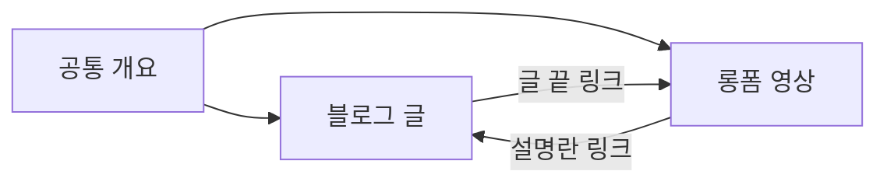

# 블로그 글쓰기와 운영: 하나의 개요로 검색 독자에게 답하기

> **학습 목표**: 네이버 블로그 글 한 편을 제목·첫 화면·구조·이미지·표·다운로드로 나눠 설계하고, 검색 의도에 맞춰 키워드 반복 없이 쓰며, 발행 전 체크리스트와 리프레시 루틴, 블로그 통계로 글을 개선할 수 있다.

이 문서는 **글을 쓰고 블로그를 굴리는 기술**을 다룬다. 네이버 검색이 문서를 어떻게 찾고 순위를 매기는지(C-Rank, D.I.A.+, 스마트블록, AI 브리핑)는 「네이버 블로그와 검색 구조」에서, 누구를 위해 쓸지는 「주제 선정과 독자 설계」에서 다룬다. AI 도구를 쓸 때의 정책 위험은 「AI 활용 제작과 플랫폼 정책」, 이미지·폰트 저작권과 광고 표시는 「표시 의무·저작권·세금」을 본다. 네이버 블로그의 메뉴 이름과 기능은 **2026-09 기준**이며, 앱 업데이트로 바뀔 수 있다.

> **AI로 쓰기**: 조사·초안·이미지·검수에 쓰는 AI 도구와 튜토리얼 링크는 「AI로 블로그 글 만들기: 도구와 튜토리얼」에 모았다.

## 핵심 개념

| 용어 | 뜻 | 이 문서에서의 쓰임 |
|---|---|---|
| 검색 의도 | 검색어 뒤에 있는 "지금 해결하고 싶은 일" | 제목과 첫 화면을 정하는 기준 |
| 첫 화면 | 스크롤하지 않고 보이는 제목 아래 영역 (대부분 모바일) | 결론·답을 먼저 둔다 |
| 개요(outline) | 소제목과 각 소제목의 핵심 한 줄로 된 설계도 | 블로그 글과 영상 대본이 공유한다 |
| 템플릿 | 매번 같은 순서로 채우는 글 틀 | 품질의 바닥을 고정한다 |
| 키워드 스터핑 | 검색어를 부자연스럽게 반복해 넣는 것 | 하지 않는다 |
| 리프레시 | 이미 발행한 글의 정보·이미지·링크를 최신으로 고치는 일 | 월 1회 루틴 |
| 블로그 통계 | 네이버 블로그가 제공하는 조회수·유입·순위 등 통계 화면 | 무엇을 고칠지 고르는 근거 |

## 원리

### 1. 네이버 글 한 편의 해부도

| 부분 | 역할 | 점검 기준 |
|---|---|---|
| 제목 | 검색어와 약속을 함께 보여 준다 | 독자가 검색할 말 + 무엇을 얻는지. 과장·낚시 표현 없음 |
| 첫 화면 | 답을 먼저 준다 | 3~5줄 안에 결론, 누구에게 맞는 글인지, 걸리는 시간 |
| 소제목 구조 | 훑어보는 독자에게 지도가 된다 | 단계·비교·주의로 나눈 3~7개 소제목 |
| 이미지와 캡션 | 직접 해 봤다는 증거이자 설명 | 직접 찍은 화면. 캡션에 "무엇을 봐야 하는지" 한 줄 |
| 표 | 비교·설정값을 한눈에 | 3열 이하, 모바일에서 옆으로 밀지 않아도 읽히는 크기 |
| 체크리스트·템플릿 다운로드 | 글을 읽은 뒤 바로 쓸 결과물 | 파일 첨부 또는 링크. 무료 배포 조건을 글에 적는다 |
| 마무리 | 다음 행동 | 관련 글·영상 링크 1~2개, 질문 유도 한 줄 |

이미지는 **직접 만든 화면 캡처**를 기본으로 한다. 다른 사람의 이미지, 유료 폰트로 만든 썸네일, 인터넷에서 가져온 아이콘은 권리 확인이 필요하다 (「표시 의무·저작권·세금」). 캡처에 개인 이메일·회사 파일명·고객 데이터가 보이지 않는지 확인하는 일도 이미지 점검에 넣는다.

### 2. 검색 의도에 맞춰 쓰기: 키워드를 반복하지 않고

검색어 하나에는 보통 한 가지 주된 의도가 있다. 의도를 먼저 정하면 글의 형태가 따라온다.

| 의도 | 검색어 예 | 맞는 글 형태 |
|---|---|---|
| 방법형 | "엑셀 중복값 제거" | 단계별 따라 하기 + 결과 화면 |
| 문제 해결형 | "VLOOKUP #N/A 오류" | 원인별 진단표 + 해결 순서 |
| 비교형 | "엑셀 파워쿼리 vs 매크로" | 기준표 + 상황별 추천 |
| 개념형 | "파워쿼리란" | 정의 → 예시 → 언제 쓰는지 |

- **나쁜 예**: 제목·첫 문단·모든 소제목·이미지 설명에 "엑셀 중복값 제거"를 똑같이 반복하고, 본문에서 같은 말을 여러 번 되풀이한다.
- **좋은 예**: 제목에 검색어를 한 번 자연스럽게 넣고, 본문은 "중복 행", "고유 값만 남기기", "UNIQUE 함수"처럼 독자가 실제로 쓰는 다른 표현으로 설명한다. 검색어보다 **질문에 끝까지 답했는지**를 먼저 본다.

검색엔진이 문서를 어떻게 평가하는지의 세부는 「네이버 블로그와 검색 구조」에 있다. 이 문서의 원칙은 단순하다: 독자가 이 글 하나로 일을 끝낼 수 있게 쓴다.

### 3. 글 템플릿

```text
[제목] {검색어} — {얻는 결과} ({대상/버전})
[첫 화면] 결론 2~3줄 / 이런 분께 맞다 / 소요 시간 / 준비물
[소제목 1] 먼저 결과 보기: 완성 화면 1장 + 캡션
[소제목 2] 단계별 방법: 1단계 ~ n단계 (단계마다 캡처 1장)
[소제목 3] 자주 막히는 곳: 오류 → 원인 → 해결 표
[소제목 4] 응용: 비슷한 상황 1~2개
[다운로드] 실습 파일·체크리스트 (배포 조건 한 줄)
[마무리] 관련 글·영상 링크 / 버전·확인 날짜 / 질문 받기
```

### 4. 발행 전 편집 체크리스트

- [ ] 제목만 읽고도 무엇을 얻는지 알 수 있다.
- [ ] 첫 화면에 결론이 있다. "안녕하세요, 오늘은…" 같은 인사가 결론보다 앞에 길게 오지 않는다.
- [ ] 모든 단계를 **직접 다시 따라 해서** 같은 결과가 나왔다.
- [ ] 숫자·버전·메뉴 이름을 공식 문서나 실제 화면으로 확인했고, 확인 날짜를 적었다.
- [ ] 캡처에 개인정보·회사 정보가 없다.
- [ ] 이미지·폰트·아이콘의 출처와 사용 조건을 확인했다.
- [ ] 제휴 링크나 협찬이 있으면 첫 화면에 표시했다 (「표시 의무·저작권·세금」).
- [ ] 모바일 미리보기로 표와 이미지가 읽히는지 봤다.
- [ ] 관련 글·영상 링크가 살아 있다.

### 5. 업데이트와 리프레시 루틴

튜토리얼 글은 도구가 바뀌면 틀린 글이 된다. 새 글만 쓰는 대신 **정해진 주기로 옛 글을 고친다**.

| 주기 | 할 일 | 판단 근거 |
|---|---|---|
| 매주 | 새 댓글의 질문에 답하고, 반복되는 질문은 본문에 추가 | 댓글 |
| 매월 | 조회수 상위 글의 버전·메뉴 이름·링크 점검 | 블로그 통계의 게시물 순위 |
| 분기 | 같은 질문에 답하는 얇은 글 여러 개를 한 편으로 합치고, 남는 글에서 링크 | 겹치는 주제 목록 |
| 도구 업데이트 때 | 해당 글 상단에 "수정: 날짜, 무엇이 바뀜" 한 줄 | 도구 공지 |

수정이 검색 노출에 어떤 영향을 주는지 네이버가 공식적으로 밝힌 공식은 확인하지 못했다. 그러니 리프레시의 목적은 **노출 요령이 아니라 틀린 정보를 없애는 것**으로 둔다.

### 6. 하나의 개요, 두 개의 결과물

블로그 글과 롱폼 영상을 따로 기획하면 시간이 두 배로 든다. 규칙은 하나다: **개요를 하나 만들고, 글과 영상으로 풀어 쓴다.** 하나의 원천에서 Shorts·상품 모듈까지 만드는 전체 파이프라인은 「원소스 멀티유즈(OSMU) 전략」에서 다루고, 여기서는 글쓰기 쪽의 연결만 본다.



- **블로그 → 유튜브**: "화면으로 따라 하기"가 필요한 단계는 영상 링크로 보낸다.
- **유튜브 → 블로그**: 영상에서 다 보여 주기 어려운 표·수식·복사할 텍스트·실습 파일은 글이 맡고, 설명란에서 글로 보낸다.
- 글은 읽고 복사하는 용도, 영상은 보고 따라 하는 용도다. 같은 문장을 그대로 옮기지 않는다.

### 7. 블로그 통계로 측정하기

네이버 블로그는 관리 화면과 앱에서 블로그 통계를 제공한다. 메뉴 구성은 바뀔 수 있으니, 다음 **질문**을 기준으로 해당 화면을 찾는다.

| 질문 | 볼 통계 (메뉴 이름은 예시) | 행동 |
|---|---|---|
| 어떤 글이 읽히나? | 게시물별 조회수 순위 | 상위 글을 먼저 리프레시 |
| 어디서 오나? | 유입 경로, 유입 검색어 | 예상과 다른 검색어는 새 글 후보 |
| 끝까지 읽나? | 평균 사용 시간 등 체류 지표 | 짧으면 첫 화면과 구조를 고친다 |
| 다시 오나? | 재방문·이웃 방문 관련 지표 | 시리즈·내부 링크 강화 |

통계는 **주 1회 같은 요일에** 본다. 하루 단위 변동에 반응하면 글을 고치는 시간보다 통계를 보는 시간이 길어진다.

### 8. 글쓰기에서 AI를 쓰는 자리

| 단계 | AI에게 맡길 수 있는 일 | 사람이 반드시 할 일 |
|---|---|---|
| 개요 | 독자 질문 목록, 소제목 후보 | 실제로 해 본 순서로 고치기 |
| 초안 | 단계 설명 문장 다듬기, 표 틀 | 모든 단계를 직접 재현하고 캡처 |
| 사실 확인 | 확인할 주장 목록 뽑기 | 공식 문서·실제 화면으로 확인, 출처와 날짜 적기 |
| 발행 전 | 맞춤법·중복 문장 점검 | 경험과 판단이 담긴 문장을 사람이 쓰기 |

AI가 쓴 문장은 그럴듯하지만 **메뉴 이름·함수 인수·버전**을 틀리기 쉽다. 발행 전 "AI가 쓴 사실 주장 = 아직 확인 안 된 주장"으로 취급한다. 네이버는 2025-05 블로그 등에 'AI 활용' 표기 기능을 도입했고, 2026-07 보도 기준으로 블로그에서는 표기가 자율이다. 이런 표기와 대량 발행에 대한 정책은 「AI 활용 제작과 플랫폼 정책」에서 다룬다.

## 적용: 예시 크리에이터 J의 블로그 한 주

예시 크리에이터 J는 주 10시간 중 블로그에 약 2시간을 쓴다. 영상과 공유하는 개요 작업은 「원소스 멀티유즈(OSMU) 전략」의 원천 패키지 시간에 들어가며, 주간 배분 전체는 그 문서에 있다. D0는 2026-10-05(월)이다.

| 요일 | 블로그 작업 | 시간 (가정) |
|---|---|---|
| 토 (전주 주말) | 공통 개요 작성 (영상과 공유) | 원천 패키지 시간에 포함 |
| 월 | 블로그 통계 확인, 댓글 질문 정리, 옛 글 1편 리프레시 | 0.5 |
| 월~화 | 개요로 글 초안, 단계 캡처, 실습 파일 준비 | 1.0 |
| 수 | 체크리스트 점검 후 발행, 화요일에 올린 영상 삽입 | 0.5 |

첫 글의 예 (가정):

- **제목**: "엑셀 중복값 한 번에 지우기 — 3가지 방법 비교 (Microsoft 365 기준)"
- **첫 화면**: "데이터가 1,000행 이하면 [중복된 항목 제거], 원본을 남겨야 하면 UNIQUE 함수, 매주 같은 작업을 반복하면 파워쿼리가 맞습니다. 따라 하는 데 10분, 실습 파일은 글 아래에 있습니다."
- **다운로드**: 실습용 엑셀 파일 + "중복 제거 전 확인할 5가지" 체크리스트. 이것이 나중의 무료 템플릿 → 유료 템플릿 팩으로 이어진다 (「자체 상품 수익: 강의·전자책·템플릿」).

J는 AI로 개요 후보와 문장 다듬기를 하지만, 모든 단계를 자기 PC에서 다시 따라 하고 캡처한다. AI가 제안한 함수 설명은 Microsoft 공식 도움말과 대조한 뒤에만 남긴다.

## 심화

### 시리즈와 허브 글

같은 주제의 글이 5편을 넘으면 "엑셀 자동화 입문 목차" 같은 **허브 글**을 만들고 각 글에서 허브로, 허브에서 각 글로 링크한다. 독자는 다음 글을 찾기 쉬워지고, 운영자는 빠진 주제를 한눈에 본다.

### 얇은 글을 합치는 기준

같은 질문에 답하는 짧은 글이 여러 편이면 독자는 어느 글을 봐야 할지 모른다. 조회수가 가장 높은 글에 내용을 합치고, 나머지 글 상단에는 합친 글로 가는 링크를 둔다. 글을 지울지 남길지는 기존 링크와 댓글을 보고 정한다.

### 다른 블로그 플랫폼과의 차이 한 줄

티스토리나 워드프레스처럼 광고 코드와 도메인을 직접 다루는 플랫폼도 있지만, 이 섹션은 검색 유입이 네이버에 모여 있는 초보자를 기준으로 네이버 블로그만 다룬다.

## 흔한 오해

- **"검색어를 많이 넣을수록 잘 뜬다"** — 반복은 읽기 경험을 망치고, 검색 품질 정책에서 문제가 될 수 있다. 의도에 끝까지 답하는 것이 먼저다.
- **"긴 글이 무조건 유리하다"** — 필요한 것은 길이가 아니라 빠진 단계가 없는 글이다. 첫 화면의 답이 늦으면 긴 글은 오히려 손해다.
- **"AI로 매일 여러 편 쓰면 빨리 큰다"** — 확인되지 않은 사실과 비슷한 글이 쌓인다. 대량 발행의 정책 위험은 「AI 활용 제작과 플랫폼 정책」을 본다.
- **"한 번 쓴 글은 끝"** — 튜토리얼은 도구가 바뀌면 틀린다. 리프레시는 운영의 일부다.
- **"블로그 글과 영상은 따로 기획해야 한다"** — 개요 하나로 둘을 만들면 주 10시간 안에서도 두 채널을 굴릴 수 있다 (「원소스 멀티유즈(OSMU) 전략」).

## 자기 점검 질문

1. "VLOOKUP #N/A 오류"를 검색한 독자에게 맞는 첫 화면 3줄을 써 보라.
2. 키워드 스터핑 없이 검색어를 제목과 본문에 넣는 방법 두 가지는 무엇인가?
3. 조회수 상위 글과 유입 검색어 통계를 보고 각각 어떤 행동을 할 것인가?
4. 같은 개요에서 블로그 글과 영상이 서로 다른 역할을 맡는 부분을 하나씩 들어 보라.
5. AI가 쓴 초안에서 발행 전에 반드시 사람이 확인해야 할 항목 세 가지는?

## 참고 자료

- 네이버 블로그 통계 화면 — 네이버 블로그 앱·관리 화면, 2026-09-30 기준 메뉴 구성은 직접 확인 필요 (도움말 페이지는 접속 불가, 검색 결과로도 세부 항목 확인 안 됨)
- ["AI로 만든 콘텐츠입니다"⋯네이버 'AI 활용 콘텐츠' 표시 도입](https://news.nate.com/view/20250520n29594) — 네이트 뉴스, 2025-05-20, 'AI 활용' 표기 도입 시점, 검색 결과로 확인
- 블로그 표기가 자율이라는 보도 — [네이버, AI 생성물 표기 이중 기준...쇼핑은 의무·블로그는 자율](https://news.mtn.co.kr/news-detail/2026072417015682342) — 머니투데이방송, 2026-07-24, 검색 결과로 확인
- 네이버의 저품질 AI 대량 게시물 대응 보도 — [‘AI 따발총’ 저품질 블로그글…네이버, 제재 강화 방침](https://www.newsverse.kr/news/articleView.html?idxno=9959) — 뉴스버스, 검색 결과로 확인
- [웹사이트에서 생성형 AI 콘텐츠를 사용하는 방법에 관한 Google 검색 안내](https://developers.google.com/search/docs/fundamentals/using-gen-ai-content?hl=ko) — Google Search Central, 검색 결과로 확인 (타 검색엔진의 일반 원칙 참고용)
- [UNIQUE function](https://support.microsoft.com/en-us/office/unique-function-c5ab87fd-30a3-4ce9-9d1a-40204fb85e1e) — Microsoft 지원, 적용 예의 함수 확인용, 검색 결과로 확인
