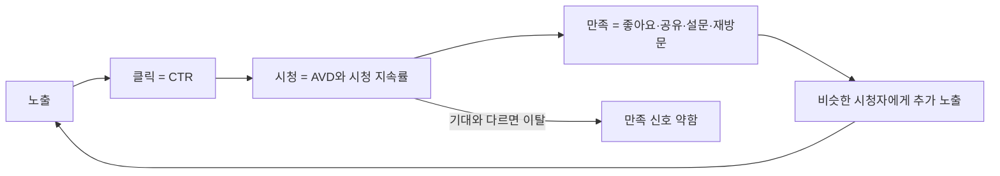

# 유튜브 추천 구조와 채널 설계: 추천은 영상이 아니라 시청자를 따라간다

> **학습 목표**: YouTube가 스스로 설명하는 추천 원리(홈·추천 동영상·검색·Shorts 피드, 만족도 신호)를 설명하고, YouTube Studio의 트래픽 소스와 CTR·평균 시청 지속 시간·시청 지속률을 진단에 쓰며, 약속·포맷 시리즈·재생목록·채널 홈으로 채널을 설계할 수 있다.

이 문서는 **추천 구조와 채널 설계**를 다룬다. 영상 한 편을 만드는 과정은 「롱폼 영상 기획과 제작」, 세로 영상과 얼굴 없는 채널의 제작은 「Shorts와 얼굴 없는 채널」, 수익 조건은 「광고 수익: 애드포스트와 YouTube 파트너 프로그램」에서 다룬다. 채널 주제와 시청자를 정하는 일은 「주제 선정과 독자 설계」가 먼저다. 내용은 **2026-09 기준**이다. YouTube 도움말·How YouTube Works·공식 블로그는 이 문서를 쓰는 환경에서 직접 열리지 않아 검색 결과로 확인했고, 그렇게 표시했다. YouTube가 공개하지 않은 가중치나 기준값은 적지 않았다.

## 핵심 개념

| 용어 | 뜻 | Studio에서 보이는 이름 (예) |
|---|---|---|
| 홈 | 앱을 열었을 때 보이는 개인화 피드 | 탐색 기능(Browse features) |
| 추천 동영상 | 보고 있는 영상 옆·아래·다음에 나오는 영상 | 추천 동영상(Suggested videos) |
| 검색 | 검색어를 입력한 시청자의 결과 목록 | YouTube 검색 |
| Shorts 피드 | 세로 영상을 넘겨 보는 피드 | Shorts 피드 |
| 노출수 | 썸네일이 시청자 화면에 표시된 횟수 | 노출수 |
| 노출 클릭률(CTR) | 노출 중 클릭으로 이어진 비율 | 노출 클릭률 |
| 평균 시청 지속 시간(AVD) | 조회 1회당 평균 시청 시간 | 평균 시청 지속 시간 |
| 시청 지속률 | 영상의 각 지점에 시청자가 남아 있는 비율 | 시청 지속률, 주요 순간 |
| 만족도 신호 | 시청자가 영상에 만족했는지 추정하는 신호 | 직접 보이지 않는다 |

## 원리

### 1. YouTube가 설명하는 추천의 목표와 신호

YouTube는 추천 시스템이 **시청자 한 사람이 보고 싶어 하고 만족할 영상**을 찾는 것이라고 설명한다. 공식 설명(검색 결과로 확인)에서 언급되는 신호는 다음과 같다.

- **클릭**: 무엇을 골랐는가. 다만 클릭만으로는 만족을 알 수 없다고 YouTube 스스로 말한다.
- **시청 시간**: 얼마나 봤는가.
- **설문 응답**: 본 영상을 별점으로 평가하는 설문. 4~5점을 준 시청만 "가치 있는 시청 시간(valued watch time)"으로 센다고 설명한다. 설문에 답하지 않은 사람의 응답은 모델로 예측한다.
- **공유·좋아요·싫어요**: 공유하거나 좋아요를 누른 영상에 더 만족할 가능성이 높고, 싫어요는 즐기지 않았다는 신호다.
- **"관심 없음"** 같은 명시적 피드백.

핵심은 추천이 "좋은 영상"을 전체에 뿌리는 것이 아니라, **이 시청자가 이 순간 만족할 영상**을 고른다는 점이다. 그래서 같은 영상이 어떤 시청자에게는 계속 추천되고 다른 시청자에게는 전혀 나오지 않는다. YouTube 관계자들은 인터뷰와 Creator Insider 영상에서 이를 "알고리즘은 시청자를 따라간다"는 취지로 반복해 설명해 왔다 (검색 결과로 확인).

### 2. 표면마다 시청자가 하는 일이 다르다

| 표면 | 시청자의 상태 | 영상에 필요한 것 |
|---|---|---|
| 홈 | 목적 없이 둘러본다 | 한눈에 이해되는 썸네일·제목, 관심사와의 일치 |
| 추천 동영상 | 방금 본 영상과 이어지는 것을 찾는다 | 앞 영상의 다음 질문에 답하는 주제, 시리즈 |
| 검색 | 이미 해결할 문제가 있다 | 검색어에 맞는 제목, 첫 30초 안의 답 |
| Shorts 피드 | 넘기면서 본다 | 첫 1~2초의 이유, 짧은 완결 구조 (「Shorts와 얼굴 없는 채널」) |
| 채널 페이지·재생목록·알림 | 이미 채널을 안다 | 정리된 재생목록, 일정한 약속 |

YouTube Studio의 트래픽 소스 보고서는 조회를 탐색 기능, 추천 동영상, YouTube 검색, 외부, 채널 페이지, 재생목록, 알림, 직접 또는 알 수 없음 등으로 나눈다. 설명란의 링크로 들어온 조회는 외부가 아니라 추천 동영상 쪽으로 집계된다는 설명이 있다 (검색 결과로 확인). 튜토리얼 채널은 처음에는 검색 비중이 크고, 시청자 반응이 쌓이면서 추천 동영상과 홈 비중이 늘어나는 흐름을 흔히 보지만, 이는 경향일 뿐 정해진 순서는 아니다.

### 3. 크리에이터가 보는 대리 지표: CTR, AVD, 시청 지속률

만족도 신호의 대부분은 크리에이터에게 직접 보이지 않는다. 대신 Studio의 지표를 **만족의 대리 지표**로 읽는다.

- **CTR은 노출된 곳에 따라 달라진다.** YouTube 도움말은 채널과 영상의 절반 정도가 노출 클릭률 2~10% 범위에 있다고 설명한다 (검색 결과로 확인). 노출이 새 시청자에게 넓어지면 CTR은 자연히 내려갈 수 있으므로, CTR 하나만 보고 영상을 판단하지 않는다.
- **AVD = 총 시청 시간 ÷ 조회수.** 10분 영상의 AVD 5분과 20분 영상의 AVD 5분은 의미가 다르므로 시청 지속률(%)과 함께 본다.
- **시청 지속률의 주요 순간**: Studio는 인트로(첫 30초 뒤에도 남아 있는 비율), 상위 순간, 급증, 급감을 표시한다 (검색 결과로 확인). 첫 30초 설계는 「롱폼 영상 기획과 제작」에서 다룬다.
- YouTube의 "Test & Compare"가 CTR이 아니라 **시청 시간**으로 승자를 고르는 것도 같은 방향을 보여 준다. 클릭만 부르고 실망시키는 썸네일은 이기지 못한다.

### 4. YouTube Studio에서 보는 순서

| 질문 | 볼 보고서 | 주의 |
|---|---|---|
| 어디서 보여졌나? | 트래픽 소스 유형 | 소스마다 CTR 기준이 다르다 |
| 보여졌을 때 눌렀나? | 노출수, 노출 클릭률 | 노출이 늘면 CTR이 내려가는 것은 정상일 수 있다 |
| 누르고 나서 봤나? | 평균 시청 지속 시간, 시청 지속률, 주요 순간 | 비슷한 길이의 내 영상들과 비교한다 |
| 다시 왔나? | 재방문 시청자, 구독자 증감 | 구독자 수보다 재방문이 채널의 건강을 보여 준다 |
| Shorts는? | Shorts 조회수와 참여 조회수(engaged views) | 2025-03-31부터 Shorts 조회수는 재생·반복 재생 시작 시점부터 센다. YPP와 수익 배분은 기존 기준인 참여 조회수로 계산한다 (검색 결과로 확인) |

### 5. 채널 설계: 약속, 포맷 시리즈, 재생목록, 채널 홈

추천은 영상 단위로 일어나지만, **채널 설계는 시청자가 두 번째 영상을 고르게 만든다.**

- **약속(promise)**: "누구에게, 어떤 문제를, 어떤 방식으로" 한 문장. 모든 영상이 이 문장 안에 들어가야 시청자가 채널을 기억한다.
- **포맷 시리즈**: 같은 틀을 반복하는 연재. 시청자는 틀을 알고 들어오고, 제작자는 기획 시간이 준다.
- **재생목록**: 시리즈마다 하나. 순서가 있는 강의는 1편부터 보도록 정렬한다.
- **채널 트레일러**: 구독하지 않은 방문자에게 채널 홈에서 보여 주는 짧은 소개 영상이다. 한 번 본 시청자에게는 다시 나오지 않는다고 도움말은 설명한다 (검색 결과로 확인).
- **추천 영상(featured video)**: 돌아온 구독자에게 채널 홈에서 보여 줄 영상. 최신 대표 강의를 건다.
- **채널 홈 섹션**: 최대 12개의 맞춤 섹션을 둘 수 있다고 안내된다 (검색 결과로 확인). 시리즈 재생목록을 위에 둔다.

### 6. 롱폼과 Shorts 시청자의 관계

YouTube 측은 Shorts와 롱폼이 **서로 다른 추천 시스템**으로 배포되며, 한쪽 성과가 다른 쪽 추천에 불이익을 주지 않는다고 여러 차례 설명했다 (Shorts 제품 책임자·크리에이터 리에종의 발언, 검색 결과로 확인). 동시에 Shorts만 보는 시청자가 롱폼으로 넘어오는 일은 흔하지 않다는 점도 인정한다. 그래서:

- Shorts 구독자가 늘어도 롱폼 조회가 같은 비율로 늘지 않을 수 있다. 두 숫자를 따로 본다.
- Shorts에서 롱폼으로 보내는 **관련 동영상 링크** 기능을 쓴다 (검색 결과로 확인). 제작 방법은 「Shorts와 얼굴 없는 채널」.
- Shorts 주제는 롱폼의 약속 안에서 고른다. 약속 밖의 유행 Shorts는 롱폼과 무관한 시청자를 모은다.

### 7. 업로드 주기와 품질

YouTube 측은 업로드 빈도 자체가 추천 점수를 올리거나 쉬었다고 벌점을 주지는 않는다는 취지로 설명해 왔다 (Creator Insider 등, 검색 결과로 확인). 추천은 영상마다 시청자 반응으로 판단된다. 주기가 중요한 이유는 알고리즘이 아니라 **사람**에게 있다.

- 시청자는 정해진 요일을 기억하고, 제작자는 루틴이 생긴다.
- 지킬 수 없는 주기는 품질을 떨어뜨리고 결국 멈춘다. **지킬 수 있는 가장 낮은 주기**에서 시작해 올린다.

## 적용: 예시 크리에이터 J의 채널 설계

예시 크리에이터 J는 주 10시간으로 롱폼 강의 1편(8~12분)과 그 영상에서 자른 Shorts 3개를 만든다. D0 = 2026-10-05(월).

- **약속**: "사무직이 매주 반복하는 엑셀 작업을, AI 도구와 함께 10분 안에 자동화하는 법."
- **포맷 시리즈 3개**:

| 시리즈 | 형식 | 예 | 주로 기대하는 표면 |
|---|---|---|---|
| 함수 하나 10분 | 강의 | "XLOOKUP 10분 완성" | 검색 |
| 반복 업무 자동화 실전 | 강의 | "주간 보고서 자동으로 만들기" | 검색 → 추천 동영상 |
| AI 도구 써 보기 | 리뷰 | "엑셀용 AI 도우미 3종 같은 과제로 비교" | 홈·추천 동영상 |

- **재생목록**: 시리즈별 3개 + "처음 오셨다면 여기부터" 1개.
- **트레일러와 홈**: 영상이 5편 정도 쌓일 때까지는 트레일러를 미루고 가장 좋은 강의를 추천 영상으로 건다. 이후 약속을 30~60초로 말하는 트레일러를 만든다 (길이는 J의 선택이다).
- **업로드**: 롱폼은 매주 같은 요일, Shorts는 주중에 나눠 올린다. 시각은 J가 지킬 수 있는 때로 정한다.

매주 일요일 Studio 점검 (진단 예시, 가정):

| 관찰 (가정) | 가능한 해석 | 다음 영상에서 바꿀 것 |
|---|---|---|
| 검색 유입은 있는데 CTR이 비슷한 내 영상보다 낮다 | 제목이 검색어와 약속을 잘 보여 주지 못한다 | 제목 앞부분에 문제 이름 |
| CTR은 높은데 인트로 지속률이 낮다 | 썸네일이 약속한 것과 첫 30초가 다르다 | 첫 30초에 결과 화면 |
| 중반에 급감 | 설명이 길어지는 구간 | 챕터 분리, 화면 전환 |
| Shorts 조회는 많은데 롱폼 유입이 거의 없다 | Shorts 주제가 롱폼과 멀다 | 관련 동영상 링크, 주제 정렬 |

## 심화

### 추천은 "밀어내기"가 아니라 "끌어오기"다

흔한 설명은 "새 영상은 구독자에게 먼저 시험되고, 반응이 좋으면 점점 넓은 원으로 퍼진다"는 것이다. YouTube 성장·발견 담당 디렉터 Todd Beaupré는 인터뷰에서 영상이 공개될 때 누군가에게 "발송"되는 것이 아니라, **시청자가 앱을 열 때마다 그 사람에게 맞는 후보를 끌어온다**는 취지로 설명했고, 첫 시청자도 핵심 구독자로만 한정되지 않는다고 말했다 (검색 결과로 확인). 확산 단계의 규모나 기간에 대한 공식 숫자는 없다. 그래서 첫 48시간의 숫자만으로 영상을 판정하지 않고, 몇 주에 걸친 검색·추천 유입을 본다.

### 채널 단위가 아니라 영상 단위

YouTube 크리에이터 리에종은 추천이 채널 전체가 아니라 영상과 주제 단위로 판단된다는 취지로 설명했다 (검색 결과로 확인). 성과가 낮은 영상 하나가 다음 영상을 "벌주는" 구조가 아니라는 뜻이다. 다만 채널 구독자가 반응하지 않는 주제를 계속 올리면, 새 영상의 첫 시청자 반응이 약해지는 것은 자연스러운 결과다.

### 개인화가 비교를 어렵게 만든다

같은 영상도 시청자 집단마다 CTR과 지속률이 다르다. 남의 채널 평균과 비교하기보다 **비슷한 길이·주제의 내 영상들**과 비교하는 편이 신호가 깨끗하다. Studio의 "일반적인" 비교선도 내 최근 영상을 기준으로 한다.

## 흔한 오해

- **"업로드 시각을 맞추면 알고리즘이 밀어 준다"** — YouTube는 게시 시각이 장기 성과에 영향을 준다고 알려져 있지 않다고 설명한다. 시청자가 활동하는 시간에 올리면 초기 조회가 조금 빨리 올 수 있을 뿐이다 (검색 결과로 확인).
- **"태그를 많이 달아야 뜬다"** — YouTube 도움말은 태그가 자주 틀리게 쓰는 단어일 때 유용하고, 그 밖에는 발견에 미치는 역할이 작다고 적는다 (검색 결과로 확인). 제목·설명·영상 내용이 먼저다.
- **"알고리즘이 나를 싫어한다"** — 추천은 영상별로 시청자 반응을 따른다. 조회가 멈췄다면 트래픽 소스·CTR·지속률 중 어디서 멈췄는지 찾는다.
- **"Shorts를 올리면 롱폼이 망한다"** — YouTube는 추천 시스템이 분리돼 있다고 설명한다. 다만 시청자층이 다를 수 있다.
- **"CTR이 높을수록 좋다"** — 기대를 배신하는 썸네일은 CTR을 올려도 시청 시간과 만족을 떨어뜨린다.
- **"쉬면 채널이 죽는다"** — 휴식 자체에 벌점이 있다는 공식 설명은 없다. 시청자의 습관이 약해질 뿐이다.

## 자기 점검 질문

1. YouTube가 "가치 있는 시청 시간"이라고 부르는 것은 무엇이고, 왜 시청 시간만으로 부족한가?
2. 같은 영상의 CTR이 검색과 홈에서 다르게 나오는 이유를 설명해 보라.
3. CTR은 높은데 인트로 지속률이 낮은 영상에서 무엇을 먼저 고칠 것인가?
4. 예시 크리에이터 J의 약속 문장 밖에 있는 영상 주제를 하나 들고, 왜 피해야 하는지 말해 보라.
5. 2025-03-31 이후 Shorts의 조회수와 참여 조회수는 어떻게 다르며, YPP에는 어느 것이 쓰이는가?

## 참고 자료

- [How YouTube recommendations work](https://support.google.com/youtube/answer/16089387?hl=en) — YouTube Help, 검색 결과로 확인
- [On YouTube's recommendation system](https://blog.youtube/inside-youtube/on-youtubes-recommendation-system/) — YouTube Official Blog, 검색 결과로 확인
- [How YouTube Works: Recommendations](https://www.youtube.com/howyoutubeworks/product-features/recommendations/) — YouTube, 2026-09-30 접속 불가
- [Understand your YouTube video reach (traffic sources)](https://support.google.com/youtube/answer/9314355?hl=en) — YouTube Help, 검색 결과로 확인
- [Impressions & click-through-rate FAQs](https://support.google.com/youtube/answer/7628154?hl=en) — YouTube Help, 검색 결과로 확인
- [Measure key moments for audience retention](https://support.google.com/youtube/answer/9314415?hl=en) — YouTube Help, 검색 결과로 확인
- [A/B test titles & thumbnails](https://support.google.com/youtube/answer/16391400?hl=en) — YouTube Help, 검색 결과로 확인
- [Customize your YouTube channel layout](https://support.google.com/youtube/answer/3219384?hl=en) — YouTube Help, 검색 결과로 확인
- [Add tags to your YouTube videos](https://support.google.com/youtube/answer/146402?hl=en) — YouTube Help, 검색 결과로 확인
- [YouTube changes how Shorts views are counted from March 31](https://ppc.land/youtube-changes-how-shorts-views-are-counted-from-march-31/) — PPC Land, 2025-03, 검색 결과로 확인
- [How to convert YouTube Shorts views into long-form channel growth](https://blog.youtube/creator-and-artist-stories/youtube-related-videos-traffic-guide/) — YouTube Official Blog, 검색 결과로 확인
- [Do YouTube Shorts Hurt Your Long-Form Videos? What YouTube Actually Said](https://creaticalc.com/blog/do-youtube-shorts-hurt-long-form) — CreatiCalc, YouTube 관계자 발언 정리 (2차 자료), 검색 결과로 확인
- [Subscribers skip 90% of uploads in their feed, YouTube director says](https://ppc.land/subscribers-skip-90-of-uploads-in-their-feed-youtube-director-says/) — PPC Land, Todd Beaupré 발언 정리 (2차 자료), 검색 결과로 확인
- Creator Insider 채널의 알고리즘 Q&A 영상들 — YouTube, 개별 영상은 접속 불가로 검색 결과의 인용만 확인
