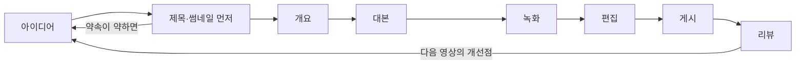

# 롱폼 영상 기획과 제작: 강의·리뷰 영상의 파이프라인

> **학습 목표**: 아이디어부터 리뷰까지의 롱폼 제작 파이프라인을 강의형·리뷰형 영상에 적용하고, 첫 30초와 챕터 구조로 시청 지속을 설계하며, 얼굴 없는 튜토리얼에 맞는 화면 녹화·오디오 장비와 편집 도구를 예산에 맞춰 고르고, 자막·챕터·Test & Compare까지 체크리스트로 마무리할 수 있다.

이 문서는 **8~20분 안팎의 가로 영상 한 편을 만드는 과정**을 다룬다. 추천이 어떻게 작동하고 Studio 지표를 어떻게 읽는지는 「유튜브 추천 구조와 채널 설계」, Shorts와 얼굴 없는 형식의 세부는 「Shorts와 얼굴 없는 채널」, AI 음성·AI 편집의 정책 위험은 「AI 활용 제작과 플랫폼 정책」, 배경음악·폰트·화면 속 저작물은 「표시 의무·저작권·세금」에서 다룬다. 도구의 기능과 가격, YouTube 기능은 **2026-09 기준**이며, 장비 예산은 모두 **예시 범위**다.

## 핵심 개념

| 단계 | 산출물 | 강의형 (예: 엑셀 함수 강의) | 리뷰형 (예: AI 도구 비교) |
|---|---|---|---|
| 아이디어 | 시청자 질문 1개 | "XLOOKUP은 어떻게 쓰나?" | "엑셀용 AI 도우미 중 뭘 써야 하나?" |
| 제목·썸네일 먼저 | 제목 후보 3개, 썸네일 스케치 | 결과 화면 + 문제 이름 | 비교 대상 + 판정 |
| 개요 | 챕터 목록 | 결과 → 단계 → 실수 → 응용 | 결론 → 기준 → 결과 → 추천 |
| 대본 | 읽을 문장 또는 말할 요점 | 단계별 설명 문장 | 테스트 과정과 판단 근거 |
| 녹화 | 화면 녹화 + 음성 | 같은 파일로 처음부터 끝까지 | 같은 과제를 도구마다 반복 |
| 편집 | 완성본 | 군더더기 삭제, 확대 | 결과 비교 화면 |
| 게시 | 제목·썸네일·설명·자막·챕터 | 실습 파일 링크 | 협찬·제휴 여부 표시 |
| 리뷰 | 다음 영상에 반영할 한 가지 | 시청 지속률 급감 지점 | 댓글의 반론·추가 질문 |

## 원리

### 1. 파이프라인 전체



각 단계는 앞 단계의 약속을 지키는지 확인한다. 녹화 뒤에 기획을 고치면 비용이 가장 크다. 그래서 **바꾸기 싼 앞 단계에서 많이 버린다.**

### 2. 제목·썸네일을 먼저 정하는 이유

제목과 썸네일은 시청자에게 하는 약속이다. 약속을 먼저 쓰면 두 가지가 생긴다.

- **아이디어 검증**: 누를 이유가 있는 제목을 세 개 쓰지 못하면 아이디어가 약하다. 찍기 전에 버린다.
- **내용의 기준**: 영상은 이 약속을 첫 30초에 확인시키고 끝까지 지켜야 한다. 약속보다 과한 썸네일은 CTR을 올려도 시청 지속과 만족을 떨어뜨린다 (「유튜브 추천 구조와 채널 설계」).

얼굴 없는 채널의 썸네일은 **결과 화면 + 짧은 문구 2~4단어**가 기본이다. 작은 화면에서도 읽히는지 축소해서 확인한다.

### 3. 훅과 첫 30초

YouTube Studio는 시청 지속률의 "인트로" 지점으로 첫 30초 뒤에도 남아 있는 시청자 비율을 보여 준다 (검색 결과로 확인). 첫 30초의 일은 **"이 영상이 내가 찾던 그것"이라는 확인**이다.

| 구간 (예시) | 강의형 | 리뷰형 |
|---|---|---|
| 0~5초 | 완성 결과 화면: "이 표가 버튼 한 번에 만들어집니다" | 판정 먼저: "세 도구 중 하나만 추천합니다" |
| 5~20초 | 누구에게, 무엇을, 몇 분 안에 | 어떤 과제로, 어떤 기준으로 비교했나 |
| 20~30초 | 바로 1단계 시작 | 첫 번째 테스트 시작 |

피할 것: 긴 로고 애니메이션, 결론 없는 인사말, 영상 시작부터 구독·좋아요 요청, 썸네일에 없던 주제로 시작하기. 구간 길이는 규칙이 아니라 예시다. 내 영상의 인트로 지속률로 맞춰 간다.

### 4. 시청 지속을 위한 구조: 챕터와 패턴 브레이크

- **챕터**: 개요의 소제목이 곧 챕터다. 시청자가 필요한 부분으로 건너뛸 수 있어 오히려 끝까지 쓸모 있는 영상이 된다.
- **흐름**: 강의형은 결과 먼저 → 준비 → 단계 1~n → 자주 하는 실수 → 응용 → 다음 영상 안내. 리뷰형은 결론 먼저 → 테스트 기준 → 도구별 결과 → 누구에게 맞나 → 한계와 표시 사항.
- **패턴 브레이크**: 같은 화면이 오래 이어지면 시청자가 떠나기 쉽다. 화면 확대, before/after 분할, 요약 카드, 짧은 퀴즈("여기서 무엇이 틀렸을까요?")로 리듬을 바꾼다. 몇 초마다 바꾸라는 공식 기준은 없으니 **시청 지속률의 급감 지점**을 보고 그 앞에 넣는다.

### 5. 대본: 귀로 듣는 문장

- 얼굴 없는 튜토리얼은 목소리와 화면이 전부다. 대본은 **읽는 글이 아니라 듣는 말**로 쓴다: 짧은 문장, 한 문장에 한 동작, "여기, 이 버튼"처럼 화면을 가리키는 말.
- 강의형은 단계 설명까지 완전 대본, 리뷰형은 판정 근거만 완전 대본으로 쓰는 방식이 흔하다. AI로 대본 초안을 만들 수 있지만, 실제로 따라 한 순서와 말투로 고친다. 소리 내어 읽어 걸리는 문장은 녹화 전에 고친다.
- 대본과 녹화 파일은 블로그 글, Shorts, 나중의 강의 상품의 원재료가 된다. 어떤 단위로 잘라 두면 재사용이 쉬운지는 「원소스 멀티유즈(OSMU) 전략」에서 다룬다.

### 6. 화면 녹화와 오디오: 얼굴 없는 튜토리얼

시청자는 흐린 화면보다 **듣기 힘든 소리**에서 먼저 떠난다. 예산은 오디오부터 쓴다.

| 단계 | 구성 (예시) | 예산 (예시 범위, 가격 조사 아님) |
|---|---|---|
| 0단계 | 가진 노트북 + 유선 이어폰 마이크 + 조용한 방 + OBS Studio(무료) | 0원 |
| 1단계 | USB 마이크 + 팝 필터 + 옷장·커튼 등으로 울림 줄이기 | 약 5만~15만 원 |
| 2단계 | 다이내믹 마이크 + 오디오 인터페이스 + 마이크 암 + 모니터링 헤드폰 | 약 20만~50만 원 |
| 3단계 | 보조 모니터, 흡음재, 유료 편집 도구 | 약 50만 원 이상 |

녹화 습관:

- 알림을 끄고, 바탕화면·브라우저 탭·파일명에서 개인정보와 회사 정보를 치운다. 글자가 휴대폰에서도 읽히도록 화면 배율을 키우거나 편집에서 확대한다.
- 음성과 화면을 **따로 녹음·녹화**하면 실수한 문장만 다시 녹음하기 쉽다. 첫 10초를 들어 보고 잡음·울림·음량을 확인한 뒤 본 녹화를 시작한다.

### 7. 편집 도구와 등급

| 등급 | 도구 (예) | 특징 | 확인 사항 |
|---|---|---|---|
| 녹화 | OBS Studio | 무료·오픈소스, Windows·macOS·Linux | 녹화 형식과 오디오 트랙 설정 |
| 입문 | Vrew | 음성을 텍스트로 바꿔 문서처럼 컷 편집, 자동 자막 | 2026-04 통합 크레딧 방식으로 요금이 바뀌었다는 안내가 있다 (검색 결과로 확인) |
| 입문 | CapCut | 템플릿·자동 자막 | 2025년 요금 개편으로 무료 기능이 줄었다는 보도가 있다. 템플릿·음원의 상업적 사용 조건 확인 |
| 중급 | DaVinci Resolve (무료판) | 워터마크 없는 무료판, 편집·색·오디오 | 사양 요구가 높다 |
| 유료 | DaVinci Resolve Studio, Premiere Pro, Final Cut Pro, Camtasia | 고급 기능, 협업, 화면 녹화 특화(Camtasia) | Resolve Studio는 일회성 구매(295달러로 안내, 검색 결과로 확인), Premiere Pro는 구독 |

도구는 **한 가지를 끝까지** 쓰는 편이 빠르다. 입문 도구로 시작해 부족한 기능이 분명해질 때 옮긴다.

### 8. 자막과 챕터

- **자막**: YouTube는 한국어를 포함한 여러 언어로 자동 자막을 만든다 (검색 결과로 확인). 함수 이름·메뉴 이름 같은 전문 용어는 자주 틀리므로 Studio에서 고치거나, 편집 도구에서 만든 자막 파일(.srt 등)을 올린다.
- **챕터**: 설명란에 타임스탬프 목록을 넣는다. 첫 타임스탬프는 00:00, 타임스탬프 3개 이상, 각 챕터 10초 이상이어야 한다 (검색 결과로 확인).
- **최종 화면**: 영상 마지막 5~20초에 넣을 수 있고, 영상 길이가 25초 이상이어야 한다 (검색 결과로 확인). 다음 강의나 재생목록으로 연결한다.

### 9. 제목·썸네일 테스트: Test & Compare

YouTube Studio의 **Test & Compare**는 한 영상에 제목·썸네일·제목+썸네일 조합을 최대 3개까지 올려 시청자에게 나눠 보여 준다 (검색 결과로 확인).

- 제목 테스트는 2025-12에 전 세계 크리에이터로 확대됐다고 보도됐다. 고급 기능이 켜진 채널이 컴퓨터의 YouTube Studio에서 쓴다. 승자는 CTR이 아니라 **시청 시간**(노출당 시청 시간 기준이라는 설명도 있다)으로 정해진다. 테스트는 최대 2주 동안 진행되고, 결과는 승자·비슷함·판단 불가 중 하나로 나온다고 설명된다.
- Shorts, 예약 라이브, 프리미어 등은 대상이 아니라는 안내가 있다. 조회가 적은 새 채널은 "판단 불가"가 나오기 쉽다.

### 10. 제작 체크리스트

- [ ] 기획: 시청자 질문 1개, 제목 후보 3개, 썸네일 스케치, 핵심 한 줄이 달린 챕터 3개 이상이 있다.
- [ ] 대본: 첫 30초에 결과·대상·소요 시간이 있다. 소리 내어 읽었다.
- [ ] 녹화: 알림 끔, 개인정보 숨김, 테스트 녹음 확인.
- [ ] 편집: 쉼·실수 삭제, 작은 글자 확대, 급감 예상 지점에 패턴 브레이크.
- [ ] 권리·AI: 배경음악·폰트·이미지의 사용 조건 확인 (「표시 의무·저작권·세금」), AI 음성·합성 요소를 썼다면 공개 설정 확인 (「AI 활용 제작과 플랫폼 정책」).
- [ ] 게시: 설명란 첫 줄 요약, 실습 파일·블로그 글 링크, 챕터, 자막 교정, 최종 화면.
- [ ] 리뷰: 1주 뒤 인트로 지속률·급감 지점·댓글 질문에서 다음 영상에 반영할 한 가지를 적었다.

## 적용: 예시 크리에이터 J의 한 주

예시 크리에이터 J의 주 10시간 배분 (가정). 블로그 3시간의 세부는 「블로그 글쓰기와 운영」에 있다.

| 작업 | 시간 (가정) |
|---|---|
| 아이디어·제목·썸네일 후보·공통 개요 (블로그와 공유) | 1 (영상 0.5 + 블로그 0.5) |
| 대본 | 1.5 |
| 녹화 (화면 + 음성) | 1 |
| 편집 | 2 |
| 썸네일·자막 교정·챕터·게시 | 0.5 |
| Shorts 3개 (「Shorts와 얼굴 없는 채널」) | 1 |
| 리뷰 (Studio·댓글) | 0.5 |
| 블로그 글·리프레시 (개요 몫 제외) | 2.5 |
| 합계 | 10 |

첫 영상 (가정): "엑셀 중복값 한 번에 지우기 — 3가지 방법 비교", 목표 길이 10분. 설명란 챕터 예:

```text
00:00 결과 먼저: 중복 없는 표
00:25 어떤 방법을 고를까
01:10 방법 1: 중복된 항목 제거
03:30 방법 2: UNIQUE 함수
06:00 방법 3: 파워쿼리로 매주 자동화
08:40 자주 하는 실수 3가지
09:40 실습 파일과 다음 강의
```

J는 0단계 장비로 시작해, 4주 동안 댓글에 "소리가 울린다"는 지적이 반복되면 1단계로 올린다. 편집은 입문 도구 하나로 고정한다. Test & Compare는 조회가 쌓인 뒤 검색 유입이 큰 강의에서 제목 2~3개를 시험한다. AI 음성은 본 영상이 아니라 Shorts 한 편에서만 시험 옵션으로 쓴다 (「AI 활용 제작과 플랫폼 정책」).

## 심화

### 영상 길이는 목표가 아니라 결과다

YouTube가 특정 길이를 우대한다는 공식 설명은 확인하지 못했다. 8~12분은 J의 제작 시간과 주제에 맞춘 **목표 범위**일 뿐이다. 개요의 모든 챕터가 필요한 만큼만 길면 된다. 늘리기 위해 넣은 구간은 시청 지속률 급감으로 드러난다.

### 리뷰 영상의 신뢰

리뷰형은 판정의 근거가 신뢰다. 같은 과제·같은 기준으로 테스트하고, 결과 화면을 그대로 보여 준다. 제품을 제공받았거나 제휴 링크가 있으면 영상 앞부분과 설명란에 표시하고, YouTube의 유료 프로모션 설정도 켠다. 세부 규칙은 「표시 의무·저작권·세금」.

## 흔한 오해

- **"좋은 카메라부터 사야 한다"** — 얼굴 없는 튜토리얼에는 카메라가 필요 없다. 오디오와 화면 가독성이 먼저다.
- **"인트로는 채널 로고로 시작해야 전문적이다"** — 첫 몇 초는 시청자가 떠날지 정하는 구간이다. 결과를 먼저 보여 준다.
- **"영상은 길수록 시청 시간이 늘어 유리하다"** — 불필요하게 늘린 구간은 이탈을 부른다.
- **"자동 자막이면 충분하다"** — 전문 용어가 틀리면 검색과 이해 모두에 손해다. 교정한다.
- **"Test & Compare는 CTR이 높은 썸네일을 고른다"** — 시청 시간 기준이다.

## 자기 점검 질문

1. 제목·썸네일을 대본보다 먼저 쓰는 이유 두 가지는 무엇인가?
2. 리뷰형 영상의 첫 30초를 구간별로 설계해 보라.
3. 시청 지속률 그래프의 급감 지점을 발견했을 때 편집에서 할 수 있는 일 세 가지는?
4. YouTube 챕터가 표시되기 위한 조건 세 가지는?
5. 예산 10만 원으로 얼굴 없는 튜토리얼 장비를 꾸린다면 무엇부터 사겠는가, 그 이유는?

## 참고 자료

- [A/B test titles & thumbnails](https://support.google.com/youtube/answer/16391400?hl=en) — YouTube Help, 검색 결과로 확인
- [YouTube Title A/B Testing Rolls Out Globally To Creators](https://www.searchenginejournal.com/youtube-title-a-b-testing-rolls-out-globally-to-creators/562571/) — Search Engine Journal, 2025-12, 검색 결과로 확인
- [Measure key moments for audience retention](https://support.google.com/youtube/answer/9314415?hl=en) — YouTube Help, 검색 결과로 확인
- [Video chapters](https://support.google.com/youtube/answer/9884579?hl=en) — YouTube Help, 검색 결과로 확인
- [Add end screens to videos](https://support.google.com/youtube/answer/6388789?hl=en) — YouTube Help, 검색 결과로 확인
- [Use automatic captioning](https://support.google.com/youtube/answer/6373554?hl=en) — YouTube Help, 검색 결과로 확인
- [obsproject/obs-studio](https://github.com/obsproject/obs-studio) — OBS Project, 검색 결과로 확인
- [DaVinci Resolve Studio](https://www.blackmagicdesign.com/products/davinciresolve/studio) — Blackmagic Design, 검색 결과로 확인
- [브루 Vrew](https://vrew.ai/ko/) — VoyagerX, 요금 개편 내용은 2차 자료로만 확인 (검색 결과로 확인)
- [CapCut Pricing (2026): Free vs Pro](https://bigvu.tv/blog/capcut-pricing-2026-free-vs-pro-whats-included-alternatives/) — BIGVU (2차 자료), 검색 결과로 확인
