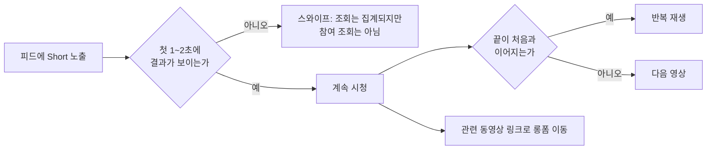

# Shorts와 얼굴 없는 채널: 스와이프 한 번을 이기는 설계와 독창성

> **학습 목표**: Shorts 피드가 롱폼과 어떻게 다른 결정을 요구하는지 설명하고, 롱폼에서 Shorts를 잘라 관련 동영상으로 연결하며, 얼굴 없는 채널이 "inauthentic content"·재사용 콘텐츠 정책에 걸리는 지점과 독창성을 더하는 방법을 구분할 수 있다.

이 문서는 Shorts와 얼굴 없는(faceless) 형식의 **제작**을 다룬다. 추천이 어떻게 작동하는지와 채널 설계는 「유튜브 추천 구조와 채널 설계」, 8~12분 강의 영상을 기획하는 법은 「롱폼 영상 기획과 제작」, 하나의 원본을 롱폼·Shorts·블로그 글·상품으로 나누는 전체 흐름은 「원소스 멀티유즈(OSMU) 전략」, AI 도구와 합성 콘텐츠 표시는 「AI 활용 제작과 플랫폼 정책」, Shorts 수익 배분은 「광고 수익: 애드포스트와 YouTube 파트너 프로그램」에서 다룬다. 기능과 정책은 **2026-09 기준**이며, YouTube 고객센터에 직접 접속할 수 없어 일부는 "검색 결과로 확인"으로 표시했다.

## 핵심 개념

| 용어 | 뜻 | 확인한 내용 (2026-09 기준) |
|---|---|---|
| Shorts | 세로 또는 정사각형, 3분 이하 영상 | 2024-10-15 이후 업로드분부터 최대 3분 (이전 60초) |
| 조회수(Shorts) | 재생·반복 재생이 시작될 때마다 1회 | 2025-03-31부터 최소 시청 시간 없이 집계 |
| 참여 조회수(engaged views) | 예전 방식의 조회수 | YPP 자격과 Shorts 수익 배분에 쓰인다 |
| 시청 vs 스와이프 비율 | 피드에서 영상이 떴을 때 계속 본 비율과 넘긴 비율 | YouTube Studio 분석의 Shorts 지표 |
| 관련 동영상 링크 | Short 하단에 같은 채널의 영상 1개를 거는 링크 | 데스크톱 YouTube Studio에서 설정 |
| 얼굴 없는 채널 | 진행자 얼굴 없이 화면 녹화·슬라이드·B-roll·보이스오버로 만드는 채널 | 형식 자체는 정책 위반이 아니다 |

Shorts 피드에서는 시청자가 영상을 **고르지 않는다**. 롱폼은 썸네일과 제목을 보고 누르는 선택이 먼저지만, Shorts는 영상이 이미 재생되고 있고 시청자는 "계속 볼까, 넘길까"만 결정한다. 그래서 롱폼의 CTR 자리에 Shorts에서는 **시청 vs 스와이프 비율**이 온다.

## 원리

### 첫 1~2초가 썸네일이다

피드에서 넘겨지지 않으려면 첫 화면이 결과를 보여 줘야 한다. 업무 자동화 주제라면 "30분 걸리던 정리가 3초에 끝나는 장면"을 먼저 보여 주고, 방법은 그 뒤에 설명한다. 인사말, 채널 소개, 로고 애니메이션은 모두 스와이프 이유가 된다.

### 반복 재생(loop)과 길이

2025-03-31 이후 Shorts 조회수는 재생·반복 재생이 **시작될 때마다** 집계된다. 끝 장면이 첫 장면으로 자연스럽게 이어지면 반복 재생이 늘어난다. 다만 수익 배분과 YPP 자격은 여전히 **참여 조회수**를 쓰므로, 반복 재생을 노린 억지 편집보다 끝까지 볼 이유를 만드는 편이 낫다.

최대 길이는 3분이지만 길이는 목표가 아니다. 제3자 분석들은 30~60초가 가장 흔한 성과 구간이라고 말하지만 공식 기준이 아니므로 **가설로 두고 내 채널에서 시험한다**. Shorts 카메라로 직접 녹화할 때는 한 번에 60초 제한이 있다는 보도가 있으므로, 긴 Short는 편집 프로그램에서 만들어 업로드한다.

### 롱폼에서 Shorts 자르기

| 방식 | 방법 | 장점 | 주의 |
|---|---|---|---|
| YouTube의 "Short로 편집" | 공개 롱폼의 시청 페이지에서 구간을 골라 Short를 만든다 | 원본 롱폼과 자동으로 연결된다 | 도움말상 선택 구간은 최대 60초. 비공개·일부공개 영상과 제3자 저작권 주장이 있는 영상은 불가 |
| 편집 프로그램에서 재편집 | 세로 화면에 맞게 다시 자르고 자막·확대를 넣는다 | 화면 녹화의 작은 글씨를 키울 수 있다 | 가로 화면을 그대로 세로 틀에 넣으면 읽을 수 없다 |
| Shorts 전용 촬영·녹화 | 처음부터 세로 비율로 녹화한다 | 가장 읽기 쉽다 | 제작 시간이 추가된다 |

여기서는 Shorts 한 편을 만드는 기술만 다룬다. 어떤 원본에서 무엇을 파생할지는 「원소스 멀티유즈(OSMU) 전략」에서 정한다. 화면 녹화 튜토리얼은 가로 화면이 기본이라 세로로 자르면 셀·메뉴 글씨가 작아진다. 확대(zoom)할 영역을 미리 정해 두고, 한 Short에는 **한 가지 동작**만 담는다.

### Short에서 롱폼으로 보내기

2023년 9월 도입된 관련 동영상 링크는 Short 하단에 **같은 채널의 영상 하나**를 연결한다. Shorts 설명란의 외부 링크는 스팸 대응으로 클릭할 수 없게 바뀌었으므로, 블로그로 보내는 길은 롱폼 설명란과 고정 댓글이 맡는다. 흐름은 "Short → 관련 롱폼 → 롱폼 설명란의 블로그 글과 템플릿"이다.

### 얼굴 없는 형식 네 가지

| 형식 | 잘 맞는 주제 | 독창성이 생기는 곳 | 흔한 실패 |
|---|---|---|---|
| 화면 녹화 | 소프트웨어 사용법, 엑셀·자동화 | 직접 푼 실제 업무 문제, 실수와 해결 과정 | 설명 없이 클릭만 이어지는 녹화 |
| 슬라이드 | 개념 설명, 비교, 체크리스트 | 직접 만든 도식과 판단 기준 | 글자로 가득 찬 화면을 그대로 읽기 |
| B-roll | 분위기 전달, 이야기 보조 | 직접 촬영한 장면, 설명과 맞물린 편집 | 무료 스톡 영상을 이어 붙이고 원고만 바꾸기 |
| 보이스오버 | 모든 형식의 설명 축 | 내 경험·의견·말투 | 원고를 읽기만 해서 누가 말해도 같은 내용 |

### 얼굴 없는 채널이 정책에 걸리는 지점

YouTube는 2025-07-15 "repetitious content" 정책 이름을 **"inauthentic content"**로 바꾸고, 반복적이거나 대량 생산된 콘텐츠를 포함한다고 명확히 했다. 대상은 템플릿으로 찍어 낸 듯 영상 사이 차이가 거의 없는 콘텐츠, 쉽게 대량 복제할 수 있는 콘텐츠다. YouTube는 이것이 기존 정책의 이름 변경과 명확화라고 설명했다. 별도로 **재사용 콘텐츠(reused content)** 규정은 다른 사람의 콘텐츠를 의미 있는 해설·수정·교육적 가치 없이 다시 올리는 것을 막는다. 원저작자의 허락이 있어도 적용되며, 저작권 판단과는 별개다.

얼굴이 없다는 사실 자체는 문제가 아니다. 문제는 **누가 만들어도 같은 결과가 나오는 제작 방식**이다.

| 위험 신호 | 독창성을 더하는 방법 |
|---|---|
| 같은 템플릿에 주제어만 바꾼 영상이 매일 여러 개 | 영상마다 다른 실제 문제와 결과물을 보여 준다 |
| 남의 영상·스톡 영상을 이어 붙이고 합성 음성으로 읽기 | 직접 녹화한 화면과 직접 만든 파일을 쓴다 |
| 웹 글을 요약해 읽는 원고 | "내가 해 보니" 경험, 실패, 수치, 판단 기준을 넣는다 |
| 채널 전체에 사람의 흔적이 없음 | 같은 목소리, 같은 관점, 댓글 질문에 답하는 후속 영상 |

YouTube CEO Neal Mohan은 2026년 1월 연례 서한에서 저품질 AI 콘텐츠("AI slop") 관리를 2026년 우선순위로 꼽았다. 대량 생산형 얼굴 없는 채널의 위험은 줄어들지 않았다고 보는 편이 안전하다. AI 도구를 쓸 때의 기준은 「AI 활용 제작과 플랫폼 정책」을 본다.

### 목소리 품질

얼굴 없는 채널에서 목소리는 사실상 진행자다.

- **녹음 환경**: 비싼 마이크보다 조용하고 울림이 적은 방이 먼저다. 입과 마이크 거리를 매번 같게 둔다.
- **편집**: 잡음 제거, 숨소리·침묵 정리, 음량 평준화 순서로 손본다. 과한 잡음 제거는 목소리를 로봇처럼 만든다.
- **원고**: 문어체 원고는 읽는 티가 난다. 소리 내어 읽어 보고 문장을 짧게 고친다.
- **AI 음성**: 선택지일 뿐이다. 자기 목소리로 쌓은 신뢰와 채널 정체성을 잃을 수 있고, 합성 음성은 자기 목소리를 복제한 것이라도 YouTube에서는 보수적으로 표시한다 (「AI 활용 제작과 플랫폼 정책」).

### 성장 수단인가, 수익 수단인가

| 구분 | Shorts | 롱폼 |
|---|---|---|
| 주 역할 | 발견: 채널을 모르는 사람에게 닿기 | 신뢰와 수익: 시청 시간, 광고, 상품으로 가는 길 |
| 광고 수익 구조 | Shorts 피드 광고를 모아 크리에이터 풀에서 45% 배분 | 시청 페이지 광고 순수익의 55% |
| 2027-02-01 이후 | 최근 90일 유효 Shorts 조회(참여 조회수) 1,000만 회 이상일 때만 Shorts 광고·구독 수익 배분 (발표 기준) | 변화 없음 |
| 소규모 채널의 기대치 | 수익보다 구독자·롱폼 유입 | 수익과 상품 판매의 중심 |

수치 확인과 계산은 「광고 수익: 애드포스트와 YouTube 파트너 프로그램」에서 한다. 이 문서의 결론은 하나다. **소규모 채널에서 Shorts는 수익이 아니라 롱폼과 블로그로 보내는 입구**다.

## 적용: 예시 크리에이터 J의 Shorts 3개

J는 매주 8~12분 롱폼 강의 1개(예: "엑셀 중복값 한 번에 지우기 — 3가지 방법 비교")를 올리고, 거기서 Shorts 3개를 만든다. 주 10시간 중 Shorts에는 약 1시간을 쓴다고 가정한다.

| Short | 내용 | 첫 1~2초 | 연결 |
|---|---|---|---|
| ① 결과형 | 정리 전 → 후 화면 비교 | 지저분한 표가 한 번에 정리되는 장면 | 관련 동영상: 이번 주 롱폼 |
| ② 실수형 | 초보가 흔히 하는 실수 1개와 고치는 법 | 오류 메시지 화면 | 관련 동영상: 이번 주 롱폼 |
| ③ 질문형 | 지난주 댓글 질문에 답하기 | 질문 댓글 캡처 | 관련 동영상: 질문이 나온 롱폼 |

- 녹화: 롱폼 녹화 때 확대할 영역을 표시해 두고, 그 구간을 세로로 다시 자르고 확대한다. 세로 재녹화는 글씨가 너무 작을 때만 선택한다.
- 목소리: 기본은 본인 목소리. AI 음성은 한 Short에서만 시험하고, 시청 vs 스와이프 비율과 댓글 반응을 본인 목소리 Short와 비교한 뒤 결정한다.
- 판단 기준 (가정): 4주 동안 12개를 올린 뒤 Short별 시청 비율과 "관련 동영상" 클릭 후 롱폼 조회를 비교해, 잘된 유형의 비중을 늘린다.

## 심화

### 같은 영상을 여러 플랫폼에

Instagram Reels 등 다른 세로 영상 플랫폼에 같은 영상을 올릴 수도 있다. 다른 플랫폼의 워터마크가 찍힌 파일을 그대로 올리기보다 원본 파일을 쓴다. 플랫폼 간 교차 게시가 추천에 어떤 영향을 주는지는 공식 설명을 확인하지 못했다.

### 측정할 지표

| 질문 | 볼 지표 |
|---|---|
| 첫 장면이 효과가 있었나 | 시청 vs 스와이프 비율 |
| 끝까지 볼 만했나 | 평균 시청 비율, 반복 재생 |
| 롱폼으로 보냈나 | 관련 동영상 링크 클릭, 롱폼의 트래픽 소스 중 Shorts |
| 채널이 컸나 | Short별 구독자 증가 |

## 흔한 오해

- **"Shorts는 60초까지다"** — 2024-10-15 이후 업로드분은 3분까지다. 단, Shorts 카메라 녹화는 한 번에 60초 제한이 있다는 보도가 있다.
- **"조회수가 늘었으니 수익도 는다"** — 2025-03-31 이후 조회수는 반복·짧은 재생까지 센다. 수익과 YPP는 참여 조회수 기준이다.
- **"얼굴이 없으면 수익 창출이 안 된다"** — 형식이 아니라 대량 생산·재사용 여부가 기준이다.
- **"허락받은 영상이면 재사용해도 된다"** — 재사용 콘텐츠 규정은 허락 여부와 무관하게 의미 있는 부가가치를 본다.
- **"Shorts를 많이 올리면 광고 수익이 쌓인다"** — 2027-02-01부터는 90일 유효 Shorts 조회(참여 조회수) 1,000만 회 미만이면 Shorts 수익 배분이 없다 (발표 기준).

## 자기 점검 질문

1. 롱폼의 CTR에 해당하는 Shorts 지표는 무엇이며, 왜 역할이 비슷한가?
2. 2025-03-31 이후 "조회수"와 "참여 조회수"는 어떻게 다르고, 수익에는 어느 쪽이 쓰이는가?
3. 가로 화면 녹화를 Shorts로 바꿀 때 가장 먼저 해결해야 할 문제는 무엇인가?
4. 같은 템플릿으로 매일 5개씩 만드는 얼굴 없는 채널이 받을 수 있는 정책 위험 두 가지와, 각각을 줄이는 방법을 말해 보라.
5. 구독자 300명인 채널에서 Shorts의 목표를 수익이 아니라 무엇으로 잡아야 하며, 그것을 어떤 지표로 확인하는가?

## 참고 자료

- [Upload YouTube Shorts / Shorts 길이 3분 확대](https://support.google.com/youtube/answer/10059070?hl=en) — YouTube Help, 검색 결과로 확인 (2026-09-30)
- [YouTube changes how Shorts views are counted from March 31](https://ppc.land/youtube-changes-how-shorts-views-are-counted-from-march-31/) — PPC Land, 2025-03, 2026-09-30 확인
- [Add a related video to your YouTube Shorts](https://support.google.com/youtube/answer/14075157?hl=en) — YouTube Help, 검색 결과로 확인 (2026-09-30)
- [YouTube's "related links" connect Shorts, long-form videos, and live streams](https://www.tubefilter.com/2023/09/01/youtube-related-links-multi-format-creators-shorts-live-long-form/) — Tubefilter, 2023-09-01, 2026-09-30 확인
- [Create YouTube Shorts from your videos](https://support.google.com/youtube/answer/12836917?hl=en) — YouTube Help, 검색 결과로 확인 (2026-09-30)
- [YouTube channel monetization policies](https://support.google.com/youtube/answer/1311392?hl=en) — YouTube Help, 검색 결과로 확인 (2026-09-30)
- [YouTube Clarifies Changes to Monetization Rules Around Inauthentic Content](https://www.socialmediatoday.com/news/youtube-clarifies-monetization-update-inauthentic-repeated-content/752892/) — Social Media Today, 2025-07, 2026-09-30 확인
- [YouTube chief says 'managing AI slop' is a priority for 2026](https://www.cnbc.com/2026/01/21/youtube-chief-says-managing-ai-slop-is-a-priority-for-2026-.html) — CNBC, 2026-01-21, 2026-09-30 확인
- [YouTube Shorts monetization policies](https://support.google.com/youtube/answer/12504220?hl=en) — YouTube Help, 검색 결과로 확인 (2026-09-30)
- [New opportunities to earn and changes to the YouTube Partner Program](https://blog.youtube/news-and-events/youtube-partner-program-updates-2027-new-opportunities-earn/) — YouTube Blog, 2026-08, 검색 결과로 확인 (2026-09-30)
