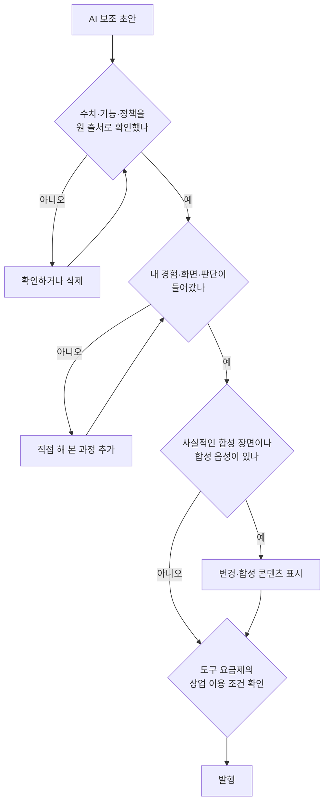

# AI 활용 제작과 플랫폼 정책: 속도는 AI에게, 책임은 사람에게

> **학습 목표**: 제작 단계별로 AI가 도울 수 있는 일과 품질을 해치는 지점을 구분하고, YouTube의 합성 콘텐츠 표시·"inauthentic content"·재사용 콘텐츠 규정과 네이버의 AI 대량 생산 글에 대한 태도를 설명하며, 도구의 상업적 이용 조건을 확인하는 발행 전 검증 절차를 세울 수 있다.

AI는 원고, 편집, 자막, 번역의 시간을 크게 줄여 준다. 동시에 같은 도구를 쓰는 수많은 채널과 비슷한 결과물을 만들고, 틀린 정보를 그럴듯하게 만든다. 이 문서는 **AI 도구와 그에 따르는 플랫폼 정책 위험**을 다룬다. Shorts와 얼굴 없는 형식의 제작 기술은 「Shorts와 얼굴 없는 채널」, 하나의 원본을 여러 형식으로 바꾸는 흐름은 「원소스 멀티유즈(OSMU) 전략」, 광고 표시·저작권·세금의 법적 측면은 「표시 의무·저작권·세금」에서 다룬다. 정책과 약관은 **2026-09 기준**이며, YouTube 고객센터와 네이버 도움말에 직접 접속할 수 없어 여러 항목을 "검색 결과로 확인"으로 표시했다. 특정 도구 이름은 **중립적인 예시**일 뿐 추천이 아니다.

> **도구·튜토리얼·방법론**: 이 문서는 정책과 원칙을 다룬다. 단계별 도구와 튜토리얼 링크는 「AI로 블로그 글 만들기: 도구와 튜토리얼」과 「AI로 유튜브 영상 만들기: 도구와 튜토리얼」에, 프롬프트 모음·검수 절차·자동화는 「AI 제작 방법론: 프롬프트·검수·자동화」에 있다.

## 핵심 개념

| 용어 | 뜻 | 핵심 |
|---|---|---|
| 변경·합성 콘텐츠 표시 (altered or synthetic content) | 실제로 오인할 만한 합성·변경 콘텐츠를 업로드 때 밝히는 YouTube Studio 설정 | 사실적인 것만 대상. 원고·자막 보조는 대상이 아니다 |
| inauthentic content | 대량 생산되거나 반복적인 콘텐츠를 수익 창출에서 제외하는 YPP 규정 | 2025-07-15 "repetitious content"에서 이름 변경 |
| 재사용 콘텐츠 (reused content) | 남의 콘텐츠를 의미 있는 부가가치 없이 다시 쓰는 것 | 허락 여부·저작권과 별개로 판단 |
| 초상 감지 (likeness detection) | 내 얼굴이 쓰인 AI 생성 영상을 찾아 알려 주는 YouTube 기능 | 발견 후 삭제 요청 가능 |
| 상업적 이용 조건 | AI 도구 약관이 정한 결과물의 소유·상업 사용 범위 | 요금제마다 다르다 |

## 원리

### 단계별 도구 지도

| 단계 | AI가 잘하는 일 | 중립적 예시 (추천 아님) | 품질을 해치는 지점 |
|---|---|---|---|
| 조사 | 자료 목록, 요약, 반론 찾기 | 범용 대화형 AI, AI 검색 | 없는 출처·수치를 만든다 (hallucination) |
| 원고 | 개요, 문장 다듬기, 길이 조절 | 범용 대화형 AI | 누구나 쓸 법한 문장, 경험 없는 설명 |
| 음성·TTS | 보이스오버, 발음 교정용 가이드 | ElevenLabs 같은 TTS 서비스 | 억양이 단조롭고 신뢰를 잃는다. 요금제별 상업 조건 |
| 이미지 | 썸네일 배경, 도식 초안 | Midjourney 같은 이미지 생성 서비스 | 실제 화면처럼 보이는 가짜 스크린샷 |
| 영상 | B-roll, 전환 장면 | 텍스트→영상 생성 서비스 | 사실적 장면은 표시 대상. 채널이 다른 채널과 비슷해진다 |
| 편집 | 무음 구간 삭제, 컷 편집, 잡음 제거 | 편집 프로그램의 AI 기능 | 과한 자동 컷으로 호흡이 사라진다 |
| 자막 | 음성 인식 자막 | YouTube 자동 자막 | 전문 용어·고유명사 오류 |
| 번역·더빙 | 다국어 자막, 음성 더빙 | YouTube 자동 더빙 | 기계 번역 어색함, 용어 불일치 |

**YouTube 자동 더빙**: 2024년 9월 발표된 뒤 2025년 YPP 크리에이터로 확대되었고, 2026년 초 모든 크리에이터로 확대되어 27개 언어를 지원한다는 보도가 있다 (검색 결과로 확인). 한국어 영상을 영어로 더빙하는 방향이 지원된다고 알려져 있다. 언어 쌍과 대상 채널은 바뀔 수 있으므로 YouTube Studio에서 직접 확인하고, 게시 전 더빙을 검토한다.

### AI가 돕는 곳, 해치는 곳

기준은 하나다. **시청자가 이 채널에서만 얻는 것**이 AI 때문에 줄어드는가, 늘어나는가.

- **돕는 곳**: 반복 작업(자막 싱크, 무음 삭제, 형식 변환), 초안(개요, 제목 후보), 점검(맞춤법, 누락된 단계 찾기).
- **해치는 곳**: 경험(직접 해 본 과정)을 대신 쓰게 할 때, 사실(수치, 기능, 정책)을 검증 없이 옮길 때, 목소리와 관점을 통째로 바꿀 때.

### YouTube의 변경·합성 콘텐츠 표시

YouTube는 시청자가 **실제 사람·장소·사건으로 쉽게 오인할 만한** 콘텐츠를 변경·합성 미디어(생성형 AI 포함)로 만들었을 때 공개하도록 요구한다.

| 표시가 필요한 예 | 표시가 필요 없는 예 | 확인되지 않음 — 보수적으로 표시 |
|---|---|---|
| 실제 사람의 얼굴을 다른 사람으로 바꾸기 | 누가 봐도 비현실적인 장면, 애니메이션 | 자기 목소리를 AI로 복제해 보이스오버·더빙에 쓰기. 예외라는 제3자 자료가 있지만 YouTube 공식 문서에서 확인하지 못했고, 공식 예시가 "사람의 목소리를 합성해 내레이션하기"이므로 표시한다 |
| 실제 사람의 목소리를 합성해 내레이션하기 | 색 보정, 뷰티 필터 같은 경미한 수정 | |
| 실제 건물이 불타는 것처럼 실제 사건·장소를 바꾸기 | 원고·아이디어·자동 자막처럼 제작 보조에만 AI를 쓴 경우 | |
| 실제 도시로 향하는 토네이도처럼 사실적인 가상 사건 | | |

- **어디서 하나**: 업로드할 때 YouTube Studio의 "변경된 콘텐츠" 설정에서 공개한다.
- **라벨은 어디에 뜨나**: 기본적으로 확장된 설명란의 "이 콘텐츠의 제작 방식(How this content was made)" 영역에 붙는다. 건강·뉴스·선거·금융 같은 민감한 주제는 플레이어 위에 더 눈에 띄는 라벨이 붙을 수 있다.
- **안 하면**: YouTube가 직접 라벨을 붙일 수 있고, 반복적으로 공개하지 않으면 콘텐츠 삭제나 YPP 정지 같은 조치를 받을 수 있다고 안내된다 (검색 결과로 확인).

### "inauthentic content"와 재사용 콘텐츠

두 규정은 모두 **YPP 수익 창출 정책**이다. 커뮤니티 가이드 위반이 아니어도 수익 창출이 막힐 수 있다.

| 구분 | inauthentic content | 재사용 콘텐츠 |
|---|---|---|
| 무엇을 보나 | 대량 생산·반복: 템플릿으로 만든 듯 영상 간 차이가 거의 없는 콘텐츠 | 출처: 내 창작물이 아니고 이미 다른 곳에 있는 콘텐츠 |
| 역사 | 2025-07-15 "repetitious content"에서 이름을 바꾸고 대량 생산 콘텐츠를 포함한다고 명확히 함 | 기존 규정 |
| 예시 | 같은 틀에 문장만 바꾼 합성 음성 영상 수백 개 | 남의 영상 클립 모음, 해설 없는 반응 영상, 다른 채널 영상 재업로드 |
| 허용되는 경우 | 영상마다 고유한 내용과 제작 판단이 있을 때 | 의미 있는 해설, 실질적 수정, 교육·오락 가치를 더했을 때 |
| 주의 | AI 사용 자체는 금지가 아니다 | 원저작자 허락이 있어도 적용된다. 저작권·공정 이용과 별개 판단 |

**내 콘텐츠를 다른 형식으로 바꿀 때**: 내가 만든 롱폼에서 Shorts를 자르거나, 같은 개요로 블로그 글을 쓰는 것은 남의 콘텐츠 재사용이 아니다. 다만 AI로 같은 원고를 조금씩 바꿔 여러 영상을 찍어 내면 inauthentic content 쪽 위험이 생긴다. 파생물마다 무엇을 새로 더할지는 「원소스 멀티유즈(OSMU) 전략」에서 정하고, 이 표를 기준으로 점검한다.

### 초상 감지 (likeness detection)

YouTube는 2025년 10월 YPP 크리에이터에게 초상 감지를 제공하기 시작했고, 2026년 5월 만 18세 이상의 채널 소유자·관리자로 대상을 넓혔다는 보도가 있다 (검색 결과로 확인). 새로 업로드된 영상에서 등록자의 얼굴이 쓰인 AI 생성 콘텐츠를 찾아 알려 주고, 등록자는 검토 후 개인정보 보호 가이드라인에 따라 삭제를 요청할 수 있다. 2026년 9월에는 음성 감지를 결합한다는 보도도 있다. 얼굴 없는 채널이라도 **목소리가 브랜드**라면 이 확장을 지켜볼 만하다.

### 네이버의 태도: AI 사용이 아니라 대량·저품질이 문제

- **AI 활용 표시**: 네이버 블로그는 2025-05-21부터 AI로 생성·편집한 이미지와 영상에 "AI 활용" 표시를 붙이는 기능을 도입했다. 2026년 7월 보도에 따르면 블로그에서는 **권장이며 의무가 아니다** (검색 결과로 확인).
- **대량 생산 글**: 2026년 3월 하루 100건씩 AI로 찍어 내는 블로그 글이 보도되자, 네이버는 스팸성·광고성·매크로 등 비정상적 이용을 모니터링하고 제재하며 신뢰할 수 있는 검색 결과를 위한 기술 대응을 강화한다고 밝혔다 (뉴스버스, 2026-03-24).
- **정리**: 네이버가 공식적으로 AI 사용 자체를 금지한다는 근거는 찾지 못했다. 위험은 검증 없는 AI 출력과 대량 발행이다. 검색이 문서를 평가하는 방식은 「네이버 블로그와 검색 구조」에서 다룬다.

### AI 결과물과 목소리의 권리

| 확인할 것 | 확인한 내용 (2026-09, 각 도구 약관은 바뀔 수 있음) |
|---|---|
| 한국에서 AI 산출물의 저작권 | 문화체육관광부·한국저작권위원회의 2025년 6월 안내서: 인간의 창작적 기여가 있으면 "생성형 AI 활용 저작물"로 등록 가능, 기여가 없는 "생성형 AI 산출물"은 등록 불가 |
| 대화형 AI 결과물 (예: OpenAI) | 이용약관은 결과물에 대한 회사의 권리를 이용자에게 "있다면(if any)" 양도한다. 권리가 존재한다는 보증은 아니다 |
| 이미지 생성 (예: Midjourney) | 유료 구독자는 생성물을 소유한다. 연 매출 100만 달러 초과 회사(또는 그 직원)는 Pro·Mega 요금제가 필요하다 |
| TTS (예: ElevenLabs) | 무료 요금제는 상업적 이용 불가, 게시할 때 제목에 출처 표시 필요. 유료 요금제는 상업 라이선스 포함 (베타 기능 제외) |
| 음성 복제 | 다른 사람의 목소리는 동의 없이 복제하지 않는다. 합성 음성은 자기 목소리라도 YouTube에서 보수적으로 표시한다 |

이 표는 법률 자문이 아니다. **쓰는 요금제의 약관을 발행 전에 직접 확인**하고, 확인한 날짜를 제작 기록에 남긴다. 계약과 지식재산의 일반 원칙은 「계약 · 지식재산 · 오픈소스」를 본다.

### 발행 전 검증 절차

## 적용: 예시 크리에이터 J의 AI 사용 원칙

J는 업무 자동화를 가르치므로 AI를 쓰는 과정 자체가 콘텐츠다. 원칙은 "AI는 초안과 반복 작업, 판단과 화면은 J"다.

| 단계 | J의 방식 | 주 10시간 중 절약 (가정) |
|---|---|---|
| 개요 | 하나의 개요를 AI와 함께 다듬고, 블로그 글과 영상 원고로 나눈다 | 약 1시간 |
| 원고 | AI 초안에 J가 직접 겪은 실수와 수치를 넣어 고쳐 쓴다 | 약 0.5시간 |
| 녹화 | 실제 엑셀 파일로 직접 화면 녹화한다. AI 생성 화면은 쓰지 않는다 | 0 |
| 편집·자막 | 무음 삭제와 자동 자막을 쓰고, 함수 이름 등 용어를 직접 교정한다 | 약 1시간 |
| 음성 | 기본은 본인 목소리. AI 음성은 유료 요금제 약관을 확인한 뒤 Short 1개에서만 시험하고, AI 음성 Short는 변경·합성 콘텐츠 설정을 켠다 | 0 |
| 표시 | 자기 화면과 직접 녹음한 목소리만 쓴 영상은 표시하지 않는다. AI 음성 Short와 사실적 합성 장면은 표시한다 | — |

J가 매주 올리는 영상은 서로 다른 실제 업무 문제를 다루므로 템플릿형 대량 생산과 거리가 멀다. 위험은 "AI로 이번 주 원고를 지난주 원고의 변형으로 만드는 것"이다.

## 심화

### 표시 라벨이 성과에 미치는 영향

YouTube 도움말은 표시를 한다고 해서 영상의 도달 범위나 수익 창출 자격이 제한되지는 않는다고 안내한다 (검색 결과로 확인). 불이익은 표시해야 할 것을 계속 표시하지 않을 때 생긴다. 표시는 "AI를 썼다는 고백"이 아니라 **시청자가 사실로 오인하지 않게 하는 장치**로 이해하는 편이 정확하다.

### 기록을 남기는 습관

영상마다 쓴 도구, 요금제, 약관 확인 날짜, 표시 여부를 한 줄로 기록한다. 나중에 약관이 바뀌거나 이의 제기를 받았을 때 근거가 된다.

## 흔한 오해

- **"AI를 조금이라도 쓰면 표시해야 한다"** — 사실적이고 오인할 만한 변경·합성일 때만이다. 원고·자막 보조는 대상이 아니다.
- **"AI 영상은 수익 창출이 안 된다"** — 기준은 대량 생산·반복과 재사용 여부다. AI 사용 자체가 아니다.
- **"허락받았으니 재사용 콘텐츠가 아니다"** — 재사용 콘텐츠 판단은 허락·저작권과 별개다.
- **"네이버는 AI 글을 금지한다"** — 공식 금지 근거는 찾지 못했다. 스팸·대량 발행과 오류 정보가 문제다.
- **"유료로 만들었으니 저작권도 내 것이다"** — 약관상 소유와 저작권 보호는 다르다. 인간의 창작적 기여가 없으면 보호가 약할 수 있다.

## 자기 점검 질문

1. AI로 원고를 쓰고 자기 목소리로 녹음한 화면 녹화 영상은 변경·합성 콘텐츠 표시 대상인가? 이유는?
2. "inauthentic content"와 재사용 콘텐츠 규정은 각각 무엇을 기준으로 보는가?
3. 무료 요금제 TTS로 만든 내레이션을 수익 창출 영상에 쓰기 전에 무엇을 확인해야 하는가?
4. 네이버 블로그의 "AI 활용" 표시는 의무인가? 네이버가 실제로 문제 삼는 것은 무엇인가?
5. 발행 전 검증 절차에서 "내 경험·화면·판단" 단계를 빼면 어떤 두 가지 위험이 커지는가?

## 참고 자료

- [Disclosing use of GenAI content (altered or synthetic content)](https://support.google.com/youtube/answer/14328491?hl=en) — YouTube Help, 검색 결과로 확인 (2026-09-30)
- [Understanding 'How this content was made' disclosures on YouTube](https://support.google.com/youtube/answer/15447836?hl=en) — YouTube Help, 검색 결과로 확인 (2026-09-30)
- [How we're helping creators disclose altered or synthetic content](https://blog.youtube/news-and-events/disclosing-ai-generated-content/) — YouTube Blog, 2024-03, 검색 결과로 확인 (2026-09-30)
- [YouTube channel monetization policies](https://support.google.com/youtube/answer/1311392?hl=en) — YouTube Help, 검색 결과로 확인 (2026-09-30)
- [YouTube clarifies "inauthentic content" policy changes](https://ppc.land/youtube-clarifies-inauthentic-content-policy-changes/) — PPC Land, 2025-07, 2026-09-30 확인
- [Understanding YouTube's reused content policy](https://ppc.land/understanding-youtubes-reused-content-policy/) — PPC Land, 2026-09-30 확인
- [Likeness detection on YouTube](https://support.google.com/youtube/answer/16440338?hl=en) — YouTube Help, 검색 결과로 확인 (2026-09-30)
- [YouTube Rolls Out Likeness Detection To All Creators Over 18](https://www.mediapost.com/publications/article/415170/youtube-rolls-out-likeness-detection-to-all-creato.html) — MediaPost, 2026-05-19, 2026-09-30 확인
- [Unlocking a global audience with auto dubbing](https://blog.youtube/news-and-events/youtube-auto-dubbing-expressive-speech/) — YouTube Blog, 검색 결과로 확인 (2026-09-30)
- [네이버, AI 생성물 표기 이중 기준...쇼핑은 의무·블로그는 자율](https://news.mtn.co.kr/news-detail/2026072417015682342) — 머니투데이방송, 2026-07-24, 2026-09-30 확인
- [‘AI 따발총’ 저품질 블로그글 하루 100건씩...네이버, 제재 강화 방침](https://www.newsverse.kr/news/articleView.html?idxno=9959) — 뉴스버스, 2026-03-24, 2026-09-30 확인
- [생성형 인공지능 활용 저작물의 저작권 등록 안내서](https://www.copyright.or.kr/information-materials/publication/research-report/view.do?brdctsno=54253) — 한국저작권위원회, 2025-06, 검색 결과로 확인 (2026-09-30)
- [Terms of Use](https://openai.com/policies/row-terms-of-use/) — OpenAI, 검색 결과로 확인 (2026-09-30)
- [Terms of Service](https://docs.midjourney.com/hc/en-us/articles/32083055291277-Terms-of-Service) — Midjourney, 검색 결과로 확인 (2026-09-30)
- [Can I publish the content I generate on the platform?](https://elevenlabs.io/docs/help-center/legal/can-i-publish-the-content-i-generate-on-the-platform) — ElevenLabs, 검색 결과로 확인 (2026-09-30)
