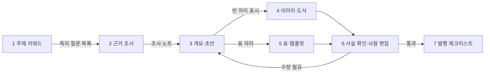

# AI로 블로그 글 만들기: 도구와 튜토리얼

> **학습 목표**: 네이버 블로그 글 한 편을 주제·키워드 조사부터 발행 체크리스트까지 7단계로 나누고, 단계마다 맞는 AI 도구와 공식 튜토리얼을 골라 첫 사용법을 익히며, 사람이 반드시 맡아야 할 경험·사실 확인 단계를 지킬 수 있다.

이 문서는 「블로그 글쓰기와 운영」에서 다룬 글쓰기 기술을 **AI 도구로 더 빨리 하는 방법**을 단계별로 다룬다. 표시 의무·대량 생산·도구 약관 같은 정책 위험은 「AI 활용 제작과 플랫폼 정책」에, 네이버 검색이 글을 평가하는 방식은 「네이버 블로그와 검색 구조」에, 주 10시간의 배분은 「원소스 멀티유즈(OSMU) 전략」에 있다. 영상 쪽 도구는 「AI로 유튜브 영상 만들기: 도구와 튜토리얼」, 프롬프트 모음·검수 절차·자동화와 요금은 「AI 제작 방법론: 프롬프트·검수·자동화」에서 다룬다. 기능과 이름은 **2026-09 기준**이다. 링크는 모두 2026-09-30 검색 결과에서 확인한 주소이며, 이 환경에서는 직접 열어 보지 못했다. 도구 이름은 **중립적인 예시**일 뿐 추천이 아니다.

## 핵심 개념

| 용어 | 뜻 | 이 문서에서의 쓰임 |
|---|---|---|
| 근거 기반 조사 | 답변마다 출처를 달거나, 내가 올린 자료 안에서만 답하게 하는 AI 사용법 | 조사 단계의 기본값 |
| 딥 리서치 | AI가 여러 번 검색하고 읽은 뒤 출처가 달린 보고서를 만드는 기능 | 새 주제를 처음 파고들 때만 쓴다 |
| 프로젝트 메모리 | 지침·파일을 한 번 넣어 두면 그 안의 모든 대화에 적용되는 작업 공간 | 스타일 가이드와 글 템플릿을 넣어 둔다 |
| 스타일 가이드 | 문체, 용어 표기, 금지 표현, 글 구조를 적은 한 장짜리 문서 | 초안 품질의 바닥을 고정한다 |
| AI 브리핑 | 네이버 검색 상단의 AI 요약 답변. 블로그 등 출처 글을 함께 보여 준다 | 인용될 만한 구조로 쓰는 기준 |
| 튜토리얼 | 도구 회사의 공식 도움말·강좌, 또는 검증된 제작자의 강의 영상 | 도구를 처음 쓸 때 20~30분 투자 |

## 원리

### 1. 7단계 흐름

AI는 각 단계에서 **초안과 정리**를 맡고, 사람은 **방향·경험·확인**을 맡는다. 단계를 건너뛰는 대신 단계마다 도구 하나만 고른다.

| 단계 | AI가 맡는 일 | 사람이 맡는 일 | 대표 도구 (예시) |
|---|---|---|---|
| 1 주제·키워드 | 검색어 묶기, 질문형으로 바꾸기 | 숫자 확인, 쓸 주제 고르기 | 네이버 데이터랩, 검색광고 키워드 도구 + 대화형 AI |
| 2 근거 조사 | 출처 찾기, 요약, 반론 찾기 | 원문 열어 보기, 날짜 적기 | Perplexity, Gemini Notebook(옛 NotebookLM), 웹 검색·딥 리서치 |
| 3 개요·초안 | 소제목 후보, 문장 초안 | 실제로 해 본 순서로 고치기 | Claude Projects, ChatGPT Projects, Gemini Gems(→Skills) |
| 4 이미지·도식 | 개념 도식, 표지 배경 | 실제 화면 캡처, 개인정보 가리기 | Canva AI, 이미지 생성 도구, 캡처 도구 |
| 5 표·템플릿 | 수식 제안, 샘플 데이터 | 수식 검증, 배포 파일 정리 | Copilot in Excel, Gemini in Sheets |
| 6 사실 확인·편집 | 확인할 주장 목록 뽑기 | 공식 문서 대조, 경험 문장 쓰기 | 두 번째 AI, 공식 도움말 |
| 7 발행 | 맞춤법·중복 점검 | 표시·링크·권리 최종 확인 | 체크리스트 |

### 2. 주제와 키워드: 숫자는 네이버 도구로, 묶기는 AI로

- **도구**: 네이버 데이터랩 검색어트렌드와 검색광고 키워드 도구의 도구 설명은 「주제 선정과 독자 설계」에 있다. 여기서는 두 도구를 AI와 함께 쓰는 순서만 다룬다.
- **하는 법**: ① 키워드 도구에서 "엑셀 중복" 같은 씨앗 검색어의 연관 키워드를 내려받는다. ② 목록을 AI에 붙여 넣고 "검색 의도별로 묶고, 각 묶음을 독자 질문 한 문장으로 바꿔 줘"라고 요청한다. ③ 데이터랩으로 상위 묶음 2~3개의 계절성을 확인한다. ④ 숫자는 AI가 아니라 **도구 화면에서** 옮긴다.
- **튜토리얼**: [네이버 데이터랩 활용 가이드](https://www.ascentkorea.com/naver-datalab-guide/) (한국어, 어센트코리아), [효과적인 네이버 키워드 도구 활용법](https://www.theegg.com/ko/insights/naver-keyword-tool-explained/) (한국어, The Egg), 영상 [네이버 검색량 조회 툴 4가지 비교](https://www.youtube.com/watch?v=PjvqZZoZVLg) (한국어, 마케터 강의).

AI에게 "검색량이 많은 키워드를 알려 줘"라고 묻지 않는다. 대화형 AI는 네이버 검색량을 알지 못하고 그럴듯한 숫자를 만든다.

### 3. 근거 있는 조사: 출처를 여는 습관까지가 조사다

| 도구 | 잘하는 일 | 하는 법 | 튜토리얼 |
|---|---|---|---|
| Perplexity | 답변마다 출처 링크. Pro Search·Deep Research 모드 | 모드를 고르고 질문을 구체적으로 쓴다. 반복 주제는 Spaces(도움말 제목은 Projects)에 지침을 넣는다 | [What is Pro Search?](https://www.perplexity.ai/help-center/en/articles/10352903-what-is-pro-search) (영어), [Introducing Perplexity Deep Research](https://www.perplexity.ai/hub/blog/introducing-perplexity-deep-research) (영어) |
| Gemini Notebook (옛 NotebookLM) | 내가 올린 PDF·웹페이지·유튜브 영상 안에서만 답하고 인용 표시 | 공식 도움말·실습 파일을 소스로 넣고 "이 소스에 없는 내용은 없다고 말해"라고 묻는다 | [Learn about NotebookLM](https://support.google.com/notebooklm/answer/16164461) (영어), 영상 [노트북LM 실전 활용법 12가지](https://www.youtube.com/watch?v=eeJz8HAyTk0) (한국어, 오빠두엑셀) |
| ChatGPT 딥 리서치 | 조사 계획을 제안하고, 검토·수정한 뒤 보고서를 쓴다고 안내된다 (검색 결과로 확인, 시작 방식은 바뀔 수 있다) | 도구 메뉴(+)에서 Deep Research, 독자·범위·출력 형식을 적는다 | [Deep research in ChatGPT](https://help.openai.com/en/articles/10500283-deep-research-in-chatgpt) (영어) |
| Gemini Deep Research | 조사 계획서를 먼저 보여 주고 보고서 생성 | gemini.google.com에서 Deep Research 선택 | [Gemini 앱에서 Deep Research 사용하기](https://support.google.com/gemini/answer/15719111?hl=ko&co=GENIE.Platform%3DDesktop) (한국어) |
| Claude 웹 검색·Research | 웹 검색을 켜고, 유료 요금제에서는 Research로 여러 번 검색 | 입력창 + 메뉴에서 웹 검색을 켠 뒤 Research 선택 | [Enable and use web search](https://support.claude.com/en/articles/10684626-enable-and-use-web-search) (영어), [Use research on Claude](https://support.claude.com/en/articles/11088861-use-research-on-claude) (영어) |

- **이름 변경**: Google은 2026-07-16 NotebookLM의 이름을 Gemini Notebook으로 바꾼다고 발표했다. 같은 제품이고 기존 노트북과 링크는 유지된다고 안내했다 (검색 결과로 확인). 도움말 주소에는 아직 notebooklm이 남아 있다.
- **규칙**: 조사 노트에는 AI 요약이 아니라 **원문 주소와 확인 날짜**를 남긴다. AI가 준 출처는 열어서 그 문장이 실제로 있는지 본다. 딥 리서치 보고서는 "읽을 목록"이지 인용할 결론이 아니다.

### 4. 개요와 초안: 스타일 가이드를 한 번 넣어 두기

매번 "친근하게, 결론 먼저" 같은 지시를 새로 쓰면 결과가 흔들린다. **프로젝트 메모리**에 스타일 가이드와 「블로그 글쓰기와 운영」의 글 템플릿을 넣어 두고, 그 안에서만 초안을 만든다.

| 도구 | 넣어 둘 것 | 튜토리얼 |
|---|---|---|
| Claude Projects + 스타일 | 프로젝트 지침(스타일 가이드), 프로젝트 지식(템플릿, 지난 글 2~3편). 내 글 샘플로 사용자 지정 스타일도 만들 수 있다 | [What are projects?](https://support.claude.com/en/articles/9517075-what-are-projects) (영어), [Introduction to projects · Claude Academy](https://academy.claude.com/courses/claude-101/introduction-to-projects) (영어 강좌) |
| ChatGPT Projects | 프로젝트 파일·지침. 맞춤형 GPT는 단계적으로 종료되고 있고, 개인 계정은 새 GPT를 만들 수 없다고 안내되므로 Projects를 쓴다 (검색 결과로 확인, 「AI 제작 방법론: 프롬프트·검수·자동화」) | [Projects in ChatGPT](https://help.openai.com/en/articles/10169521-projects-in-chatgpt) (영어), [Writing with ChatGPT](https://openai.com/academy/writing/) (영어) |
| Gemini Gems | Gem 이름과 요청 사항(스타일 가이드), 참고 파일. 개인 계정은 2026-11-17부터 Skills로 이전될 예정이므로 원본 지침은 내 파일에 보관한다 | [Gemini 앱에서 Gem 시작하기](https://support.google.com/gemini/answer/15236321?hl=ko) (한국어) |

- **하는 법**: ① 조사 노트와 독자 질문 목록을 붙여 넣고 **개요만** 먼저 받는다. ② 개요를 내가 실제로 해 본 순서로 고친다. ③ 소제목 하나씩 초안을 받는다. ④ 초안에서 "직접 해 보니", "제 파일에서는" 같은 경험 문장이 들어갈 자리를 `[경험]`으로 비워 두게 한다. 그 자리는 사람이 채운다.
- 프롬프트 원문은 「AI 제작 방법론: 프롬프트·검수·자동화」의 프롬프트 모음을 쓴다.

### 5. 네이버의 AI: 2026년에 있는 것과 없는 것

| 항목 | 2026-09 기준 상태 | 블로거에게 뜻하는 것 |
|---|---|---|
| CLOVA X·Cue: | 2026-04-09 서비스 종료. 하이퍼클로바X 기술은 검색 등 핵심 서비스에 녹인다는 방향 (보도로 확인) | 네이버 자체 AI 챗봇으로 글을 쓰는 선택지는 없다 |
| 스마트에디터 AI 글쓰기 | 공식 AI 글쓰기 보조 기능은 검색으로 확인하지 못했다 | 초안은 외부 도구에서 만들고 에디터에서 다듬는다 |
| AI 브리핑 | 2025-03 도입. 검색 상단 요약과 함께 블로그 등 출처 글을 보여 준다. 2026-08 보도자료 기준 월 3,000만 명이 쓴다 | 첫 화면에 답이 있는 글이 인용 후보가 된다 |
| AI탭 | 2026-04-28 네이버플러스 멤버십 베타, 2026-06-26 전체 이용자에게 정식 출시 (보도로 확인) | 대화형 검색에서도 출처 글이 쓰인다 |
| 네이버 메이트 | 2026-06 베타. AI 브리핑 인용수·주제 전문성·활동성으로 매월 약 3,000명을 뽑아 활동지원금을 준다고 보도됐다 | 인용수가 새 보상 지표가 됐다. 수익 전체는 「광고 수익: 애드포스트와 YouTube 파트너 프로그램」 |
| AI 활용 표시 | AI로 만든 이미지·영상에 붙이는 표시. 블로그는 자율 | 표시 기준은 「AI 활용 제작과 플랫폼 정책」 |

- **인용되는 글**: 네이버가 2026-05 제시했다고 보도된 콘텐츠 원칙과 인용 제외 기준은 「네이버 블로그와 검색 구조」의 AI 브리핑과 출처 선정 절에서 다룬다.
- **결론**: AI로 쓴 티가 나는 글은 인용 대상에서 멀어진다. AI 브리핑이 문서를 고르는 원리는 「네이버 블로그와 검색 구조」, 생성형 검색 전반은 「AI 검색 · GEO/AEO」를 본다.

### 6. 이미지와 도식: 실제 화면은 캡처, AI는 개념도에만

| 용도 | 도구 (예시) | 하는 법 | 튜토리얼 |
|---|---|---|---|
| 표지·도식 | Canva AI | 템플릿에 제목을 넣고 AI로 배경·레이아웃 변형 | [Canva AI 시작하기](https://www.canva.com/help/using-canva-ai/) (한국어 도움말), [캔바 Canva 공식 채널](https://www.youtube.com/@canvakorea) (한국어) |
| 개념 삽화 | ChatGPT 이미지 생성 | 비율과 넣을 글자를 프롬프트에 적는다 | [Images in ChatGPT](https://help.openai.com/en/articles/11084440-images-in-chatgpt) (영어) |
| 개념 삽화 | Gemini 앱 이미지 생성 (Nano Banana) | 도구 메뉴에서 이미지 만들기, 올린 이미지 수정 | [Gemini 앱으로 이미지 생성 및 수정하기](https://support.google.com/gemini/answer/14286560?hl=ko) (한국어) |
| 스타일 있는 이미지 | Midjourney | 웹의 Create 화면에서 생성 | [Getting Started Guide](https://docs.midjourney.com/docs/quick-start) (영어) |
| 글자가 들어간 이미지 | Ideogram | 넣을 문구를 따옴표로 감싸 지정 | [Text and Typography](https://docs.ideogram.ai/using-ideogram/getting-started/prompting-guide/2-prompting-fundamentals/text-and-typography) (영어) |
| 실제 화면 | Windows 캡처 도구 | Windows 로고 키+Shift+S로 캡처, 펜으로 표시, 텍스트 작업으로 이메일 등 가리기 | [캡처 도구](https://www.microsoft.com/ko-kr/windows/tips/snipping-tool) (한국어) |

- **규칙**: 엑셀 화면처럼 "실제로 이렇게 보인다"는 이미지는 **반드시 직접 캡처**한다. AI가 그린 가짜 스크린샷은 독자를 속이고 튜토리얼의 신뢰를 무너뜨린다.
- **권리**: 무료·유료 요금제마다 상업 이용 조건이 다르다. 한 줄 요약과 확인 절차는 「AI 활용 제작과 플랫폼 정책」, 폰트·이미지 저작권은 「표시 의무·저작권·세금」을 본다.

### 7. 표와 템플릿: J의 주제 그 자체

- **Copilot in Excel**: 도움말은 Excel 오른쪽 아래의 Copilot 아이콘으로 연다고 안내하며 (검색 결과로 확인, 버전에 따라 리본 홈 탭 버튼일 수 있다), 수식 생성·차트·피벗 테이블·서식을 말로 요청한다. 2026-09 도움말은 편집(edit)·계획(plan)·대화(chat) 세 모드를 안내한다 (검색 결과로 확인). 개인용 Microsoft 365에서의 제공 범위와 한국어 지원은 요금제별로 다를 수 있다.
- **Gemini in Sheets**: 오른쪽 위 "Gemini에게 물어보기"로 표 만들기, 수식, 분석, 차트를 요청한다. 쓸 수 있는 요금제는 도움말에서 확인한다.
- **하는 법**: ① AI에 "가상의 주문 데이터 30행"처럼 **실습용 샘플 데이터**를 만들게 한다. 실제 회사 데이터는 넣지 않는다. ② 수식은 AI 제안을 받되 셀에 직접 넣어 결과를 확인한다. ③ 배포할 템플릿에는 AI 기능 없이도 작동하는 수식만 남긴다.
- **튜토리얼**: [Get started with Copilot in Excel](https://support.microsoft.com/en-us/excel/copilot/get-started-with-copilot-in-excel) (영어), [Microsoft Copilot video tutorials](https://support.microsoft.com/en-us/microsoft-365-copilot/microsoft-365-copilot-video-tutorials) (영어), [직장인을 위한 엑셀 코파일럿 실전 활용법](https://www.oppadu.com/lesson/xl-copilot-tips/) (한국어, 오빠두엑셀), [Google Sheets의 Gemini로 공동작업하기](https://support.google.com/docs/answer/14356410?hl=ko-kr) (한국어), 영상 [Gemini: Your always-on AI assistant in Sheets](https://www.youtube.com/watch?v=lfGIQbzyhFs) (영어).

### 8. 사실 확인과 사람의 편집

1. P7 템플릿으로 초안 속 **확인할 주장 목록**(함수 이름·인수, 메뉴 이름, 버전, 수치)을 뽑는다.
2. 그 목록을 「AI 제작 방법론: 프롬프트·검수·자동화」 5절의 검수 프로토콜과 발행 직전 체크리스트대로 확인한다. `[경험]` 자리도 그 체크리스트의 자리 표시로 본다. 엑셀 함수는 [Excel functions (alphabetical)](https://support.microsoft.com/en-us/excel/excel-functions-alphabetical) 같은 공식 문서와 내 PC 화면이 기준이다.

### 9. 발행 체크리스트 (AI 사용 부분)

- [ ] AI로 만든 이미지에 "AI 활용" 표시를 할지 정했다 (기준은 「AI 활용 제작과 플랫폼 정책」).
- [ ] 이미지 도구의 요금제와 상업 이용 조건을 확인했다.
- [ ] 제휴·협찬 링크가 있으면 첫 화면에 표시했다 (「표시 의무·저작권·세금」).
- [ ] 글 속 공식 문서·영상 링크가 열리고, 같은 주제의 내 영상 링크를 넣었다.

## 적용: 예시 크리에이터 J의 글 한 편 (AI 사용 버전)

예시 크리에이터 J는 주 10시간 중 블로그에 약 2시간을 쓴다 (「블로그 글쓰기와 운영」). 이번 주 주제는 "엑셀 중복값 한 번에 지우기"다. 시간은 모두 설명용 가정이다.

| 단계 | J가 쓰는 도구 | 결과물 | 시간 (가정) |
|---|---|---|---|
| 1 주제·키워드 | 키워드 도구 + Claude에서 의도별 묶기 | 독자 질문 5개 | 공통 개요 시간에 포함 |
| 2 근거 조사 | Gemini Notebook에 Microsoft 도움말 3편을 소스로 | 출처·날짜가 달린 조사 노트 | 공통 개요 시간에 포함 |
| 3 개요·초안 | Claude Projects (스타일 가이드, 지난 글 2편) | `[경험]` 자리가 표시된 초안 | 0.3 |
| 4 이미지 | 캡처 도구로 단계별 캡처 6장, Canva로 표지 1장 | 캡션 달린 이미지 | 0.3 |
| 5 표·템플릿 | Copilot in Excel로 샘플 데이터·수식 초안 | 실습 파일 | 0.2 |
| 6 확인·편집 | ChatGPT로 교차 점검, 공식 문서 대조 | `[경험]`이 채워진 원고 | 0.5 |
| 7 발행 | 체크리스트 | 발행된 글, 영상 링크 | 0.2 |

- 합계 1.5시간에 월요일 통계 확인·리프레시 0.5시간(「블로그 글쓰기와 운영」)을 더해 주 2시간 예산 안에 들어간다. AI가 줄여 주는 것은 **초안 작성** 시간이고, 확인·편집 시간은 오히려 늘어난다고 본다.
- J는 표지만 AI 도구로 만들고, 엑셀 화면은 전부 직접 캡처한다. 표지에 AI 생성 이미지를 쓴 주에는 "AI 활용" 표시를 켠다.
- 도구는 단계마다 하나로 고정한다. 매주 새 도구를 시험하면 절약한 시간이 도구 학습에 다시 들어간다.

## 심화

### AI 브리핑 인용을 목표로 삼아도 되나

인용수는 네이버 메이트 선정 기준에 들어가므로 신경 쓰게 된다. 하지만 인용 기준은 공개된 원칙 수준이고 세부 알고리즘은 공개되지 않았다. 원칙 자체가 "경험, 일관된 주제, 읽기 쉬운 구조, 최신성"이므로, 인용을 따로 노리기보다 **첫 화면에 답을 두고 직접 해 본 과정을 쓰는** 기본을 지키는 편이 같은 방향이다. 업계 분석 글은 소제목 구조·비교표·단계별 설명이 자주 인용된다고 보지만 네이버 공식 설명은 아니다.

### 튜토리얼 링크를 고르는 기준

독자에게 링크를 줄 때도 같은 기준을 쓴다. ① 공식 도움말·강좌를 먼저, ② 한국어가 있으면 한국어를, ③ 최근 1년 안의 자료를, ④ "하루 만에 월 1,000만 원" 같은 제목의 채널은 피한다. 도구 화면이 바뀌면 영상은 금방 낡으므로, 글에는 영상 하나와 공식 도움말 하나를 같이 둔다.

### AI 도구를 줄이는 신호

같은 단계에 도구가 둘 이상이거나, 도구 설정·결과 비교에 쓰는 시간이 절약한 시간보다 길면 하나를 뺀다. 도구별 시간 측정 방법은 「AI 제작 방법론: 프롬프트·검수·자동화」에서 다룬다.

## 흔한 오해

- **"AI에게 검색량을 물어보면 된다"** — 대화형 AI는 네이버 검색량을 모른다. 숫자는 데이터랩과 키워드 도구 화면에서 옮긴다.
- **"출처가 달려 있으니 사실이다"** — 출처 링크가 그 문장을 뒷받침하지 않는 경우가 있다. 열어서 확인하기 전까지는 확인 안 된 주장이다.
- **"네이버에도 AI 글쓰기 챗봇이 있다"** — CLOVA X는 2026-04-09 종료됐다. 네이버의 AI는 이제 검색(AI 브리핑, AI탭) 쪽에 있다.
- **"AI 이미지로 화면을 대신해도 된다"** — 튜토리얼의 화면은 증거다. 실제 화면은 직접 캡처한다.
- **"도구를 많이 쓸수록 빨라진다"** — 단계마다 하나로 고정해야 절약이 쌓인다.

## 자기 점검 질문

1. 데이터랩 검색어트렌드의 숫자 100은 무엇을 뜻하며, 왜 절대 검색량으로 읽으면 안 되는가?
2. Gemini Notebook(옛 NotebookLM)과 딥 리서치 기능은 조사에서 각각 어떤 역할에 맞는가?
3. 프로젝트 메모리에 넣어 둘 파일 세 가지를 J의 경우로 들어 보라.
4. 2026-09 기준 네이버의 AI 서비스 가운데 블로거의 글이 출처로 쓰이는 곳 두 가지는?
5. 사실 확인 단계에서 두 AI가 같은 답을 냈는데 공식 문서와 다르면 어떻게 하는가?

## 참고 자료

모든 링크는 2026-09-30 검색 결과로 확인했다 (직접 접속 확인은 못 함).

**네이버**
- [네이버, 생성형 AI 실험 마침표…클로바X·큐 4월 종료](https://zdnet.co.kr/view/?no=20260225180559) — ZDNet Korea, 2026-02-25
- [네이버 AI 챗봇 '클로바X', 서비스 종료…AI 에이전트에 집중](https://news.nate.com/view/20260409n31474) — 네이트 뉴스, 2026-04-09
- [네이버, 대화형 검색 'AI탭' 정식 출시](https://www.navercorp.com/media/pressReleasesDetail?seq=10034429) — NAVER Corp. 보도자료, 2026-06
- [AI 시대에도 블로그 창작자 수익 늘었다… AI 브리핑 도입 이후 창작자 지원 규모 약 2배 확대](https://navercorp.com/media/pressReleasesDetail?seq=10034578) — NAVER Corp. 보도자료, 2026-08
- ["팔로워 수보다 AI 인용수"…네이버 메이트, 창작 생태계 바꾼다](https://zdnet.co.kr/view/?no=20260622165503) — ZDNet Korea, 2026-06-22
- [AI는 어떤 콘텐츠를 선택할까?…'네이버 메이트' 선정 기준 살펴보니](https://v.daum.net/v/6X1XvAe4cP) — 다음 뉴스, 콘텐츠 원칙 보도
- [AI 브리핑 인용 콘텐츠 70%가 UGC, 네이버가 '네이버 메이트'를 만든 이유](https://blog.nasmedia.co.kr/entry/2606naspick) — 나스미디어 블로그
- [네이버 데이터랩 활용 가이드](https://www.ascentkorea.com/naver-datalab-guide/) — 어센트코리아
- [효과적인 네이버 키워드 도구 활용법](https://www.theegg.com/ko/insights/naver-keyword-tool-explained/) — The Egg
- [현직 마케터가 쓰는 네이버 검색량 조회 툴 4가지 완벽 비교/분석](https://www.youtube.com/watch?v=PjvqZZoZVLg) — YouTube (한국어)

**조사 도구**
- [NotebookLM is now Gemini Notebook](https://blog.google/innovation-and-ai/products/gemini-notebook/notebooklm-gemini-notebook/) — Google 블로그, 2026-07
- [Learn about NotebookLM](https://support.google.com/notebooklm/answer/16164461) — Google 도움말
- [노트북LM의 인기 기능 'AI 음성 개요'를 이제 한국어로 이용해 보세요](https://blog.google/intl/ko-kr/company-news/technology/notebooklm-audio-overviews-50-languages-kr/) — Google 코리아 블로그
- [직장인 필수 AI 도구 NotebookLM 완벽 가이드 | 12가지 실전 활용법](https://www.oppadu.com/live/250/) — 오빠두엑셀 (한국어), [YouTube 영상](https://www.youtube.com/watch?v=eeJz8HAyTk0)
- [What is Pro Search?](https://www.perplexity.ai/help-center/en/articles/10352903-what-is-pro-search), [What are Projects?](https://www.perplexity.ai/help-center/en/articles/10352961-what-are-spaces) — Perplexity 도움말
- [Introducing Perplexity Deep Research](https://www.perplexity.ai/hub/blog/introducing-perplexity-deep-research) — Perplexity 블로그
- [Deep research in ChatGPT](https://help.openai.com/en/articles/10500283-deep-research-in-chatgpt) — OpenAI 도움말
- [Gemini 앱에서 Deep Research 사용하기](https://support.google.com/gemini/answer/15719111?hl=ko&co=GENIE.Platform%3DDesktop) — Gemini 앱 고객센터
- [Enable and use web search](https://support.claude.com/en/articles/10684626-enable-and-use-web-search), [Use research on Claude](https://support.claude.com/en/articles/11088861-use-research-on-claude) — Claude 도움말

**초안 도구와 강좌**
- [What are projects?](https://support.claude.com/en/articles/9517075-what-are-projects) — Claude 도움말; [Introduction to projects](https://academy.claude.com/courses/claude-101/introduction-to-projects) — Claude Academy; Styles(링크 없음: 원래 공지 주소가 2026-09-30 기준 404) — Anthropic; [Anthropic YouTube 채널](https://www.youtube.com/@anthropic-ai)
- [Projects in ChatGPT](https://help.openai.com/en/articles/10169521-projects-in-chatgpt) — OpenAI 도움말; [Writing with ChatGPT](https://openai.com/academy/writing/) — OpenAI Academy; [Using custom GPTs](https://openai.com/academy/custom-gpts/) — OpenAI Academy (맞춤형 GPT는 단계적 종료 중)
- [Gemini 앱에서 Gem 시작하기](https://support.google.com/gemini/answer/15236321?hl=ko) — Gemini 앱 고객센터
- [Google AI Essentials](https://grow.google/ai-essentials/) — Grow with Google 입문 강좌

**이미지와 캡처**
- [Canva AI 시작하기](https://www.canva.com/help/using-canva-ai/) — Canva 도움말; [캔바 Canva](https://www.youtube.com/@canvakorea) — Canva 한국 공식 YouTube
- [Images in ChatGPT](https://help.openai.com/en/articles/11084440-images-in-chatgpt) — OpenAI 도움말
- [Gemini 앱으로 이미지 생성 및 수정하기](https://support.google.com/gemini/answer/14286560?hl=ko) — Gemini 앱 고객센터
- [Getting Started Guide](https://docs.midjourney.com/docs/quick-start) — Midjourney; [Text and Typography](https://docs.ideogram.ai/using-ideogram/getting-started/prompting-guide/2-prompting-fundamentals/text-and-typography) — Ideogram
- [캡처 도구](https://www.microsoft.com/ko-kr/windows/tips/snipping-tool) — Microsoft Windows

**표와 템플릿, 사실 확인**
- [Get started with Copilot in Excel](https://support.microsoft.com/en-us/excel/copilot/get-started-with-copilot-in-excel), [Microsoft Copilot video tutorials](https://support.microsoft.com/en-us/microsoft-365-copilot/microsoft-365-copilot-video-tutorials), [Excel functions (alphabetical)](https://support.microsoft.com/en-us/excel/excel-functions-alphabetical) — Microsoft 지원
- [직장인을 위한 엑셀 코파일럿 실전 활용법](https://www.oppadu.com/lesson/xl-copilot-tips/) — 오빠두엑셀 (한국어); [오빠두엑셀 YouTube](https://www.youtube.com/@Oppadu)
- [Google Sheets의 Gemini로 공동작업하기](https://support.google.com/docs/answer/14356410?hl=ko-kr) — Google Docs 편집기 고객센터; [Gemini: Your always-on AI assistant in Sheets](https://www.youtube.com/watch?v=lfGIQbzyhFs) — YouTube (영어)
- [웹사이트에서 생성형 AI 콘텐츠를 사용하는 방법에 관한 Google 검색 안내](https://developers.google.com/search/docs/fundamentals/using-gen-ai-content) — Google Search Central (타 검색엔진의 일반 원칙 참고용)
