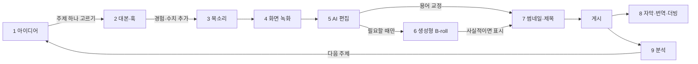

# AI로 유튜브 영상 만들기: 도구와 튜토리얼

> **학습 목표**: 롱폼·Shorts·얼굴 없는 영상의 제작을 아이디어부터 분석까지 9단계로 나누고, 단계마다 YouTube 내장 AI와 외부 도구 가운데 하나를 골라 공식 튜토리얼로 첫 사용법을 익히며, 한국에서 쓸 수 있는 기능과 아직 확인되지 않은 기능을 구분할 수 있다.

이 문서는 「롱폼 영상 기획과 제작」과 「Shorts와 얼굴 없는 채널」에서 다룬 제작 기술을 **AI 도구로 더 빨리 하는 방법**을 단계별로 모았다. 합성 콘텐츠 표시, inauthentic content, 도구 약관 같은 정책 위험은 「AI 활용 제작과 플랫폼 정책」에서, 블로그 쪽 도구는 「AI로 블로그 글 만들기: 도구와 튜토리얼」에서, 프롬프트 모음·검수 절차·자동화·요금은 「AI 제작 방법론: 프롬프트·검수·자동화」에서, 주 10시간 배분은 「원소스 멀티유즈(OSMU) 전략」에서 다룬다. 기능 이름과 제공 지역은 **2026-09 기준**이다. YouTube의 AI 기능은 나라·기기·채널별로 순차 제공되므로 "한국에서 확인됨"과 "확인 안 됨"을 나눠 적었다. 링크는 모두 2026-09-30 검색 결과에 나온 주소이며, 이 환경에서는 직접 열어 보지 못했다. 도구 이름은 **중립적인 예시**일 뿐 추천이 아니다.

## 핵심 개념

| 용어 | 뜻 | 이 문서에서의 쓰임 |
|---|---|---|
| Ask Studio | YouTube Studio 안의 대화형 AI. 내 채널 데이터·댓글·업로드 기록으로 아이디어와 분석 답을 준다 | 아이디어와 분석 단계의 기본값 |
| 영감(Inspiration) 탭 | 아이디어·제목·썸네일·개요를 제안하던 Studio 탭 | 2026-08부터 단계적 종료, Ask Studio로 대체 |
| 텍스트 기반 편집 | 음성을 받아 적은 텍스트를 지우거나 옮기면 영상이 같이 잘리는 편집 방식 | 화면 녹화 강의의 컷 편집 |
| 보이스 클로닝 | 내 목소리 샘플로 AI 음성을 만드는 기능 | Shorts 한 편의 시험에만. 롱폼의 틀린 단어는 다시 녹음한다. 표시 기준은 07 문서 |
| 생성형 영상 | 프롬프트로 짧은 영상 클립을 만드는 모델 (Veo, Runway, Kling 등) | 설명용 B-roll 한정 |
| 자동 더빙 | YouTube가 영상 음성을 다른 언어로 번역해 오디오 트랙을 만드는 기능 | 게시 후 선택 단계 |
| 튜토리얼 | 도구 회사의 공식 도움말·강좌, 또는 검증된 제작자의 강의 영상 | 도구를 처음 쓸 때 20~30분 투자 |

## 원리

### 1. 9단계 흐름과 사람의 확인 지점

AI는 **초안과 반복 작업**을 맡고, 사람은 **경험·화면·판단**을 맡는다. 화살표의 라벨이 사람이 개입하는 지점이다.

### 2. YouTube 내장 AI 기능: 한국에서 쓸 수 있나

외부 도구보다 먼저 확인할 것은 YouTube Studio와 Shorts 앱에 이미 있는 기능이다. 무료이고, 채널 데이터와 바로 연결된다. 다만 제공 지역이 기능마다 다르다.

| 기능 | 하는 일 | 한국 (2026-09 기준) | 근거 |
|---|---|---|---|
| Ask Studio | 아이디어, 댓글 요약, 분석 질문 | **이용 가능** (데스크톱 YouTube Studio) | YouTube 한국 블로그 (검색 결과로 확인) |
| 영감 탭 | 아이디어 카드 제안 | 2026-08부터 단계적 종료 | YouTube 고객센터 (검색 결과로 확인) |
| Edit with AI (Shorts) | 촬영본을 골라 음악·전환을 넣은 첫 편집본. 발표 시점 기준 AI 보이스오버(영어·힌디어)도 넣는다 | 한국 포함 발표 (2025-11), 일부 기기·크리에이터부터 | PPC Land, YouTube 커뮤니티 공지 |
| Gemini 대화형 편집 | 말이나 글로 지시하면 컷·전환·자막을 배치 | 2027년 초 한국·미국 등 14개국 도입 예정이라는 **보도** | ZDNet Korea, 2026-09-24 |
| Veo 3 Fast (Shorts) | Shorts 카메라에서 8초 안팎의 AI 클립 생성 | **확인 안 됨**. 발표 지역은 미국·영국·캐나다·호주·뉴질랜드(2025-09), 이후 일부 중동·북아프리카 | YouTube 블로그, Google MENA 블로그 |
| Dream Screen (Veo 2) | Shorts 배경·클립 생성 | **확인 안 됨**. 발표 지역은 미국·캐나다·호주·뉴질랜드 | YouTube 블로그, 2025-02 |
| 스토리텔링 어시스턴트, 다이내믹 썸네일 | 대본·가편집 피드백, 시청자별 썸네일 선택 | 2026-09-23 발표. 한국 일정 **확인 안 됨** | YouTube 블로그 (Made On YouTube 2026) |
| 자동 더빙 | 다른 언어 오디오 트랙 생성 | 한국어 고객센터 문서 있음. 언어 쌍은 Studio에서 확인 | YouTube 고객센터 |
| YouTube Create 앱 | 모바일 편집 앱 | 한국 Android 제공 국가 목록에 포함 | YouTube 고객센터 |

"확인 안 됨"은 없다는 뜻이 아니라 **공식 자료로 한국 제공을 확인하지 못했다**는 뜻이다. 내 Studio와 Shorts 카메라에 메뉴가 보이는지가 최종 확인이다. 지역 제한을 VPN 등으로 우회하는 방법은 약관 문제가 생길 수 있으므로 쓰지 않는다.

### 3. 아이디어: Ask Studio를 먼저

- **무엇을 하나**: "최근 업로드한 영상의 성과는?", "시청자들이 편집 스타일에 대해 뭐라고 하나?"처럼 묻는다. 채널 분석, 댓글, 업로드 기록을 근거로 답한다.
- **쓰는 법**: 데스크톱 YouTube Studio 오른쪽 위의 반짝임 아이콘을 누른다. 공식 가이드는 "댓글에서 아이디어를 줘"처럼 모호하게 묻기보다 특정 영상을 지정하고, 분석 화면의 용어("트래픽 소스", "새 시청자")를 쓰라고 권한다.
- **제한**: 공식 아티스트 채널, 아동용 채널, 만 18세 미만 크리에이터는 쓸 수 없다고 안내된다 (검색 결과로 확인). 답은 AI 요약이므로 숫자는 분석 화면에서 다시 본다.
- **튜토리얼**: [Ask Studio 소개 (한국어)](https://blog.youtube/intl/ko-kr/news-and-events/ai-ask-studio/), [Ask Studio: Getting started guide (영어)](https://blog.youtube/creator-and-artist-stories/youtube-ask-studio-creator-guide/), [시작 가이드 영상 (영어)](https://www.youtube.com/watch?v=zpXHtc5m4ZI)

영감 탭(예전 이름 Research 탭)은 2026-08부터 단계적으로 사라진다. 키워드 수요를 따로 보고 싶으면 「AI로 블로그 글 만들기: 도구와 튜토리얼」의 키워드 조사 방법을 같이 쓴다.

### 4. 대본과 훅: 범용 LLM + 채널 문맥

- **도구**: Claude, ChatGPT, Gemini 같은 범용 대화형 AI. 스타일 가이드와 지난 대본을 프로젝트 기능에 넣어 두면 매번 설명하지 않아도 된다 ([Claude 프로젝트 만들기](https://support.claude.com/en/articles/9519177-how-can-i-create-and-manage-projects), [Introduction to projects 강좌](https://academy.claude.com/courses/claude-101/introduction-to-projects)).
- **순서**: ① 제목·썸네일 약속 한 줄 → ② 첫 30초 훅 후보 3개 → ③ 챕터 개요 → ④ 귀로 듣는 문장으로 초안 → ⑤ J가 직접 겪은 실수·수치를 `[경험]` 자리에 채운다. 구조 원칙은 「롱폼 영상 기획과 제작」을 따른다.
- **YouTube 쪽 변화**: 2026-09-23 Made On YouTube에서 대본과 가편집을 분석해 속도·구조를 제안하는 스토리텔링 어시스턴트가 발표됐다. 한국 제공 일정은 확인하지 못했다.
- 프롬프트 원문(훅 3개, Shorts 컷 지점 찾기 등)은 「AI 제작 방법론: 프롬프트·검수·자동화」에 템플릿으로 있다.

### 5. 목소리: 내 목소리가 먼저다

얼굴 없는 채널에서 목소리는 진행자다(「Shorts와 얼굴 없는 채널」). 롱폼에서 틀린 단어는 **그 문장을 다시 녹음해** 고친다. AI 음성과 보이스 클로닝은 「롱폼 영상 기획과 제작」에서 정한 대로 Shorts 한 편에서만 시험하는 옵션이다. 합성 음성의 표시와 요금제별 상업 이용 조건은 「AI 활용 제작과 플랫폼 정책」을 본다.

| 도구 (예시) | 한국어 | 특징 (2026-09, 검색 결과로 확인) | 튜토리얼 |
|---|---|---|---|
| Vrew AI 목소리 | 지원 | 편집기 안의 TTS. 준비된 30문장을 읽어 "내 목소리 AI"를 만든다 | [AI 목소리 안내 (한국어)](https://vrew.ai/ko/feature/ai-voice/) |
| ElevenLabs | 지원 | TTS·보이스 클로닝·더빙. Eleven v3가 한국어를 포함한다고 문서화 | [Kevin Stratvert 입문 가이드 (영어)](https://kevinstratvert.com/2026/07/21/elevenlabs-tutorial-for-beginners-complete-step-by-step-guide/) |
| Typecast (타입캐스트) | 지원 | 국내 서비스. 감정 연기가 되는 AI 성우 400여 명이라는 2026-04 보도 | [사용법 (한국어)](https://typecast.ai/kr/learn/how-to-use-typecast/) |
| CLOVA Dubbing (클로바더빙) | 지원 | 네이버클라우드의 AI 보이스 더빙. 무료 이용 시 출처 표기·상업 조건을 약관에서 확인 | [재생목록 (한국어)](https://www.youtube.com/playlist?list=PLq8dHmDf5DDXPPp_LB7yf_qiFqEDg6tmq) |
| Supertone Play (수퍼톤 플레이) | 지원 | HYBE 계열 수퍼톤의 TTS. 2026-01 새 모델로 23개 언어 지원 발표 | [신모델 소개 (한국어)](https://www.supertone.ai/ko/work/ai-tts-model-sona2-multilingual) |

J의 기준: 본 영상은 본인 목소리로 녹음하고, 틀린 함수 이름은 그 문장만 다시 녹음한다. 보이스 클로닝은 Shorts 시험에만 쓰며, 보이스 클로닝으로 고친 영상은 어느 것이든 07 문서의 보수적 기준에 따라 변경·합성 콘텐츠 설정을 켠다.

### 6. 화면 녹화: 녹화는 사람이, 확대는 도구가

| 도구 (예시) | 플랫폼 | AI·자동 기능 | 튜토리얼 |
|---|---|---|---|
| OBS Studio | Windows·macOS·Linux, 무료 | AI 기능은 없다. 설정이 안정적이고 오디오 트랙을 나눠 녹음 | [공식 Quick Start (영어)](https://obsproject.com/kb/quick-start-guide), [OBS 사용법 영상 (한국어)](https://www.youtube.com/watch?v=XuAYjvxi0mE) |
| Screen Studio | macOS 전용이라는 비교 글이 있다 | 클릭 위치 자동 확대, 커서 부드럽게 | 공식 사이트 주소를 검색 결과로 확인하지 못해 링크하지 않음 |
| Loom | 브라우저·데스크톱 | 자막, 제목·요약·챕터 자동 생성, 군말 제거 | [Loom AI features (영어)](https://support.atlassian.com/loom/docs/loom-ai-features) |

자동 확대는 세로 Shorts를 자를 때 특히 쓸모 있다. 다만 확대할 영역은 녹화 전에 J가 정한다(「Shorts와 얼굴 없는 채널」). Windows에서 자동 확대가 필요하면 편집 단계의 키프레임 확대로 대신한다.

### 7. AI 편집: 텍스트로 자르고, 용어는 사람이 고친다

| 도구 (예시) | AI로 하는 일 | 한국어·요금 메모 (검색 결과로 확인) | 튜토리얼 |
|---|---|---|---|
| Vrew | 한국어 자동 자막, 텍스트 삭제로 컷 편집, 무음 구간 정리 | 2026-04-22 통합 크레딧 방식으로 개편. 무료는 매달 크레딧이 충전된다는 안내 | [무작정 따라하기 #1 (한국어)](https://www.youtube.com/watch?v=QtP9PvjMy5E), [텍스트 기반 편집 가이드 (한국어)](https://vrew.ai/ko/blog/all/text-based-video-editing/) |
| CapCut | 자동 캡션, 템플릿, 배경 제거 | 자동 캡션 등이 유료 요금제로 옮겨졌다는 보도. 음원·템플릿 상업 조건 확인 | [자막 인식 도움말 (한국어)](https://www.capcut.com/ko-kr/help/how-to-recognise-subtitles) |
| Descript | 문서처럼 편집, AI 공동 편집자 Underlord, 음질 보정 | 한국어 전사 지원 언어에 포함된다는 제3자 리뷰 | [입문 6단계 (영어)](https://www.descript.com/blog/article/descript-tutorial-for-beginners-6-steps-to-get-started) |
| Premiere Pro | 텍스트 기반 편집, 음성→텍스트 자막, Generative Extend, 미디어 인텔리전스 검색 | 구독형. 한국어 전사는 설치 버전에서 확인 | [Text-Based Editing (영어)](https://helpx.adobe.com/premiere/desktop/edit-projects/edit-video-using-text-based-editing/overview-of-text-based-editing.html) |
| DaVinci Resolve | 20: AI IntelliScript(대본으로 가편집), AI 애니메이션 자막, AI 오디오 어시스턴트. 21(2026-06 정식): AI 도구 추가 | AI 기능 상당수가 유료판(Studio) 기능이라는 보도 | [공식 트레이닝 (영어)](https://www.blackmagicdesign.com/products/davinciresolve/training) |
| YouTube Edit with AI | Shorts 촬영본으로 첫 편집본. 발표 시점 기준 AI 보이스오버도 넣는다 — J는 끄거나, 남기면 합성 음성 표시 | 한국 포함 발표, 순차 제공 | [도움말 (영어)](https://support.google.com/youtube/answer/16631240?hl=en-GB), [How-to Short (영어)](https://www.youtube.com/shorts/1WW76Rz4nqM) |

화면 녹화 강의에서 AI 편집이 가장 많이 틀리는 곳은 **함수 이름·메뉴 이름·숫자**다. "VLOOKUP"이 "브이 룩업"으로, "필터"가 "피터"로 받아 적히는 식이다. 자동 자막은 한 번에 일괄 수정할 단어 목록을 만들어 두면 빨라진다. 도구는 「롱폼 영상 기획과 제작」의 등급표처럼 **하나로 고정**한다.

### 8. 생성형 영상: B-roll에만, 그리고 표시

J 같은 튜토리얼 채널에서 생성형 영상의 자리는 좁다. 실제 화면이 증거이기 때문이다. 쓸 만한 곳은 챕터 전환, 개념 비유("데이터가 쌓이는 창고") 같은 설명용 B-roll이다.

| 서비스 (예시) | 2026-09 상태 (검색 결과로 확인) | 링크 |
|---|---|---|
| Veo (Google) | Gemini 앱·Flow·API에서 Veo 3.1 제공. Flow가 140여 개국으로 확대됐다는 자료가 있으나 한국 포함은 확인 못 함 | [Veo 모델 소개](https://deepmind.google/models/veo/), [Flow 공개 (한국어)](https://blog.google/intl/ko-kr/company-news/technology/google-flow-veo-ai-filmmaking-tool-kr/) |
| Veo in Shorts | 위 표 참고. 한국 확인 안 됨 | [Made on YouTube 2025 도구 설명](https://blog.youtube/news-and-events/generative-ai-creation-tools-made-on-youtube-2025/) |
| Sora (OpenAI) | 앱·웹 2026-04-26 종료, API는 2026-09-24 종료로 안내 | [종료 안내](https://help.openai.com/en/articles/20001152-what-to-know-about-the-sora-discontinuation) |
| Runway | 무료 체험 크레딧과 월 구독. 생성 길이만큼 크레딧 차감 | [크레딧 도움말](https://help.runwayml.com/hc/en-us/articles/15124877443219-How-do-credits-work) |
| Kling (Kuaishou) | 2026-02 3.0 공개 보도 | [공식 사이트](https://kling.ai/) |
| Pika | 웹·앱 서비스 계속 | [공식 사이트](https://pika.art/) |

**규칙 세 가지**: ① 실제 엑셀 화면처럼 보이는 가짜 화면은 만들지 않는다. ② 사실적인 사람·장소·사건 장면이면 변경·합성 콘텐츠를 표시한다(「AI 활용 제작과 플랫폼 정책」). ③ 생성 클립을 반복해 쓰는 것 자체는 문제가 아니다. 영상 전체가 같은 틀·같은 클립·바뀐 문장뿐이면 inauthentic content 쪽 위험이다 (「AI 활용 제작과 플랫폼 정책」).

### 9. 썸네일, 자막·더빙, 분석

**썸네일**: 얼굴 없는 채널의 기본은 결과 화면 캡처 + 2~4단어 문구다(「롱폼 영상 기획과 제작」). Canva의 [YouTube 썸네일 템플릿](https://www.canva.com/create/youtube-thumbnails/)과 [AI 썸네일 메이커](https://www.canva.com/ai-thumbnail-maker/)로 배치 후보를 빠르게 만들고, 문구는 J가 고른다. 후보 2~3개는 [Test & Compare](https://support.google.com/youtube/answer/16391400?hl=en)로 시청 시간 기준 비교한다. 2026-09 발표된 다이내믹 썸네일은 한국 제공을 확인하지 못했다.

**자막·번역·더빙**:
- [자동 자막](https://support.google.com/youtube/answer/6373554?hl=en)은 한국어를 지원하지만, 편집 도구에서 교정한 자막 파일을 올리는 편이 정확하다.
- [자동 더빙 (한국어 도움말)](https://support.google.com/youtube/answer/15569972?hl=ko)은 채널 고급 설정에서 켜고, "게시 전 더빙 직접 검토"를 선택할 수 있다고 안내된다 (검색 결과로 확인). 2026년 초 모든 크리에이터로 확대됐다는 보도가 있다.
- 직접 만든 번역 음성은 [다국어 오디오 트랙](https://support.google.com/youtube/answer/13338784?hl=ko)으로 올린다. 대상 언어·검토 기준은 07 문서의 자동 더빙 항목을 본다.

**분석**: Ask Studio는 분석 화면에서도 추천 질문을 준다. "지난 4주 동안 Shorts에서 롱폼으로 넘어온 시청자는?"처럼 묻고, 답에 나온 숫자는 분석 탭의 원래 보고서와 대조한다. 지표 해석은 「유튜브 추천 구조와 채널 설계」를 따른다.

## 적용: 예시 크리에이터 J의 영상 제작 스택

J의 한 주 배분은 「원소스 멀티유즈(OSMU) 전략」의 기준표를 따른다. 영상 쪽 6시간(스크립트 0.5, 녹화·음성 1.5, 롱폼 편집·썸네일 3.0, Shorts 1.0)에 도구를 하나씩 붙이면 이렇다. 시간은 설명용 가정이다.

| 단계 | J가 쓰는 도구 | AI가 하는 일 | J가 하는 일 | 시간 (가정) |
|---|---|---|---|---|
| 아이디어 | Ask Studio | 지난 영상 댓글 질문 요약 | 주제 하나 고르기 | 조사 시간에 포함 |
| 대본·훅 | Claude Projects (스타일 가이드, 지난 대본 2편) | 훅 3개, 챕터 개요, 초안 | 실수 사례·수치 채우기, 소리 내어 읽기 | 0.5 |
| 녹화·음성 | OBS Studio + USB 마이크 | 없음 | 실제 파일로 녹화, 본인 목소리 녹음 | 1.5 |
| 롱폼 편집 | Vrew | 자동 자막, 텍스트 컷, 무음 정리 | 함수 이름 교정, 확대 구간 편집 | 2.5 |
| 썸네일 | Canva + Test & Compare | 배치 후보 | 문구 결정, 결과 화면 캡처 | 0.5 |
| Shorts 3개 | Vrew 세로 재편집 (Edit with AI는 메뉴가 보이면 1개만 시험, AI 보이스오버는 끈다) | 구간 후보 | 결과형·실수형·질문형 선택 | 1.0 |
| 게시 후 | YouTube 자동 자막 교정본 업로드, Ask Studio | 댓글 요약 | 다음 주제 메모 | 월요일 점검에 포함 |

- **시험 규칙 (가정)**: 새 도구는 한 달에 하나만, Short 1개에서 시험한다. 4주 뒤 편집 시간과 시청 vs 스와이프 비율을 기존 방식과 비교해 남길지 정한다.
- **쓰지 않는 것**: 생성형 영상으로 만든 엑셀 화면, 전체 AI 내레이션. AI 음성은 「롱폼 영상 기획과 제작」에서 정한 대로 Shorts 한 편의 시험 옵션으로만 쓴다.
- **표시**: 본인 화면과 본인 목소리만 쓴 영상은 표시 대상이 아니다. AI 음성 Short, 보이스 클로닝으로 고친 영상, 사실적 생성 클립이 들어간 영상은 표시한다.

## 심화

### 발표와 제공은 다르다

2026-09-23 Made On YouTube 2026에서 대화형 편집, 스토리텔링 어시스턴트, 다이내믹 썸네일, 라이브 실시간 더빙 등이 발표됐다. YouTube의 AI 기능은 대개 **영어·미국 → 일부 국가 → 확대** 순서로 제공되고, 같은 나라 안에서도 채널마다 시기가 다르다. 그래서 이 문서는 발표만 있는 기능을 J의 작업표에 넣지 않았다. 새 기능은 ① 공식 블로그 발표, ② 고객센터 문서의 제공 국가, ③ 내 Studio 화면 순서로 확인한다.

### 튜토리얼을 고르는 기준

① 공식 도움말·강좌를 먼저, ② 한국어 자료가 있으면 한국어를, ③ 최근 1년 안의 자료를, ④ "AI로 하루 만에 수익" 같은 제목의 채널은 피한다. 도구 화면은 몇 달 만에 바뀌므로 영상 하나와 공식 도움말 하나를 같이 둔다. YouTube 공식 교육 자료는 [YouTube 크리에이터 (한국어)](https://www.youtube.com/intl/ko_ALL/creators/)와 [AI for Creators](https://www.youtube.com/creators/create/ai-for-creators/)에 모여 있다.

### 도구 비용과 중단 위험

Sora 앱·웹이 2026-04에 종료된 것처럼, AI 도구는 요금제와 존속 여부가 빠르게 바뀐다. 원본 녹화 파일, 대본, 자막 파일(.srt)을 **도구 밖에 보관**하면 도구를 바꿔도 작업이 남는다. LLM·자동화 도구의 월 예산표는 「AI 제작 방법론: 프롬프트·검수·자동화」에 있다. 편집·음성 도구의 요금 메모는 이 문서의 표에 두고, 결제 전 공식 가격 페이지에서 확인한다.

## 흔한 오해

- **"YouTube가 발표했으니 한국에서도 된다"** — Veo in Shorts와 Dream Screen은 2026-09 기준 한국 제공을 확인하지 못했다. 발표와 제공 국가는 따로 확인한다.
- **"영감 탭이 아이디어 도구다"** — 2026-08부터 단계적으로 종료된다. 대화형 Ask Studio가 대신한다.
- **"AI 편집이면 자막 교정이 필요 없다"** — 함수·메뉴 이름과 숫자는 거의 항상 틀린다. 교정은 사람이 한다.
- **"내 목소리를 복제한 AI 음성은 표시할 필요가 없다"** — 공식 문서로 예외를 확인하지 못했으므로 보수적으로 표시한다(「AI 활용 제작과 플랫폼 정책」).
- **"도구를 많이 쓸수록 빨라진다"** — 단계마다 하나로 고정해야 절약이 쌓인다. 새 도구 학습 시간도 제작 시간이다.

## 자기 점검 질문

1. Ask Studio와 영감 탭은 어떻게 다르며, 2026-09 기준 한국 크리에이터는 어느 쪽을 써야 하는가?
2. 9단계 흐름에서 사람이 반드시 개입하는 지점 세 곳을 꼽고, 각각 무엇을 확인하는지 말해 보라.
3. 화면 녹화 강의를 텍스트 기반 편집 도구로 자를 때 가장 먼저 교정해야 할 오류 유형은 무엇인가?
4. J가 설명용 B-roll로 생성형 영상을 한 컷 넣을 때 지켜야 할 규칙 세 가지는?
5. 새 YouTube AI 기능이 발표됐을 때 한국에서 쓸 수 있는지 확인하는 순서를 말해 보라.

## 참고 자료

모든 링크는 2026-09-30 검색 결과로 확인했다 (직접 접속 확인은 못 함).

**YouTube: 아이디어·분석·편집**
- [한국 크리에이터들을 위한 새로운 AI 파트너, Ask Studio를 소개합니다!](https://blog.youtube/intl/ko-kr/news-and-events/ai-ask-studio/) — YouTube 한국 블로그; [Learn about Ask Studio in YouTube Studio](https://support.google.com/youtube/answer/16291691?hl=en) — YouTube 고객센터
- [Ask Studio: Getting started guide for creators](https://blog.youtube/creator-and-artist-stories/youtube-ask-studio-creator-guide/) — YouTube 블로그; [Ask Studio - Getting Started Guide for Creators](https://www.youtube.com/watch?v=zpXHtc5m4ZI) — YouTube (영어)
- [Explore Inspiration tab on YouTube](https://support.google.com/youtube/answer/15575509?hl=en) — YouTube 고객센터 (2026-08 단계적 종료 안내)
- [최신 유튜브 스튜디오 업데이트로 창작 여정을 혁신하세요](https://blog.youtube/intl/ko-kr/news-and-events/youtube-studio-made-on-youtube-2025/) — YouTube 한국 블로그, 2025-09
- [Made On YouTube 2026: All Announcements & New Features](https://blog.youtube/news-and-events/innovation-youtube-era-made-on-viewers-creators/) — YouTube 블로그, 2026-09
- ["크리에이터 대체 안한다"…유튜브, AI 기능 대폭 확대](https://zdnet.co.kr/view/?no=20260924092215) — ZDNet Korea, 2026-09-24 (대화형 편집 14개국 도입 예정 보도)
- [Create content using Edit with AI](https://support.google.com/youtube/answer/16631240?hl=en-GB) — YouTube 고객센터; [YouTube launches Edit with AI for automated Shorts creation](https://ppc.land/youtube-launches-edit-with-ai-for-automated-shorts-creation/) — PPC Land, 2025-11; [HOW TO: Edit with AI in YouTube Shorts](https://www.youtube.com/shorts/1WW76Rz4nqM) — YouTube (영어)
- [YouTube Create available locations](https://support.google.com/youtube/answer/13952912?hl=en) — YouTube 고객센터; [YouTube Shares More Info on Its 'Ask Studio' AI Bot](https://www.socialmediatoday.com/news/youtube-ask-studio-ai-chatbot-explainer-analytics/803682/) — Social Media Today

**YouTube: 생성형 영상·썸네일·자막·더빙**
- [Unpacking the magic of our new creative tools](https://blog.youtube/news-and-events/generative-ai-creation-tools-made-on-youtube-2025/) — YouTube 블로그, 2025-09 (Veo 3 Fast 제공 국가)
- [Unlocking new creative possibilities with Veo 3 on YouTube Shorts in MENA](https://blog.google/intl/en-mena/product-updates/connect-communicate/unlocking-new-creative-possibilities-on-youtube-shorts-with-veo-3-in-mena/) — Google MENA 블로그, 2025-11
- [Imagine it, create it: Veo 2 is coming to YouTube Shorts](https://blog.youtube/news-and-events/veo-2-shorts/) — YouTube 블로그, 2025-02
- [AI 생성 기능을 사용하여 Shorts 콘텐츠 만들기](https://support.google.com/youtube/answer/15260303?hl=ko) — YouTube 고객센터
- [A/B test titles & thumbnails](https://support.google.com/youtube/answer/16391400?hl=en) — YouTube 고객센터; [Use automatic captioning](https://support.google.com/youtube/answer/6373554?hl=en) — YouTube 고객센터
- [자동 더빙 사용하기](https://support.google.com/youtube/answer/15569972?hl=ko), [동영상에 다국어 기능 추가하기](https://support.google.com/youtube/answer/13338784?hl=ko) — YouTube 고객센터; [YouTube Expands Auto-Dubbing to All Creators](https://www.socialmediatoday.com/news/youtube-expands-auto-dubbing-to-all-creators/811375/) — Social Media Today
- [YouTube 크리에이터](https://www.youtube.com/intl/ko_ALL/creators/), [AI for Creators](https://www.youtube.com/creators/create/ai-for-creators/) — YouTube 공식 교육 사이트

**음성**
- [내 목소리 AI 만들기](https://vrew.ai/ko/feature/ai-voice/) — Vrew; [Korean Text to Speech](https://elevenlabs.io/text-to-speech/korean), [Text to Speech 문서](https://elevenlabs.io/docs/overview/capabilities/text-to-speech) — ElevenLabs; [ElevenLabs Tutorial for Beginners](https://kevinstratvert.com/2026/07/21/elevenlabs-tutorial-for-beginners-complete-step-by-step-guide/) — Kevin Stratvert, 2026-07-21
- [인공지능 성우 타입캐스트 사용법](https://typecast.ai/kr/learn/how-to-use-typecast/) — Typecast; [AI 성우 활용 콘텐츠 제작의 강자 '타입캐스트'](https://www.mstoday.co.kr/news/articleView.html?idxno=101040) — MS TODAY, 2026-04
- [CLOVA Dubbing](https://www.ncloud.com/product/aiService/clovaDubbing) — 네이버클라우드; [CLOVA Dubbing 재생목록](https://www.youtube.com/playlist?list=PLq8dHmDf5DDXPPp_LB7yf_qiFqEDg6tmq) — YouTube (한국어)
- [수퍼톤 플레이 TTS 신모델 공개](https://www.supertone.ai/ko/work/ai-tts-model-sona2-multilingual) — Supertone; [Supertone Play](https://play.supertone.ai/)

**녹화와 편집**
- [Quick Start Guide](https://obsproject.com/kb/quick-start-guide) — OBS; [OBS Studio로 화면 녹화하기](https://inflab-1.gitbook.io/inflearn/lecture-video/recording/obs-studio) — 인프런 지식공유자 가이드; [OBS Studio 사용법](https://www.youtube.com/watch?v=XuAYjvxi0mE) — YouTube (한국어)
- [Screen Studio for Windows: 7 Best Alternatives](https://www.screensnap.pro/blog/screen-studio-for-windows) — ScreenSnap (macOS 전용 여부 비교 글); [Loom AI features](https://support.atlassian.com/loom/docs/loom-ai-features) — Atlassian 지원
- [브루 무작정 따라하고 마스터하기 #1](https://www.youtube.com/watch?v=QtP9PvjMy5E) — YouTube (한국어), [Vrew 튜토리얼 모음](https://vrew.imweb.me/tutorial), [Vrew_PC Tutorial (ko) 재생목록](https://www.youtube.com/playlist?list=PLIJ_xikv0zfcSMgpi9w2fb4348keFPxWK)
- [AI 자막 생성 프로그램 Vrew로 유튜브 자막 넣기](https://vrew.ai/ko/blog/all/ai-subtitle-with-vrew/), [텍스트 기반 영상 편집 가이드](https://vrew.ai/ko/blog/all/text-based-video-editing/) — Vrew 블로그; [2026/4/22, 통합 크레딧 방식으로 변경됩니다](https://vrew.imweb.me/notice/?bmode=view&idx=170656156) — Vrew 공지
- [자막을 어떻게 인식합니까?](https://www.capcut.com/ko-kr/help/how-to-recognise-subtitles) — CapCut 도움말; [CapCut captions aren't free anymore](https://www.descript.com/blog/article/capcut-captions-arent-free-anymore-heres-a-better-option) — Descript 블로그 (경쟁사 글)
- [Descript Tutorial for Beginners: 6 Steps to Start](https://www.descript.com/blog/article/descript-tutorial-for-beginners-6-steps-to-get-started), [How to Get Started with Underlord: An AI Video Editor Primer](https://www.descript.com/blog/article/underlord-ai-video-editor-primer) — Descript 블로그
- [Text-Based Editing overview in Premiere](https://helpx.adobe.com/premiere/desktop/edit-projects/edit-video-using-text-based-editing/overview-of-text-based-editing.html), [What's new in Adobe Premiere](https://helpx.adobe.com/premiere/desktop/whats-new/whats-new.html) — Adobe 도움말
- [DaVinci Resolve Training](https://www.blackmagicdesign.com/products/davinciresolve/training) — Blackmagic Design; [DaVinci Resolve 20 Released with a Handful of AI-assisted Features](https://www.cined.com/davinci-resolve-20-released-with-handful-of-ai-assisted-features/) — CineD; [DaVinci Resolve 21 Officially Released](https://petapixel.com/2026/06/03/davinci-resolve-21-officially-released-with-new-photo-editing-ai-tools-and-much-more/) — PetaPixel, 2026-06-03

**생성형 영상, 썸네일, 대본**
- [Veo](https://deepmind.google/models/veo/) — Google DeepMind; [[I/O 2025] 비오 3 기반 AI 영화 제작 툴 '플로우(Flow)'](https://blog.google/intl/ko-kr/company-news/technology/google-flow-veo-ai-filmmaking-tool-kr/) — Google 코리아 블로그; [You can now make your images talk with Veo 3 in Flow, plus we're expanding to more countries](https://blog.google/innovation-and-ai/models-and-research/google-labs/flow-adds-speech-expands/) — Google 블로그
- [What to know about the Sora discontinuation](https://help.openai.com/en/articles/20001152-what-to-know-about-the-sora-discontinuation) — OpenAI 도움말; [OpenAI's Sora was the creepiest app on your phone -- now it's shutting down](https://techcrunch.com/2026/03/24/openais-sora-was-the-creepiest-app-on-your-phone-now-its-shutting-down/) — TechCrunch, 2026-03-24
- [How do credits work?](https://help.runwayml.com/hc/en-us/articles/15124877443219-How-do-credits-work), [Pricing](https://runway.com/pricing) — Runway; [Kling AI](https://kling.ai/); [Pika](https://pika.art/)
- [YouTube 썸네일 만들기](https://www.canva.com/create/youtube-thumbnails/), [AI Thumbnail Maker](https://www.canva.com/ai-thumbnail-maker/) — Canva
- [How can I create and manage projects?](https://support.claude.com/en/articles/9519177-how-can-i-create-and-manage-projects) — Claude 도움말; [Introduction to projects](https://academy.claude.com/courses/claude-101/introduction-to-projects) — Claude Academy

