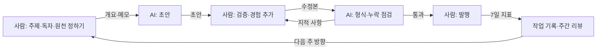

# AI 제작 방법론: 프롬프트·검수·자동화 — 도구가 바뀌어도 남는 작업 방식

> **학습 목표**: "사람이 방향 → AI가 초안 → 사람이 검증과 경험 → AI가 형식 점검"이라는 운영 모델을 OSMU 제작 단계에 대응시키고, 재사용할 프롬프트 템플릿과 스타일 가이드를 도구 밖의 내 파일로 관리하며, 발행 전 검수 절차·반복 작업 자동화·AI 효과 측정과 월 도구 예산을 스스로 설계할 수 있다.

도구 이름은 몇 달마다 바뀐다. 2026년 7월 NotebookLM은 Gemini Notebook으로 이름을 바꿨고, 9월에는 OpenAI가 custom GPTs 은퇴를, Google이 Gems의 Skills 전환을 발표했다. 그래서 이 문서는 **도구가 바뀌어도 남는 작업 방식**을 다룬다. 블로그 단계별 도구 사용법은 「AI로 블로그 글 만들기: 도구와 튜토리얼」, 영상 단계별 도구 사용법은 「AI로 유튜브 영상 만들기: 도구와 튜토리얼」, 합성 콘텐츠 표시·inauthentic content·약관 같은 정책은 「AI 활용 제작과 플랫폼 정책」, 한 주의 제작 흐름과 시간 배분은 「원소스 멀티유즈(OSMU) 전략」을 따른다. 기능·가격·상태는 **2026-09 기준**이며, 대부분의 공식 페이지에 직접 접속할 수 없어 "검색 결과로 확인"으로 표시했다. 도구 이름은 중립적인 예시이며 추천이 아니다.

## 핵심 개념

| 용어 | 뜻 | 이 문서에서의 쓰임 |
|---|---|---|
| 운영 모델 | 사람과 AI가 한 결과물에서 맡는 순서와 역할 | 방향 → 초안 → 검증·경험 → 형식 점검 |
| 프롬프트 템플릿 | 빈칸만 바꿔 매주 다시 쓰는 지시문 | [역할·참조]·[입력]·[작업]·[형식]·[제약] 다섯 칸 |
| 스타일 가이드 | 독자·말투·금지 표현·용어·형식을 적은 한 장짜리 문서 | 모든 초안의 기준. 원본은 내 파일로 보관 |
| 프로젝트 메모리 | 지시문과 참고 파일을 대화마다 자동으로 불러오는 기능 | Claude Projects, ChatGPT Projects, Gems·Skills, Gemini Notebook |
| 독창성 레이어 | AI가 만들 수 없고 J만 더할 수 있는 증거 | 직접 녹화한 화면, 실제 파일, 실수, 측정값 |

## 원리

### 1. 운영 모델: 네 칸을 순서대로

AI는 **빈 페이지를 없애고 형식을 맞추는 데** 강하고, **사실을 보증하고 경험을 만드는 데** 약하다. 그래서 역할을 네 칸으로 나눈다. 사람이 방향(누구에게, 무엇을)을 정하고, AI가 초안을 쓰고, 사람이 사실을 확인하고 자기 경험을 넣고, 마지막에 AI가 누락·맞춤법·형식을 점검한다. 점검에서 지적이 나오면 사람 칸으로 되돌아간다. Anthropic의 무료 강좌 [AI Fluency](https://academy.claude.com/courses/ai-fluency-framework-foundations)(영어)가 말하는 4D(Delegation·Description·Discernment·Diligence)도 같은 구조다: 맡길 일을 고르고, 분명히 설명하고, 결과를 판별하고, 책임진다.



### 2. 프롬프트는 문장이 아니라 양식이다

좋은 프롬프트를 매번 새로 쓰면 품질이 요일마다 달라진다. **빈칸이 있는 양식**을 만들어 두고 입력만 바꾼다. 이 문서의 템플릿은 다섯 칸이다: **[역할·참조]**(누구로서, 어떤 스타일 가이드로), **[입력]**(이번 주의 검색어·개요·전사문·지표. 긴 자료는 지시문 위에 둔다), **[작업]**(한 번에 한 가지), **[형식]**(표의 열, 길이, 자리 표시. 형식이 정해지면 검수가 쉬워진다), **[제약]**("모르면 [확인 필요]로 남겨라", "없는 수치를 만들지 마라". 환각을 줄이는 가장 싼 방법). 기본기는 Anthropic의 [Prompt engineering overview](https://docs.anthropic.com/en/docs/build-with-claude/prompt-engineering/overview)와 [대화형 튜토리얼](https://github.com/anthropics/prompt-eng-interactive-tutorial)(영어), Google의 [Google Prompting Essentials](https://www.skills.google/paths/2337/course_templates/1229)(영어, 10시간 미만 과정)로 익힌다.

### 3. 스타일 가이드와 프로젝트 메모리: 원본은 내 파일로

프로젝트 메모리 기능은 스타일 가이드와 참고 파일을 매 대화에 자동으로 불러와 준다. 다만 2026년 9월 한 달 사이에 두 회사가 이 기능의 형태를 바꿨다. 결론은 하나다. **스타일 가이드의 원본은 `style_guide.md` 한 파일로 내가 갖고, 각 도구에는 복사본을 넣는다.** 도구를 바꿔도 파일을 다시 붙여 넣으면 끝난다.

| 기능 | J의 용도 |
|---|---|
| Claude Projects | 스타일 가이드 + 지난 개요 모음으로 "주간 제작" 프로젝트 |
| ChatGPT Projects | ChatGPT를 주력으로 쓸 때 같은 구성 |
| custom GPTs | **새로 만들지 않는다**. 기존 GPT가 있으면 지시문을 `style_guide.md`로 옮긴다 |
| Gemini Gems → Skills | Gemini를 교차 점검용으로 쓸 때 "팩트체크" Skill 하나 |
| Gemini Notebook (옛 NotebookLM) | 공식 문서·도움말·참고 영상을 모은 "조사 노트북" |

도구별 2026-09 상태와 튜토리얼은 「AI로 블로그 글 만들기: 도구와 튜토리얼」을 본다.

```text
# style_guide.md 템플릿 — J의 스타일 가이드 원본 v1 (2026-10-05)
독자: 엑셀은 매일 쓰지만 함수와 자동화는 낯선 사무직
말투: 존댓말, 한 문장에 한 가지, 전문 용어는 처음 한 번 풀어 쓴다
금지: 과장("무조건", "1분 만에"), 확인하지 않은 수치, 남의 화면 캡처
용어: 엑셀 메뉴는 한국어 UI 이름, 함수는 대문자(XLOOKUP, UNIQUE)
형식: 블로그 첫 화면 = 결론+대상+소요 시간 / 영상 첫 30초 = 문제→결과→오늘 배울 것
증거: 글·영상마다 J의 실수 1개 + 측정값 1개 + 직접 녹화한 화면
```

### 4. 독창성 레이어: J만 더할 수 있는 것

AI 초안은 누구에게나 비슷하게 나온다. 결과물을 J의 것으로 만드는 것은 **AI가 가질 수 없는 증거**다: 실제 엑셀 파일로 직접 녹화한 화면, 회사 자료를 지운 예제 파일, 처음에 틀렸던 수식과 고친 과정, "3,200행 정리에 수작업 40분 → 함수 2분" 같은 측정값, 댓글로 받은 독자 질문. 템플릿의 `[J의 실수/측정값]` 빈칸은 AI가 채우지 못하게 일부러 남긴 자리다. 플랫폼도 같은 방향이다. YouTube의 inauthentic content 정의와 2026-07에 설명된 세 유형은 「AI 활용 제작과 플랫폼 정책」을 따르고, Google 검색은 만드는 방법보다 경험과 전문성이 드러나는 [사람 중심 콘텐츠](https://developers.google.com/search/docs/fundamentals/creating-helpful-content)를 보상한다고 안내한다. 네이버의 평가 방식은 「네이버 블로그와 검색 구조」를 본다.

### 5. 검수 프로토콜: 판정은 원 출처가 한다

| 대상 | 확인 방법 | 통과 기준 |
|---|---|---|
| 출처 | AI가 댄 링크를 직접 열고 해당 문장을 찾는다 | 공식 문서·도움말 등 원 출처 1개 이상, 확인 날짜 기록 |
| 수치·가격·날짜 | 원 출처와 대조하고 "2026-09 기준"을 붙인다 | 원 출처가 없으면 지우거나 "확인하지 못함"으로 쓴다 |
| 메뉴 경로·함수 이름 | 실제 엑셀에서 그대로 따라 해 본다 | 글·대본·캡처가 서로 일치 |
| 스크린샷 | 개인정보·회사 파일명·AI 생성 화면이 있는지 본다 | 직접 찍은 실제 화면만 |
| 교차 모델 점검 | 다른 회사 모델에게 원고와 팩트체크 목록(P7)을 주고 반론·누락을 묻는다 | 지적된 항목은 원 출처로 판정. 모델끼리 다수결로 정하지 않는다 |
| 표시·권리 | 「AI 활용 제작과 플랫폼 정책」의 발행 전 검증 절차를 따른다 | 그 절차 통과 |

발행 직전 체크리스트는 다섯 줄이면 된다: ① P7 목록의 "높음" 항목을 모두 원 출처로 확인했다 ② `[확인 필요]`와 `[J의 …]` 자리 표시가 하나도 남지 않았다 ③ 캡처와 본문의 메뉴 이름이 같다 ④ 스타일 가이드의 금지 표현이 없다 ⑤ 작업 기록에 쓴 도구와 확인 날짜를 적었다.

### 6. 자동화: 반복 단계만, 발행은 사람

자동화할 대상은 **판단이 없는 반복**이다: 매주 같은 순서로, 같은 입력을, 같은 곳에 옮기는 일. 네이버 블로그 통계는 공개 API를 확인하지 못했으므로 손으로 옮긴다. 발행을 자동화하지 않는 이유는 표 아래에 적었다.

| 도구 | 무료 범위 (2026-09, 검색 결과로 확인) | 유료 시작 | J가 맡길 반복 작업 | 튜토리얼 |
|---|---|---|---|---|
| Apps Script | 무료. 개인 계정은 트리거 실행 합계 하루 90분, 1회 실행 6분 | — | 캘린더 시트 날짜에 맞춘 발행 알림 메일, 매주 월요일 YouTube Analytics 수치를 시트에 한 줄 기록, 주차 폴더와 `rights.md` 틀 만들기 | [Apps Script overview](https://developers.google.com/apps-script/overview)(영어, 공식), [AI로 구글 시트 앱 10분 만에](https://www.oppadu.com/lesson/ai-apps-script-10min/)(한국어, 오빠두엑셀) |
| Make | Free 월 1,000 크레딧 | Core 월 약 $9~12 (10,000 크레딧. 결제 주기에 따라 다르고 자료마다 차이) | 전사문을 드라이브 폴더에 넣으면 LLM API로 개요·블로그 초안 문서 생성 (API 요금 별도) | [Make Academy](https://academy.make.com/)(영어, 무료) |
| Zapier | Free 월 100 tasks, 2단계 Zap | Professional 월 $19.99(연간 결제)·$29.99(월간), 750 tasks | 위와 같음. 연결 앱이 가장 많다 | [Build your first Zap](https://learn.zapier.com/build-your-first-zap)(영어) |
| n8n | 자체 호스팅 Community Edition 무료 | Cloud Starter 월 €24(연간 결제 시 €20), 2,500 executions | 위와 같음. 복잡한 흐름, 서버를 직접 운영할 수 있을 때 | [Level one 텍스트 과정](https://docs.n8n.io/courses/level-one/)(영어, 공식, 약 2시간), [n8n 노코드 자동화 한글 가이드북](https://wikidocs.net/book/18092)(한국어, WikiDocs) |

- **플랫폼**: 네이버 블로그 글쓰기 API는 광고성 대량 글 때문에 2020-05-06 종료됐다 (보도로 확인). 공식 자동 게시 경로가 없고, 매크로 우회는 「AI 활용 제작과 플랫폼 정책」에서 다룬 비정상 이용 제재 쪽으로 간다. YouTube에서는 2020-07-28 이후 만든 검증되지 않은 API 프로젝트로 올린 영상은 비공개로 잠기고, 공개하려면 감사(audit)를 받아야 한다 (YouTube Data API 문서, 검색 결과로 확인). 사람 없이 초안부터 발행까지 돌면 영상 간 차이가 줄어 inauthentic content에 가까워진다.
- **보안과 비용**: API 키를 공유 시트에 두지 않고 권한은 필요한 범위만 준다. Zapier는 성공한 액션마다, Make는 오퍼레이션마다 크레딧을 쓰므로 반복 실행이 요금을 키운다. 실패 알림을 켜서 "조용히 멈춘 자동화"를 막는다.

## 적용: 예시 크리에이터 J의 프롬프트 라이브러리와 주간 루프

### J의 주간 루프: OSMU 단계별 네 칸

「원소스 멀티유즈(OSMU) 전략」의 주 10시간 배분을 그대로 쓰고, 단계마다 네 칸을 나눈다. P1~P8은 아래 프롬프트 템플릿 번호다. `{ }`를 이번 주 자료로 바꾸고, 프로젝트 메모리에 `style_guide.md`를 넣은 상태에서 쓴다. 결과는 언제나 초안이다.

| OSMU 단계 (시간) | 사람: 방향 | AI: 초안 | 사람: 검증·경험 | AI: 형식 점검 |
|---|---|---|---|---|
| 조사·예제 파일 (1.0) | 이번 주 독자 문제 선택 | 검색어 묶기(P1), 노트북 안 자료 요약 | 원 출처 열기, 예제 파일 직접 제작 | — |
| 개요 (0.5) | 문제 정의 | 개요 초안(P2) | 직접 해 본 순서로 고치기 | 빠진 단계 찾기 |
| 스크립트 (0.5) | 훅 선택 | 대본 초안(P4) | 실수 사례·측정값 넣기 | 길이·말투 점검 |
| 녹화·음성 (1.5) | 전부 사람 | — | 실제 파일로 녹화 | — |
| 롱폼 편집·썸네일 (3.0) | 썸네일 결정 | 문구 후보(P6) | 문구 선택 (Test & Compare는 「롱폼 영상 기획과 제작」 기준, 조회가 쌓인 뒤에만) | 자막 오탈자 |
| 블로그 글 (2.0) | 첫 화면 결정 | 글 초안(P3), 팩트체크 목록(P7) | 캡처·수식 대조 | 교차 모델 점검, 맞춤법 |
| Shorts 3개 (1.0) | 3개 선택 | 구간 후보(P5) | 첫 1~2초 편집 | 자막 |
| 커뮤니티·기록 (0.5) | 다음 주 방향 | 7일 리뷰 초안(P8) | 결정 | — |

### 프롬프트 라이브러리 (템플릿)

```text
# P1 템플릿: 검색어 묶기
[역할·참조] 너는 네이버 블로그와 YouTube 튜토리얼 채널의 편집자다. style_guide.md의 독자 항목을 따른다.
[입력] 데이터랩·검색광고 키워드 도구에서 모은 검색어: {붙여넣기}
[작업] 같은 문제를 푸는 검색어끼리 5~8개 묶음으로 나누고, 묶음마다 대표 질문 한 문장을 적어라.
[형식] 표: 묶음 이름 | 대표 질문 | 포함 검색어 | 검색 의도(방법/문제 해결/비교/개념)
[제약] 목록에 없는 검색어나 검색량 숫자를 만들지 마라. 애매한 검색어는 "미분류"에 둔다.
```

```text
# P2 템플릿: 독자 질문에서 개요로
[역할·참조] 너는 엑셀 업무 자동화 강의의 구성 작가다. style_guide.md를 따른다.
[입력] 주제: {주제} / 독자 질문: {목록} / 내가 해 본 과정 메모: {메모}
[작업] "하나의 개요"를 만들어라: 문제 → 해결 단계 → 흔한 실수 → 다음 단계.
[형식] 소제목 5~7개. 소제목마다 핵심 한 줄과 "필요한 화면 캡처" 한 줄.
[제약] 내 메모에 없는 단계는 [확인 필요]로 표시한다.
```

```text
# P3 템플릿: 스타일 가이드에 맞춘 블로그 초안
[역할·참조] 너는 J의 네이버 블로그 편집자다. 프로젝트의 style_guide.md를 따른다.
[입력] 이번 주 개요: {개요} / 과정 메모: {메모}
[작업] 네이버 블로그 글 초안을 써라. 첫 화면 3~5줄에 결론·대상·소요 시간을 둔다.
[형식] 소제목은 개요와 같게. 단계마다 [캡처: 무엇을 보여 줄지] 자리 표시를 넣는다.
[제약] 수치·메뉴 경로·함수 이름은 개요와 메모에 있는 것만 쓰고, 없으면 [확인 필요]. 경험 자리는 [J의 실수/측정값] 빈칸으로 남긴다.
```

```text
# P4 템플릿: 훅이 있는 롱폼 대본
[역할·참조] 너는 J의 강의 대본 작가다. style_guide.md의 말투 항목을 따른다.
[입력] 이번 주 개요: {개요}
[작업] 8~12분 강의 대본을 써라. 첫 30초는 문제 장면 → 완성 결과 → 오늘 배울 것 순서다.
[형식] 두 열 표: 말할 문장 | 화면 지시(녹화할 동작)
[제약] 귀로 듣는 짧은 문장. "1분 만에 끝" 같은 과장 금지. 개요에 없는 기능은 [확인 필요]로 표시한다.
```

```text
# P5 템플릿: 전사문에서 Shorts 구간 고르기
[역할·참조] 너는 J의 Shorts 편집자다. style_guide.md를 따른다.
[입력] 롱폼 강의의 타임스탬프 포함 전사문: {전사문}
[작업] Short로 자를 30~60초 구간 후보 5개를 골라라. 결과가 한 화면에 보이는 구간이 우선이다.
[형식] 표: 시작~끝 | 유형(결과형/실수형/질문형) | 첫 1~2초 자막 문구 | 롱폼으로 보낼 이유
[제약] 전사문에 없는 내용을 더하지 마라. 앞뒤 맥락 없이 이해되지 않는 구간은 뺀다.
```

```text
# P6 템플릿: 썸네일 문구 후보
[역할·참조] 너는 썸네일 문구 작가다. style_guide.md의 금지 표현을 따른다.
[입력] 제목 후보: {제목} / 결과 화면 설명: {설명} / 대상 시청자: {대상}
[작업] 썸네일 문구 후보 10개를 만들어라. 짧게, 최대 두 줄.
[형식] 번호 | 문구 | 제목과 겹치지 않는 정보 | 과장 위험(낮음/중간/높음)
[제약] 영상에서 보여 주지 않는 결과를 약속하지 마라.
```

```text
# P7 템플릿: 팩트체크 목록
[역할·참조] 너는 발행 전 검수자다. style_guide.md의 금지 항목도 함께 본다.
[입력] 발행 전 원고: {원고}
[작업] 확인이 필요한 주장을 모두 뽑아라: 수치, 날짜, 가격, 메뉴 경로, 함수 이름, 정책, 다른 서비스 설명.
[형식] 표: 문장 | 주장 유형 | 확인할 원 출처의 종류 | 위험도(높음/중간/낮음)
[제약] 주장이 맞는지 판정하지 마라. 목록만 만든다. 판정은 사람이 원 출처로 한다.
```

```text
# P8 템플릿: 발행 7일 뒤 리뷰
[역할·참조] 너는 J의 채널 분석 보조다.
[입력] 7일 지표: {조회수·평균 시청 지속 시간·노출 클릭률·블로그 유입 검색어·댓글 요약} / 지난 4주 평균: {값}
[작업] 4주 평균과 비교해 달라진 점 3가지와 다음 주에 바꿀 것 1가지를 제안하라.
[형식] 관찰 | 근거 지표 | 가설 | 다음 주 실험 1개
[제약] 지표에 없는 원인을 단정하지 마라. 가설은 가설로 표시한다.
```

### J의 월 도구 예산 (2026-09 기준)

| 항목 | 선택 | 플랜과 가격 (검색 결과로 확인) | J의 판단 |
|---|---|---|---|
| 주력 LLM (하나만) | Claude, ChatGPT, Gemini 중 하나 | Claude Pro 월 $20(연간 결제 시 월 $17) / ChatGPT Plus 월 $20(연간 결제 없음) / Google AI Pro 월 $19.99 (미국 기준. 한국 원화 가격은 공식 페이지에서 확인하지 못함) | 한 달 써 보고 초안이 가장 덜 고쳐지는 쪽을 남긴다. 교차 점검은 다른 회사의 무료 플랜(0원)으로 |
| 조사 노트북 | Gemini Notebook | 무료 (한도 있음). Google AI 요금제에서 한도 확대 | 공식 문서·도움말을 모으는 곳 |
| 자동화 | Apps Script (+ 선택: Make·Zapier·n8n) | Apps Script 무료 (개인 계정 트리거 하루 90분). 나머지는 무료 플랜부터, 유료는 위 표의 시작가 | Apps Script로 알림·지표 수집·폴더 정리. 유료 자동화는 전사문 → 초안을 4주 이상 손으로 해 본 뒤에만 검토 |
| **합계 (방법론 도구)** | | **월 약 $20 ≈ 28,000원** (1 USD = 1,400원 가정, 세금·환율 변동 별도) | 첫 90일에는 이 이상 늘리지 않는다 |

이 문서는 LLM·조사·자동화 도구의 요금만 다룬다. 편집·음성 도구의 요금 메모는 「AI로 유튜브 영상 만들기: 도구와 튜토리얼」의 표에 있고, 이미지·디자인 도구는 결제 전 각 공식 가격 페이지에서 확인한다. 가격은 자주 바뀐다. Google은 I/O 2026에서 요금제를 개편했고 이후 AI Plus 가격을 내렸다는 보도가 있다. 결제 전에 각 가격 페이지를 다시 확인한다.

## 심화

"AI 덕분에 빨라졌다"는 느낌은 검수 시간을 빼먹기 쉽다. 단계마다 **순절약 = 줄어든 작성 시간 − 늘어난 검수 시간**을 본다. 「AI 활용 제작과 플랫폼 정책」의 절약 시간은 가정이므로, J는 첫 4주 동안 실제로 기록해 가정을 확인한다.

| 지표 | 재는 법 | 판단 |
|---|---|---|
| 단계별 시간 | 작업 기록 시트에 시작·끝 시각 | 「원소스 멀티유즈(OSMU) 전략」의 배분과 비교 |
| 검수 시간 | P7 목록 확인에 걸린 분 | 순절약이 0 이하면 그 단계의 AI 사용을 다시 본다 |
| 초안 잔존율 | AI 초안 문장 중 발행본에 남은 비율 (대략) | 거의 그대로면 독창성 위험 신호, 거의 다 버리면 초안 효용이 없다 |
| 발행 후 오류 | 댓글 지적·자체 발견 사실 오류 수 | 목표 0건. 1건이면 해당 단계 검수 강화 |

결과 지표(평균 시청 지속 시간, 블로그 유입 검색어)는 AI 도입 전후 4주 평균으로 비교하되 다른 요인과 섞인다는 점을 적어 둔다. **멈추는 규칙**: 4주 연속 순절약이 0 이하이거나, 같은 도구에서 나온 사실 오류가 두 번 발행되면 그 단계에서 도구를 멈춘다. 주기를 「원소스 멀티유즈(OSMU) 전략」의 가지치기와 같은 4주로 맞추면 한 번의 리뷰로 끝난다. 모델이 업데이트되면 지난주 입력 세 개(검색어 목록, 개요, 전사문)를 "시험 세트"로 P1·P3·P5를 다시 돌려 형식과 `[확인 필요]` 표시가 유지되는지 보고, 프롬프트는 `prompts_v2.md`처럼 버전을 붙여 스타일 가이드 옆에 둔다.

## 흔한 오해

- **"좋은 프롬프트 하나면 된다"** — 품질을 정하는 것은 검수와 J의 경험이다. 프롬프트는 바닥을 고정할 뿐이다.
- **"AI 두 개가 같은 답을 내면 사실이다"** — 두 모델이 같은 틀린 자료를 학습했을 수 있다. 판정은 원 출처로 한다.
- **"자동화는 발행까지 이어져야 의미가 있다"** — 네이버는 자동 게시 경로를 닫았고 YouTube는 미검증 API 업로드를 비공개로 잠근다. 자동화는 초안과 기록까지다.
- **"프로젝트 기능에 넣어 둔 설정은 계속 남는다"** — custom GPTs 은퇴와 Gems → Skills 전환처럼 형태가 바뀐다. 원본은 내 파일이다.

## 자기 점검 질문

1. 운영 모델의 네 칸 중 AI에게 넘기지 않는 칸은 무엇이고, 그 이유는?
2. P3 템플릿의 `[J의 실수/측정값]` 빈칸은 어떤 두 가지 위험을 막는가?
3. 교차 모델 점검에서 두 모델의 의견이 갈리면 무엇으로 판정하는가?
4. 네이버 블로그와 YouTube에서 자동 발행을 하지 않는 이유를 각각 한 가지씩 말해 보라.
5. 4주 동안 대본 단계의 작성 시간은 30분 줄었지만 검수 시간이 40분 늘었다. 어떻게 하겠는가?

## 참고 자료

모든 링크는 2026-09-30 검색 결과로 확인했다 (직접 접속 확인은 하지 못함). 언어 표시가 없으면 영어다.

- **방법과 프롬프트**: [AI Fluency: Framework and foundations](https://academy.claude.com/courses/ai-fluency-framework-foundations), [Prompt engineering overview](https://docs.anthropic.com/en/docs/build-with-claude/prompt-engineering/overview), [Interactive Prompt Engineering Tutorial](https://github.com/anthropics/prompt-eng-interactive-tutorial) — Anthropic / [Google Prompting Essentials](https://www.skills.google/paths/2337/course_templates/1229) — Google Skills — 2026-09-30 검색 결과로 확인
- **프로젝트 메모리 (Claude·ChatGPT)**: [How can I create and manage projects?](https://support.claude.com/en/articles/9519177-how-can-i-create-and-manage-projects), [Introduction to projects](https://academy.claude.com/courses/claude-101/introduction-to-projects) — Anthropic / [클로드 프로젝트(Projects) 사용법](https://www.digitalmarketer.co.kr/class/claude-in-practice/what-are-claude-projects) — 준이아빠블로그 (한국어) / [Projects in ChatGPT](https://help.openai.com/en/articles/10169521-projects-in-chatgpt), [Custom GPT retirement and migration FAQ](https://help.openai.com/en/articles/20001519-custom-gpt-retirement-and-migration-faq) — OpenAI Help Center / [OpenAI to Retire Custom GPTs, Replace Them with Plugins](https://virtualizationreview.com/articles/2026/09/28/openai-to-retire-custom-gpts-replace-them-with-plugins.aspx) — Virtualization Review, 2026-09-28 — 2026-09-30 검색 결과로 확인
- **Gemini (Gems·Skills·Notebook)**: [About the transition from Gems to skills](https://support.google.com/gemini/answer/18560919), [Write effective skills for Gemini Apps](https://support.google.com/gemini/answer/17102773?hl=en) — Gemini Apps Help / [Google is killing off Gemini's Gems in favor of skills](https://techcrunch.com/2026/09/28/google-is-killing-off-geminis-gems-in-favor-of-skills/) — TechCrunch, 2026-09-28 / [Gemini Skills are expanding to free accounts](https://www.androidauthority.com/gemini-skills-expand-free-accounts-3716627/) — Android Authority / [NotebookLM is now Gemini Notebook](https://blog.google/innovation-and-ai/products/gemini-notebook/notebooklm-gemini-notebook/), [8 expert tips for getting started with NotebookLM](https://blog.google/innovation-and-ai/products/notebooklm-beginner-tips/) — Google 블로그 / [Create a notebook in Gemini Notebook](https://support.google.com/notebooklm/answer/16206563?hl=en) — Gemini Notebook Help / [Quick Tips for Google Workspace: How to use NotebookLM](https://www.youtube.com/watch?v=mX39MYEhqCU) — Google Workspace, YouTube / [노트북LM 완벽가이드](https://brunch.co.kr/@eunjongseong/242) — 브런치 (한국어) — 2026-09-30 검색 결과로 확인
- **독창성과 정책**: [YouTube's Inauthentic Content Policy - Explained!](https://www.youtube.com/watch?v=14Vm0CiyUVE) — Creator Insider로 보도됨, YouTube, 2026-07 / [YouTube clarifies policies around AI slop and upsetting videos](https://techcrunch.com/2026/07/20/youtube-clarifies-policies-around-ai-slop-and-upsetting-videos/) — TechCrunch, 2026-07-20 / [Creating helpful, reliable, people-first content](https://developers.google.com/search/docs/fundamentals/creating-helpful-content) — Google Search Central — 2026-09-30 검색 결과로 확인
- **자동화와 그 한계**: [Google Apps Script overview](https://developers.google.com/apps-script/overview), [Quotas for Google Services](https://developers.google.com/apps-script/guides/services/quotas), [YouTube Analytics Service](https://developers.google.com/apps-script/advanced/youtube-analytics) — Google for Developers / [코딩 몰라도 AI로 앱 개발?! 구글 시트로 10분 만에](https://www.oppadu.com/lesson/ai-apps-script-10min/) — 오빠두엑셀 (한국어) / [Make Academy](https://academy.make.com/), [Credits](https://help.make.com/credits) — Make / [Build your first Zap](https://learn.zapier.com/build-your-first-zap), [How pay-per-task billing works in Zapier](https://help.zapier.com/hc/en-us/articles/15279018245901-How-pay-per-task-billing-works-in-Zapier) — Zapier / [Level one: Introduction](https://docs.n8n.io/courses/level-one/), [Video courses](https://docs.n8n.io/video-courses/) — n8n Docs / [n8n 노코드 자동화 한글 가이드북](https://wikidocs.net/book/18092) — WikiDocs (한국어) / [네이버 '글쓰기 API' 기능, 내달 종료](https://www.newspim.com/news/view/20200413000737) — 뉴스핌 (한국어), 2020-04-13 / [Videos: insert](https://developers.google.com/youtube/v3/docs/videos/insert) — YouTube Data API — 2026-09-30 검색 결과로 확인
- **가격**: [Plans & Pricing](https://claude.com/pricing) — Anthropic / [What is ChatGPT Plus?](https://help.openai.com/en/articles/6950777-what-is-chatgpt-plus) — OpenAI Help Center / [Everything new in our Google AI subscriptions, fresh from I/O 2026](https://blog.google/products-and-platforms/products/google-one/google-ai-subscriptions/) — Google 블로그 / [Google cuts the price of its AI Plus plan and doubles the storage](https://www.engadget.com/2190039/google-cuts-the-price-of-its-ai-plus-plan-and-doubles-the-storage/) — Engadget / [Pricing & Subscription Packages](https://www.make.com/en/pricing) — Make / [Plans & Pricing](https://zapier.com/pricing) — Zapier / [n8n Plans and Pricing](https://n8n.io/pricing/) — n8n — 2026-09-30 검색 결과로 확인
