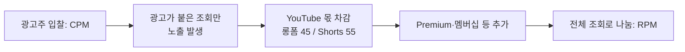
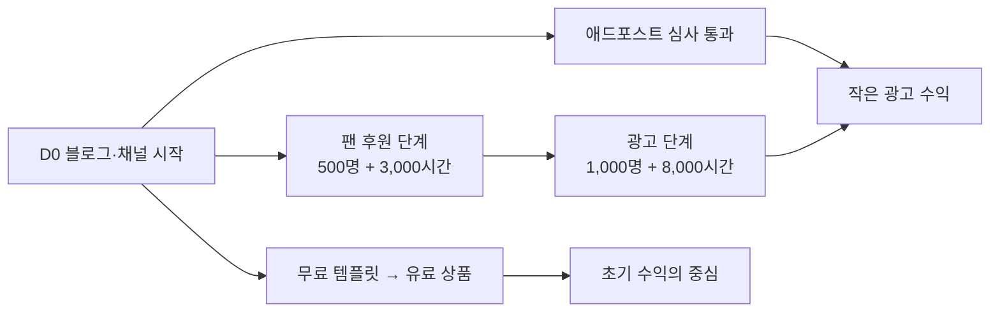

# 광고 수익: 애드포스트와 YouTube 파트너 프로그램

> **학습 목표**: 네이버 애드포스트와 YouTube 파트너 프로그램(YPP)의 가입 조건·수익 발생 방식·지급 규칙을 설명하고, 2027-02-01에 바뀌는 YPP 기준을 반영해 가입 시점을 가정과 함께 계산하며, 작은 규모에서 광고만으로 부족한 이유를 말할 수 있다.

이 문서는 블로그와 유튜브의 **광고 수익만** 다룬다. RPM·CPM의 일반 원리, AdSense 수익 배분, 무효 트래픽은 「광고 수익 심화」에서 이미 다뤘으므로 반복하지 않는다. 강의·전자책·템플릿 판매는 「자체 상품 수익: 강의·전자책·템플릿」, 원천징수와 종합소득세는 「표시 의무·저작권·세금」, Shorts가 성장에서 맡는 역할은 「Shorts와 얼굴 없는 채널」에서 다룬다. 기준은 **2026-09 기준**이다. 네이버 도움말과 YouTube 고객센터에 직접 접속할 수 없어 대부분 "검색 결과로 확인"했고, 공식 수치가 없는 것은 없다고 적었다. 환율은 사이트 공통 가정 **1 USD = 1,400원**을 쓴다.

## 핵심 개념

| 용어 | 뜻 | 핵심 |
|---|---|---|
| 네이버 애드포스트 | 네이버 블로그 등 네이버 미디어에 광고를 붙여 수익을 나누는 프로그램 | 미디어 등록 심사 후 광고가 자동 노출된다 |
| YPP 팬 후원 단계 | 구독자 500명부터 들어가는 YPP의 낮은 단계 | 멤버십·Super Chat·Super Thanks·쇼핑. 광고 수익 배분은 없다 |
| YPP 광고 단계 | 구독자 1,000명부터 들어가는 전체 수익 창출 단계 | 시청 페이지 광고, Shorts 광고, YouTube Premium 수익 배분 |
| CPM | 광고 노출 1,000회당 광고주가 낸 금액 | YouTube 몫을 떼기 전, 광고 노출 기준 |
| RPM | 조회 1,000회당 크리에이터가 받은 금액 | YouTube 몫을 뗀 뒤, 수익이 없는 조회까지 포함한 전체 조회 기준 |
| 유효 시청 시간 | YPP 자격 계산에 쓰는 공개 롱폼 시청 시간 | Shorts 피드에서 본 시간은 포함되지 않는다 |

## 원리

### 네이버 애드포스트

| 항목 | 확인한 내용 | 확인 수준 |
|---|---|---|
| 가입 조건 | 공식 수치 기준은 공개되지 않는다. 운영 기간, 전체 공개 콘텐츠 수, 방문자·페이지뷰 같은 활동성, 광고 매체로서의 적합성을 종합 심사한다 | 검색 결과로 확인 |
| 흔한 통념 | "개설 90일, 글 50개, 하루 방문자 100명"은 공식 기준이 아니다 | 검색 결과로 확인 |
| 심사 | adpost.naver.com에서 미디어를 등록하면 블로그 검수는 영업일 기준 최대 5일, 통과하면 광고가 자동 노출된다 | 검색 결과로 확인 |
| 수익 발생 | 글에 붙은 광고의 노출과 클릭에 따라 발생한다. 광고주 지출 대비 배분 비율은 공개되어 있지 않다 | 검색 결과로 확인 |
| 지급 조건 | 전월 말 잔액이 본인이 설정한 최소 지급액(기본 50,000원, 그 미만으로 설정 불가) 이상이면 다음 달 지급 | 검색 결과로 확인 |
| 지급일 | 개인회원 기준 매월 25일경. 휴일에 따라 앞당겨질 수 있다 | 검색 결과로 확인 |
| 다른 수령 방법 | 개인회원은 소액부터 네이버페이 머니로 전환할 수 있다고 알려져 있다 | 검색 결과로 확인, 최소액은 확인하지 못함 |
| 제재 | 부정 클릭·무효 트래픽이 확인되면 수입 차감, 지급 보류, 지급분 회수가 가능하다 | 검색 결과로 확인 |

지급 때 원천징수가 적용된다. 소득 구분과 세율은 「표시 의무·저작권·세금」에서 다룬다.

네이버에는 애드포스트 외의 창작자 수익도 있다. 광고주와 창작자를 연결하는 브랜드 커넥트는 협찬이므로 표시 의무와 함께 「표시 의무·저작권·세금」에서, "네이버 메이트"는 AI 브리핑 인용 빈도 등을 기준으로 매월 창작자를 뽑아 활동 지원금을 준다고 보도된 프로그램이다(2026-06 베타 시작, 검색 결과로 확인). 둘 다 광고 수익이 아니므로 여기서는 이름만 적는다. 2026년 8월 보도에 따르면 애드포스트 지급 규모는 2025년 2월 대비 약 14% 늘었다.

### YouTube 파트너 프로그램: 두 단계와 2027년 변경

YouTube는 2026년 8월 YPP 기준 변경을 발표했다. **2027-02-01부터 새로 신청하는 채널**의 광고 단계 기준이 두 배가 된다. 이미 YPP에 있는 채널은 지위를 유지하지만, 같은 날부터 활동 기준과 Shorts 수익 기준이 적용되고 2027-01-31까지 개정 약관에 동의해야 한다.

| 항목 | 팬 후원 단계 | 광고 단계 (2027-01-31까지 신청) | 광고 단계 (2027-02-01부터 신청) |
|---|---|---|---|
| 구독자 | 500명 | 1,000명 | 1,000명 |
| 업로드 | 최근 90일 공개 업로드 3개 | — | — |
| 시청 조건 (둘 중 하나) | 최근 12개월 유효 시청 3,000시간 또는 최근 90일 유효 Shorts 조회 300만 회 | 12개월 4,000시간 또는 90일 Shorts 1,000만 회 | 365일 8,000시간 또는 90일 Shorts 2,000만 회 |
| 여는 기능 | 채널 멤버십, Super Chat·Super Stickers, Super Thanks, 쇼핑 | 위 기능 + 시청 페이지 광고, Shorts 피드 광고, Premium 수익 배분 | 같음 |
| 한국 적용 | 2023년 한국 등 5개국에서 먼저 시작 | 적용 | 적용 |

- **팬 후원 단계는 바뀌지 않는다.** 광고 수익 배분은 없고, 광고 단계 기준을 채우면 옮겨 갈 수 있다.
- **Shorts 수익 기준 (2027-02-01부터)**: YPP 채널이라도 최근 90일 유효 Shorts 조회가 1,000만 회 이상이어야 Shorts 광고·구독 수익을 배분받는다. 미달하면 롱폼 수익은 계속 받고, 기준을 넘으면 Shorts 수익 배분이 다시 시작된다.
- **활동 기준 (2027-02-01부터, 기존 파트너)**: 최근 1년 유효 시청 1,000시간, 최근 90일 유효 Shorts 조회 100만 회, 또는 90일마다 롱폼 2개나 Shorts 5개 업로드 중 하나를 채워야 "활동 중"으로 본다고 보도되었다.

### 수익 배분

| 수익원 | 크리에이터 몫 | 비고 |
|---|---|---|
| 롱폼 시청 페이지 광고 | 순광고수익의 55% | 영상 단위로 계산 |
| Shorts 피드 광고 | 크리에이터 풀 배분액의 45% | 피드 광고 수익을 모아 음악 라이선스 몫을 뗀 뒤, 나라별 유효 조회 비중으로 나눈다 |
| YouTube Premium | Premium 회원의 시청량에 따라 배분 | 2026-08 발표 기준 Premium은 순구독수익의 30%, Premium Lite는 60%가 크리에이터 풀이며 롱폼 55%·Shorts 45%로 나눈다고 보도됨 |

Shorts 풀에서 음악 1곡을 쓴 Short에 해당하는 몫은 절반이 음악 라이선스로 가지만, **내 몫의 비율(45%)과 유효 조회 배분은 음악 사용과 무관**하다.

### YouTube에서 RPM을 움직이는 것

RPM은 광고가 붙지 않은 조회까지 분모에 넣으므로 **항상 CPM보다 낮다**.

| 요인 | 작동 방식 | J에게 주는 의미 |
|---|---|---|
| 주제 | 광고주가 사려는 시청자일수록 입찰이 높다 | 업무 도구·자동화는 기업용 소프트웨어 광고주와 겹친다 (효과 크기는 미확인) |
| 시청자 국가 | 광고 시장 규모가 나라마다 다르다 | 한국어 채널은 대부분 국내 시청. 자동 더빙으로 다른 나라 시청이 생길 수 있다 (「AI 활용 제작과 플랫폼 정책」) |
| 영상 길이 | 8분 이상 롱폼에는 중간 광고(mid-roll)를 넣을 수 있다 | 8~12분 강의는 중간 광고 대상. 시청 흐름이 끊기지 않는 지점에 둔다 |
| 형식 | Shorts는 피드 광고 풀 배분이라 조회당 수익이 매우 낮다 | Shorts는 수익보다 유입 수단 |
| 수익 없는 조회 | 광고 차단, 광고가 없는 조회는 분모만 늘린다 | RPM은 채널마다 직접 재야 한다 |

RPM 범위는 공식 수치가 없다. 아래 계산은 **제3자 추정 범위**를 가정으로 쓴다: 한국어 롱폼 RPM 1,000~5,000원(국내 수익 계산 블로그의 추정), Shorts RPM 0.01~0.08달러(해외 도구 업체의 추정, 약 14~112원). 실제 값은 수익 창출 후 YouTube Studio에서 확인해 바꾼다.

## 적용: 예시 크리에이터 J의 문턱 도달 시점 (예시 계산)

**이것은 예측이 아니라 가정에 따른 예시 계산이다.** D0는 2026-10-05, 1개월 차는 D0부터 한 달이다.

| 가정 | 값 | 근거 |
|---|---|---|
| 롱폼 | 매주 1개, 10분 | 사이트 공통 예시 |
| 평균 시청 시간 | 4분 (시청 지속 40%) | 계산용 가정 |
| 월 롱폼 조회수 | n개월 차에 k × n회 (매달 k씩 선형 증가) | 계산용 가정. k = 500 / 1,000 / 2,000 |
| 구독 전환 | 롱폼 조회 100회당 1명, Shorts 기여는 무시 | 계산용 가정 (보수적) |
| 유효 시청 시간 | 롱폼 조회 × 4분 ÷ 60, 최근 12개월 합계 | Shorts 피드 시청 시간은 포함되지 않음 |

J가 신청하는 시점은 모든 시나리오에서 2027-02-01 이후이므로 **새 기준(1,000명 + 8,000시간)**을 적용한다. 옛 기준 4,000시간을 2027-01-31 전에 채우려면 첫 4개월 누적 조회 60,000회, 즉 k ≈ 6,000이 필요하다.

| 시나리오 | 팬 후원 단계 (500명 + 3,000시간) | 광고 단계 (1,000명 + 8,000시간) | 광고 단계 진입 직후 월 롱폼 광고 수익 (RPM 1,000~5,000원 가정) |
|---|---|---|---|
| 느림 k = 500 | 14개월 차 (2027-12 초), 구독자가 먼저 막힘 | 26개월 차 (2028-12 초), 누적 구독 약 1,755명 | 월 13,500회 × RPM → 약 13,500~67,500원 |
| 보통 k = 1,000 | 10개월 차 (2027-08 초), 구독자가 먼저 막힘 | 16개월 차 (2028-02 초), 누적 구독 약 1,360명 | 월 17,000회 × RPM → 약 17,000~85,000원 |
| 빠름 k = 2,000 | 7개월 차 (2027-05 초) | 11개월 차 (2027-09 초), 누적 구독 약 1,320명 | 월 24,000회 × RPM → 약 24,000~120,000원 |

- 계산 예 (보통): 16개월 차의 최근 12개월(5~16개월 차) 조회 = 1,000 × (5 + … + 16) = 126,000회 → 126,000 × 4 ÷ 60 = 8,400시간. 15개월 차는 7,600시간이라 미달.
- 신청 후 심사 기간은 별도다. D90(2027-01-03)에는 어느 시나리오도 팬 후원 단계에 닿지 않는다.
- Shorts: 2027-02-01 이후에는 90일 유효 Shorts 조회 1,000만 회 미만이면 Shorts 수익 배분이 없다. 주 3개 Shorts로 이 기준을 넘는다고 가정하지 않는다.

**블로그 (애드포스트)**: 공식 RPM도 믿을 만한 공개 범위도 찾지 못했다. 식만 세운다: 최소 지급액 50,000원까지 필요한 누적 페이지뷰 = 50,000 ÷ (PV 1,000당 수입) × 1,000. 계산 편의를 위해 PV 1,000당 1,000원이라고 **가정**하면 50,000 PV가 필요하다. 잔액은 이월되므로 한 달에 채울 필요는 없다. 등록 후 4~8주의 실제 수입으로 이 값을 바꾼다.

## 심화

### 작은 규모에서 광고만으로 부족한 이유

위 계산의 "보통" 시나리오에서 광고 단계에 들어간 직후 월 롱폼 광고 수익은 가정상 약 1만 7천~8만 5천 원이다. 들이는 시간은 주 10시간, 한 달 약 43시간이다. 광고는 **조회 1,000회당 수천 원**을 버는 구조라 규모가 없으면 작고, 문턱 전에는 0이다. 반면 같은 시청자 중 소수가 템플릿 팩이나 강의를 사면 한 명이 수천~수만 원을 낸다. 그래서 J의 경로는 광고를 기다리는 동안 **무료 템플릿으로 목록을 모으고 유료 상품으로 넘어가는 것**이다. 설계는 「자체 상품 수익: 강의·전자책·템플릿」에서, 가격과 결제는 「유료 판매·구독과 가격 설계」에서 다룬다.

### 광고 수익을 늘리는 순서

1. **문턱 통과**: 롱폼 시청 시간이 기준을 결정한다. Shorts는 구독자와 롱폼 유입을 돕는다.
2. **RPM 측정**: 수익 창출 4~8주 뒤 실제 RPM으로 위 표를 다시 계산한다.
3. **중간 광고 배치**: 8분 이상 영상에서 설명이 끝나는 지점에 둔다.
4. **계정 보호**: 자기 광고 클릭, 클릭 요청, 트래픽 구매는 애드포스트와 YouTube 모두에서 수익 회수·정지 사유다 (「광고 수익 심화」).

## 흔한 오해

- **"애드포스트는 90일·글 50개면 승인된다"** — 공식 수치 기준은 없다. 활동성과 적합성을 종합 심사한다.
- **"구독자 1,000명과 4,000시간이면 된다"** — 2027-02-01부터 새로 신청하는 채널은 8,000시간 또는 Shorts 2,000만 회다.
- **"구독자 500명이면 광고 수익이 생긴다"** — 팬 후원 단계에는 광고 수익 배분이 없다.
- **"Shorts 조회가 많으면 시청 시간도 채워진다"** — Shorts 피드 시청 시간은 유효 시청 시간에 포함되지 않는다.
- **"CPM이 5,000원이면 조회 1,000회당 5,000원을 번다"** — RPM은 YouTube 몫과 광고 없는 조회를 반영해 더 낮다.

## 자기 점검 질문

1. 애드포스트의 최소 지급액은 얼마이며, 잔액이 부족한 달에는 어떻게 되는가?
2. 2027-03에 YPP를 처음 신청하는 채널의 광고 단계 기준은 무엇이고, 팬 후원 단계 기준과 어떻게 다른가?
3. 롱폼 광고와 Shorts 광고의 크리에이터 몫은 각각 어떻게 계산되는가?
4. 월 롱폼 조회가 매달 1,000씩 늘고 평균 시청 시간이 5분이라면, 8,000시간에 처음 닿는 달은 언제인가?
5. 광고 단계에 들어간 뒤에도 J가 자체 상품을 먼저 키워야 하는 이유를 숫자로 설명해 보라.

## 참고 자료

- [네이버 애드포스트 신청 조건과 수익](https://postdot.kr/blog/naver-adpost-guide) — 포스트닷, 검색 결과로 확인 (2026-09-30)
- [네이버 애드포스트 수익 지급 및 정산 설정 가이드](https://online-financer.com/%EB%84%A4%EC%9D%B4%EB%B2%84-%EC%95%A0%EB%93%9C%ED%8F%AC%EC%8A%A4%ED%8A%B8-%EC%88%98%EC%9D%B5-%EC%A7%80%EA%B8%89/) — 검색 결과로 확인 (2026-09-30)
- ["블로그 하면 돈 되나?"…네이버, 창작자 수익·지원 2배 늘었다](https://m.news.nate.com/view/20260807n25996) — 네이트 뉴스, 2026-08-07, 검색 결과로 확인 (2026-09-30)
- [New opportunities to earn and changes to the YouTube Partner Program](https://blog.youtube/news-and-events/youtube-partner-program-updates-2027-new-opportunities-earn/) — YouTube Blog, 2026-08, 검색 결과로 확인 (2026-09-30)
- [Changes to the YouTube Partner Program](https://support.google.com/youtube/answer/12843009?hl=en) — YouTube Help, 검색 결과로 확인 (2026-09-30)
- [YouTube teases Premium Lite expansion, doubles channel monetization requirements](https://9to5google.com/2026/08/10/youtube-premium-lite-expansion-monetization-changes/) — 9to5Google, 2026-08-10, 검색 결과로 확인 (2026-09-30)
- [확대된 YouTube 파트너 프로그램 개요](https://support.google.com/youtube/answer/13429240?hl=ko) — YouTube 고객센터, 검색 결과로 확인 (2026-09-30)
- [YouTube Partner Program overview & eligibility](https://support.google.com/youtube/answer/72851?hl=en) — YouTube Help, 검색 결과로 확인 (2026-09-30)
- [YouTube Shorts monetization policies](https://support.google.com/youtube/answer/12504220?hl=en) — YouTube Help, 검색 결과로 확인 (2026-09-30)
- [Understand ad revenue analytics](https://support.google.com/youtube/answer/9314357) — YouTube Help, 검색 결과로 확인 (2026-09-30)
- [Manage mid-roll ad breaks in long videos](https://support.google.com/youtube/answer/6175006?hl=en) — YouTube Help, 검색 결과로 확인 (2026-09-30)
- [유튜브 수익 계산법 2026 — RPM·CPM 정리](https://snsboost.kr/blog/44) — SNS부스터, 제3자 추정, 검색 결과로 확인 (2026-09-30)
- [YouTube Shorts RPM in 2026: Typical Ranges by Niche](https://miraflow.ai/blog/youtube-shorts-rpm-2026-real-ranges-by-niche) — Miraflow, 제3자 추정, 검색 결과로 확인 (2026-09-30)
