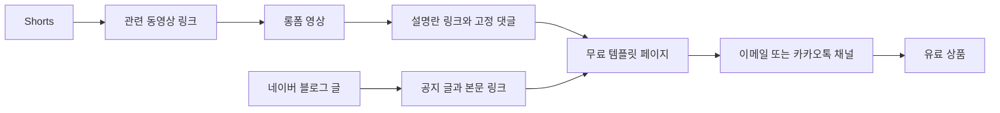

# 자체 상품 수익: 강의·전자책·템플릿

> **학습 목표**: 무료 리드 마그넷에서 코호트·컨설팅까지 이어지는 상품 사다리를 설계하고, 댓글·검색·질문에서 수요 신호를 읽어 만들기 전에 사전 판매로 검증하며, 한국 판매처의 수수료와 통제권 차이를 비교해 첫 상품의 판매 경로를 고를 수 있다.

광고는 조회수가 쌓여야 돈이 되고, 기준(애드포스트 승인, YouTube 파트너 프로그램)을 넘기 전에는 0원이다. 광고 구조는 「광고 수익: 애드포스트와 YouTube 파트너 프로그램」이 다루고, 이 문서는 **내가 직접 만들어 파는 상품**만 다룬다. 가격 이론(가치 기반 가격, Van Westendorp, 번들)과 결제 인프라(PG, MoR)는 「유료 판매·구독과 가격 설계」에 있으므로 반복하지 않는다. 콘텐츠를 상품 모듈로 바꾸는 규칙은 「원소스 멀티유즈(OSMU) 전략」, 상품 출시 시점은 「채널 90일 실행 계획」, 판매에 따르는 표시 의무와 세금은 「표시 의무·저작권·세금」을 본다. 수수료와 정책은 2026-09 기준이며 자주 바뀐다. 금액 예시는 모두 설명용 가정이다.

## 핵심 개념

| 단계 | 형태 (예) | 가격대 (설명용 가정) | 만드는 시간 | 고객이 사는 것 |
|---|---|---|---|---|
| 0. 리드 마그넷 | 무료 템플릿, 체크리스트 | 0원 (이메일·카카오톡 채널 구독과 교환) | 2~6시간 | 당장 쓸 수 있는 작은 결과 |
| 1. 저가 상품 | 유료 템플릿 팩 | 1만~3만 원 | 10~20시간 | 시간 절약 |
| 2. 전자책 | PDF 가이드 | 2만~5만 원 | 30~60시간 | 체계화된 방법 |
| 3. VOD 강의 | 녹화 강의 + 실습 파일 | 5만~20만 원 | 60~120시간 | 따라 하면 되는 과정 |
| 4. 코호트·컨설팅 | 소수 라이브 수업, 1:1 진단 | 수십만 원 이상 | 판매 건마다 시간 투입 | 내 문제에 맞춘 답 |

- **상품 사다리(Product Ladder)**: 아래 단계에서 신뢰를 얻은 고객 일부가 위 단계로 올라가는 구조다. 위로 갈수록 가격과 제작 시간이 늘고 구매자는 줄어든다.
- **리드 마그넷(Lead Magnet)**: 연락처와 교환하는 무료 자료다. 목적은 매출이 아니라 **다시 연락할 수 있는 명단**이다.
- **수요 신호**: 같은 질문이 반복되는 댓글, 검색 유입 키워드, 저장·다운로드 수처럼 "이 문제에 돈을 낼 수도 있다"는 흔적이다.
- **사전 판매(Pre-sale)**: 완성 전에 결제를 받는 검증이다. **대기자 명단(Waitlist)**은 결제 없이 관심만 모으는 약한 검증이다.

## 원리

### 1. 광고와 상품은 한 명당 수익의 크기가 다르다

> 상품 매출 = 방문자 × 전환율 × 가격 − 수수료

광고 수익은 조회 1,000회당 금액(RPM)으로 계산하고, RPM 가정은 「광고 수익: 애드포스트와 YouTube 파트너 프로그램」과 「광고 수익 심화」의 범위를 쓴다. 상품은 소수의 구매자가 큰 몫을 만든다. 예 (가정): 한 달 방문자 3,000명 중 0.5%가 1만 4,900원 템플릿을 사면 15건, 약 22만 원이다. 같은 방문자에게서 광고로 이만큼 벌려면 RPM이 약 7만 5천 원이어야 하는데, 이는 사이트 공통 가정 범위를 크게 벗어난다. 전환율 0.5%도 가정이며, 실제 값은 첫 판매 후 자기 숫자로 바꾼다.

### 2. 콘텐츠가 수요를 만드는 경로

| 신호 | 어디서 보나 | 상품 힌트 | 주의 |
|---|---|---|---|
| 댓글 질문 | 유튜브 댓글, 블로그 댓글 | "파일 공유해 주세요" → 템플릿 | 한 사람의 요청은 신호가 아니다. 서로 다른 사람의 같은 질문을 센다 |
| 검색 유입 | 네이버 블로그 통계의 유입 검색어, YouTube 분석의 검색어 | 반복 유입 키워드 → 전자책 목차 | 검색량과 구매 의향은 다르다 |
| 저장·다운로드 | 무료 템플릿 다운로드 수, 재생목록 저장 | 많이 받아 간 자료 → 유료 확장판 | 무료라서 받는 사람도 많다 |
| DM·메일 | 이메일 답장, 카카오톡 채널 상담 | "회사에 적용하려면?" → 컨설팅 | 요청이 구체적일수록 강한 신호 |

콘텐츠 하나가 블로그 글, 영상, Shorts, 상품 모듈로 갈라지는 규칙은 「원소스 멀티유즈(OSMU) 전략」에 있다. 상품은 새로 만드는 것이 아니라 **이미 반응이 확인된 콘텐츠를 묶고 깊게 만든 것**일 때 가장 빨리 나온다.

### 3. 만들기 전에 검증한다

1. **대기자 명단**: 상품 소개 한 단락과 목차 초안을 올리고 "출시 알림 받기" 폼을 연다. 가입 수는 관심의 상한선이다.
2. **사전 판매**: 얼리버드 가격으로 결제 링크를 연다. 기준(예: 약 12일의 사전 판매 기간에 10건, 가정)을 못 넘으면 전액 환불하고 주제나 형태를 바꾼다.
3. **최소 버전 납품**: 사전 구매자에게 먼저 납품하고, 받은 질문으로 정식판을 보강한다.

검증 단계를 더 깊게 나눈 "증거의 사다리"는 「기회 선택과 수요 검증」에 있다. 대기자 가입이 결제로 이어지는 비율은 제품마다 크게 달라 공개된 기준값을 쓰지 않는다. 자기 명단의 실제 비율을 첫 기준으로 삼는다. 사전 판매를 할 때도 전자상거래법상 표시·환불 의무는 그대로 적용된다 (아래 7).

### 4. 가격은 가치와 대안으로 정한다

가격 이론은 「유료 판매·구독과 가격 설계」를 따른다. 크리에이터 상품에서 기억할 점만 적는다.

- 비교 대상은 **무료 유튜브 영상과 직접 해 보는 수고**다. "무료로도 배울 수 있는 것"에 돈을 내는 이유(시간 절약, 정리된 순서, 바로 쓰는 파일)를 상품 설명 첫 줄에 쓴다.
- 사다리의 단계 사이 가격 차이는 2~5배로 두고 (가정), 아래 상품 구매자에게 위 상품 할인 쿠폰을 준다.

### 5. 한국에서 어디서 파나

| 판매처 | 수수료 (공시·보도 기준, 2026-09 확인) | 통제권 | 맞는 상품 |
|---|---|---|---|
| 크몽 | 판매 금액 구간별 서비스 이용료 16.4%(70만 원까지)·9.4%·4.4% + 결제망 이용료 3.3% + 두 수수료에 대한 부가세 10%. 카테고리별로 다를 수 있음 | 낮음: 상품 심사, 구매자 연락처 제한 | 전자책, 템플릿, 컨설팅 |
| 클래스101 | 구독(CLASS101+) 클래스는 수강시간 점유율에 따라 배분, 계약 플랜별 정산비율이 다름. 개별판매 클래스는 수강 시작 90일 뒤 정산 확정 (크리에이터 안내 검색 결과로 확인) | 낮음: 제작·편성 협의, 정산 지연 | VOD 강의 |
| 탈잉 | 전자책·VOD 중개 수수료 약 20% (보도·비교 글), 정산 시 소득세 3.3% 원천징수. 형태별로 공제 항목이 다름 | 중간: 심사, 전자책 최소 분량 기준 보도 | 전자책, VOD, 원데이 |
| 네이버 스마트스토어 | 네이버페이 주문관리 수수료 매출 등급별 약 1.98~3.63% (부가세 포함 요율로 보이나 확인 못 함) + 판매수수료 2.73% (마케팅 링크 유입 0.91%, 부가세 별도로 보도, 2025-06-02 개편) | 높음: 구매자 정보, 쿠폰, 리뷰 | 템플릿 팩, 전자책 (디지털 상품 등록 조건은 판매자센터 확인) |
| 자체 사이트 + 국내 PG | 일반 카드 3.4%, 가입비·연 관리비 별도 (「유료 판매·구독과 가격 설계」의 비교 자료) | 가장 높음: 명단·가격·업데이트 전부 | 강의, 번들, 구독 |
| 해외 MoR (Paddle, Gumroad) | Paddle 5% + 50센트, Gumroad 10% + 50센트 (+ 결제 처리 수수료, 마켓 유입 시 30%) | 높음, 해외 세금 처리 대행 | 영어판 템플릿·전자책 |

- 마켓(크몽·클래스101·탈잉)은 **수수료를 내고 유입을 산다**. 자체 사이트는 수수료가 낮지만 유입을 직접 만들어야 한다. 채널이 작을 때는 마켓 노출이 도움이 되고, 명단이 쌓이면 자체 판매 비중을 늘린다.
- 수치는 공식 공지·보도·판매자 비교 글에서 확인한 것이고 계약·카테고리·시점마다 다르다. 등록 직전에 각 판매자센터의 현재 요율을 다시 확인한다.
- 개인 판매 횟수가 늘면 통신판매업 신고와 사업자 등록 문제가 생긴다. 「사업자 등록 · 통신판매업」과 「표시 의무·저작권·세금」을 본다.

### 6. 네이버 블로그와 유튜브에서 상품까지



- **YouTube 설명란·고정 댓글**: 설명란 링크가 클릭되려면 채널에 고급 기능(advanced features)이 켜져 있어야 한다. 고정 댓글에 "무료 템플릿은 설명란 첫 줄"처럼 한 가지 행동만 적는다.
- **Shorts**: 2023-08-31부터 Shorts 설명·댓글의 링크는 클릭되지 않는다. 대신 Shorts에 원본 롱폼을 **관련 동영상**으로 연결하고, 롱폼에서 상품으로 보낸다 (현재 상태는 YouTube 도움말로 재확인).
- **네이버 블로그**: 무료 템플릿 안내 글을 공지로 올려 블로그 상단에 두고(대표 글 역할), 관련 튜토리얼 본문 끝에 같은 링크를 둔다.
- **이메일·카카오톡 채널**: 연락처를 받을 때 광고성 정보 수신 동의를 따로 받고, 판매 메시지에는 "(광고)"를 붙인다. 규칙은 「법 · 윤리 · 광고 표시」에 있다. 카카오톡 채널 메시지는 발송 건마다 비용이 붙으므로 요금을 카카오비즈니스 안내로 확인한다.

### 7. 환불과 고객 지원

- 통신판매로 산 소비자는 원칙적으로 7일 안에 청약철회를 할 수 있다 (전자상거래법 제17조 제1항).
- 디지털콘텐츠는 **제공이 개시되면** 청약철회가 제한될 수 있지만, 판매자가 철회 불가 사실을 쉽게 알 수 있는 곳에 표시하고 시험 사용 상품(미리보기, 샘플 챕터)을 주는 등의 조치를 해야 한다 (제17조 제2항 제5호, 제6항). 조치가 없으면 제한을 주장하기 어렵다.
- 판매 페이지에 **환불 조건, 파일 형식, 필요한 프로그램 버전, 문의 경로와 응답 시간**을 적는다. 엑셀 템플릿이라면 "Microsoft 365 Excel에서 확인, 구버전 일부 함수 미지원"처럼 호환 범위를 밝힌다.
- 문의는 한 창구(이메일 또는 카카오톡 채널)로 모으고, 반복 질문은 FAQ와 다음 콘텐츠 주제로 돌린다.

## 적용: 예시 크리에이터 J의 상품 사다리

J(업무 자동화: 엑셀과 AI 도구, 주 10시간)의 사다리다. 날짜는 「채널 90일 실행 계획」의 D0(2026-10-05) 기준이고, 숫자는 모두 설명용 가정이다.

| 단계 | 상품 | 시점 | 가격 (가정) | 판매처 | 검증 기준 (가정) |
|---|---|---|---|---|---|
| 0 | 무료 "주간 업무 보고 자동화 시트" | D14 (2026-10-19) | 0원 | 블로그 공지 + 폼 | D60까지 연락처 150명 |
| 1 | 유료 템플릿 팩 (시트 8종 + 사용 영상) | 대기자 D35, 사전 판매 D49~D60, 납품 D63 | 정가 14,900원, 얼리버드 9,900원 | 스마트스토어 또는 크몽 | 사전 판매 기간(D49~D60, 약 12일) 10건 |
| 2 | 전자책 "엑셀 + AI로 반복 업무 줄이기" | D90 이후 대기자 모집 | 29,000원 | 탈잉 또는 자체 | 템플릿 구매자 설문 |
| 3 | VOD 강의 | 90일 계획 밖 (검토만) | 미정 | 클래스101 제안 또는 자체 | 전자책 판매 추이 |

**판매처별 1건 순수익 (정가 14,900원, 부가세·소득세 제외, 수수료만 가정 계산)**

```text
크몽 (첫 구간 16.4% + 결제망 3.3%, 수수료 부가세 10%):
  14,900 × (0.164 + 0.033) × 1.1 = 3,229원 → 순수익 약 11,671원
스마트스토어 (두 수수료 모두 부가세 포함으로 통일: 주문관리 1.98% 영세 등급은 부가세 포함 가정, 판매수수료 0.91% × 1.1 = 1.001%):
  14,900 × (0.0198 + 0.01001) = 444원 → 순수익 약 14,456원
자체 사이트 + PG (3.4%):
  14,900 × 0.034 = 507원 → 순수익 약 14,393원, 단 PG 가입비·연 관리비는 별도
```

사전 판매 10건(얼리버드 9,900원)이면 스마트스토어 기준 약 9만 6천 원이다 (10 × 9,900 × (1 − 0.02981)). J의 결론: 첫 상품은 수수료보다 **판매처 준비 시간**이 병목이다. 명단을 J가 직접 갖는 스마트스토어를 1순위로 두고, 사전 판매가 기준에 못 미치면 크몽의 마켓 노출로 한 번 더 시험한다. PG 가입비가 있는 자체 사이트는 연 판매량이 확인된 뒤로 미룬다.

나쁜 예:

> 채널 시작 첫 주에 VOD 강의 20강을 찍기 시작했다. 3개월 뒤 구독자 80명에게 강의를 알렸고 2건이 팔렸다.

좋은 예:

> 댓글에서 "시트 공유해 주세요"가 서로 다른 12명에게서 나온 뒤, 무료 시트로 연락처를 모으고 유료 팩을 사전 판매했다. 10건을 넘긴 뒤에 제작을 시작했다.

## 심화

### 사다리 꼭대기: 코호트와 컨설팅

코호트 수업과 1:1 컨설팅은 제작 시간이 짧은 대신 **판매 건마다 시간**이 든다. 주 10시간인 J에게는 한 달 1~2건이 한계다 (가정). 대신 가장 구체적인 고객 문제를 듣는 자리라서, 여기서 나온 질문이 전자책과 강의 목차가 된다. 가격이 높을수록 결과를 약속하는 표현("월 100만 원 보장")은 표시·광고법 문제가 될 수 있다 (「법 · 윤리 · 광고 표시」).

### 템플릿 라이선스와 업데이트 정책

- 판매 페이지에 **이용 범위**를 적는다: 개인·사내 사용 허용, 재판매·재배포 금지, 회사 여러 명이 쓰면 팀 라이선스.
- 템플릿에 넣은 폰트·아이콘·이미지가 재배포를 허용하는지 확인한다 (「표시 의무·저작권·세금」, 「계약 · 지식재산 · 오픈소스」).
- 업데이트 약속(예: "1년간 무료 업데이트")은 지킬 수 있는 범위만 적는다. 약속은 곧 지원 부담이다.

### 플랫폼 수수료와 명단 소유

마켓 판매는 구매자 연락처를 판매자가 자유롭게 쓰지 못하는 경우가 많다. 사다리의 다음 단계로 고객을 올리려면 무료 자료로 모은 **자기 명단**이 있어야 한다. 마켓을 쓰더라도 상품 안(PDF 마지막 쪽, 템플릿 안내 시트)에 무료 자료 구독 링크를 넣는다. 각 마켓 약관이 외부 결제 유도를 금지하는지는 등록 전에 확인한다.

## 흔한 오해

- **"구독자 1만 명이 되어야 상품을 낼 수 있다."** 작은 채널이라도 같은 문제를 가진 소수가 모이면 사전 판매가 가능하다. 기준은 구독자 수가 아니라 반복되는 질문이다.
- **"수수료가 가장 낮은 곳이 최선이다."** 유입이 없는 자체 사이트의 0건보다 마켓 수수료 20%를 낸 10건이 낫다. 수수료와 유입, 명단 소유를 함께 본다.
- **"디지털 상품은 환불이 안 된다."** 철회 불가 표시와 시험 사용 조치가 있어야 제한할 수 있다.
- **"강의부터 크게 만들어야 신뢰가 생긴다."** 큰 상품은 검증 전에 만들면 실패 비용도 크다. 사다리는 아래에서 위로 올라간다.
- **"무료 템플릿은 손해다."** 무료 자료의 목적은 매출이 아니라 명단과 신뢰다.

## 자기 점검 질문

1. 월 방문자 2,000명, 전환율 0.8%(가정), 가격 19,000원일 때 월 매출은? 같은 금액을 광고로 벌려면 RPM이 얼마여야 하는가?
2. 댓글에서 "파일 주세요"가 3번 나왔다. 이것을 상품 신호로 보기 전에 무엇을 더 확인하겠는가?
3. 사전 판매 기준을 "12일 10건"으로 잡았는데 6건이 나왔다. 다음 행동 두 가지를 말해 보라.
4. 크몽과 스마트스토어 중 첫 템플릿 팩을 어디서 팔지, 수수료·유입·명단 소유 세 기준으로 설명하라.
5. PDF 전자책 판매 페이지에 청약철회 제한을 적으려면 어떤 조치를 함께 해야 하는가?

## 참고 자료

- [판매 수수료 정책](https://kmong.com/support/expert-center/posts/751) — 크몽, 검색 결과로 확인 (2026-09-30)
- [탈잉 중개 위탁수수료](https://talingtutorguide.oopy.io/commission) — 탈잉 튜터 가이드북, 검색 결과로 확인 (2026-09-30)
- [2026 전자책 판매 사이트 비교](https://start.litt.ly/blog/ebook-side-hustle-strategy) — 리틀리 블로그, 검색 결과로 확인 (2026-09-30)
- [클래스101 정기 지급 용어 설명 및 가이드](https://docs.channel.io/creator/ko/articles/d6a90b1b-%ED%81%B4%EB%9E%98%EC%8A%A4101-%EC%A0%95%EC%82%B0-%EA%B0%80%EC%9D%B4%EB%93%9C%EA%B0%80-%EC%9E%88%EB%82%98%EC%9A%94) — 클래스101 크리에이터 센터, 검색 결과로 확인 (2026-09-30)
- [수수료 체계 바꾸는 네이버플러스 스토어, 왜?](https://byline.network/2025/03/04_naver/) — 바이라인네트워크, 2025-03, 검색 결과로 확인 (2026-09-30)
- [네이버 스마트스토어 수수료 2025년 6월 개편](https://www.sellerking.io/blog/%EB%84%A4%EC%9D%B4%EB%B2%84-%EC%8A%A4%EB%A7%88%ED%8A%B8%EC%8A%A4%ED%86%A0%EC%96%B4-%EC%88%98%EC%88%98%EB%A3%8C-%EA%B3%84%EC%82%B0%ED%95%98%EB%8A%94-%EB%B0%A9%EB%B2%95-2025%EB%85%84-6%EC%9B%94-%EA%B0%9C%ED%8E%B8-58772) — 장사왕 블로그, 검색 결과로 확인 (2026-09-30)
- [Gumroad pricing](https://gumroad.com/pricing) — Gumroad, 검색 결과로 확인 (2026-09-30)
- [YouTube's banning clickable links from Shorts descriptions and comments](https://www.tubefilter.com/2023/08/10/youtube-shorts-comments-spam/) — Tubefilter, 2023-08-10, 검색 결과로 확인 (2026-09-30)
- [Sharing links with your audiences](https://support.google.com/youtube/answer/13748639?hl=en) — YouTube Help, 검색 결과로 확인 (2026-09-30)
- [전자상거래 등에서의 소비자보호에 관한 법률 제17조](https://www.law.go.kr/%EB%B2%95%EB%A0%B9/%EC%A0%84%EC%9E%90%EC%83%81%EA%B1%B0%EB%9E%98%EB%93%B1%EC%97%90%EC%84%9C%EC%9D%98%EC%86%8C%EB%B9%84%EC%9E%90%EB%B3%B4%ED%98%B8%EC%97%90%EA%B4%80%ED%95%9C%EB%B2%95%EB%A5%A0/%EC%A0%9C17%EC%A1%B0) — 국가법령정보센터, 검색 결과로 확인 (2026-09-30)
- [메시지](https://kakaobusiness.gitbook.io/main/channel/run/message) — 카카오비즈니스 가이드, 검색 결과로 확인 (2026-09-30)
