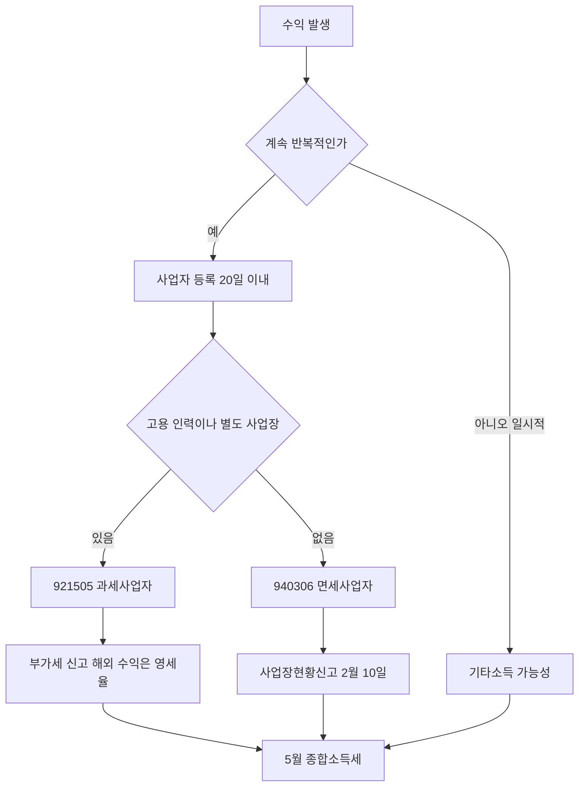

# 표시 의무·저작권·세금

> **학습 목표**: 경제적 이해관계가 있는 글과 영상에서 표시 문구를 어디에 어떻게 넣는지 설명하고, 폰트·BGM·이미지·타인 영상·소프트웨어 화면을 쓸 때의 권리 확인 순서를 따르며, 1인 미디어 창작자의 사업자 등록·업종코드·부가세·종합소득세 흐름을 그릴 수 있다.

> 이 문서는 일반 정보이며 법률·세무 자문이 아니다. 제도는 자주 바뀌므로 실행 전에 공정거래위원회·국세청 원문을 확인하고 필요하면 세무사·변호사와 상담한다.

광고 수익 구조는 「광고 수익: 애드포스트와 YouTube 파트너 프로그램」, 상품 판매는 「자체 상품 수익: 강의·전자책·템플릿」, AI 생성물과 플랫폼 정책은 「AI 활용 제작과 플랫폼 정책」이 다룬다. 이 문서는 그 활동에 붙는 **표시 의무, 저작권, 세금**만 다룬다. 사업 일반의 법·세무는 비즈니스 트랙의 「사업자 등록 · 통신판매업」, 「부가세 · 영세율 · 세금계산서」, 「소득세 · 법인세 · 원천징수 · 장부」, 「계약 · 지식재산 · 오픈소스」, 마케팅 전반의 광고 규제는 「법 · 윤리 · 광고 표시」에 있으므로 반복하지 않는다. 내용은 2026-09 기준이다.

## 핵심 개념

| 용어 | 뜻 | 이 섹션에서 걸리는 곳 |
|---|---|---|
| 경제적 이해관계 | 광고주와 추천·보증인 사이의 현금, 무상 제품, 할인, 수수료, 고용 등의 관계 | 협찬 리뷰, 제휴 링크 |
| 추천·보증 | 소비자가 광고주가 아닌 제3자의 의견으로 인식하는 표시·광고 | 블로그 후기, 유튜브 리뷰 |
| 공표된 저작물의 인용 | 보도·비평·교육·연구를 위해 정당한 범위에서 공정한 관행에 맞게 인용 (저작권법 제28조) | 타인 영상·이미지 일부 사용 |
| 공정이용 | 목적, 저작물 종류, 이용 비중, 시장 영향을 종합해 허락 없이 이용 (저작권법 제35조의5) | 리뷰·비평 영상 |
| 초상권·퍼블리시티권 | 얼굴·모습을 함부로 촬영·공개당하지 않을 권리, 유명인의 성명·초상의 경제적 가치 | 화면 속 타인, 썸네일 |
| 과세사업자·면세사업자 | 부가가치세를 내는지에 따른 구분 | 업종코드 921505·940306 |
| 영세율 | 세율 0%. 매출세액은 0이고 매입세액은 공제 가능 | 해외에서 받는 YouTube 수익 |
| 기타소득·사업소득 | 일시적 소득과 계속·반복적 소득의 구분 | 애드포스트 수입 |

## 원리

### 1. 경제적 이해관계 표시: 언제 필요한가

공정거래위원회 「추천·보증 등에 관한 표시·광고 심사지침」은 추천·보증인이 광고주로부터 대가를 받은 경우 그 관계를 **소비자가 쉽게 알 수 있게** 표시하도록 한다.

| 상황 | 표시 필요 | 이유 |
|---|---|---|
| 광고주가 원고료를 주고 리뷰를 요청 | 필요 | 금전적 대가 |
| 제품을 무상으로 받아 리뷰 (돌려주지 않음) | 필요 | 무상 제공도 경제적 대가 |
| 제휴 링크로 구매 시 수수료를 받음 | 필요 | 조건부 대가. "수수료를 받을 수 있음" 같은 모호한 표현은 부적절 |
| 네이버 브랜드 커넥트 같은 제휴 플랫폼으로 받은 협찬·판매 수수료 | 필요 | 플랫폼을 거쳐도 대가는 대가. 플랫폼이 붙이는 표시가 있어도 제목·첫 부분 표시는 직접 확인 |
| 내가 직접 산 도구를 추천, 대가 없음 | 원칙적으로 불필요 | 경제적 이해관계 없음 |
| 내 상품(템플릿·전자책)을 소개 | 추천·보증과는 다른 자기 광고 | 오인이 없도록 "제가 만든 유료 상품입니다"라고 밝히는 것이 안전 |

### 2. 어디에, 어떤 문구로

- **블로그 등 문자 중심 매체**: 2024-12-01 시행 개정으로 표시 문구는 **게시물의 제목 또는 첫 부분**에 둬야 한다. 전에는 끝 부분도 허용됐다. 본문 중간, 댓글, "더보기" 뒤에 숨기는 방식은 적절하지 않다.
- **동영상**: 공정위 안내서의 예시는 영상 **시작 부분과 끝 부분**에 언급·자막으로 표시하고, 긴 영상은 자막 등으로 **반복 표시**(예시: 5분마다)하는 방식이다. 실시간 방송은 중간에 들어온 시청자도 알 수 있게 반복하고, 제목에 협찬 사실을 넣는 예시가 있다 (검색 결과로 확인).
- **형태**: 배경과 구분되는 글자 크기·색, 소리 크기나 속도를 조절하지 않아도 알아들을 수 있는 음성이어야 한다. 표시는 추천·보증 내용과 가까운 위치에 둔다.
- **문구**: "광고", "협찬", "OO로부터 제품을 무상으로 제공받아 작성" 처럼 대가의 내용을 분명히 쓴다. 2024년 개정은 "소정의 수수료를 지급받을 수 있음" 같은 조건부·모호한 표현을 부적절한 예로 추가했다.
- **AI 가상인물**: 2026-06-01 시행 개정으로 생성형 AI로 만든 가상인물이 추천·보증하면 "가상인물"임을 표시해야 한다. 문자 매체는 제목이나 첫 부분, 영상은 가상인물이 나오는 동안 가까운 위치에 표시한다.

### 3. YouTube 유료 프로모션 체크박스

YouTube Studio 동영상 세부정보의 **콘텐츠 신고(Content declaration)** 항목에서 "유료 PPL, 스폰서십, 보증 광고 등 유료 프로모션이 포함됨"을 체크하면, 시청 시작 시 "유료 광고 포함" 안내가 몇 초간 표시된다 (검색 결과로 확인). YouTube 도움말도 이 기능이 **각국 법의 표시 의무를 대신하지 않는다**고 안내한다. 한국에서는 체크박스와 함께 영상 속 자막·음성, 설명란 첫 줄의 표시를 모두 한다.

### 4. 저작권: 소재별 확인 순서

| 소재 | 확인할 것 | 안전한 기본값 |
|---|---|---|
| 폰트 | 한국 저작권법이 보호하는 것은 글자 모양이 아니라 **폰트 파일(프로그램)**이다. 파일을 정당하게 얻었는지, 라이선스가 영상·썸네일·상업적 이용·템플릿 임베드를 허용하는지 | 상업적 이용이 명시된 무료 폰트나 구매한 폰트만 쓰고 라이선스 캡처를 보관 |
| BGM | YouTube 오디오 보관함의 트랙마다 라이선스 유형이 다르다. 저작자 표시가 필요한 CC BY 트랙은 설명란에 표기 문구를 넣는다 | 오디오 보관함 또는 라이선스가 명확한 서비스만 사용, 트랙명 기록 |
| 이미지 | 검색 결과 이미지는 대부분 권리자가 있다 | 직접 캡처·제작, 상업 이용 가능한 스톡, AI 생성물은 「AI 활용 제작과 플랫폼 정책」 확인 |
| 타인 영상 클립 | 인용(제28조)은 비평·교육 목적, 필요한 최소 분량, 출처 표시, 내 콘텐츠가 주가 되는 관계가 필요하다. 요약·몰아보기·리액션은 공정이용 인정 가능성이 낮다는 분석이 많다 | 쓰지 않거나, 허락을 받거나, 비평 대상 장면만 짧게 |
| 소프트웨어 화면 녹화 | 제품 UI도 저작물이다. Microsoft는 튜토리얼·영상·웹사이트에서 스크린샷 사용을 허용하되 변형 금지, 제3자 콘텐츠·식별 가능한 인물 포함 금지, 스플래시·베타 화면 금지, "Used with permission from Microsoft" 표시를 요구한다 | 각 회사의 스크린샷 가이드라인을 확인하고, 로고를 내 상표처럼 쓰지 않는다 |

유튜브의 Content ID 판정과 저작권법 판단은 다르다. Content ID 클레임이 없다고 합법인 것도, 클레임이 있다고 불법인 것도 아니다.

### 5. 초상권과 개인정보

- **초상권**은 법률 조문이 아니라 헌법상 인격권을 근거로 판례가 인정한다. 길거리·사무실 촬영에서 알아볼 수 있는 사람은 동의를 받거나 흐림 처리한다.
- **퍼블리시티권**: 널리 알려진 사람의 성명·초상·음성 등을 무단으로 영업에 쓰는 행위는 부정경쟁방지법 제2조 제1호 타목(2022-06-08 시행)의 부정경쟁행위가 될 수 있다. 유명인 얼굴을 썸네일에 넣거나 AI로 목소리를 흉내 내는 것이 여기에 걸린다.
- **화면 녹화 속 개인정보**: 엑셀 튜토리얼에서 가장 흔한 사고는 실제 회사 파일, 동료 이름, 이메일 주소, 알림 창이 녹화되는 것이다. 예제 데이터는 가짜로 만들고, 알림을 끄고, 업로드 전 전체 프레임을 한 번 본다.

### 6. 세금: 1인 미디어 창작자의 흐름

- **사업자 등록 시기**: 부가가치세법은 사업 개시일부터 20일 이내 등록을 요구한다. 국세청 안내는 계속·반복적으로 수익을 내는 유튜버에게 등록을 안내한다. "얼마부터"라는 금액 기준은 없으므로, 수익이 정기적으로 들어오기 시작하면 세무서·세무사와 확인한다. 절차는 「사업자 등록 · 통신판매업」.
- **업종코드 (국세청 설명)**: 인적 시설(고용 인력)이나 물적 시설(별도 촬영 스튜디오 등)을 갖추면 **921505 미디어콘텐츠창작업, 과세사업자**. 그런 시설 없이 혼자 활동하면 **940306 1인미디어콘텐츠창작자, 면세 인적용역사업자**.

| 구분 | 921505 과세 | 940306 면세 |
|---|---|---|
| 부가세 | 신고 의무. Google 등 국외에서 외화로 받는 용역 대가는 영세율, 장비 매입세액 공제·환급 가능 | 신고 의무 없음, 매입세액 공제도 없음. 다음 해 2월 10일까지 사업장현황신고 |
| 단순경비율 기준 (직전 연도 수입금액) | 3,600만 원 미만 (정보서비스업 계열, 검색 결과로 확인) | 2,400만 원 미만 (인적용역 계열, 검색 결과로 확인) |
| 2026년 변화 | 현금매출명세서 제출 대상 업종에 추가 (2026-04 이후 신고분부터라는 해설, 검색 결과로 확인) | 해당 보도 없음 |

- **애드포스트 수입**: 개인 회원에게는 네이버가 **기타소득**으로 원천징수해 지급하는 것으로 알려져 있고(8.8%로 설명하는 자료가 많다), 사업자 회원은 전자세금계산서를 발행하고 정산받는다. 다만 플랫폼의 원천징수 분류가 세법상 소득 구분을 확정하지 않는다. 계속·반복적이면 사업소득으로 보는 것이 원칙이라는 세무 해설이 있으므로, 수입이 커지면 사업자 회원 전환과 소득 구분을 세무사와 정한다.
- **종합소득세**: 1~12월 소득을 다음 해 **5월**에 신고한다 (성실신고확인대상은 6월). 기타소득금액이 연 300만 원 이하면 분리과세를 선택할 수 있다. 원천징수된 세금은 신고 때 정산된다. 세율과 장부는 「소득세 · 법인세 · 원천징수 · 장부」.
- **기록**: 월별 플랫폼 정산서(YouTube/AdSense 지급 내역, 애드포스트 정산), 외화 입금 내역, 장비·소프트웨어·폰트·스톡 구매 영수증, 라이선스 캡처를 한 폴더에 둔다. 사업용 계좌를 분리하면 장부와 증빙이 쉬워진다.

## 적용: 예시 크리에이터 J의 준수 체크리스트

J는 회사원이고, 얼굴 없이 화면 녹화와 본인 목소리로 엑셀·AI 도구 강의를 만든다. 날짜는 「채널 90일 실행 계획」 기준이다.

| 시점 | 할 일 | 근거 |
|---|---|---|
| D0 전 | 회사 취업규칙의 겸업 조항 확인. 예제용 가짜 데이터 파일 제작, 알림 끄기 설정 | 회사 규정, 개인정보 |
| D0 | 소재 기록 시트 만들기: 폰트명·라이선스 URL, BGM 트랙명·라이선스 유형, 스크린샷 가이드라인 | 저작권 |
| 첫 AI 도구 리뷰 | 도구사가 무료 크레딧을 줬다면 블로그 제목 앞 "[협찬]", 영상 시작·끝 자막, 유료 프로모션 체크 | 추천·보증 심사지침 |
| 첫 제휴 링크 | 링크 바로 위에 "이 링크로 구매하면 J가 수수료를 받습니다" | 모호 표현 금지 |
| 첫 유료 판매 (D49 사전 판매) | 통신판매업 신고 대상 여부, 사업자 등록 검토 (시설 없음 → 940306 후보, 템플릿 판매는 별도 업종 검토) | 「사업자 등록 · 통신판매업」 |
| 2027-02-10 | 면세사업자로 등록했다면 2026년분 사업장현황신고 | 국세청 |
| 2027-05 | 2026년 10~12월 소득을 근로소득과 합산해 종합소득세 신고 | 소득세법 |

> J의 템플릿·전자책 판매는 "영상 플랫폼에 콘텐츠를 공급"하는 활동이 아니다. 창작자 업종코드와 별도로 전자상거래 소매업 등 부업종 추가와 과세 여부를 세무사와 확인한다 (확인 필요).

나쁜 예:

> 도구 회사에서 1년 무료 이용권을 받고 "강추" 리뷰를 올렸다. 표시는 설명란 맨 아래 "#협찬" 한 줄.

좋은 예:

> 제목 "[협찬] OO 자동화 도구 2주 사용 후기", 영상 첫 5초와 끝에 "OO로부터 1년 이용권을 무상으로 받았습니다" 자막과 음성, 유료 프로모션 체크, 설명란 첫 줄에 같은 문구.

## 심화

### 해외 플랫폼의 원천징수

YouTube(AdSense)는 세금 정보를 제출하지 않으면 미국 시청자 수익에 미국 세금을 원천징수할 수 있다. 세금 정보 제출과 조세조약 적용, 한국 신고 때의 외국납부세액공제는 「소득세 · 법인세 · 원천징수 · 장부」를 본다.

### 직장인 크리에이터의 건강보험

직장가입자의 보수 외 소득(사업·기타소득 등)이 연 2,000만 원을 넘으면 초과분에 소득월액보험료가 따로 부과된다 (국민건강보험공단 안내, 검색 결과로 확인). 세금만이 아니라 보험료도 순수익 계산에 넣는다.

### 협찬 계약서

협찬을 받을 때는 표시 의무를 누가 지는지, 광고주가 문구를 검수하는지, 영상 재사용 범위와 기간을 계약서에 적는다. 계약 일반은 「계약 · 지식재산 · 오픈소스」.

## 흔한 오해

- **"설명란 맨 아래에 #광고를 달았으니 됐다."** 문자 매체는 제목 또는 첫 부분, 영상은 시작·끝과 반복 표시가 기준이다.
- **"YouTube 체크박스를 켰으니 법적 의무는 끝났다."** 플랫폼 기능은 한국 표시 의무를 대신하지 않는다.
- **"무료 폰트니 어디든 써도 된다."** 무료 폰트도 라이선스가 상업적 이용·임베드를 제한할 수 있다.
- **"출처를 밝히면 남의 영상을 써도 된다."** 출처 표시는 인용 요건의 하나일 뿐이다. 목적, 분량, 주종 관계가 함께 필요하다.
- **"애드포스트는 기타소득으로 떼니 신고할 필요가 없다."** 원천징수 분류가 소득 구분을 확정하지 않고, 금액과 반복성에 따라 신고가 필요하다.

## 자기 점검 질문

1. 제휴 링크가 들어간 네이버 블로그 글에서 표시 문구를 어디에, 어떤 문장으로 넣겠는가?
2. 12분 협찬 영상에서 표시를 넣을 위치를 모두 말해 보라.
3. 혼자 집에서 촬영하는 유튜버와 편집자 1명을 고용한 유튜버의 업종코드와 부가세 의무 차이는?
4. 엑셀 튜토리얼 화면 녹화에서 업로드 전에 확인할 개인정보·저작권 항목 세 가지는?
5. 2026년 11월에 첫 수익이 생긴 직장인이 챙겨야 할 신고 일정을 순서대로 적어 보라.

## 참고 자료

- [「추천·보증 등에 관한 표시·광고 심사지침」 개정·시행](https://www.ftc.go.kr/www/selectBbsNttView.do?pageUnit=10&pageIndex=1&searchCnd=all&key=12&bordCd=3&searchCtgry=01%2C02&nttSn=47547) — 공정거래위원회, 2026, 검색 결과로 확인 (2026-09-30)
- [추천·보증 등에 관한 표시·광고 심사지침](https://www.law.go.kr/%ED%96%89%EC%A0%95%EA%B7%9C%EC%B9%99/%EC%B6%94%EC%B2%9C%C2%B7%EB%B3%B4%EC%A6%9D%EB%93%B1%EC%97%90%EA%B4%80%ED%95%9C%ED%91%9C%EC%8B%9C%C2%B7%EA%B4%91%EA%B3%A0%EC%8B%AC%EC%82%AC%EC%A7%80%EC%B9%A8) — 국가법령정보센터, 검색 결과로 확인 (2026-09-30)
- [경제적 이해관계 표시 안내서 개정본 배포](https://www.ftc.go.kr/www//selectBbsNttView.do?pageUnit=10&pageIndex=1&searchCnd=all&key=12&bordCd=3&searchCtgry=01,02&searchViolt=000002&nttSn=46709&rltnNttSn=42475) — 공정거래위원회, 검색 결과로 확인 (2026-09-30)
- [추천·보증 등에 관한 표시·광고심사지침 개정안 행정예고](https://www.kimchang.com/ko/insights/detail.kc?sch_section=4&idx=30241) — 김·장 법률사무소, 검색 결과로 확인 (2026-09-30)
- [동영상 방송 광고에서 경제적 이해관계 표시 방법](https://easylaw.go.kr/CSP/OnhunqueansInfoRetrieve.laf?onhunqnaAstSeq=94&onhunqueSeq=5759) — 찾기쉬운 생활법령정보, 검색 결과로 확인 (2026-09-30)
- [내일부터 AI 가상인물 광고에 표시 필수](https://www.seoul.co.kr/news/economy/2026/05/31/20260531500033) — 서울신문, 2026-05-31, 검색 결과로 확인 (2026-09-30)
- [Use of Microsoft Copyrighted Content](https://www.microsoft.com/en-us/legal/intellectualproperty/copyright/permissions) — Microsoft, 2026-09-30 확인
- [Use music and sound effects from the Audio Library](https://support.google.com/youtube/answer/3376882?hl=en) — YouTube Help, 검색 결과로 확인 (2026-09-30)
- [Paid product placements and endorsements](https://support.google.com/youtube/answer/154235?hl=en) — YouTube Help, 검색 결과로 확인 (2026-09-30)
- [글꼴 파일 저작권에 대해 알아보고 사용하세요](https://www.mcst.go.kr/site/s_notice/press/pressView.jsp?pSeq=17076) — 문화체육관광부, 검색 결과로 확인 (2026-09-30)
- [저작권법 제35조의5](https://casenote.kr/%EB%B2%95%EB%A0%B9/%EC%A0%80%EC%9E%91%EA%B6%8C%EB%B2%95/%EC%A0%9C35%EC%A1%B0%EC%9D%985) — CaseNote, 검색 결과로 확인 (2026-09-30)
- [데이터 부정사용행위와 유명인 식별표지 무단사용을 규제하는 부정경쟁방지법 개정](https://www.kimchang.com/ko/insights/detail.kc?sch_section=4&idx=24264) — 김·장 법률사무소, 검색 결과로 확인 (2026-09-30)
- [온라인취약업종 세무 안내 - 1인미디어 창작자](https://www.nts.go.kr/nts/cm/cntnts/cntntsView.do?mi=2480&cntntsId=7802) — 국세청, 검색 결과로 확인 (2026-09-30)
- [유튜버 등 신종업종에 대한 세무안내 #4.부가가치세 신고](https://www.nts.go.kr/nts/na/ntt/selectNttInfo.do?nttSn=1319617&mi=2489) — 국세청, 검색 결과로 확인 (2026-09-30)
- [사업장현황신고 개요](https://www.nts.go.kr/nts/cm/cntnts/cntntsView.do?cntntsId=7699&mi=2283) — 국세청, 검색 결과로 확인 (2026-09-30)
- [유튜버 '현금매출' 꼼꼼히 따진다, 명세서 제출 의무화](https://m.joseilbo.com/news/view.htm?newsid=560914) — 조세일보, 검색 결과로 확인 (2026-09-30)
- [블로거 종합소득세 신고 매뉴얼 (애드센스, 애드포스트)](https://help.3o3.co.kr/hc/ko/articles/19156591135385) — 삼쩜삼 고객센터, 검색 결과로 확인 (2026-09-30)
- [직장가입자 보수 외 소득월액보험료](https://www.nhis.or.kr/nhis/policy/wbhada01900m01.do) — 국민건강보험공단, 검색 결과로 확인 (2026-09-30)
