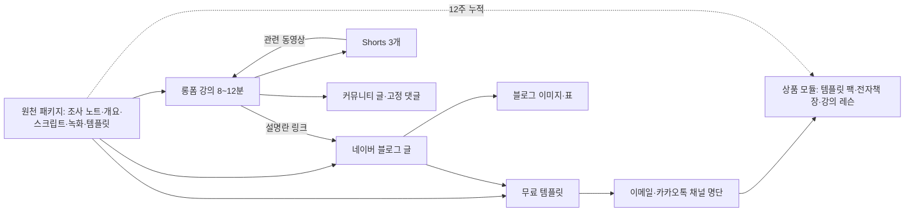

# 원소스 멀티유즈(OSMU) 전략: 한 번 조사하고, 플랫폼마다 다시 쓴다

> **학습 목표**: 원천 자산과 파생물을 구분해 한 주의 원천 패키지를 롱폼·Shorts·네이버 글·커뮤니티 글·메시지·상품 모듈로 나누고, 플랫폼마다 복사가 아닌 네이티브 결과물을 만들며, 발행 순서·연결·권리·측정·가지치기 규칙을 세울 수 있다.

이 문서는 섹션 전체를 하나의 제작 흐름으로 묶는다. 글 한 편을 쓰는 기술은 「블로그 글쓰기와 운영」, 강의 영상은 「롱폼 영상 기획과 제작」, Shorts 한 편은 「Shorts와 얼굴 없는 채널」, AI 도구의 정책 위험은 「AI 활용 제작과 플랫폼 정책」, 상품 설계와 판매처는 「자체 상품 수익: 강의·전자책·템플릿」, 저작권과 광고 표시는 「표시 의무·저작권·세금」, 주차별 일정은 「채널 90일 실행 계획」에서 다룬다. 여기서는 **무엇을 한 번 만들고, 무엇을 플랫폼마다 새로 만드는지**를 정한다. 정책과 기능은 **2026-09 기준**이며, 네이버 도움말과 YouTube 고객센터에 직접 접속할 수 없어 여러 항목을 "검색 결과로 확인"으로 표시했다. 시간과 성과 숫자는 모두 설명용 가정이다.

## 핵심 개념

**원소스 멀티유즈(OSMU)** 는 한 번 만든 원천에서 여러 결과물을 파생시키는 방식이다. 핵심은 "같은 파일을 여러 곳에 올리기"가 아니라 **조사와 구조 설계는 한 번, 표현은 플랫폼마다 새로**다. **원천 자산(source)** 은 플랫폼과 무관하게 재사용하는 재료이고, 한 주 치 묶음을 **원천 패키지**라 부른다. **파생물(derivative)** 은 원천을 한 플랫폼의 문법으로 다시 만든 결과물, **상품 모듈**은 여러 주의 원천을 묶고 깊게 만든 유료 단위다.

| 원천 자산 | 담는 것 | 주로 먹여 살리는 파생물 |
|---|---|---|
| 조사 노트 | 독자 질문, 공식 문서 링크와 확인 날짜, 직접 해 본 결과 | 모든 파생물의 사실 근거 |
| 개요 | 문제 → 해결 단계 → 흔한 실수 → 다음 단계 | 롱폼 구성, 블로그 소제목, 전자책 목차 |
| 스크립트 | 말로 할 문장, 화면 지시 | 롱폼 내레이션, 블로그 초안의 재료 |
| 화면 녹화 원본 | 가로 녹화 원본 + 확대 구간 표시 | 롱폼, Shorts, 블로그 캡처, 강의 레슨 |
| 템플릿 파일 | 실습용 엑셀 시트, 체크리스트 | 무료 템플릿, 유료 템플릿 팩 |

| 파생물 | 플랫폼 | 원천에서 가져오는 것 | 새로 만들어야 하는 것 | 역할 |
|---|---|---|---|---|
| 롱폼 강의 (8~12분) | YouTube | 개요, 스크립트, 녹화 | 도입부, 편집 리듬, 썸네일 | 신뢰와 시청 시간 |
| Shorts 3개 | YouTube | 녹화 구간 | 세로 재구성, 첫 1~2초, 자막 | 발견 |
| 네이버 블로그 글 | 네이버 | 개요, 조사 노트 | 검색 질문에 맞춘 제목·첫 화면, 복사 가능한 수식 | 검색 유입 |
| 블로그 이미지·표 | 네이버 | 녹화 캡처, 템플릿 | 단계별 캡처, 비교표 | 글의 이해도 |
| 커뮤니티 글·고정 댓글 | YouTube | 개요의 핵심 질문 | 투표·질문, 글과 템플릿 링크 | 참여와 연결 |
| 이메일·카카오톡 채널 메시지 | 자체 명단 | 이번 주 요약, 템플릿 | 명단 독자만을 위한 한 문단 | 명단 관계 |
| 상품 모듈 | 판매처 | 12주치 원천 | 정리·설명서·지원 | 수익 |

## 원리

### 1. 복사가 아니라 번역: 플랫폼 네이티브

파생물은 원천을 **그 플랫폼 독자가 쓰는 방식으로 번역한 것**이어야 한다. 네이버 독자는 검색어로 들어와 훑고 복사하고, 롱폼 시청자는 따라 하며 보고, Shorts 시청자는 첫 1~2초에 스와이프 여부를 정한다. **나쁜 예**: 영상 자동 자막을 그대로 블로그 본문에 붙이고, 롱폼 앞 60초를 잘라 Short로 올린다. **좋은 예**: 블로그는 결론·수식·표를 첫 화면에 두고, 영상은 문제 장면으로, Short는 결과 화면 하나로 시작한다.

### 2. 네이버: 유사문서·중복문서

네이버는 2012-10-30 원본 문서와 유사 문서를 가려 원본을 우선 노출하는 '프로젝트 바이오'를 발표했다 (보도로 확인). 현재의 판정 기준은 공개되어 있지 않고, 업계에서 쓰는 "유사문서" 개념(일부만 고쳐도 걸릴 수 있다, 내 블로그 안의 반복 글도 문제다)은 네이버 공식 문서가 아닌 해설이다. 그래서 규칙은 보수적으로 잡는다.

- 같은 글을 블로그·카페·다른 계정에 **복사해 올리지 않는다**. 영상 자막을 글로 옮길 때는 문장·구조·캡처를 새로 만든다.
- 내 블로그 안에서 같은 질문에 답하는 글을 또 쓰지 않고 **기존 글을 고치고 합친다** (「블로그 글쓰기와 운영」). 검색의 평가 방식은 「네이버 블로그와 검색 구조」에서 다룬다.

### 3. YouTube: 재사용 콘텐츠와 inauthentic content

두 수익 창출 정책의 정의·예시·허용 범위는 「AI 활용 제작과 플랫폼 정책」에 있다. OSMU에 필요한 결론만 적는다. 내 롱폼에서 Shorts를 만드는 것은 YouTube가 "Short로 편집" 기능으로 지원하는 흐름이다. OSMU의 위험은 재사용이 아니라 **반복**이다. 매주 같은 틀에 단어만 바꾼 영상을 쌓으면 inauthentic content 쪽으로 기운다. 원천마다 새 문제와 새 녹화가 있어야 한다.

### 4. 제작 순서와 발행 순서

제작은 항상 **조사 → 개요 → 스크립트 → 녹화**가 먼저다. 녹화가 끝나야 글의 캡처와 Shorts 구간이 생긴다. 발행 순서에 대한 플랫폼의 공식 규칙은 찾지 못했으므로, 아래는 판단 기준이다.

| 선택 | 언제 | 이유 | 주의 |
|---|---|---|---|
| 영상 먼저, 글 다음 날 | 기본값. 검색 시기가 급하지 않은 튜토리얼 | 글에 영상을 넣어 발행할 수 있고, Shorts가 가리킬 롱폼이 이미 있다 | 글이 하루 늦게 검색에 들어간다 |
| 글 먼저, 영상 나중 | 연말정산·새 기능 출시처럼 검색 수요가 날짜에 몰릴 때 | 글이 영상보다 빨리 만들어진다 | 영상 공개 뒤 글에 영상을 추가한다 |
| Shorts는 롱폼 뒤에 분산 | 항상 | 관련 동영상 링크는 이미 올라간 영상에만 걸 수 있다 | 같은 날 3개를 몰아 올리지 않는다 |

### 5. 잠식 없이 서로 연결하기

파생물끼리 같은 일을 하면 서로의 조회를 빼앗는다(cannibalisation). **역할을 나눈다**: 영상은 과정을 보여 주고, 글은 복사할 수식·표·파일을 주며, Short는 결과 하나만 보여 주고 롱폼으로 보낸다. 글에 영상 대본 전체를 옮기면 독자가 둘 다 볼 이유가 사라진다.

연결은 한 방향 사슬로 설계한다: Short → (관련 동영상) → 롱폼 → (설명란·고정 댓글) → 블로그 글·무료 템플릿 → (구독 선택) → 이메일·카카오톡 채널 명단 → 상품. Shorts 설명란·댓글 링크는 2023-08-31부터 클릭할 수 없으므로 관련 동영상 링크가 유일한 직접 경로다. 블로그 글은 "화면으로 따라 하기" 단계에 영상을 넣어 롱폼으로 돌려보낸다. 광고성 메시지의 동의·표시 규칙은 「채널 · Content · Paid · Lifecycle」과 「표시 의무·저작권·세금」을 따른다.

### 6. 자산 라이브러리와 권리

원천은 찾을 수 있어야 재사용된다. 주차 폴더 하나(예: `2026-W41_dedupe/`)에 원천과 파생물을 함께 두고, 파일 이름에 종류·버전을 넣는다(`src_outline_v2.md`, `src_rec_raw.mp4`, `out_short-1_result.mp4`). 폴더마다 `rights.md`에 이 주에 쓴 폰트·음원·이미지의 출처와 라이선스 범위를 적는다. 한 자산이 영상·글·유료 상품으로 흘러가므로, **"모든 파생물 + 유료 상품"에 쓸 수 있는 자산만 원천에 넣는다.** 애매하면 직접 만든 자산으로 바꾼다.

| 자산 | 확인할 것 | 예 |
|---|---|---|
| 폰트 | 영상·인쇄·임베딩(전자책·앱) 허용 범위 | 눈누는 폰트별로 임베딩·BI/CI 등 허용 범위를 나눠 표시한다 (검색 결과로 확인). 최종 확인은 제작사 라이선스 |
| BGM | 플랫폼 밖 사용 가능 여부 | YouTube 오디오 보관함의 표준 라이선스 음원은 YouTube 밖 사용이 제한되고, CC BY 음원은 출처 표시가 필요하다고 안내된다 (검색 결과로 확인) |
| 이미지 | 재배포·판매 상품 포함 허용 여부 | 스톡 이미지를 템플릿 파일 안에 넣어 파는 것이 되는지 라이선스에서 확인 |
| AI 생성물 | 도구 약관의 상업 이용 조건 | 「AI 활용 제작과 플랫폼 정책」 |

### 7. AI로 형식 바꾸기, 사람이 고치기

AI는 형식 변환에 강하다: 전사문 → 블로그 소제목과 단계 목록, 롱폼 전사문 → "결과가 한 화면에 보이는 30~60초 구간" 후보 5개, 개요 → 커뮤니티 질문 후보. 결과는 **초안**이다. 사람이 문장을 쓰고, 후보 중 3개를 고르고, 모든 함수 이름·메뉴 경로를 실제 화면과 대조하며, 파생물마다 **원천에 없던 것 하나**(새 캡처, 새 질문, 새 예시)를 더한다. 표시 규칙(YouTube의 변경·합성 콘텐츠 표시, 네이버 블로그가 2025-05-21 도입한 선택적 "AI 활용" 표시)은 「AI 활용 제작과 플랫폼 정책」을 따른다.

### 8. OSMU가 해가 될 때

20단계짜리 설정 과정을 Short로 자르면 아무것도 전달되지 않는다. 그 주에는 Short를 줄인다. 파생물 수가 목표가 되어 결과물마다 품질이 떨어지거나, 약한 원천에서 억지로 일곱 개를 뽑을 때도 마찬가지다. **형식이 맞지 않으면 만들지 않는 것**도 OSMU 규칙이다.

## 적용: 예시 크리에이터 J의 주간 원천 패키지

J의 1주차(D0 = 2026-10-05) 원천은 "엑셀 중복 데이터 정리"다. 시간은 「블로그·유튜브 수익화 전체 개요」의 주 10시간 가정을 단계별로 나눈 것이다.

| 순서 | 단계 | 산출물 | 시간 (가정) |
|---|---|---|---|
| 1 | 조사·예제 파일 | 조사 노트, 실습 시트 (원천) | 1.0 |
| 2 | 개요 | "하나의 개요" (원천) | 0.5 |
| 3 | 스크립트 | AI 초안 + J의 실수 사례 (원천) | 0.5 |
| 4 | 화면 녹화·음성 | 가로 원본 + 확대 구간 표시 (원천) | 1.5 |
| 5 | 롱폼 편집·썸네일 | 10분 강의 (화 발행) | 3.0 |
| 6 | 블로그 글·캡처·표 | 네이버 글 (수 발행, 영상 삽입) | 2.0 |
| 7 | Shorts 3개 | 결과형·실수형·질문형 (목·토·월 분산) | 1.0 |
| 8 | 커뮤니티·고정 댓글·메시지, 라이브러리 정리 | 질문 글, 명단 메시지, `rights.md` | 0.5 |
| | 합계 | | **10.0** |

같은 결과물을 플랫폼별로 따로 만든다면 (예시 계산이며 측정값이 아니다):

| 작업 | OSMU | 따로 만들기 | 차이가 나는 이유 |
|---|---|---|---|
| 조사·개요·스크립트 | 2.0 | 3.5 | 영상용·글용 조사와 개요를 각각 |
| 녹화 | 1.5 | 1.5 | 동일 |
| 롱폼 편집 | 3.0 | 3.0 | 동일 |
| 블로그 글 | 2.0 | 3.0 | 예제 파일과 캡처를 새로 준비 |
| Shorts 3개 | 1.0 | 3.0 | 각각 기획·녹화 |
| 커뮤니티·메시지·정리 | 0.5 | 0.5 | 동일 |
| 합계 | **10.0** | **14.5** | |

따로 만들면 주 10시간을 4.5시간 넘으므로 J는 Shorts나 블로그 중 하나를 포기해야 한다. 절약의 대부분은 **조사와 녹화를 한 번만 하는 데서** 나온다. 12주 동안 원천은 이렇게 쌓인다 (상품 일정은 「자체 상품 수익: 강의·전자책·템플릿」의 사다리를 따른다).

| 시점 | 쌓인 원천 | 원천에서 만드는 상품 모듈 |
|---|---|---|
| 1~2주차 (D0~D13) | 개요 2, 시트 2 | 가장 반응이 좋은 시트 → 무료 템플릿 (D14) |
| 3~5주차 (~D34) | 개요 5, 시트 5~8 | 다운로드·댓글 요청이 많은 시트로 유료 템플릿 팩 목록, 대기자 모집 (D35) |
| 6~9주차 (~D62) | 녹화 원본 9주치 | 녹화 원본을 짧게 다시 편집해 팩의 "사용 영상", 사전 판매(D49)·납품(D63) |
| 10~12주차 (~D83) | 개요 12 | 12개 개요를 4부 × 3장으로 묶어 전자책 목차, D90 이후 대기자 모집 |

유료 팩은 무료 시트의 묶음만으로는 부족하다. 사용 설명서, 통합 시트, 업데이트 약속처럼 **무료로 이미 받은 것 위에 더한 가치**가 있어야 한다. 「광고 수익: 애드포스트와 YouTube 파트너 프로그램」의 예시 계산에서 J의 YPP 광고 단계 도달은 11~26개월 차이므로, 첫 90일 동안 OSMU의 보상은 광고가 아니라 **절약한 시간, 상품 모듈, 어떤 주제가 반응하는지에 대한 학습**이다.

## 심화

### 어느 파생물이 결과를 냈나

| 도구 | 보는 것 | J의 질문 |
|---|---|---|
| UTM 또는 단축 링크 | 상품·템플릿 페이지로 온 방문의 출발 파생물 | 템플릿 다운로드는 블로그 글에서 왔나, 롱폼 설명란에서 왔나? |
| YouTube Studio 도달 탭의 트래픽 소스 | Shorts 피드, YouTube 검색, 추천 동영상, 외부 등 | 롱폼 조회 중 Shorts 경유는 얼마인가? |
| 네이버 블로그 통계의 유입분석 | 검색 유입·사이트 유입, 유입 검색어 (메뉴 이름은 바뀔 수 있음) | 글이 검색에서 오나, 유튜브에서 오나? |

링크마다 출발지를 붙인다. 예: `?utm_source=naverblog&utm_medium=post&utm_campaign=2026-w41`. UTM은 받는 페이지가 분석 도구로 읽을 때만 의미가 있고 기기를 바꾼 경로는 놓치므로, 다운로드 폼에 "어디서 알게 되었나요" 한 문항을 둔다.

### 가지치기 규칙

파생물마다 **투입 시간당 결과**(다운로드·구독·검색 유입)를 4주 단위로 본다 (가정). 4주 연속 가장 낮고 그 결과를 다른 파생물이 대신 낸다면 줄이거나 멈춘다. 첫 90일의 "결과"는 광고 수익이 아니라 다운로드·명단 가입·사전 판매 같은 상품 신호로 잰다. 예외는 루프의 중심인 롱폼이다: 모든 파생물의 재료이고 시청 시간이 쌓이는 곳이므로 단기 결과가 낮아도 유지한다. 첫 2주의 숫자로는 자르지 않는다.

### 오래된 콘텐츠 되살리기

네이버의 조회 상위 옛 글은 새 글로 다시 쓰지 말고 고쳐서 갱신한다. YouTube는 공개된 영상 파일을 바꿀 수 없으므로, 옛 롱폼에서 새 Short를 만들거나(공개 롱폼만, 제3자 저작권 주장이 있으면 불가) 도구가 바뀌었다면 새 버전 영상을 만들어 옛 영상의 고정 댓글에서 연결한다. 갱신한 원천은 템플릿 팩 업데이트로 이어진다.

### 플랫폼을 늘릴 때 (선택)

Instagram Reels, Threads, 뉴스레터는 **핵심 루프(롱폼·Shorts·네이버)가 12주 동안 흔들리지 않은 뒤** 한 번에 하나씩 더한다. 먼저 `rights.md`로 음원·폰트가 새 플랫폼에서도 허용되는지 확인하고, 다른 플랫폼 워터마크가 찍힌 파일이 아니라 원본 파일을 쓴다 (「Shorts와 얼굴 없는 채널」).

## 흔한 오해

- **"OSMU는 같은 콘텐츠를 여러 곳에 올리는 것"** — 조사와 구조를 재사용하는 것이지 결과물을 복사하는 것이 아니다.
- **"내 영상에서 자른 Shorts는 재사용 콘텐츠라 수익이 막힌다"** — 재사용 콘텐츠는 내 창작물이 아닌 콘텐츠가 대상이다. 위험은 반복·대량 생산이다 (「AI 활용 제작과 플랫폼 정책」).
- **"파생물이 많을수록 좋다"** — 투입 시간을 갚지 못하는 파생물은 원천의 품질을 갉아먹는다.
- **"영상에 쓴 음원과 폰트는 전자책에도 쓸 수 있다"** — 허용 범위는 용도별로 다르다.
- **"AI가 변환해 주면 편집은 필요 없다"** — AI 결과는 초안이다. 사실 확인과 플랫폼 문법은 사람이 맞춘다.

## 자기 점검 질문

1. 원천 자산 다섯 가지를 들고, 각각이 먹여 살리는 파생물을 하나씩 말해 보라.
2. 롱폼 자막을 그대로 네이버 글로 올리면 어떤 두 가지 문제가 생길 수 있는가?
3. 연말정산 엑셀 튜토리얼이라면 영상과 글 중 무엇을 먼저 발행하겠는가? 이유는?
4. Short에서 블로그 글로 독자를 보내려면 어떤 경로를 거쳐야 하는가?
5. 4주 동안 커뮤니티 글의 시간당 결과가 가장 낮았다. 멈추기 전에 확인할 것은 무엇인가?

## 참고 자료

- [YouTube channel monetization policies — YouTube Help](https://support.google.com/youtube/answer/1311392?hl=en) — Google, 검색 결과로 확인 (2026-09-30)
- [FAQ: Reused Content & YouTube's Partner Program — YouTube Community](https://support.google.com/youtube/community-guide/271248162/%F0%9F%94%8E-faq-reused-content-youtube%E2%80%99s-partner-program?hl=en) — Google, 검색 결과로 확인 (2026-09-30)
- [Create YouTube Shorts from your videos — YouTube Help](https://support.google.com/youtube/answer/12836917?hl=en) — Google, 검색 결과로 확인 (2026-09-30)
- [YouTube enables linking between Shorts and long-form videos — Search Engine Land](https://searchengineland.com/youtube-enables-linking-shorts-long-form-videos-430655) — Search Engine Land, 검색 결과로 확인 (2026-09-30)
- [YouTube's banning clickable links from Shorts descriptions and comments — Tubefilter](https://www.tubefilter.com/2023/08/10/youtube-shorts-comments-spam/) — Tubefilter, 검색 결과로 확인 (2026-09-30)
- [Understand your YouTube video reach — YouTube Help](https://support.google.com/youtube/answer/9314355?hl=en) — Google, 검색 결과로 확인 (2026-09-30)
- [URL builders: Collect campaign data with custom URLs — Analytics Help](https://support.google.com/analytics/answer/10917952?hl=en) — Google, 검색 결과로 확인 (2026-09-30)
- [네이버 검색개편 — 한국일보](https://www.hankookilbo.com/news/article/201210301298432767) — 한국일보, 2012-10-30, 검색 결과로 확인 (2026-09-30)
- [다시 정립해야 할 네이버 유사문서 개념 — 오픈애즈](https://www.openads.co.kr/content/contentDetail?contsId=4748) — 오픈애즈(업계 해설), 검색 결과로 확인 (2026-09-30)
- [YouTube Audio Library: what is it & what are its limitations — Lickd](https://lickd.co/youtube-audio-library/) — Lickd, 검색 결과로 확인 (2026-09-30)
- [Noonnu FAQ — 눈누](https://noonnu.cc/en/questions) — 눈누, 검색 결과로 확인 (2026-09-30)
