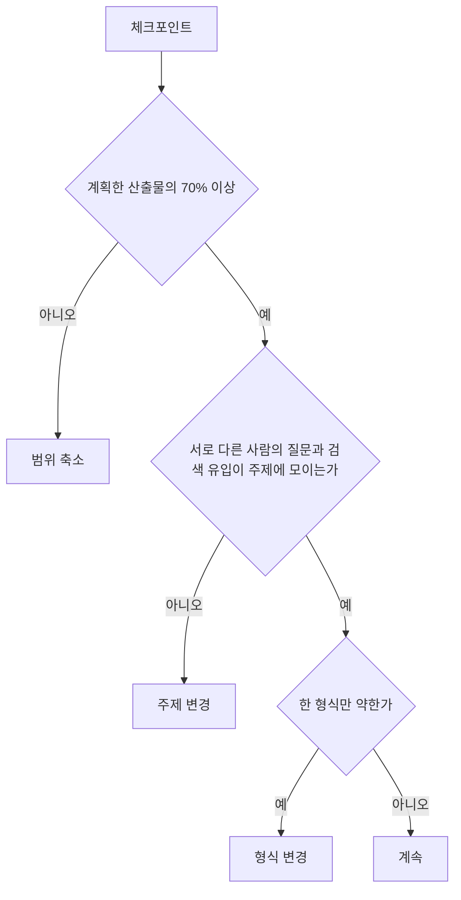

# 채널 90일 실행 계획

> **학습 목표**: 주 10시간을 블로그·롱폼·Shorts·상품 작업에 나누고, 주 1개의 원천 패키지에서 파생물을 만드는 주간 루틴과 콘텐츠 캘린더를 세우며, D30·D60·D90 지표로 계속·주제 변경·형식 변경을 판단하고 첫 상품 출시 시점을 정할 수 있다.

이 문서는 섹션 전체를 한 계획으로 묶는다. 각 단계의 방법은 형제 문서에 있으므로 여기서는 **순서, 시간, 판단 기준**만 다룬다. 주제와 독자는 「주제 선정과 독자 설계」, 검색과 글쓰기는 「네이버 블로그와 검색 구조」와 「블로그 글쓰기와 운영」, 유튜브는 「유튜브 추천 구조와 채널 설계」, 「롱폼 영상 기획과 제작」, 「Shorts와 얼굴 없는 채널」, AI 도구와 정책 위험은 「AI 활용 제작과 플랫폼 정책」, 수익은 「광고 수익: 애드포스트와 YouTube 파트너 프로그램」과 「자체 상품 수익: 강의·전자책·템플릿」, 법과 세금은 「표시 의무·저작권·세금」을 본다. 원천 하나를 여러 파생물로 나누는 규칙은 「원소스 멀티유즈(OSMU) 전략」에 있고, 이 계획의 주간 루틴은 그 흐름을 달력에 올린 것이다. 날짜와 기준은 2026-09 기준이고, 목표 숫자는 모두 예시 크리에이터 J의 가정이다.

## 핵심 개념

| 용어 | 뜻 | 이 계획에서 |
|---|---|---|
| 원천 패키지 | 한 주의 원천 자산 묶음: 조사 노트, 예제 파일, 개요, 스크립트, 화면 녹화 원본 | 매주 1개 (`2026-W41` 같은 주차 폴더) |
| 파생물 | 원천 패키지에서 나온 결과물 | 롱폼 1개, 네이버 블로그 글 1개, Shorts 3개, 커뮤니티 글, 상품 모듈 메모 |
| 시간 예산 | 주당 쓸 수 있는 시간의 배분 | 주 10시간 고정 |
| 선행 지표 | 빨리 움직이고 행동으로 바꿀 수 있는 지표 | 노출 클릭률, 평균 시청 지속률, 블로그 검색 유입어, 댓글 질문, 템플릿 다운로드 |
| 후행 지표 | 늦게 움직이는 결과 지표 | 구독자, 광고 수익, 상품 매출 |
| 결정 규칙 | 체크포인트에서 미리 정한 조건으로 다음 행동을 고르는 규칙 | 계속 / 형식 변경 / 주제 변경 / 범위 축소 |

## 원리

### 1. 산출물을 약속하고, 결과는 나중에 판단한다

초보에게 90일은 광고 수익을 판단하기에 짧다. 광고는 애드포스트 심사와 YouTube 파트너 프로그램 기준을 넘어야 시작되고, 「광고 수익: 애드포스트와 YouTube 파트너 프로그램」의 예시 계산(예측이 아님)에서 J는 팬 후원 단계(구독자 500명, 광고 수익 배분 없음)에 7~14개월 차, 2027-02-01부터 적용되는 새 광고 단계 기준(구독자 1,000명 + 365일 8,000시간)에 11~26개월 차에 닿는다. D90에는 어느 시나리오도 팬 후원 단계에 닿지 않는다. 그래서 90일 계획은 **통제할 수 있는 산출물**(주 1 원천 패키지)과 **선행 지표**로 판단하고, 광고 기준 도달은 판단 조건에 넣지 않는다.

### 2. 주 10시간의 배분

1단계는 「원소스 멀티유즈(OSMU) 전략」의 주간 배분을 그대로 쓴다. 제작이 손에 익으면 줄어든 시간을 상품 작업으로 옮긴다.

| 작업 | 1단계 D0~D30 | 2단계 D31~D60 | 3단계 D61~D90 |
|---|---|---|---|
| 원천: 조사·예제 파일·개요·스크립트 | 2.0 | 2.0 | 1.5 |
| 원천: 화면 녹화·음성 | 1.5 | 1.5 | 1.5 |
| 롱폼 편집·썸네일 (8~12분) | 3.0 | 2.5 | 2.5 |
| 네이버 블로그 글 | 2.0 | 1.5 | 1.5 |
| Shorts 3개 (롱폼에서 잘라 냄) | 1.0 | 1.0 | 1.0 |
| 커뮤니티·측정·상품 작업 | 0.5 | 1.5 | 2.0 |
| **합계 (시간)** | **10** | **10** | **10** |

2·3단계의 감소분은 J의 가정이다. 1단계 2주 동안 실제 소요 시간을 기록하고, 기록이 가정보다 길면 상품 작업을 늘리기 전에 범위부터 줄인다 (아래 결정 규칙).

### 3. 주간 루틴: 원천 하나, 파생물 여럿

직장인 J는 주말에 원천을 만들고, 다음 주 평일에 파생물을 마무리하며 발행한다. 발행 요일(롱폼 화, 블로그 수, Shorts 목·토·월)은 「원소스 멀티유즈(OSMU) 전략」의 기본값을 따른다.

| 요일 | 시간 | 작업 | 산출물 |
|---|---|---|---|
| 토 | 3.5 | 댓글·검색어에서 주제 고르기, 조사·예제 파일, 개요, AI 스크립트 초안 검증, 화면 녹화·음성 | 원천 패키지 |
| 일 | 3 | 롱폼 편집, 썸네일, 제목 | 롱폼 (화요일 예약) |
| 월 | 1.25 | 주간 지표 검토 (지난주 발행분, 15분), 같은 개요로 블로그 초안·캡처 | 주간 기록, 블로그 초안 |
| 화 | 1 | 블로그 마무리, 영상 삽입 | 블로그 글 (수요일 예약) |
| 수 | 1 | 롱폼에서 Shorts 3개 잘라 관련 동영상 연결 | Shorts 3개 (목·토·월 예약) |
| 목 | 0.25 | 고정 댓글·커뮤니티 글, 질문 수집 | 질문 목록 |

블로그 글과 영상은 같은 개요에서 나온다("하나의 개요, 두 개의 결과물"). 2·3단계에는 토요일 원천 시간과 일요일 편집 시간을 줄여 일요일 끝에 상품 작업 1~1.5시간을 둔다.

### 4. 결정 규칙

- **범위 축소**: 산출물이 70% 미만이면 지표를 보기 전에 계획을 줄인다. Shorts를 3개에서 1개로, 블로그 글을 짧은 요약형으로 바꾼다.
- **주제 변경**: 모든 형식에서 수요 신호(질문, 검색 유입어, 다운로드)가 약하면 같은 분야 안에서 하위 주제를 옮긴다. 예: "엑셀 일반" → "영업·총무 직무의 보고서 자동화".
- **형식 변경**: 블로그 검색 유입은 느는데 롱폼 시청 지속만 약하다면 주제가 아니라 형식 문제다. 영상 길이, 도입부, 썸네일을 바꾼다 (「롱폼 영상 기획과 제작」).
- 비교 기준은 외부 평균이 아니라 **내 채널의 지난 4주 중앙값**이다.

## 적용: 예시 크리에이터 J의 90일 (2026-10-05 ~ 2027-01-03)

### 콘텐츠 캘린더

주는 발행 주 기준이다. W1 원천은 D0 직전 주말(2026-10-03~04)에 만든다.

| 주 | 시작일 | 원천 주제 (예) | 상품 작업 |
|---|---|---|---|
| W1 | 2026-10-05 (D0) | 엑셀 중복 데이터 정리 | 블로그·채널 기본 설정 |
| W2 | 2026-10-12 | 주간 업무 보고 자동화 시트 | 무료 시트 준비 |
| W3 | 2026-10-19 (D14) | XLOOKUP으로 명단 대조 | 무료 템플릿 공개, 연락처 폼 |
| W4 | 2026-10-26 | AI에게 엑셀 수식 부탁하는 법 | 댓글·질문 수집 |
| W5 | 2026-11-02 (D30은 11-04) | 피벗 테이블로 월간 보고 | D30 점검 |
| W6 | 2026-11-09 (D35) | 파워 쿼리로 파일 여러 개 합치기 | 유료 템플릿 팩 대기자 모집 |
| W7 | 2026-11-16 | 댓글 질문 모음 Q&A | 팩 목록·사용 영상 계획 |
| W8 | 2026-11-23 (D49) | 템플릿 팩 미리보기 튜토리얼 | 사전 판매 시작 (D49~D60, 약 12일) |
| W9 | 2026-11-30 (D60은 12-04) | 조건부 서식으로 대시보드 | D60 점검에서 사전 판매 마감·판정 |
| W10 | 2026-12-07 (D63) | 템플릿 팩 사용법 | 사전 구매자 납품 |
| W11 | 2026-12-14 | AI로 회의 메모를 표로 정리 | 구매자 질문으로 보강, 여유 원천 1개 미리 녹화 |
| W12 | 2026-12-21 | 연간 업무 회고 시트 | 정식 판매 전환, 전자책 목차 초안 |
| W13 | 2026-12-28 | 가장 많이 받은 질문 다시 풀기 (여유 원천 사용 가능) | D90 점검 (2027-01-03) |

연말에는 회사 일정이 몰리기 쉬워 W11에 여유 원천을 하나 미리 만든다. 쓰지 않으면 1월 첫 주에 쓴다.

### 체크포인트와 목표 (J의 가정)

| 시점 | 산출물 목표 | 선행 지표로 볼 것 | 판단 |
|---|---|---|---|
| D30 (2026-11-04) | 롱폼 5, 블로그 글 5, Shorts 12, 무료 템플릿 공개 | 영상별 노출 클릭률·평균 시청 지속률, 블로그 검색 유입어, 템플릿 연락처 수 | 범위 축소 여부만 판단. 주제 판단은 아직 이르다 |
| D60 (2026-12-04) | 누적 롱폼 9, 블로그 글 9, Shorts 25, 사전 판매 진행 | 서로 다른 사람의 질문 수, 지표의 4주 추세, 대기자 수 | 결정 규칙 전체 적용. 사전 판매 판정: D49~D60 약 12일에 10건 (가정) |
| D90 (2027-01-03) | 누적 롱폼 13, 블로그 글 13, Shorts 38 (W13의 월요일 Short는 D91), 템플릿 팩 납품 완료 | 구매자 질문, 검색 유입 상위 글, 구독 전환이 좋은 영상 | 다음 90일 주제·형식·상품(전자책 대기자 모집 여부) 결정 |

누적 수는 화요일 롱폼, 수요일 블로그, 목·토·월 Shorts 발행을 가정해 센 값이다. 13주 전체로는 「블로그·유튜브 수익화 전체 개요」의 "롱폼 13편, Shorts 39편, 블로그 글 13편"과 같고, 마지막 Short 1개만 D90 다음 날(2027-01-04) 발행된다.

광고: 90일 안의 광고 수익은 0원으로 잡는다. 애드포스트 신청과 YouTube 파트너 프로그램 기준 도달은 D90 판단 조건이 아니다. 기준에 가까워지면 「광고 수익: 애드포스트와 YouTube 파트너 프로그램」의 절차를 따른다.

### 첫 상품 출시 타이밍

J는 D14에 무료 템플릿을 공개해 연락처를 모으고, 유료 템플릿 팩은 **D35 대기자, D49~D60 사전 판매(D60 점검에서 판정), D63 납품**으로 간다. D30 이전에는 유료 상품을 팔지 않는다. 판매 근거(서로 다른 사람의 반복 질문)가 아직 없기 때문이다. D49 전에 통신판매업 신고 대상 여부를 확인하고, 사업자 등록은 세무사와 먼저 상담한다. 템플릿 판매는 과세 공급이라 940306 면세 등록만으로는 부족하고 과세 겸영 등록과 부가세 신고가 필요할 수 있다 (「표시 의무·저작권·세금」). 판매 페이지에는 환불 조건을 적는다 (「자체 상품 수익: 강의·전자책·템플릿」).

### 위험과 멈출 것

| 위험 | 신호 | 대응 |
|---|---|---|
| 번아웃 | 2주 연속 산출물 70% 미만, 주말 전부 사용 | 범위 축소 규칙 적용, 여유 원천 앞당겨 쓰기 |
| 반복·대량 생산으로 보이는 영상 | 매주 같은 틀에 단어만 바뀜, AI 원고를 그대로 읽음 | 매 원천에 새 문제와 새 녹화, 「AI 활용 제작과 플랫폼 정책」 점검 |
| 저작권·개인정보 사고 | 실제 회사 파일, 알림 창이 녹화됨 | 가짜 예제 데이터, 업로드 전 전체 확인 |
| 회사 겸업 문제 | 취업규칙 겸업 조항 | D0 전에 확인 |
| 비교와 조급함 | 다른 채널 성장 속도를 보고 계획 변경 | 비교 기준은 내 지난 4주 중앙값 |

멈출 것: 매일 업로드, 하루 여러 번 통계 확인, 90일 안에 새 플랫폼 추가, 썸네일 끝없는 수정, 장비 구매로 문제 해결하기.

## 심화

### 배치 제작과 여유 원천

일정이 안정되면 격주로 원천 2개를 한 번에 녹화하고(배치), 녹화 원본 1~2주 분을 쌓는다. 여유 원천은 야근·연말처럼 예측 가능한 공백을 흡수한다. 여유 원천을 만드는 동안에도 주 1회 발행 간격은 유지한다.

### 90일 뒤: 다음 계획으로 넘길 것

- 검색 유입 상위 5개 글과 구독 전환 상위 3개 영상의 공통 주제 → 다음 90일 주제
- 구매자 질문 목록과 W1~W12의 개요 12개 (W13은 D90 직전이라 제외) → 전자책 목차 (묶는 방법은 「원소스 멀티유즈(OSMU) 전략」)
- 실제 주간 시간 기록 → 다음 시간 예산
- 광고 기준까지 남은 거리 → 「광고 수익: 애드포스트와 YouTube 파트너 프로그램」의 계산으로 현실적인 시점 추정

## 흔한 오해

- **"90일이면 광고 수익이 나야 한다."** 광고는 기준을 넘은 뒤에 시작된다. 90일 판단은 산출물과 선행 지표로 한다.
- **"블로그와 유튜브를 따로 기획해야 한다."** 같은 원천에서 파생물을 만들면 시간이 줄고 주제가 일관된다.
- **"조회수가 낮으면 바로 주제를 바꾼다."** 먼저 산출물 달성률과 형식 문제를 본다. 주제 변경은 모든 형식에서 신호가 약할 때만 한다.
- **"상품은 구독자가 많아진 뒤에 생각한다."** 무료 템플릿으로 명단을 모으는 일은 D14부터 시작할 수 있다.
- **"여유 원천은 낭비다."** 직장인에게 여유 원천은 계획이 무너지지 않게 하는 장치다.

## 자기 점검 질문

1. 주 8시간만 쓸 수 있다면 2단계 배분 표에서 무엇을 줄이겠는가? 이유는?
2. D60에 블로그 검색 유입은 늘었지만 롱폼 평균 시청 지속률이 4주 연속 떨어졌다. 결정 규칙상 어떤 행동인가?
3. 산출물 달성률이 60%인데 지표가 좋다. 계속해도 되는가?
4. 첫 유료 상품을 D30 이전에 팔지 않는 이유를 설명하라.
5. 자신의 주제로 W1~W4 원천 주제를 적고, 각각에서 나올 파생물을 나열하라.

## 참고 자료

- [Overview of the expanded YouTube Partner Program](https://support.google.com/youtube/answer/13429240?hl=en) — YouTube Help, 검색 결과로 확인 (2026-09-30)
- [YouTube is lowering the barrier to be eligible for its monetization program](https://techcrunch.com/2023/06/13/youtube-is-lowering-the-barrier-to-be-eligible-for-its-monetization-program/) — TechCrunch, 2023-06-13, 검색 결과로 확인 (2026-09-30)
- [YouTube Partner Program: Eligibility, Benefits & Application](https://www.youtube.com/creators/partner-program/) — YouTube, 검색 결과로 확인 (2026-09-30)
- [네이버 애드포스트 신청 조건과 수익](https://postdot.kr/blog/naver-adpost-guide) — 포스트닷, 검색 결과로 확인 (2026-09-30)
- [「추천·보증 등에 관한 표시·광고 심사지침」 개정·시행](https://www.ftc.go.kr/www/selectBbsNttView.do?pageUnit=10&pageIndex=1&searchCnd=all&key=12&bordCd=3&searchCtgry=01%2C02&nttSn=47547) — 공정거래위원회, 검색 결과로 확인 (2026-09-30)
- [온라인취약업종 세무 안내 - 1인미디어 창작자](https://www.nts.go.kr/nts/cm/cntnts/cntntsView.do?mi=2480&cntntsId=7802) — 국세청, 검색 결과로 확인 (2026-09-30)
