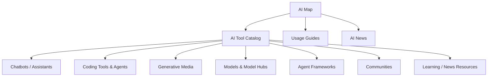

# AI Map

AI Map is a knowledge map for exploring AI tools by **role, execution method, and workflow**, rather than as a simple list of names.

The current blog integrates only content suitable for public release from the separate `linjingzhu/ai-map` repository.

## Structure

## Why It Is a Separate Theme

`Using AI` and `AI Map` serve different purposes.

| Area | Question |
|---|---|
| Using AI | How can we use AI in development and work? |
| AI Map | What AI tools exist, and where do they fit? |

## Data Coverage

- A catalog of more than 109 AI tools/resources
- 7 categories
- Distinction between installed applications and web access
- Image/design and coding workflow guides
- AI news and learning links

## Integration Principles

The original repository is private and contains a standalone React/Vite application. The current technical blog uses a static Markdown structure on GitHub Pages, so the entire development infrastructure was not copied.

Included:

- Public tool data
- Categories
- Official launch/download links
- Usage guides
- Public news data

Excluded:

- The original repository's `.ai/`, `.claude/`, and `.codex/`
- Internal development scripts and test harnesses
- Hosting configuration
- Private operational documents

This approach reuses AI Map's knowledge while preserving the current blog architecture.
