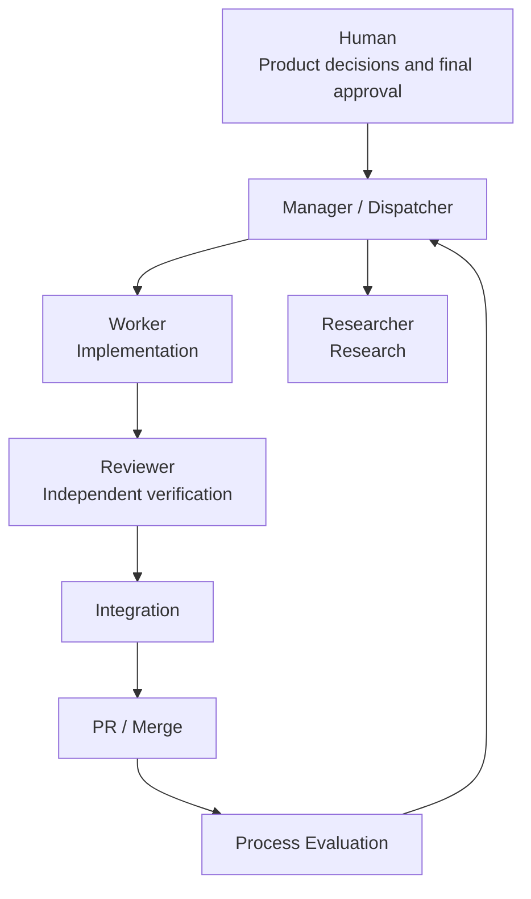
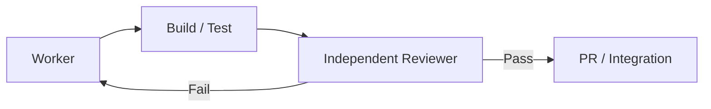

# Using AI as a Development System, Not Just a Development Tool

The effectiveness of AI coding tools depends less on “how quickly they write code” than on **the roles and responsibilities they receive and the verification loop in which they operate**.

## Basic Perspective

Rather than treating AI as one all-purpose developer, separate its roles as follows.



| Layer | Core Responsibility |
|---|---|
| Human | Product direction, priorities, approval of high-risk actions |
| Manager / Dispatcher | Interpret requests, break down tasks, select difficulty, model, and role |
| Workspace Manager | Create and clean up Git branches/worktrees |
| Worker | Implement changes |
| Researcher | Investigate existing code, APIs, and structure |
| Reviewer | Independently verify the implementation |
| Integration | Integrate results and check for regressions |
| Process Evaluator | Analyze cost, failures, and recurring problems |

## The Most Important Operating Principles

### 1. Use the Repository as Memory Rather Than the Conversation

Long conversations eventually get compacted or interrupted. Store decisions that must last in the repository.

```text
Repository
├─ CLAUDE.md        Claude Code entry point
├─ AGENTS.md        Codex entry point
└─ .ai/
   ├─ PRODUCT.md
   ├─ ARCHITECTURE.md
   ├─ GIT_POLICY.md
   ├─ TEST_POLICY.md
   ├─ DECISIONS.md
   └─ CURRENT_STATE.md
```

In other words, treat the **repository as long-term memory** and the **session as temporary working memory**.

### 2. Separate Implementation from Verification

Having another agent inspect and verify the actual diff is safer than letting the implementing agent conclude, “I built it, and it works.”



### 3. More Agents Do Not Necessarily Make a Better System

Handoffs between agents also consume tokens and require explanation. One worker and one reviewer may be enough for a small change.

> The goal is not **maximum parallelism**, but **lower Cost per Accepted Change while maintaining quality**.

## The Basic Unit When Combined with Git

The most intuitive unit of feature development is as follows.

```text
1 Feature
↕
1 Branch
↕
1 Worktree
↕
1 Main Development Session
```

A session can be replaced, while its branch and worktree can remain until the feature is complete.

## Good Tasks to Delegate to AI

- Explore the codebase
- Compare implementation approaches
- Implement small features
- Run builds and tests
- Review diffs
- Analyze Git state
- Create branches/worktrees
- Write PR descriptions
- Analyze recurring failure patterns

## Responsibilities Humans Should Retain

- Product direction
- User value
- Core architecture decisions
- Approval of destructive Git history changes
- Approval of force pushes
- Security policy
- Final merge decisions

The AI section of this blog covers **how to build a more predictable development system by clearly separating authority and responsibility**, rather than “how to give AI more authority.”
