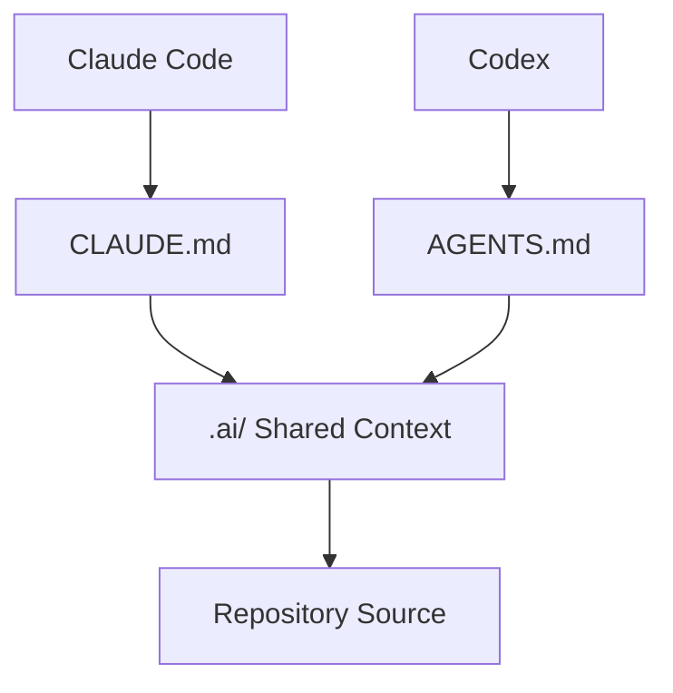
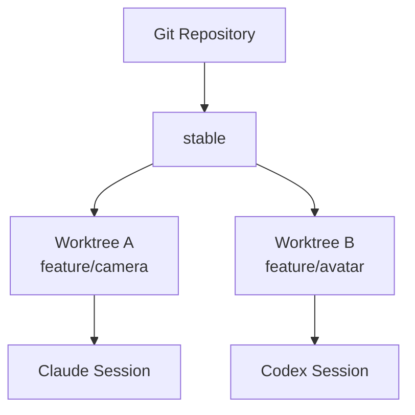

# Developing One Product with Claude Code and Codex

Two AIs do not automatically share the same context merely because they use the same GitHub repository.

The key is to **share code through Git and share long-term context and policies through repository files**.

## Recommended Structure

```text
MyProduct/
├─ CLAUDE.md
├─ AGENTS.md
├─ .ai/
│  ├─ PRODUCT.md
│  ├─ ARCHITECTURE.md
│  ├─ DEVELOPMENT_POLICY.md
│  ├─ GIT_POLICY.md
│  ├─ UX_POLICY.md
│  ├─ TEST_POLICY.md
│  ├─ DECISIONS.md
│  └─ CURRENT_STATE.md
└─ Source/
```



## Why This Structure Is Needed

Claude and Codex do not automatically share their conversation histories.

For example, suppose a Claude session makes the following decision.

> Place the Blend Shape creation UI in the Avatar > Blend Shape tab.

If this decision remains only in the chat, Codex cannot know it. Externalize lasting decisions into a file such as `.ai/DECISIONS.md`.

## Do Not Develop in Parallel in the Same Working Tree

Poor structure:

```text
The same folder
├─ Claude edits Camera.cpp
└─ Codex also edits Camera.cpp
```

Recommended:



Each AI works in its own branch and worktree, with cross-verification at the PR stage.

## Cross-model Review

```text
Claude implements
→ PR
→ Codex Review
→ Claude revises
→ Human / CI checks
→ Merge

Codex implements
→ PR
→ Claude Review
→ Codex revises
→ Human / CI checks
→ Merge
```

The goal is not to make the models identical. Instead:

> **The same source of truth + different reasoning paths + mutual verification**

is more valuable.

## The Role of CURRENT_STATE.md

This is an index for quickly reconstructing the current work.

| Owner | Branch | Task | State |
|---|---|---|---|
| Claude | `feature/camera` | Camera animation | In Progress |
| Codex | `feature/library` | Library browser | Review |

Even if a session is interrupted, a new agent can read the repository and recover the current state.

## Tools That Can Be Added Later

Keeping shared policies in `.ai/` means that adding a new coding agent requires only an entry file for that agent.

```text
Claude → CLAUDE.md ─┐
Codex  → AGENTS.md ─┼→ .ai/*
Other  → ENTRY.md  ─┘
```

This creates a development operating structure that is not tied to a particular AI product.
