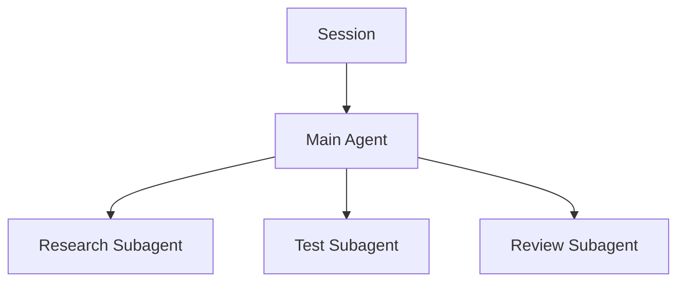

# The Difference Between Sessions, Agents, and Subagents

Distinguishing these three concepts makes Claude Code’s parallel work structure much clearer.

## One-Sentence Definitions

- **Session**: a workspace containing the conversation and task context
- **Agent**: the worker that pursues the goal within that workspace
- **Subagent**: an assistant worker invoked by the main agent to handle a specific subtask



## Session

A session accumulates the following.

- Conversations with the user
- Decisions made so far
- Tool execution results
- Task goals
- A temporary understanding of the current project

Creating a new session starts a fresh conversation context, but the files and Git state in the same worktree remain intact.

```text
feature/camera + worktree/camera
├─ Session 1  ended
├─ Session 2  fresh start
└─ Session 3  QA stage
```

There is therefore no need to preserve a long session at all costs.

## Agent

An agent is the executing entity that plans and uses tools to pursue a goal.

```text
Main Agent
├─ Interpret requirements
├─ Explore files
├─ Modify code
├─ Run Git
├─ Test
└─ Evaluate results
```

## Subagent

A subagent focuses on a specific assignment in its own smaller context.

Example:

```text
Main Agent
"Implement the Camera Animation feature."

├─ Researcher
│  └─ Investigate the existing Camera structure
├─ Test Agent
│  └─ Investigate candidate regression tests
└─ Reviewer
   └─ Independently review the changes
```

The advantage is that the entire investigation does not accumulate in the main context.

## Can the Same Agent Participate in Multiple Sessions?

The “same role” can be reused across sessions, but it is more accurate to view each execution as a separate instance.

```text
Reviewer role definition
├─ Session A → Reviewer Instance A
└─ Session B → Reviewer Instance B
```

To share state, externalize it into files.

## When to Replace a Session

Use **task boundaries**, rather than elapsed time, as the criterion.

- Completion of a major subtask
- A commit boundary
- Implementation → Review
- Review → Fix
- Context grows too large
- Incorrect earlier assumptions keep recurring

## Handoff Documents

For complex unfinished work, leave a short handoff for the new session.

```md
# Session Handoff

Branch: feature/camera
Worktree: worktrees/camera

## Current Goal
Connect imported camera animation

## Completed
- Investigated the data structures
- Implemented basic import

## In Progress
- frame range sync

## Next
1. Complete sync
2. targeted build
3. regression test
```

The key is that **repository state should be more reliable than session memory**.
