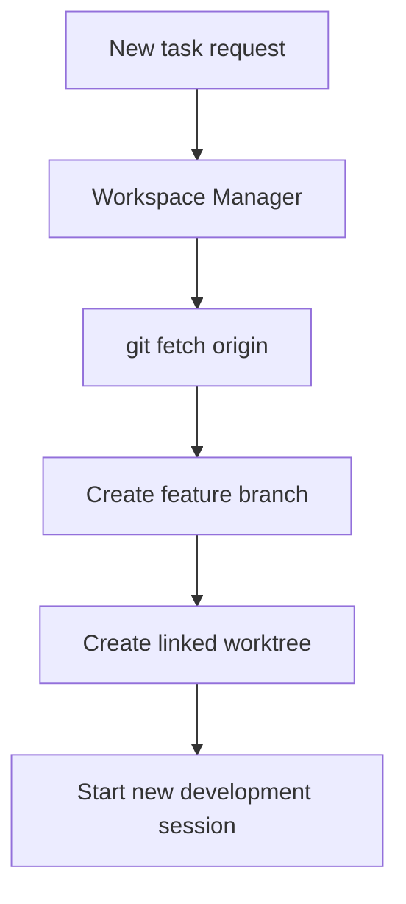
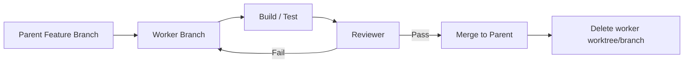

# Multi-Agent Roles and Model Routing

Operating agents takes more than assigning “expensive models to difficult work.” The key is to **separate role from difficulty**.

## A Three-Axis Model

```text
Task
├─ Role        What does the task involve?
├─ Difficulty  How difficult is it?
└─ Model       What model tier should be used?
```

Example:

| Task | Role | Difficulty | Model Tier |
|---|---|---|---|
| Locate a file | Researcher | Easy | Fast |
| Analyze the Camera API | Researcher | Normal | Standard |
| Redesign SceneGraph | Architect | Difficult | Deep reasoning |
| Edit a string | Worker | Easy | Fast |
| Implement a typical feature | Worker | Normal | Standard |
| Change the structure | Worker | Difficult | Deep reasoning |

Specific Claude Code model names may change over time. A safer policy first defines roles such as **Fast / Standard / Deep**, then maps them to the currently available Haiku / Sonnet / Opus families.

## Manager and Dispatcher

The two are similar, but answer different questions.

### Dispatcher

> “Who should receive this task?”

- Classify the request
- Assess difficulty
- Select a role
- Select a model

### Manager

> “How will this entire task be completed?”

- Break down the task
- Manage dependencies
- Assign workers
- Request reviews
- Decide on rework
- Integrate results

Initially, **combining Manager / Dispatcher into one role** is simpler.

## Recommended Roles

### Control Plane

| Role | Responsibility |
|---|---|
| Manager / Dispatcher | Analyze, distribute work, and decide on integration |
| Workspace Manager | Fetch, create and clean up branches/worktrees |
| Integration Manager | Integrate worker results and manage conflicts |

### Development Plane

| Role | Responsibility |
|---|---|
| Researcher / Explorer | Explore existing code and APIs |
| Planner | Organize implementation order and risks |
| Architect | Decide on structure, ownership, and serialization |
| Worker / Implementer | Implement changes |
| Debugger | Trace errors, crashes, and state issues |
| Refactorer | Improve structure while preserving behavior |

### Assurance Plane

| Role | Responsibility |
|---|---|
| Test Runner | Run existing tests |
| Test Designer | Design new regression and boundary tests |
| Reviewer | Perform general code review |
| Adversarial Reviewer | Actively probe for hidden problems |
| QA Agent | Verify behavior against user workflows |

## Workspace Manager

This role is responsible only for Git workspaces.



A Workspace Manager should not:

- Implement feature code
- Merge into stable at its own discretion
- Force Push
- Delete branches without approval
- Develop in another worktree

## The Temporary Worker Branch Pattern

When multiple workers implement parts of a large feature in parallel:

```text
feature/camera-animation
├─ worker/camera-animation/parser
├─ worker/camera-animation/ui
└─ worker/camera-animation/tests
```

Each worker implements in a separate worktree and integrates into the parent branch after verification.



## Escalation

Difficulty is not fixed.

```text
Easy → Normal → Difficult
```

If unexpected effects involving serialization, cross-module dependencies, ownership, or threading emerge during a task, escalate to the manager rather than forcing the implementation forward.

## The Minimum-Agent Principle

Routing even small tasks through Researcher → Planner → Worker → Reviewer → QA is inefficient.

> Small tasks: Worker + Reviewer  
> Typical tasks: Researcher when needed + Worker + Reviewer  
> High-risk tasks: Planner/Architect + Worker + independent Reviewer + Integration

Optimize **cost and quality per accepted result, rather than the number of agents**.
