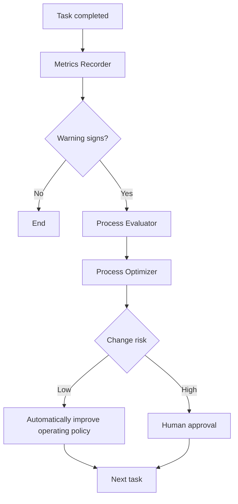

# A Self-Improving AI Development Process

Running a development loop over time reveals the following problems.

- Token costs keep increasing
- Explanation and handoff costs between agents increase
- The same problems recur
- Reviews repeat the same findings
- Rework increases
- Build/test failures recur
- Agent counts grow without better quality

Instead of stopping at “use a better model,” **make the process itself the subject of learning**.

## Learning Plane



## Metrics to Record

| Metric | Meaning |
|---|---|
| Agent Count | Number of workers involved |
| Handoff Count | Number of transfers between agents |
| Iterations | Number of iterations |
| Rework Count | Revision cycles |
| Build Failures | Failed builds |
| Test Failures | Failed tests |
| Review Findings | Issues raised in review |
| Human Intervention | Direct human involvement |
| Token Cost | Model cost |
| Completion Time | Time to completion |

The most important perspective is:

> **Cost per Accepted Change**

The question is not whether fewer tokens were used, but **how much it cost to produce one change that was actually accepted**.

## Turn Recurring Failures into Policy

For example, if Save/Load omissions recur three times, do not treat them only as isolated bugs.

```md
## FP-003 — Serialization Impact Missed

Occurrences: 3

Symptoms:
Save/Load support is repeatedly omitted.

Root Cause:
The planning stage does not review persistence.

Improvement:
Tasks that change data structures must check serialization impact before implementation.
```

A check can then be added to `TEST_POLICY.md` or `DEVELOPMENT_POLICY.md`.

## Learn from Unnecessary Procedures as Well as Failures

Example:

```md
Observation:
Localized bug fixes were completed reliably without a separate Researcher,
using only a Worker + Reviewer.

Lesson:
Do not create a Researcher by default for small-scope tasks.
```

This kind of learning prevents the system from growing more complex over time.

## Experiment Before Making Policy

Run a small experiment instead of immediately changing the rules.

```text
Hypothesis:
Normal tasks modifying five or fewer files do not need a separate Researcher.

Sample:
The next five tasks

Success:
- No increase in regressions
- No increase in review findings
- At least 20% fewer tokens
```

If successful, promote the result to policy.

## Risk of Policy Changes

### Changes That Can Be Automated

- Role routing
- Model routing
- Metric recording methods
- Recurring failure lists
- Learning records

### Changes Requiring Human Approval

- Git policy
- Commit policy
- Build policy
- Review gate

### Changes AI Must Not Make at Its Own Discretion

- Product direction
- Core architecture principles
- Security policy
- Human approval rules
- Destructive Git policy

## Example Repository Structure

```text
.ai/
├─ ROLE_POLICY.md
├─ MODEL_ROUTING.md
├─ DEVELOPMENT_POLICY.md
├─ GIT_POLICY.md
└─ PROCESS/
   ├─ METRICS.md
   ├─ FAILURE_PATTERNS.md
   ├─ LESSONS_LEARNED.md
   ├─ EXPERIMENTS.md
   └─ PROCESS_CHANGELOG.md
```

The point is not the abstract idea that “AI becomes smarter on its own.”

> **Record execution results → discover recurring patterns → experiment with small improvements → incorporate only verified rules into the repository.**

In other words, version-control the development process itself.
