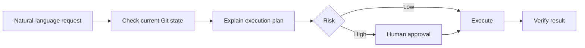

# Using Claude Code as a Natural-Language Git Client

If Claude Code can access the local repository and shell, most Git operations can be requested in natural language.

Examples:

- commit
- fetch / pull / push
- branch / worktree
- merge / rebase / cherry-pick
- stash
- restore / revert
- diff / log / reflog
- Prepare a PR

## The Basic Safety Loop



### Useful Checks Before Execution

```bash
git status
git branch --show-current
git remote -v
git log --oneline --decorate -10
```

## Natural-Language Examples

### Commit

> Review the current changes and commit related changes together in meaningful units. Do not include unrelated files.

### Pull

> Check which upstream the current branch tracks, and safely update it only if there are no uncommitted changes.

### Push

> Push the current branch to the remote. If this is its first push, also set the upstream. Do not force push.

### Rebase

> Rebase the current feature branch onto the latest origin/stable. Before running it, explain the current branch, base, and expected history changes. If a conflict occurs, report it rather than resolving it at your discretion.

### Merge

> I want to merge origin/stable into the current feature branch. First explain the merge direction and whether a merge commit may be created.

### Cherry-pick

> Bring only the changes from commit abc123 into the current branch. First use git show to inspect its contents and any prerequisite commits.

### PR

> Prepare a PR from the current branch targeting stable. Check the commit list, diff, and build/test status, and write Summary / Changes / Verification / Risk.

## Permissions by Risk Level

| Level | Examples | Operating Rule |
|---|---|---|
| Low | status, diff, log, fetch | Can run automatically |
| Medium | commit, push, merge, rebase, cherry-pick | Run after checking the state |
| High | reset --hard, force push, branch -D, clean -fdx | Explicit approval required |

## Is a GUI Git Client Such as Fork Still Needed?

When AI acts as a Git operator, the need for a GUI Git client decreases considerably.

However, a GUI is still useful for quickly inspecting graphs and diffs visually.

```text
Claude Code
= Git Operator

Fork / SourceTree
= Git Visualizer / Inspector
```

The combination of “natural language for operations, visualization for verification” is practical.

## A Common Structure for Good Git Instructions

```text
1. Check the current state first.
2. My desired goal is ___.
3. Explain the Git commands you will run and their direction.
4. Do not perform destructive operations before approval.
5. If a conflict occurs, report the cause instead of resolving it automatically.
6. After completion, summarize the branch / commit / remote state.
```

Delegating Git to AI does not mean that Git concepts no longer matter. On the contrary, **understanding concepts such as Merge, Rebase, HEAD, and Remote well enough to verify the results is important.**
