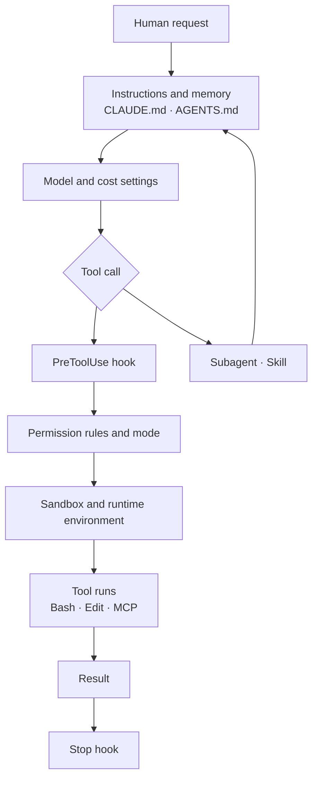

# The AI Agent Setup Map: Seeing Configuration as Layers

> **Learning goal**: Split an agent setup into layers, and explain where each layer lives in Claude Code and in Codex and how the layers combine by precedence. Choose between a minimum setup and a fuller setup suited to a one-person studio.

The earlier documents ("AI development overview", "Session · Agent · Subagent", "Multi-agent roles and model routing") covered *how to organize* AI work. From this document on, the subject is **turning that organization into real configuration files**. Only keys and paths confirmed in official documentation or source as of 2026-09 are included.

## Key Concepts

An agent's capability is not decided by the model alone. The same model behaves very differently depending on what it reads, what it is allowed to do, and what runs automatically around it. That outer structure is the **harness**, and what configures the harness is the **agent setup**.

| Layer | Question it answers | Claude Code | Codex |
|---|---|---|---|
| Instructions · memory | What does it always know at the start? | `CLAUDE.md`, `.claude/rules/`, auto memory | `AGENTS.md`, `AGENTS.override.md` |
| Permissions · mode | What may it do without asking? | `permissions` in `settings.json`, permission mode | `approval_policy`, `.rules` files |
| Sandbox | What does the OS block? | `sandbox` settings (for Bash) | `sandbox_mode` |
| Hooks | What must run at a given moment? | `hooks` in `settings.json` | `hooks.json` or `[hooks]` in `config.toml` |
| Subagents | Who gets isolated work? | `.claude/agents/*.md` | `.codex/agents/*.toml` |
| Skills · slash commands | How is a repeated procedure invoked? | `.claude/skills/<name>/SKILL.md` | `.agents/skills/<name>/SKILL.md` |
| Plugins | How is a bundle of setup distributed? | plugins · marketplaces | plugins (`plugins` setting) |
| MCP · external tools | What is it connected to? | `.mcp.json`, `~/.claude.json` | `[mcp_servers.<name>]` in `config.toml` |
| Environment | Where does it run? | local, cloud session, CI | local, cloud, CI (`codex exec`) |
| Model · cost | Which model, and how much? | `model`, subagent `model` field | `model`, `model_reasoning_effort` |

### Each layer has a different kind of force

- **Advisory**: instructions and skills are context the model reads and *tries* to follow. The Claude Code docs themselves call CLAUDE.md "context, not enforced configuration".
- **Enforced**: permission rules, the sandbox and hooks are executed by the harness regardless of what the model decides.
- **Connection · delegation**: subagents, MCP and plugins widen capability or isolate work.

"Never edit `.env`" written only in CLAUDE.md is advice. If it must hold, it moves into a deny rule or a `PreToolUse` hook, and then it is enforcement. This distinction is where setup design starts.

## Principles

### Claude Code: scopes and precedence

Claude Code settings files live in four scopes, and the higher one overrides the same key (as of 2026-09).

| Precedence | Scope | File | Use |
|---|---|---|---|
| 1 | Managed | `managed-settings.json`, MDM, server-managed settings | Organization policy; users cannot override it |
| 2 | Command line | `claude --settings`, `--permission-mode`, etc. | This session only |
| 3 | Project local | `.claude/settings.local.json` | Just me, just this project; kept out of git |
| 4 | Shared project | `.claude/settings.json` | Everyone on the project; committed |
| 5 | User | `~/.claude/settings.json` | Just me, every project |

"Override" applies only to single values. Each layer combines differently:

- **Lists merge**, such as `permissions.allow`. And deny rules from any scope are evaluated before allow rules, so a user-level deny blocks a project-level allow.
- **CLAUDE.md is additive**: content from every level enters context together.
- **Skills and subagents resolve by name, one wins.** For subagents the order is managed > `--agents` > project > user > plugin.
- **MCP servers also resolve by name.** The order is local > project > user.
- **Hooks all run.** Every matching hook fires, whatever its source.

### Codex: config layers and trust

Codex stacks TOML layers from lowest to highest precedence (per the config loader comments in the openai/codex source, as of 2026-09): system `/etc/codex/config.toml` → user `~/.codex/config.toml` → the selected profile → project `.codex/config.toml` → `--config` and flags at run time. Constraints an organization wants to enforce go in a separate `requirements.toml`.

The important difference is that **project settings only take effect once the project is trusted**. A `.codex/config.toml` in an untrusted directory is read but left disabled. Claude Code is similar: `permissions.allow` in a committed `.claude/settings.json` applies only after you accept the workspace trust dialog, while deny and ask rules, which only restrict, apply immediately.

```toml
model = "gpt-6-sol"
model_reasoning_effort = "medium"
approval_policy = "on-request"
sandbox_mode = "workspace-write"

[sandbox_workspace_write]
network_access = false

[projects."/Users/me/work/product-a"]
trust_level = "trusted"
```

The above is an example `~/.codex/config.toml`. The model name follows the routing table in this repository's `.ai/HARNESS.md`.

### What to commit and what to keep personal

This repository's `.ai/HARNESS.md` gives the test for sorting settings: *would a new contributor who clones the repository behave differently without it?* If so, it is a project capability and gets committed. If only their prose would read differently, it is personal preference and must not be committed. A default model or answer language is preference; permissions, hooks, role agents and MCP servers are capabilities.



The diagram shows the order in which a single tool call passes through the layers. The advisory layer (instructions) acts *before the call is formed*; the enforced layers (hooks, permissions, sandbox) intervene *before the call executes*.

## Applied: This Repository's Setup

The repository behind this site is a working example of a setup that uses Claude Code and Codex together.

```text
tech-jeongsu/
├─ CLAUDE.md                     Claude Code entry contract (31 lines)
├─ AGENTS.md                     Codex entry contract (34 lines)
├─ .ai/                          shared policy set (CORE, MANAGER, HARNESS ...)
│  └─ tools/check_policy_set.py  structural checks on the policy set
├─ .claude/
│  ├─ agents/fast-explorer.md          read-only search subagent
│  ├─ agents/adversarial-reviewer.md   independent review subagent
│  └─ skills/auto-dev/SKILL.md         automatic development loop skill
├─ .codex/agents/                dispatcher · fast-explorer · adversarial-reviewer (.toml)
└─ .agents/skills/auto-dev/      Codex edition of the same skill + agents/openai.yaml
```

| Layer | In this repository | Observation |
|---|---|---|
| Instructions | `CLAUDE.md` and `AGENTS.md` point into `.ai/` | Entry files are short contracts; the body loads on demand by trigger |
| Subagents | two Claude agents, three Codex agents | All read-only: `permissionMode: plan`, `sandbox_mode = "read-only"` |
| Skills | two editions of `auto-dev` | The Codex edition sets `allow_implicit_invocation: false`, so it never starts itself |
| Model | only the dispatcher pins a model | The reviewer is left open on purpose, so a model different from the implementer's can be chosen at spawn time |
| Permissions · hooks · MCP | no committed files | HARNESS.md says "commit them", yet the enforced layer is still empty |

The last row is this repository's biggest gap. Advice and role definitions are thorough, but the enforced layer is left to each person's private settings. The "Permissions, sandbox, hooks" document proposes a `.claude/settings.json` draft for this repository.

## Going Deeper

### Minimum setup versus studio setup

| Item | Minimum setup (one product, first week) | Studio setup (many products, one person) |
|---|---|---|
| Instructions | one `CLAUDE.md` or one `AGENTS.md` under 60 lines | short entry contract + shared policy folder + trigger table |
| Tool compatibility | one tool | `AGENTS.md` as the base, Claude Code via import or its own entry file |
| Permissions | default mode, approve as prompts appear | committed allow/ask/deny + a risk-tier table |
| Sandbox | none | locally Claude `/sandbox` or Codex `workspace-write`; containers for unattended runs |
| Hooks | none | block force push, refuse to stop with uncommitted work, lint after edits |
| Subagents | built-in agents | read-only explorer, reviewer on a different model |
| Skills | none | repeated procedures such as deploy, release, an automatic development loop |
| Sharing | none | package as a plugin when several repositories need the same setup |

Starting minimal and adding **one layer each time the same problem happens twice** is also the order the Claude Code docs recommend: a rule gotten wrong twice goes into CLAUDE.md, a prompt pasted a third time becomes a skill, something that must happen every time becomes a hook, and a second repository wanting the same setup becomes a plugin.

### Environments: where local settings do not follow

- A Claude Code cloud session does not receive your local `~/.claude/skills/` or a device `managed-settings.json`. Only server-managed settings and **files committed to the repository** arrive.
- `claude -p` and SDK runs have no trust dialog. When running in someone else's repository, `--setting-sources user` or `--bare` keeps project settings from being read.
- In CI, combine the `dontAsk` mode, which denies instead of asking, with an explicit allowlist (`--allowedTools`). For Codex, state the sandbox as in `codex exec --sandbox workspace-write`, and use `--ignore-user-config` to exclude personal settings when needed.

The conclusion is the same each time: **settings that must be identical across environments belong in the repository.**

### Model and cost settings

Claude Code picks models through the `model` key (usually user scope), the `model` field in subagent files, and the organization-level `availableModels` allowlist. Codex uses `model`, `model_reasoning_effort` and the subagent default `[agents] default_subagent_model`. For the principles of assigning models to roles, see "Multi-agent roles and model routing". The remaining layers are covered in detail in the documents that follow: "Subagents, Skills, Commands and Plugins", "MCP and External Tools", and "Headless, CI and Cloud Runs".

## Common Misconceptions

- **"I wrote the prohibition in CLAUDE.md, so it is safe."** Instructions are advice. Prohibitions are enforced with deny rules, hooks and the sandbox.
- **"A project-level allow beats a user-level deny."** Deny is evaluated first, whatever its scope.
- **"Configuration is done once."** Keys change between tool versions. The keys in this document are as of 2026-09; date them and re-check periodically.
- **"More configuration is more power."** Always-loaded layers cost tokens every turn. Moving content to on-demand layers makes it cheaper and more accurate.

## Self-Check Questions

1. What criterion decides whether a rule goes into CLAUDE.md or into a deny rule?
2. If user settings deny `Bash(git push *)` and project settings allow it, what is the result, and why?
3. What is the typical reason a project `.codex/config.toml` is ignored by Codex?
4. Explain, in terms of settings precedence, why this repository's reviewer agent does not pin a model.
5. Why does a personal skill come back "not found" in a cloud session, and how do you fix it?

## References

- Claude Code, [Settings files and precedence](https://code.claude.com/docs/en/settings) (checked 2026-09-29)
- Claude Code, [Extend Claude Code](https://code.claude.com/docs/en/features-overview) (checked 2026-09-29)
- Claude Code, [Subagents](https://code.claude.com/docs/en/sub-agents) · [MCP](https://code.claude.com/docs/en/mcp) (checked 2026-09-29)
- OpenAI Codex, [Config basics](https://developers.openai.com/codex/config-basic) (2026-09-29, cross-checked against source `codex-rs/config/src/loader/mod.rs`)
- This repository: `.ai/HARNESS.md`, `.claude/agents/`, `.codex/agents/`, `.agents/skills/auto-dev/`
